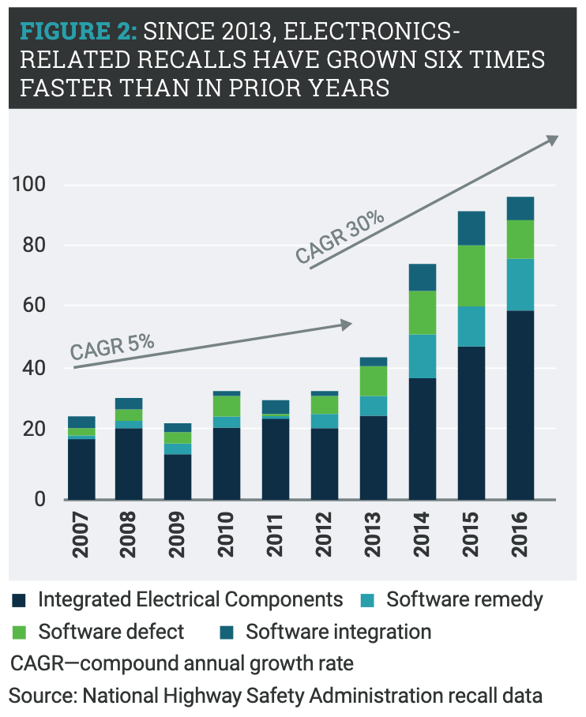
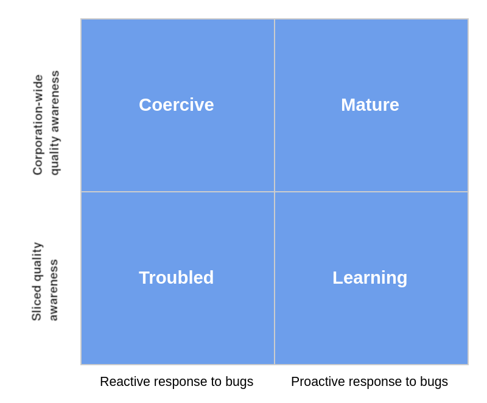

:slug: ceo-bugs/
:date: 2019-11-09
:subtitle: Should CEOs discuss software defects?
:category: philosophy
:tags: business, security, company
:image: cover.png
:alt: Broken blue ceramic plate on Unsplash: https://unsplash.com/photos/WdJkXFQ4VHY
:description: Corporations depend on software more than ever. Software quality management, including security weaknesses, has become of strategic relevance. In this article, we discuss a recent article calling for CEOs’ attention to bugs. We go further by adding a few more ideas.
:keywords: Bussiness, CEO, Security, Bugs, Software, Information
:author: Julian Arango
:writer: jarango
:name: Julian Arango
:about1: Behavioral strategist
:about2: Data scientist in training.

= Debug like a Boss

You wake up, and probably check your smartphone immediately.
Chances are you already have smart devices at home;
like light bulbs, you turn on and off from the same smartphone.
You often check traffic and estimated time arrivals of your commute
by using an app or online service.
Software aids plenty of operations while you drive,
like braking and accelerating (even if you’re not aware).
No matter the job, work has to cross over digital boundaries.
Also, to see your friends or family,
a piece of software might be in the midst.
Much of the time, consciously or not,
our lives develop over software grounds.

.Software is eating the world by Gerd Leonhard. Source link:https://flic.kr/p/2ePju9R[flickr]
image::sw-eating.png[width=630, alt="Softare is eating the world"]

Corporations have brought us software.
They now depend heavily
on coding for sustainability and to keep competitiveness.
Organizations of all sorts
are becoming more like tech companies focused on specific services.
The shift is more clear in some industries like banking:
no bank would survive without information technology.
link:https://www.finchannel.com/technology/66528-worldwide-it-spending-set-to-rebound-in-second-half-of-2017-led-by-cloud-and-mobile-upgrade-cycles[+IT+ spending keeps growing across the globe].
You probably have read that _“software is eating the world”_,
a sentence by Marc Andreessen _—Netscape founder and venture capitalist—_,
written in an op-ed back in 2011.
It has already eaten nearly everything.

== Why bugs and vulnerabilities should be CEO’s top of mind

With software so pervasively present,
corporations should consider
putting more attention on theirs at a strategic level.
A recent Harvard Business Review piece
written by Nicholas Bowen
suggests that fixing software defects should be a CEO’s priority.
We can't agree more.
Some global cases support this view.

In 2003, there was a link:https://www.scientificamerican.com/article/2003-blackout-five-years-later/[massive blackout in North America],
covering several states in the US and Canada.
More than 50 million people
were left with no electricity for two days or more.
An investigation found a link:https://devopedia.org/race-condition-software[race condition]
was present in a +Unix-based system+ (+XA/21+),
which stalled a critical process.
Last year, a software defect caused two fatal incidents
in two brand-new +Boeing 737 MAX+.
The press coverage was massive.
The bug affected a critical alarm for captains,
inhibiting timely maneuvering.
link:https://www.businessinsider.com/boeing-knew-737-max-software-error-year-before-telling-faa-2019-5[Business Insider]
confirmed the airplane manufacturer
knew the defect for around a year.
Bowen's article draws upon two similar cases.
One tells about how +Toyota+
settled a lawsuit in USD 1.1 billion
by a link:https://users.ece.cmu.edu/~koopman/pubs/koopman14_toyota_ua_slides.pdf[sudden acceleration problem] in one of its models,
which caused deaths.
Again, it was a software bug.
In line with this type of defect,
the National Highway Safety Administration
reported that only one car manufacturer
recalled 80.000 vehicles in 2016 due to software defects.
The other case is Microsoft,
which in the nineties experienced spectacular growth,
so much that the share of software defects
and vulnerabilities among operative systems
around those years was higher for Windows.
Do you remember the _“blue screen”_?

How much do other of these escapes
—defects and weaknesses— cost to corporations?
More importantly,
how much do they cost to society?
Vulnerabilities are rising and probably will keep growing.
Organizations can find a competitive advantage
in paying more attention to software quality,
deployment, functionality, and security.
Making sure testing efforts are performed
with high standards should be more prominent
in C-level discussions
about product and service development and delivery.

.Electronics related recalls from 2007 to 2016. Source link:https://emarketing.alixpartners.com/rs/emsimages/2018/pubs/EI/AP_Auto_Industry_Recall_Problem_Jan_2018.pdf[Alixpartners].

== What can be done about this?

Bowen suggests that asking simple questions
can cause a turnaround
by making an organization proactive
with software quality management.
CEOs could ask,
_“what criteria was used to determine_
_when the product was ready to be shipped?”_
attempting to capture attention to quality processes.
Moreover, executives should ask for the defect status
months after releasing a software product,
seeking to prevent significant size events,
like car or airplane crashes.
In the case of an incident,
executives could ask,
_“how did the software get released with that type of bug?”_

These questions are important but aren't enough.
An effective quality management system should be in place,
and not every +CEO+ is in a position to assess that.
At +Fluid Attacks+, we have blended robust technology, automation,
and the best hacking skills in the market
to address security quality issues
in the whole software development lifecycle.
Our [inner]#link:../../services/continuous-hacking/[hacking tests]# covers from static code analysis
to attacks (controlled, of course) to production environments.
We centralize every security hole in [inner]#link:../../products/integrates/[Integrates]#,
our Vulnerability Management System.
And along with processes and technology,
our [inner]#link:../../products/rules/[Rules]# act as unifying chain;
a criteria to classify findings
so customers can quickly identify and decide
where to start fixing defects.
We also test the effectiveness of fixes
and break the build every time
software doesn't follow those rules.

Will you ask those questions to your team?
We can help by giving them to you without even asking.
Everything would be available at our +VMS+, [inner]#link:../../products/integrates/[Integrates]#,
covering from very technical to strategic levels.
Bowens propose a simple +2x2+ matrix
to assess how an organization is performing
based on quality awareness and response to bugs.
+Fluid Attacks+ can help you moving towards the upper-right.

.Bowens performance matrix. Source <<r1, [1]>>.

== But, do not just ask for bug reports.

In emergency rooms,
medical staff has to make quick decisions under uncertainty,
with tight time frames
and sometimes without clear how-to's
to keep people alive in extreme conditions.
Some researchers have found a positive correlation
between the number of mistakes made by teams and their results.
*This is counterintuitive:*
*more mistakes, better results*.
Best-performing groups show a riskier behavior (hence the errors),
but these teams also share more among themselves
about those risks and mistakes.
In turn, they find better results from these interactions,
allowing more experimentation,
and achieving incremental improvements.
Why? Psychological safety.

link:https://www.youtube.com/watch?v=LhoLuui9gX8[Psychological safety],
coined by professor Amy Edmonson,
is *a state where people aren't afraid to speak up*
*when needed and to accept their mistakes*.
Teams feel psychologically safe
when they expect no retaliation from sharing uncomfortable
yet essential matters to their peers and managers,
like pointing out something that might endanger a project
just before it is launched.
Trust and openness are key.

Bowen’s related his own experience at IBM
when software defects were harming.
A +VP+ was commissioned to revert the trend
and he had a motto:
_“be forthright, and I’ll be forthcoming”_.
To make software defects and security weaknesses chief
for high leadership,
companies have to create a safe environment
so technical teams aren't hesitant
to reveal what is or might be wrong.
If people think speaking out would threaten them,
they will be dangerously silent.
Some incidents,
like Boeing’s, seem to reveal an effort to cover things up.
In Volkswagen’s gas emission scandal,
people who bravely spoke up were fired.

We hope you have enjoyed this post,
and we look forward to hearing from you.
[inner]#link:../../contact-us/[Do get in touch with us!]#

== References

. [[r1]] link:https://hbr.org/2019/09/why-fixing-software-bugs-should-be-the-ceos-problem[Bowen, N. (2019) Why Fixing Software Bugs Should Be the CEO’s Problem.
Harvard Business Review.]
