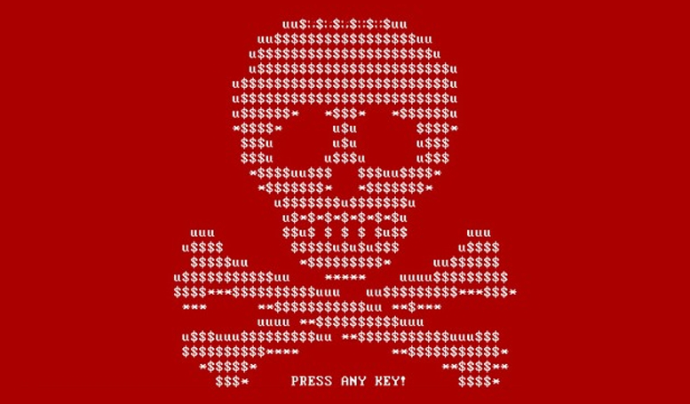
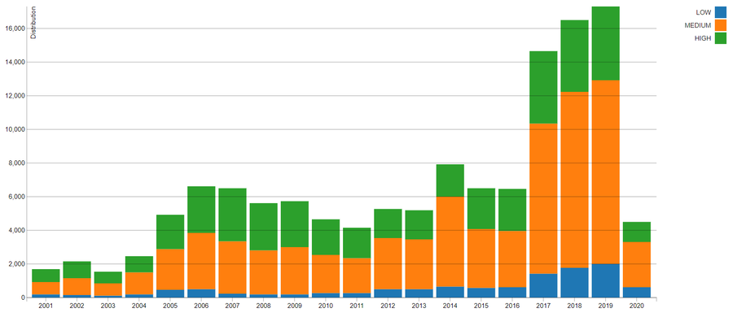
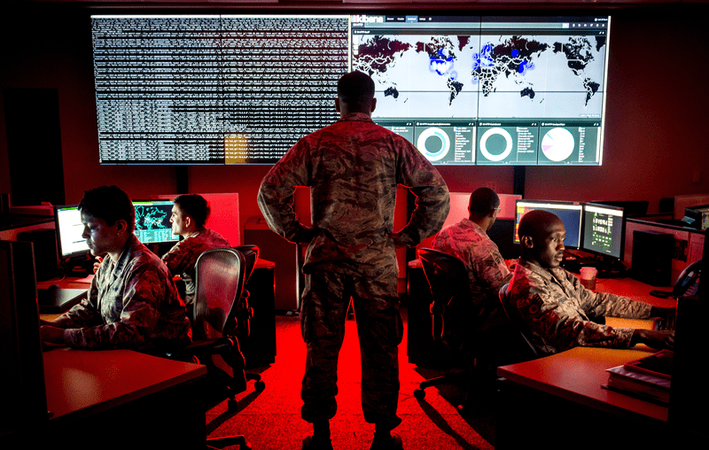

:slug: chat-with-correa/
:date: 2020-03-30
:subtitle: A chat with Daniel Correa
:category: interview
:tags: machine learning, cybersecurity, security, interview, risk, software
:image: cover.png
:alt: Photo by Liam Tucker on Unsplash
:description: We had the pleasure to chat with Daniel Correa, a Security Expert at a Latin American financial group. He shared his view about current threats, the human factors in cybersecurity and technology. Machine learning, human factors, malware and more, is what you’ll find in this post.
:keywords: Machine Learning, Cybersecurity, Security, Interview, Risk, Software
:author: Julian Arango
:writer: jarango
:name: Julian Arango
:about1: Behavioral strategist
:about2: Data scientist in training.
:source: https://unsplash.com/photos/cVMaxt672ss

= A Perspective in Cybersecurity

Daniel is a highly skilled security professional.
His insights about the current cybersecurity landscape
complements previous perspectives on our blog.
Daniel has a bachelor's degree in Computer Science
and holds qualifications such as `OSCP`, `OSCE` and `OSWE`.
He's currently doing an `MBA`.

We started this conversation
by discussing the main threats companies face these days.

.Splash link:https://commons.wikimedia.org/wiki/File:2017_Petya_cyberattack_screenshot.jpg[screen of the payload] of the original version of Petya

*What are the leading cybersecurity threats organizations currently face?*
[role="fluid-qanda"]
  . You get to hear that newer threats are based on machine learning (`ML`)
  and artificial intelligence (`AI`), but I disagree.
  I don't think this is feasible for now.
  Most of those `ML`-based threats seem just marketing to me.
  A `ML` approach is viable for defense:
  there is 'big data' on network (traffic) and user behavior,
  required to train smart decision algorithms to prevent incidents.

[role="fluid-qanda"]
  . Current threats aren't that different from those we have known for years.
  Organizations are focusing on containing malware.
  Perhaps, two newer variants are worth mentioning:
  malware that instantly wipes data and criptojacking.

[role="fluid-qanda"]
  . Common [inner]#link:../ransomware/[ransomware]# looks to encrypt data,
  so that crooks can ask for money.
  In the wiper malware, organizations face data availability issues.
  With the wiper, attackers want to inflict damage right away.

*Is _wiper_ worse than other types of malware?*
[role="fluid-qanda"]
  . Not necessarily. It depends on the data and the backup policies in place.
  As with ransomware, if data is fully backed-up elsewhere, there's no damage.
  If it's not, there might be trouble.
  The consequences are usually reputational,
  and sometimes those are worse than financial.
  An example of the wiper is the _NotPetya_,
  link:https://www.forbes.com/sites/leemathews/2017/08/16/notpetya-ransomware-attack-cost-shipping-giant-maersk-over-200-million/#5aa1017f4f9a[which caused significant trouble to Maersk],
  the Danish shipping company.

At `Fluid Attacks`, we blend automation with the best talent in hacking
to find weaknesses in our customer’s systems
by means of our [inner]#link:../../services/continuous-hacking/[Continuous]#
and [inner]#link:../../services/one-shot-hacking/[One-shot Hacking]# services.
As Daniel says, hacking skills are still not replaceable by machines.

*And the other variant?*
[role="fluid-qanda"]
  . [inner]#link:../cryptojacking-malware/[Cryptojacking]#. Capturing machines,
  so third party resources are devoted to mine cryptocurrencies.

*What is your opinion of cryptocurrencies?*
[role="fluid-qanda"]
  . I believe all financial transactions will be made over blockchain
  or similar technologies sometime in the future.
  Some big players and central banks are doing research
  and testing with digital currencies.
  They might find an innovative way to make it work with current systems.
  Although I would say this is difficult
  without undermining one of the premises
  by which bitcoin was proposed back in 2008: decentralization.

*What are other threats still out there
causing troubles to organizations and people?*
[role="fluid-qanda"]
  . [inner]#link:../phishing/[_Phishing_]#. link:https://www.thesslstore.com/blog/the-top-9-cyber-security-threats-that-will-ruin-your-day/[It still makes it to the ranks].
  Even with `ML`-based recognition on email providers,
  browsers extensions, and endpoint software protections against this threat,
  nothing reduces to a great deal
  the odds of falling to well crafted phishing communications.
  Human psychology at play.

[role="fluid-qanda"]
  . Other relevant threats are those coming
  from the _supply-chain_, often overlooked.
  All the hardware, a significant proportion of software,
  and many specific software developments aren't proprietary.
  So, what's 'inside' is up to suppliers.
  Let's say you have a data center with hundreds of servers.
  Nobody has checked the suppliers' proprietary chips for malware
  because nobody does that.
  What do these chips have? Who knows!
  In practice, it's entirely possible to program something
  to be activated in the future that causes a harsh incident,
  or a spectacular hack.
  And it has happened. See, for example, link:https://meltdownattack.com/[Meltdown and Spectre].
  See how link:https://www.bloomberg.com/news/articles/2019-04-30/vodafone-found-hidden-backdoors-in-huawei-equipment[a telecom company found backdoors in home equipment].
  Rate is high: a study found that
  link:https://www.businesswire.com/news/home/20181115005665/en/Opus-Ponemon-Institute-Announce-Results-2018-Third-Party[`59%` of companies surveyed had a Third-Party Data Breach].
  And you can keep going: a supplier has at the same time more suppliers,
  and those other suppliers too.
  The _supply-chain_ is revealing itself very critical.
  Think of `IoT` devices in this same line of thought:
  those deploying these devices face complex threats.

.CVSS Severity Distribution Over Time. Source: link:https://nvd.nist.gov/general/visualizations/vulnerability-visualizations/cvss-severity-distribution-over-time[NIST]

[role="fluid-qanda"]
  . Application and infrastructure weaknesses will always be major threats.
  As time passes, more and more vulnerabilities are found.
  All that's man-made is prone to error.
  We produce chips, create software,
  deploy infrastructure, design security policies.
  Could antivirus software have software weaknesses?
  Hell yeah, link:https://www.prnewswire.com/news-releases/consumers-file-class-action-lawsuit-against-symantec-for-defective-antivirus-software-300746568.html[there are plenty of examples].
  It even goes into making it possible for an attacker
  to gain administrative control through the faulty antivirus
  by leveraging on its privileges.

*What do you think are the primarily blind spots when managing cybersecurity?*
[role="fluid-qanda"]
  . I like an analogy: cybersecurity works as a 4-piston engine
  — people, processes, technology, and management.
  Pistons must be synchronized, lubricated, going at the same speed,
  among others, for the engine to work correctly.
  You can have the best technology,
  systematic processes, and proper management.
  But, if people fail, the whole cybersecurity endeavor fails.
  People are the piston that fails the most.
  That's why, I believe, we see so many incidents and frauds.
  People keep clicking malicious links;
  people still give information away they should not.
  Small actions are all attackers need.

*Do you think the problem is that people fall into those attacks?*
[role="fluid-qanda"]
  . Not only on those, but people also fall for other untargeted attacks.
  We invest in high technology; we streamline processes;
  managers are conscious and attentive to cybersecurity.
  But it takes only one person to open a breach.
  Perhaps, we should do more on awareness.

*Are awareness programs the solution?*
[role="fluid-qanda"]
  . I'm in favor of awareness programs.
  Nonetheless, it's not enough to focus on employees only.
  I think we have to start educating at an early age
  about risks in the information, digital, and technology domains.
  As the idiom says, _you can't teach an old dog new tricks_.

*What about a more interactive approach
where people could face a threat more realistically?*
[role="fluid-qanda"]
  . A must. In the link:https://www.nist.gov/cyberframework[NIST Cybersecurity Framework], this is recommended.
  Some day I gave a one-hour talk.
  I described risks and how we can prevent them.
  I showed people link:https://haveibeenpwned.com/[websites] where they could check
  if their emails have been compromised in well-known incidents.
  People liked it and were engaged.
  Afterward, we ran a simulation where people could fall for a real attack.
  They didn’t know. A non-negligible proportion of attendees,
  many of them security professionals just fell.
  Just telling people what to do or not, is far from enough.

[role="fluid-qanda"]
  . But, when people face and feel the downsides of risks, they learn;
  they increase their awareness;
  they really pay attention to their behaviors and change accordingly.
  People react after their security is broken,
  provided that _the hole_ brings palpable consequences.

.Cyber warfare specialists. June 3, 2017. link:https://media.defense.gov/2018/Mar/14/2001890169/-1/-1/0/180221-F-SK383-0012A.JPG[Air Force photo by J.M. Eddins Jr.]

*How can organizations do better in their pen-testing?*
[role="fluid-qanda"]
  . I would recommend two things:
  focus on testing `IT` assets where an incident can  endanger operations
  and the corporate mission.
  But here's where this suggestion makes real sense:
  *identifying those assets is no easy task*.
  Not all organizations have this clear.
  Companies should devote time and effort
  to clarify business priorities and failure points in `IT`.

[role="fluid-qanda"]
  . Second, use a red teaming approach.
  Diversity of perspective adds value.
  One or two security analysts —a typical setting— could do a good job,
  but a more diverse approach to attacking could mean exceptional performance.

We're grateful to Daniel for this conversation.
We hope you have enjoyed this post, and we look forward to hearing from you.
[inner]#link:../../contact-us/[Do get in touch with us!]#
