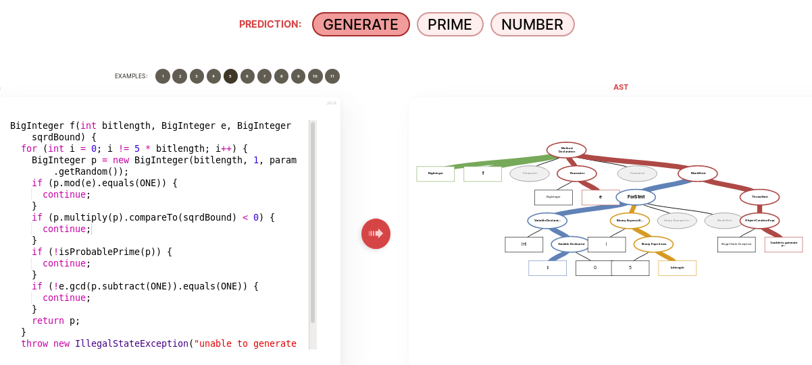
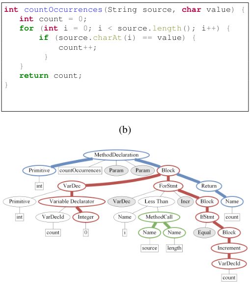
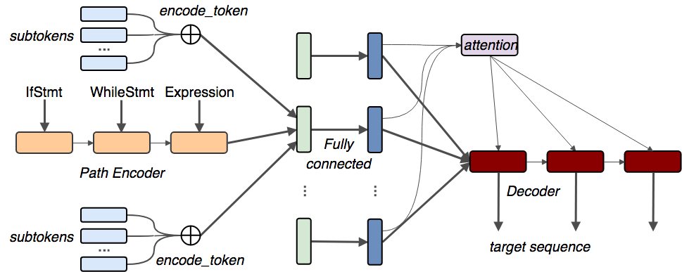
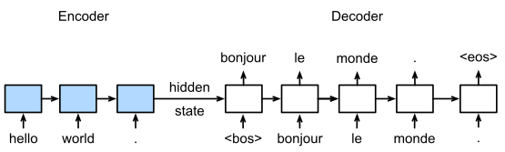
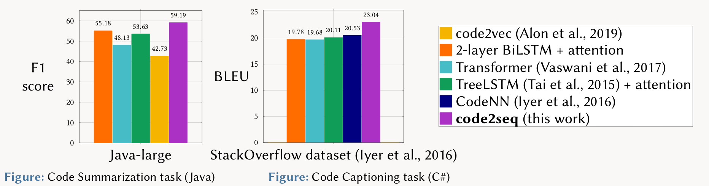

:slug: code-translate/
:date: 2020-01-31
:subtitle: From code to words
:category: machine-learning
:tags: machine learning, security, code
:image: cover.png
:alt: Book in two languages
:description: Code2seq, a newer model from the authors of code2vec, which differs in adapting neural machine translation techniques to the task of mapping a snippet of code to a sequence of words. This could have applications to code summarization, captioning, and specific vulnerability prediction.
:keywords: Machine learning, Neural Network, Encoding, Parsing, Classifier, Vulnerability
:author: Rafael Ballestas
:writer: raballestasr
:name: Rafael Ballestas
:about1: Mathematician
:about2: with an itch for CS
:source: https://unsplash.com/photos/r8H8K3w9AzA

= Can code be translated?

Now that we have a better undestanding of
how natural language and code embeddings work,
let us take a look at a work by the same authors of `code2vec`,
entitled `code2seq`: generating sequences from code <<r1, [1]>>.
What sequences? you might ask.
Sequences of natural language,
which might have different applications
according to the given training data.
In the original paper, they propose some applications:

* Code summarization, i.e.,
explain in a few words what a snippet of code does,
although not necessary in articulate language.

* Code captioning,
which is pretty much the same,
only properly written.

* Even automatic code documentation, in particular,
generate `JavaDoc` documentation given a `Java` method.

A picture says more than a thousand words:

.Sample prediction and generated AST via link:https://code2seq.org/[demo site].

Notice that the `AST` says _even less_
about what this snippet does than the code itself, in my opinion.
And yet `code2seq` sort of manages to
_understand the intent_ of this function,
which is to generate a prime number for an `RSA` key.
The prediction for the summary of this method is:
`generate prime number`.
Not too shabby.

So, how does it work?
Again, as in `code2vec` they use randomly taken
`AST` paths from one leaf token to another leaf
for the initial representation of code,

.Paths in an AST. From <<r1, [1]>>.

This representation, according to them,
is fairly standard representation of code
for machine learning purposes, and
has a few advantages, namely:

* It does not require semantic knowledge.
* Works across programming languages.
* It is not needed to hard-code human knowledge into features.

However, as with `code2vec`, one requires a specific _extractor_
(essentially a tool to parse the code and
extract the `AST` in a specific format understandable by `code2*`)
for each language one intends to analyze.
One key difference with `code2vec` is the
use of the long short-term memory (`LSTM`)
neural network architecture,
which is used to encode each `AST` path
from the previous step as a sequence of nodes.
Otherwise the architecture is pretty similar:

.`code2seq` architecture. From <<r1, [1]>>.

As with `code2vec`, their main secret sauce
lies in the _attention_ mechanisms,
and the encoding and decoding layers
which sort of resemble the inner workings
of an _autoencoder_,
which we met
[inner]#link:../embed-code-vector/[earlier]#
and serves as a stepping stone into
understanding the vector representation of code and
other objects.

Another intersesting under the hood idea of `code2seq`
is to take after `seq2seq` models,
which are widely used in natural language translation
with neural networks (_neural machine translation_).
The idea is to connect two separate neural networks:
one for encoding the source language and
one for decoding into the target language.
This already suggests an _intermediate_ representation,
a 'universal language' of sorts,
that only these kind of networks understand.
Again, this is a bit reminiscent of the autoencoder example
and most likely stemmed from that seminal idea.

.`seq2seq` diagram, via link:https://d2l.ai/_images/seq2seq.svg[d2l.ai].

Needless to say that this kind of translator networks
achieve better than deterministic methods,
and are in fact used in production translators nowadays.
Not just that: they can be used not only for translation,
for also v.g. for chatbots, by changing the training data:
instead of giving pairs of sentences in different languages,
just match questions with their answers,
or sentences that naturally follow one another.

And, as we see here, with careful adjustment,
the idea can be applied even to more structured languages,
such as programming languages.
The results are better than the current benchmarks,
including the authors' own previous work, `code2vec`:

.`code2seq` results

The image to the left refers to the results
from the summarization task with `Java` source code.
Different methods (right) are compared using the F1 score
(see discussion in our
[inner]#link:../further-code2vec/[last article] for details,
but keep in mind this score balances how much is actually found
and how much escapes).
The one on the right does the same for the `C#`
captioning application, this time comparing the
bilingual evaluation understudy (`BLEU`) scores,
which are specific to machine translation.
Clearly, for both tasks,
`code2seq` beats the current state of the art.

As far as using it for our purpose
and testing the accuracy,
`code2seq` provides pretty much the same interface as `code2vec`,
which you can check out in our
[inner]#link:../further-code2vec/[last article]#,
so we might expect the same ease of use.
Only further experiments with the
embeddings produced by this and `code2vec`
will let us decide which one to go with for our classifier.

While code ummarization and captioning are
the only two applications researched by the authors,
and documentation generation is proposed,
this might have applications beyond that.
One idea of the top of my head:
while our code classifier is supposed to only
give a probability of a file or function
containing a vulnerability,
it could also produce a list of the _possible_
specific types of vulnerabilities.
To reuse the example above,
imagine that instead of predicting the words
"generate prime number",
it would predict
"buffer overflow",
assuming the function contained such a vulnerability,
and perhaps other kinds of vulnerabilities with lower probabilities,
such as
"lack of input validation".
That is an interesting direction to research,
i.e., being more specific in the predictions,
one that has been asked a lot during the
[inner]#link:https://www.youtube.com/watch?v=CRoQZDmRvoE[talks]#,
and one that we will certainly keep in mind.

Overall, `code2seq` is an innovative way of looking at
the code-natural language relations,
bringing into the game sophisticated techniques
from the field of neural machine translation,
and exploiting the rich syntax of code in the form of its `AST`,
which as we haven seen throughout the series,
is one of the simplest and most succesful ways of
representing code features.
Stay tuned for more of this.

== References

. [[r1]] U. Alon, M. Zilberstein, O. Levy, and E. Yahav.
link:https://openreview.net/pdf?id=H1gKYo09tX[code2seq: Generating Sequences from Structured Representations of Code].
ICLR'2019
