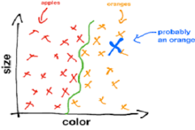
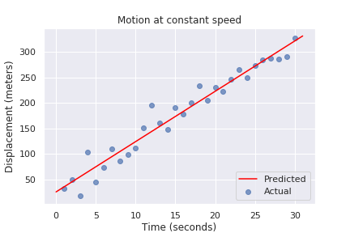
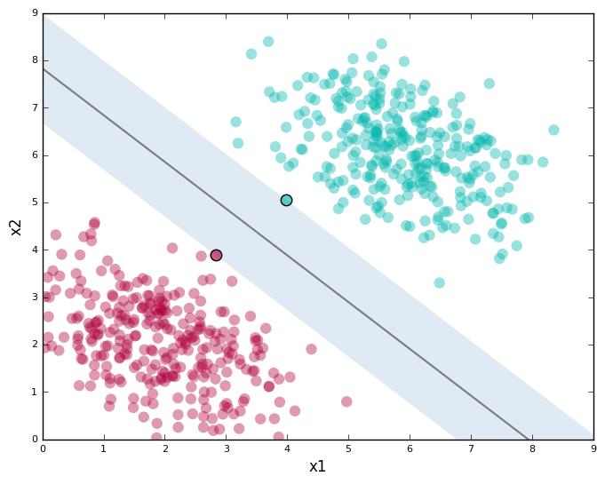
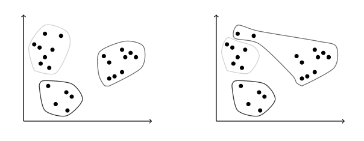
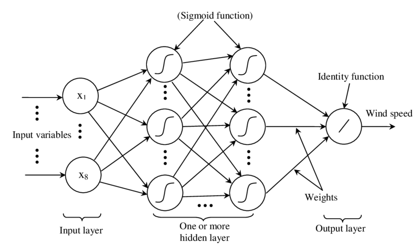
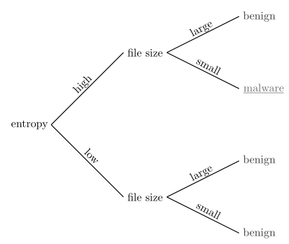
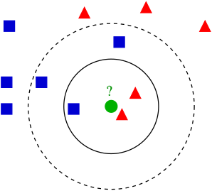

:slug: crash-course-machine-learning/
:date: 2018-11-19
:subtitle: A survey of machine learning algorithms
:category: machine-learning
:tags: machine learning, security, application
:image: cover.png
:alt: Robot playing the piano
:description: A summary of machine learning and data mining algorithms and techniques which are relevant for our studies in automated vulnerability discovery in source code. We give a high level view of each of the most important ML algorithms that have relevant applications in information security.
:keywords: Machine learning, Clustering, Anomaly detection, Neural Network, Deep learning, Security
:author: Rafael Ballestas
:writer: raballestasr
:name: Rafael Ballestas
:about1: Mathematician
:about2: with an itch for CS

= Crash course in machine learning

In this article we clarify
some of the undefined terms in our
link:../machine-learning-hack/[previous article] and thereby
explore a selection of machine learning algorithms and
their applications to information security.

This is not meant to be an exhaustive list
of all machine learning (`ML`) algorithms and techniques.
We would like, however, to demistify
some obscure concepts and
dethrone a few buzzwords.
Hence, this article is far from neutral.

First of all we can classify by the type of input available.
If we are trying to develop a system that
can identify if the animal in a picture is a cat or a dog,
initially we need to train it with pictures of cats or dogs.
Now, do we tell the system what each picture contains?
If we do, it's _supervised learning_  and
we say we are training the system with _labeled_ data.
The opposite is completely _unsupervised_ learning,
with a few levels in between, such as

* _semi-supervised_ learning: with partially labeled data
* _active learning_: the computer has to "pay" for the labels
* _reinforcement learning_: labels are given as output starts to be produced

However, each algorithm typically fits more naturally either
in the supervised or unsupervised learning category,
so we will stick to those two.

Next, what do want to obtain from our learned sytem?
The cat-dog situation above is a typical *classification* problem;
given a new picture, to what category does it belong?
A related but different problem is that of *clustering*,
which tries to divide the inputs into groups according to
the features identified in them.
The difference is that the groups are not known beforehand,
so this is an unsupervised problem.

.Classification.

Both of these problems are _discrete_, in the sense
that categories are separate and there are no in-between
elements (a picture that is 80% cat and 20% dog).
What if my data is continuous?
Good old *regression* to the rescue!
Even the humble least squares linear regression
we learned in school
can be thought of as a machine learning technique,
since it _learns_ a couple of parameters from the data
and can make predictions based on those.

.Linear Regression

Two other interesting problems are
estimating the probability distribution of a sample of points
(*density estimation*) and
finding a lower-dimensional representation of our inputs
(*dimensionality reduction*):

.Dimensionality reduction.
image::dim-reduction[width="60%",alt="Dimensionality reduction"]

With these _classifications_ out of the way,
let's go deeper into each particular technique
that is interesting for our purposes.

== Support vector machines

Much like linear regression tries to draw a line that
best _joins_ a set of closely correlated points,
support vector machines (`SVM`) try to draw a line that
separates a set of naturally separated points.
Since a line divides the plane in two,
any new point must be on one of the two sides,
and is thus classified as belonging to one class or the other.

.Support Vector Machines in `2D` and `3D`.

More generally, if the inputs are _n_-dimensional vectors,
an +SVM+ tries to find a geometric object of dimension _n-1_ (a _hyperplane_)
that divides the given inputs into two groups.
To name an application, support vector machines
are used to detect spam in images
(which is supposed to evade text spam filters) and
link:http://www.mit.edu/~9.54/fall14/Classes/class10/Turk%20Pentland%20Eigenfaces.pdf[face detection].

== _K_-means clustering

We need to group unlabeled data in a meaningful way.
Of course, the number of possible clusterings is very large.
In the _k_-means technique, we need to specify
the desired number of clusters _k_ beforehand.
How do we choose? We need a way to measure cluster compactness.
For every cluster we can define its _centroid_,
something like its center of mass.
Thus a measure of the compactness of a cluster could be
the sum of the member-to-centroid distances, called the distortion:

.Distortion is lower on the left than on the right, so compactness is better.

With that defined, we can state the problem clearly
as an optimization problem: minimize the sum of all distortions.
However, this problem is `NP`-complete (computationally very difficult)
but good estimations can be achieved via _k_-means.
It can be shown and, more importantly, makes intuitive sense, that:

. Each point must be clustered with the nearest centroid.
. Each centroid is at the center of its cluster.

Clustering has been used in the context of security
for malware detection; see for example
link:https://scholarworks.sjsu.edu/etd_projects/404/[Pai (2015)] and
link:https://link.springer.com/article/10.1007%2Fs11416-016-0265-3[Pai et al. (2017)].

== Artificial neural networks and deep learning

Loosely inspired by the massive parallelism animal brains are capable of,
these models are highly interconnected graphs
in which the nodes are (mathematical) functions and
the edges have weights, which are to be adjusted by the training.
A set of weights is scored by the accuracy of labeled output,
and optimized in the next step or _epoch_ of training
in a process called _back-propagation_ (of error).
The weights are adjusted in such a way that
the measured error decreases.
The nodes are arranged in layers and
their functions are typically smooth versions of step functions
(i.e. yes/no functions, but with no big jumps),
and there are two special layers for input and output.
After training, since the whole network is fixed,
it's only a matter of giving it input and getting the output.

.A neural network with two layers.

The networks described above are _feed-forward_,
but there are also
_recurrent neural networks_.
_Convolutional_ networks use mathematical
link:https://en.wikipedia.org/wiki/Cross-correlation[cross-correlation]
instead of regular smooth step functions.
_Deep_ neural networks owe their name to
the great number of layers they use and
to the fact that they are unsupervised learning models.

While these networks have been quite succesful
in applications, they are not perfect:

- in contrast to simpler machine learning models,
  they don't produce an understandable model;
  it's just a black box that computes output given input.
- biology is not necessarily the best model for engineering.
  In Mark Stamp's words <<r1, ^[1]^>>,

[quote]
____
Attempting to construct intelligent systems by
modeling neural interactions within the brain
might one day be seen as akin to
trying to build an airplane that flaps its wings.
____

== Decision trees and forests

In stark contrast to the unintelligible models extracted from neural networks,
decision trees are simple enough to understand at a glance:

.A decision tree for classifying malware. Taken from <<r1, [1]>>.

However, decision trees have a tendency to overfit the training data,
i.e., are sensitive to noise and extreme values in it.
Worse, a particular testing point could be predicted
differently by two trees made with the same training data,
but with, for example, the order of features reversed.

These difficulties can be overcome by
constructing many trees with different
(even possibly overlapping)
subsets of the training data and
making the final conclusion by choosing
from among all the trees' decisions.
This solves overfitting, but
the intution obtained from simple trees is lost.

== Anomaly detection via k-nearest neighbors

Detecting anomalies is a naturallyunsupervised problem
and really makes up a whole class of algorithms and techniques,
more data mining than machine learning.

The _k_-nearest neighbors algorithm (`kNN`),
essentially classifies an element according to
the _k_ training elements closest to it.

.The new point would be classified as a triangle in `3NN`, but as a square in `5NN`.

The `kNN` algorithm can also be adapted to be used
in the context of regression, classification, and anomaly detection,
in particular by scoring elements in terms of the distance
to its closest neighbor (`1NN`).

Notice that in `kNN` there is no training phase.
the labeled input is the training data and the model in itself.
The most natural application for anomaly detection
in computer security is in
link:https://en.wikipedia.org/wiki/Intrusion_detection_system[intrusion detection systems].

''''

I hope this article has served to establish the following
general ideas on machine learning:

- Even though `ML` has gained a lot of momentum in the past few years,
  its basic ideas are quite old.
- Fancy names can sometimes be used to masquerade simple ideas.
- `ML` is not a field of its own, rather an application of
  statistics, optimization, data analysis and data mining.

== References

. [[r1]] Mark Stamp (2018). link:https://bit.ly/2Q9JSOG[
 _Introduction to Machine Learning with Applications in Information Security_].
  CRC Press.
