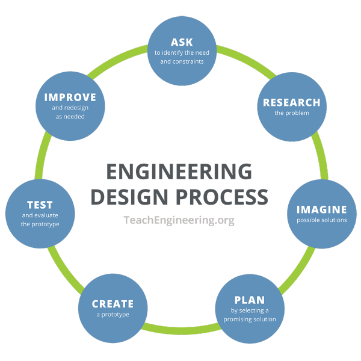
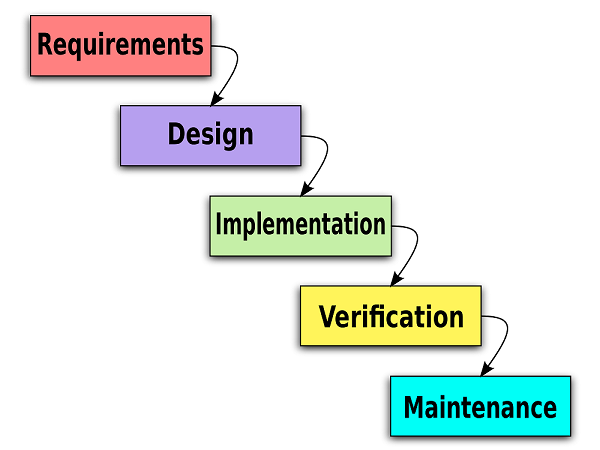

:slug: decision-making/
:date: 2020-08-19
:category: philosophy
:subtitle: An invitation to revisit all our software choices
:tags: engineering, business
:image: cover.png
:alt: Photo by Kyle Glenn on Unsplash
:description: This post will describe a way to make decisions in a design process.
:keywords: Decision, Strategy, Business, Engineering, Agile
:author: Mateo Norena
:writer: mnorena
:name: Mateo Norena
:about1: Systems Engineer, Software Development Team Leader
:source: https://unsplash.com/photos/IFLgWYlT2fI

= Decisions in a design process

In programming we are always making some decisions.
This matter turns into a critical issue
when we are working building software that we want to last.

One of the main decisions we are taking is about the stack we are building.
Given that every day a new or updated version of a
framework, database, language, etc is released,
we face the question, what do we should use?

In this article, I want to propose a way to make decisions concerning the 
software products that we are using or want to use in our stack.
These observations are from my point of view and collected along the
two years of being part of the Development Team in Fluid Attacks.
Also, it is important to note that these considerations are formulated
in retrospective, with the aim of build knowledge about the next decisions
we should make.

== Let's talk about the design process

In this first part, I want to take a walk from
the general Engineering Design Process
to the Agile one, passing by the Software Engineering one.

== The Engineering Design Process

The Engineering Design Process `EDP` is well established
and it shares some common steps with the well known Scientific Design Process.
However, while in the last we are working around a hypothesis,
in the prior we want to produce a sort of result
in the shape of a product or a service.

We can locate a set of variations in the Engineering Design Process,
but all accomplish basically the same,
in this post, I want to take into account the 
link:https://www.teachengineering.org/design/designprocess[process]
described by TeachEngineering in which we can follow seven steps:

.Engineering Design Process taken from link:https://www.teachengineering.org/Images/edpHub/EDPHub_Graphic.png[TeachEngineering].

== The Software Engineering Design Process

Following a similar approach that the Engineering Design Process,
in the 1970s, it was developed the also well known Waterfall Model. 
In this we can map every step to the correspondent one in
the Engineering Design Process, without forgetting that
in this process our result should be a working piece of software:

- *Requirements* (_Ask_ and _Research_ in `EDP`)
- *Design* (_Imagine_ and _Plan_ in `EDP`)
- *Implementation* (_Create_ in `EDP`)
- *Verification* (_Test_ in `EDP`)
- *Maintenance* (_Improve_ in `EDP`)

This latter model is very well structured,
however, because of this, it has received
a lot of critics because of its strictness and lack of flexibility.
Every step must be completed before the next,
and the first two steps are very dependant on documentation.
The above has caused the results to be delivered after months or even years.

.Software Engineering Design Process taken from link:https://www.seowebsitedesign.com/wp-content/uploads/2012/12/waterfall-model-software.png[SEO Website Design].

== The Agile Software Development Design Process

In the searching for increasing the Waterfall Model flexibility without 
sacrificing its discipline, other models emerged.
As a direct response to the Waterfall model, and to solve the problems of it,
in the year 2001 it was published the
link:https://agilemanifesto.org/[Manifesto for Agile Software Development]
which enumerates four principles.

This model results in another design process,
with the same steps that the Waterfall one,
but repeated increasingly,
for avoiding the main pitfalls of the Waterfall Model.

This latter approach is the one we use in Fluid Attacks
to develop modern software applications.
Since underneath its values, it follows a set of simple
link:https://agilemanifesto.org/principles.html[principles]
in whose we found the one that drives all our development team:

[quote]
____
Our highest priority is to satisfy the customer
through early and continuous delivery
of valuable software.
____

So, now we established our model to develop software,
the next question we have is,
where we should place the decision-making process?

== A proposal

After this introduction, we are ready to locate the decision-making process
as part of the requirements and design stages in our development model.
Nevertheless, as the Agile Manifesto reads, we have to be ready to change
the requirements, thus changing our stack if it is needed,
though, I consider that it is important to take into account the following:

- *Learning curve*: Implement a linting process in our code like 
is not the same that implement a library like
link:https://docs.python.org/3/library/asyncio.html[asyncio].
- *Developer expertise*. Don't get me wrong, it is 
link:https://twitter.com/tiangolo/status/1281946592459853830[clear]
that years of experience is not the same that skill level
and in Fluid Attacks, we know it very well.
Still, it is important, that our developers are somewhat familiarized
with the stack, or at least accompanied by more expert developers
that can share its expertise with them.
- *Compatibility*: There are pieces of software that are not 
well matched between them, so we must evaluate this before the implementation.
- *Expert opinion*: In an environment of total uncertainty, 
one of the best ways to make decisions is trusting the experts.
- *Point out errors*: Errors are inevitable in tasks of any complexity,
so one of the most effective strategies for reducing the
consequences is to make the errors as visible as possible.

== Conclusion

In this post, I proposed a set of considerations before choosing
a piece of software that it is going to be in our stack, also
these considerations should be addressed in early development stages,
so we can minimize the risk associated when the implementation.

== What's next

This is the first of a post series that pretends to revisit every one
of the decisions that we make in the choosing of different 
paradigms, frameworks, languages, services, and systems.
