:slug: devoops-writeup/
:date: 2018-10-16
:category: attacks
:subtitle: How to resolve HTB DevOops
:tags: security, htb, pwn, web
:image: cover.png
:alt: Developers programming in an office
:description: DevOops is a Linux Hack the Box machine that has several vulnerabilities where an attacker can gain remote code executionand finally system access as root. In this article we present how to exploit the vulnerabilities of that machine and how to gain access as root and obtain the root flag.
:keywords: HTB, Security, Hack the Box, Web, Writeup, DevOops.
:author: Jonathan Armas
:writer: johna
:name: Jonathan Armas
:about1: Systems Engineer, Security+
:about2: "Be formless, shapeless like water" Bruce Lee
:source: https://unsplash.com/photos/QckxruozjRg

= DevOops Writeup

== Scanning Phase

First, we check the IP of the
link:https://www.hackthebox.eu/home/machines/profile/140[DevOops]
machine and try a `ping`
to see if we have access.

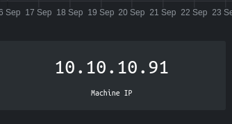
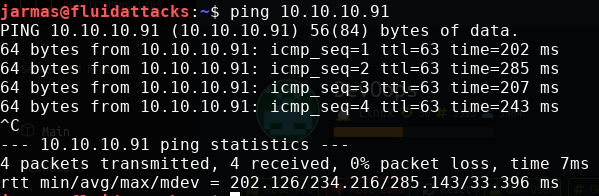

Then, we scan the ports with `nmap`.
In this case, we're going to use basic `nmap`.

.port scannning
[source, bash, linenums]
----
nmap 10.10.10.91
----

And, we see that ports `5000` and `22` are open.

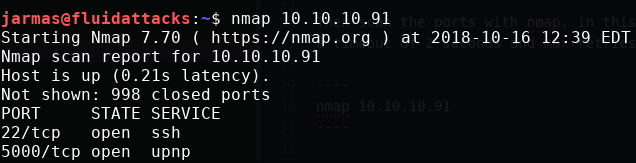

Then, we try to access port `5000` with our browser,
and it opens a web page with the contents of some feed.

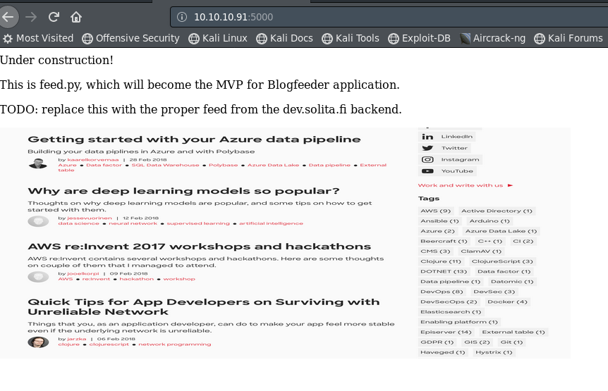

As we can see on this page,
there is nothing more than an image there.
So, we’re going to scan the whole web server with `dirbuster`
to see if we can access something useful.

.Searching folders in machine
[source, bash, linenums]
----
dirb http://10.10.10.91:5000
----

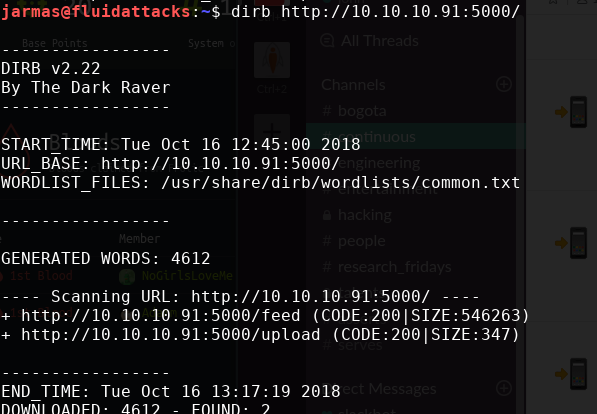

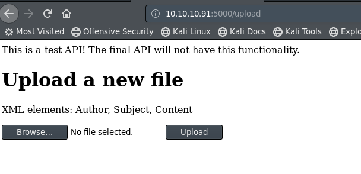

== Getting user

In the last step, we got an upload page,
because the page says we can upload `XML` files
with the tags Author, Subject and Content.
Then, we try to upload the following `XML` file.

.xml
[source, xml,linenums]
----
<post>
<Author>johnarmas</Author>
<Subject>test</Subject>
<heading>Reminder</heading>
<Content>test</Content>
</post>
----

The response of the server is:

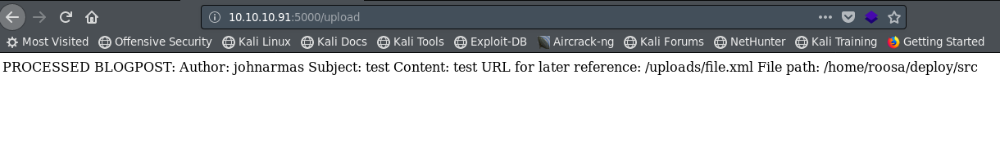

So, because there is no other functionality on the server,
we can suspect that there is an `XML External Entity` (`XXE`) injection.
This is a type of attack against an application that parses `XML` input.
This may lead to, among other issues,
the disclosure of confidential data, and denial of service.
We can exploit it to retrieve the contents of files
by uploading a malicious `XML` file.

To test this we can upload the following file:

[source, xml,linenums]
----
<?xml version="1.0" encoding="ISO-8859-1"?>
<!DOCTYPE foo [ <!ELEMENT foo ANY >
   <!ENTITY xxe SYSTEM "file:///etc/passwd" >]>
<post>
<Author>johnarmas</Author>
<Subject>hola</Subject>
<heading>Reminder</heading>
<Content>&xxe;</Content>
</post>
----

With this, we can retrieve the content of `/etc/passwd`
from the web server and test for `XXE` injection.
We can do it by manually uploading the file
or using a proxy like `burpsuite`
and sending the request to the repeater,
like in this example:

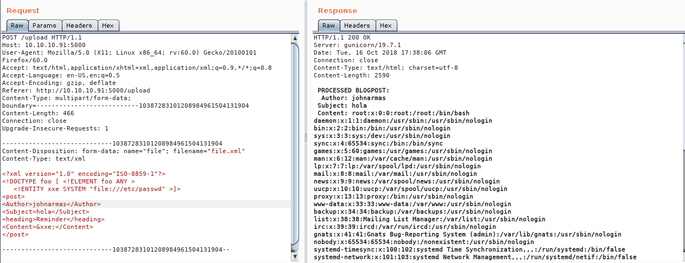

What to do next?
When we uploaded our first `XML` file,
we could see from the response that the file
is stored on `/home/roosa/deploy/src`.
With this information, we could retrieve the user flag.
Usually, this file is on `/home/roosa/user.txt`,
and modifying our `XXE` we could do it,
but what about remote code execution?

In our scans, we saw port `22` is open,
so maybe we could retrieve a private key
to access the server with `ssh`.

In general, the ssh keys are named `id_rsa`,
so what happens if we try to obtain the file `/home/roosa/.ssh/id_rsa`?

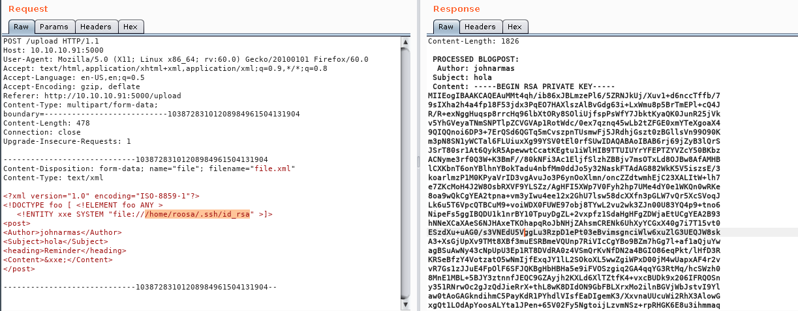

We save the content in a file
and change the permission to `0600`
to be able to use it with `ssh` without trouble.

We save the content in a file
and change the permissions to `0600`
to be able to use it with `ssh` without trouble.

I like `nano`, but it could be with any other text editor.
Then, we access the server with those credentials.

.Access to the server
[source, bash, linenums]
----
nano roosekey
chmod 0600 roosekey
ssh -i roosekey roosa@10.10.10.91
----

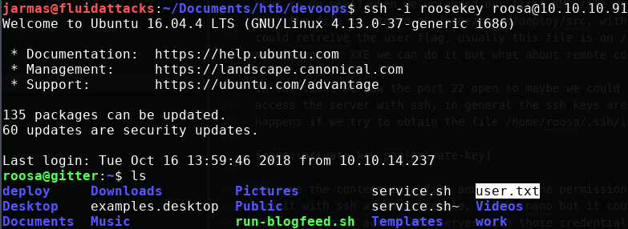

== Enumerating the server

When we access the server,
the first thing we should do
is to check the files and the folders that we can access.

On this server,
we can see that there is a folder named `deploy`.
Let's see what's in there.

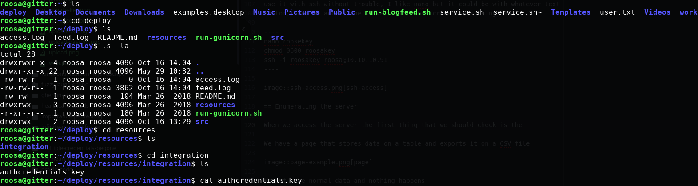

There is another private key,
but when we try to elevate it as `root`, we get an error.
So, what could be happening?
Let's see what commands our user has typed.

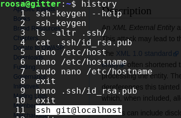

There we can see that our user has done a `ssh` to `localhost`
with the user `git`.
Let's try the same and see what happens.

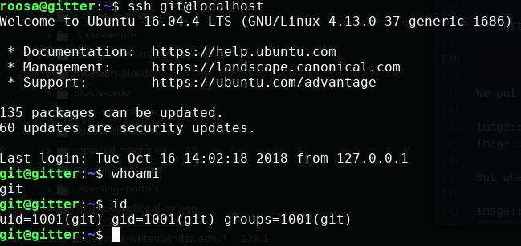

== Getting root

We do the same with our user `git` to check the history.
There is a command to a route that we didn’t know that is `/srv/git/`.
We access another folder
named `blogfeed.git` and check what is in there.

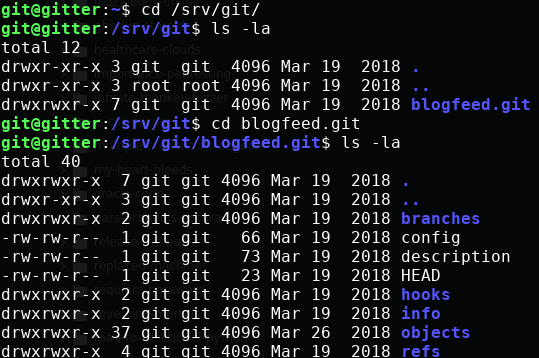

It looks like a normal `git` folder,
but there is no code in it.
Let's see what is on their log with:

.Repository log
[source, bash, linenums]
----
git log
----

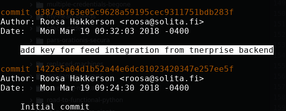

Surprise, surprise...

In their log is an authentication key,
but to see its content
we need to use `git log` with more verbosity

.Repository log, verbose
[source, bash, linenums]
----
git log -p -8
----

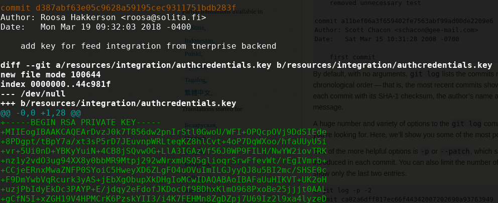

When we scroll down,
we can see the authentication key.
We need to copy it, remove the trailing plus symbols (only the first one)
and then, do the same with the first key we encounter.

We don’t know which user's key it is,
but we can try to find the `root` user.
It won't hurt anyone.

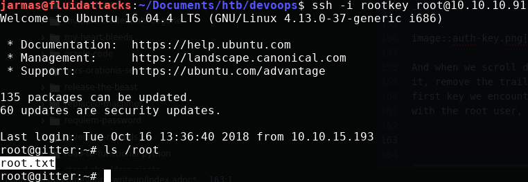

The key is, in fact, the user's `root`.
So, we can retrieve our `root` flag,
and the challenge is completed.

On this challenge `XXE`,
we learned to always check the `history`
when we gain access to a machine as a user,
and to check `git` repositories for credentials.
