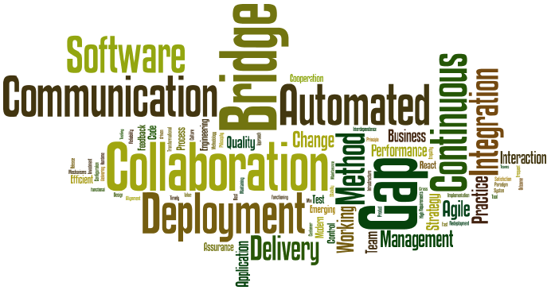
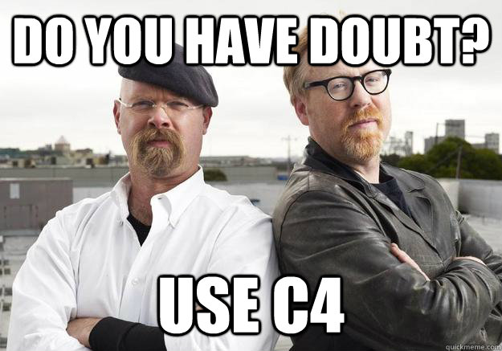

:slug: devops-concept/
:date: 2020-05-05
:subtitle: The central components of DevOps definition
:category: philosophy
:tags: devops, software, information, web, cloud, business
:image: cover.png
:alt: Photo by Michael Fenton on Unsplash
:description: In this post, we present an introduction about DevOps, a term with multiple definitions, a working methodology whose principles are communication and collaboration between developers and operators, automation, continuous release of new software versions, and quick reaction to feedback.
:keywords: Devops, Software, Information, Web, Cloud, Business
:author: Felipe Ruiz
:writer: fruiz
:name: Felipe Ruiz
:about1: Technical writer
:source: https://unsplash.com/photos/y5dUcQXzJ40

= Breaking Down DevOps

`DevOps` is a link:https://www.researchgate.net/publication/297573467_Towards_DevOps_in_the_Embedded_Systems_Domain_Why_is_It_so_Hard[predominant phenomenon],
a link:https://dl.acm.org/doi/pdf/10.1145/2962695.2962707[new way of thinking] and working in software engineering
that is receiving a lot of attention nowadays.
The word `DevOps` is a way
we can combine the words 'Development' and 'Operations.'
For this concept, over there in *2016*,
link:https://dl.acm.org/doi/pdf/10.1145/2962695.2962707[Jabbari et al.] said that
there was no concrete or complete definition.
That's why they decided to do a review and collect,
analyze, and compare definitions from scientific papers to consolidate one.

According to these authors, in their research,
*49* primary studies were meeting their requirements.
They identified in those studies
"the central components of `DevOps` definition."
But, before presenting them, we can see *Figure 1*,
a word-cloud with the common terms used in the definitions,
excluding the obvious ones: 'Development' and 'Operations.'

.taken from link:https://dl.acm.org/doi/pdf/10.1145/2962695.2962707[Jabbari et al. (2016)]

== Components of DevOps definition

As a first component (*C1*),
link:https://dl.acm.org/doi/pdf/10.1145/2962695.2962707[Jabbari et al. (2016)] show us the already mentioned combination of terms
'Development' (`Dev`) and 'Operations' (`Ops`).
The second component (*C2*) comprehends communication, collaboration,
and team working between developers and operators.

In the third component (*C3*), widely connected to the previous one,
we can see "the main goal of `DevOps`,"
which is to bridge the gap between `Dev` and `Ops` teams.
From the fourth component (*C4*),
we can assume that `DevOps` is a modern software development method
that unifies other methods and tools.

The fifth component (*C5*) is where `DevOps` is seen
as a paradigm of software delivery with continuous feedback,
fast response to modifications, and automated delivery pipelines.
In the sixth component (*C6*) appears the automatic "deployment process
from the source code in version control to the production environment."

The seventh component (*C7*) is related to 'continuous integration.'
Finally, the eight component (*C8*) is where `DevOps` is taken as a method
where quality assurance is essential for improving performance.

With those components identified,
link:https://dl.acm.org/doi/pdf/10.1145/2962695.2962707[Jabbari et al.] give us the following definition of `DevOps`:

[quote]
DevOps is a development methodology (C4)
aimed at bringing the gap (C3) between Development and Operations (C1),
emphasizing communication and collaboration (C2),
continuous integration (C7), quality assurance (C8) and delivery (C5)
with automated deployment (C6) utilizing a set of development practices.

With this definition as a guide,
we can easily delve into different issues about `DevOps`
and always know what component or part of this methodology we are referring to.

== Digging deeper into DevOps

So, for instance, let's expand what is said in *C1*, *C2*, and *C3*.
As our `CTO`, Rafael Alvarez, explains to us in [inner]#link:../../events/burn-the-datacenter/[one of his conferences]#,
in a company where software is created and sold as a product or service,
there are typically two teams.
A team of developers and a team of operators.
In short, the first team,
with its programming knowledge, creates the application.
The second team, which manages the hardware and operating systems,
is in charge of deployment
(making the app available for customer use) and service.

Rafael tells us that the development team
is often asked to change the software quickly.
In contrast, the operations team is asked to ensure
that the infrastructure remains stable and changes slowly.
From this point, there tends to be a struggle between the parties,
"political noise," which slows down the overall process.
Here is where the `DevOps` methodology comes into play,
bringing those two teams together.
As our `CTO` says, people are no longer grouped by task or function
but by product (or service),
and we then have cross-functional teams.

.taken from link:http://www.quickmeme.com/meme/35gk6h[quickmeme.com]

Now, continuing with the components, but focused on *C4* (not the explosive),
we have that `DevOps` is related to some software development methods.
Let's extend the information about that,
mostly from what link:https://medium.com/@freddyyumba/contrasting-the-waterfall-model-agile-lean-and-devops-a95cd9acf58[Freddy Yumba] shares.

'Waterfall’ and 'Agile' software development methods are often mentioned.
Waterfall is a traditional linear plan-driven approach to software development.
So, it is assumed that
all requirements can be specified before starting the development process.
Each phase must end before moving on to the next.
In Waterfall, each phase of development results in detailed documents
that must be signed and that are measures of progress.
In this model, the integration of later changes
may mean redesigning the entire system.
So, it is said that it doesn't accommodate well
to modifications requested by users
and that it doesn't give rise to creativity.

Instead, Agile focuses more on collaboration
"between development teams, business people and customer" (link:https://medium.com/@freddyyumba/contrasting-the-waterfall-model-agile-lean-and-devops-a95cd9acf58[Yumba]),
and on creativity, and rapid response to user needs.
Through this methodology, earlier and more frequent releases are sought.
Communication of development plans
is preferred through face-to-face conversations,
rather than through documentation as in Waterfall.

Then, 'Lean' methodology is also mentioned.
Lean, according to link:https://medium.com/@freddyyumba/contrasting-the-waterfall-model-agile-lean-and-devops-a95cd9acf58[Yumba],
is more oriented towards improving production system operations,
project management, and the delivery of products and services.
Some people see Lean as a way to bring agility
from the project level to the organization level.
In the Lean methodology, there's an essential aim:
the elimination of waste,
anything that doesn't add value to the development process.
Unnecessary meetings, documentation, and tasks
are discarded as much as possible.

`DevOps` arises by mixing Agile and Lean principles and practices,
but it's more than that.
As link:https://medium.com/@freddyyumba/contrasting-the-waterfall-model-agile-lean-and-devops-a95cd9acf58[Freddy Yumba] says:
`DevOps` is "a new culture, corporate philosophy, and way of working."
It is a result of the experiences of many people
and the desire to create and maintain organizations with high-speed,
high-performance processes and exceptional `IT` products and services.

Talking about more components,
`DevOps` also involves what we have as *C7*: 'continuous integration.'
It is one of the drivers of the `DevOps` culture.
The development practice is made from different machines and locations.
The resulting code is integrated into a shared repository
over and over again during the day, even every day.

Associated with the above, *C5*, *C6*, and *C8* appear.
An automated build verifies each check-in,
which serves to detect bugs and other problems quickly,
without waiting for full code integration
and the deployment of the entire system.
Then we have continuous, automated, and fast delivery,
with software always ready for the production environment,
to be released to users whenever required.
In `DevOps`, there's increased responsiveness
to customer requirements and needs.

With a continuous deployment, companies in the web domain,
as is commented by link:https://www.researchgate.net/publication/297573467_Towards_DevOps_in_the_Embedded_Systems_Domain_Why_is_It_so_Hard[Lwakatare et al. (2016)],
have "the opportunity to quickly verify
whether their new software features are useful to customers
and [can adopt] practices such as *A/B* testing."
In this, "users are randomly assigned
to one of the two variants of the system for experimentation."

As link:https://ieeexplore.ieee.org/stamp/stamp.jsp?tp=&arnumber=7458765[Zhu, Bass, and Champlin-Scharff (2016)] say,
in `DevOps`, the "systems are monitored after deployment,
and changes might be rolled back."
Quick feedback becomes quite useful to evaluate the quality of the software
and continuously repair or improve what is needed in the development process.

Today, many companies offer software as a service (`SaaS`) on the web.
"Resource virtualization and cloud computing
have provided the required building blocks" (link:https://ieeexplore.ieee.org/stamp/stamp.jsp?tp=&arnumber=7458759[Spinellis, 2016]).
"DevOps —according to link:https://www.researchgate.net/publication/297573467_Towards_DevOps_in_the_Embedded_Systems_Domain_Why_is_It_so_Hard[Lwakatare et al., 2016]—
has proven to be most conducive to SaaS applications,
because companies maintain full control and ownership of the infrastructure
and have fast mechanisms for rolling back new software releases
whenever there are problems."

What happens if we implement the term 'security' in this context?

We get the much mentioned `DevSecOps` concept. +
Don't worry; surely we'll talk about it later.
