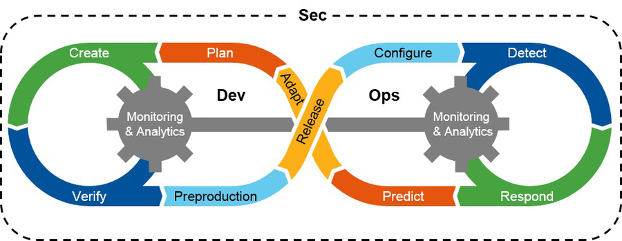

:slug: devsecops-concept/
:date: 2020-05-14
:subtitle: An overview of DevSecOps, better SecDevOps
:category: philosophy
:tags: security, devops, software, information, web, cloud
:image: cover.png
:alt: Photo by Sebastian Pena Lambarri on Unsplash
:description: DevSecOps is the evolution of a renowned software engineering approach that is here to stay. Through this blog post, you will know what DevSecOps is, how it applies, and why it is recommended for IT companies. Maybe even when you finish reading it, you won't refer to this term in the same way again.
:keywords: Security, Devops, Software, Information, Web, Cloud
:author: Felipe Ruiz
:writer: fruiz
:name: Felipe Ruiz
:about1: Technical writer
:source: https://unsplash.com/photos/YV593oyMKmo

= Everyone Is Responsible for SEC

We recently published [inner]#link:../devops-concept/[a post about 'DevOps.']#
At the end of it, we asked about the inclusion of security
in this methodology of continuous integration and deployment.
Consequently, we refer to the emergence of the `'DevSecOps'` concept. +
But what does this term mean?

=== Definition of DevSecOps

Let's see. If we search on the Internet for a short definition,
we find what is said in link:https://www.gartner.com/en/information-technology/glossary/devsecops[Gartner's glossary]:

[quote]
DevSecOps is the integration of security
into emerging agile IT and DevOps development
as seamlessly and as transparently as possible.
Ideally, this is done without reducing the agility or speed of developers
or requiring them to leave their development toolchain environment.

Ok, that information might be enough. See you in the next post!

.Ah? (image taken from link:https://i.imgur.com/YezxAlA.png[imgur.com])

What? I was just kidding! Let's talk a little more about it.

As we said, the element `Sec`, referring to security, is added to `DevOps`.
But to be clear, we don't just add it anywhere,
we add it in the middle: `DevSecOps`.
Security is then expected to play a significant role
alongside the development (`Dev`) and operations (`Ops`) processes.
`DevSecOps` is an evolution of `DevOps`
where security is understood and implemented.
But why the inclusion of security in this methodology?

Well, security in software engineering is still ignored by many.
Others still see it as an obstacle that slows down the production process.
But many others have come to see security as a _necessity_
in an ample shared virtual space,
where the intentions of a lot turn out not to be the best
(you can read our posts on [inner]#link:../phishing/[phishing]# and [inner]#link:../ransomware/[ransomware]#).
The most attentive regarding this issue
have been those wishing to maintain the prestige of their companies,
which may be handling personal data of huge amounts of users.

We must be aware that user data and app functionality
can be put at risk by the presence of vulnerabilities
in code developed by programmers.
So, to avoid weaknesses and subsequent attacks on products,
security measures must be implemented from the early stages
in the software development life cycles (`SDLC`).
It's true that security tests usually have been carried out
_just before_ the deployment of applications to the production environment.
But for many, this testing approach has been a burden.
What about those within the `DevOps` culture
who are continually creating features on their applications?
Are they investing time and effort in finding and detecting gaps in their code
_just before_ each deployment?

If they are already within the `DevSecOps` approach, the answer is *NO*.
When we say implementation in the early stages, as shown in *Figure 2*,
the security element has to cover the cycle from its beginning to its end.

.DevSecOps (taken from link:https://images.idgesg.net/images/article/2018/01/devsecops-gartner-image-100745815-orig.jpg[images.idgesg.net], original from Gartner)

In this approach, companies have to establish security requirements
they must comply with, which are initially encoded,
and then verified during the `SDLC`
through open source or proprietary software.
The security requirements can be link:https://medium.com/faun/what-is-devsecops-the-6-steps-to-secure-your-software-delivery-447906a6bd9f[based on system infrastructure assessments].
Such evaluations carried out manually and from the attacker's point of view
detect potential security issues.
In other words, these assessments are intended to answer questions such as:
Where can hackers attack us?
What are the areas and information that we must protect the most?
What are the gaps that we must not allow in our applications?
What will be the countermeasures and solutions to establish?

Following those security requirements,
security checks for finding vulnerabilities
are performed continuously and automatically by the tools,
keeping pace with `DevOps`.
The use of these tools integrated into the pipelines,
employing `SAST` and `DAST` techniques,
makes it possible to minimize the number of the software's vulnerabilities.
These weaknesses can be found early, while the code is under construction,
and their remediation can also be done promptly.
The timely activity of the tools,
which should generate continuous information logging and quick feedback,
allows companies to stay one step ahead of attackers
and maintain security control.

*Tip:* _Perform the security checks gradually,
starting link:https://medium.com/hackernoon/the-future-of-security-is-devsecops-9166db1d8a03[with high-priority areas],
trying not to overload the developers with work
as they are usually responsible for closing the gaps._

=== DevSecOps with Fluid Attacks

Now, to have a clearer idea of the role of security within `DevOps`,
let's briefly outline what Oscar Prado, Cybersecurity Analyst,
shared with us about what `Fluid Attacks` does for its clients.
Our company offers continuous hacking service,
a constant search for vulnerabilities or gaps in `IT` systems.
But although some tools are used in this process,
at `Fluid Attacks`, it is not entirely automatic or tool-dependent,
contrary to what other companies do.
Here more value is placed on the manual work of ethical hackers.
Their work can begin "from the moment the first commit is uploaded,"
with every new change being reviewed.
That work can continue after the application has been deployed to production.

When a vulnerability is detected in the client's code
(with our product *'Forces'* enabled),
a member of our team develops a personalized script called 'exploit,'
associated with the finding.
That exploit "automatically checks if the analyst's finding persists."
Therefore, "if the customer wants to make new changes to her product,
she must fix the finding first," because if she doesn't,
the exploit will continue reporting the presence of the vulnerability.
Then, according to a configuration by our team, *Forces* will break the build,
and the deployment process will be automatically stopped.
"This way, security is prioritized, and our security testing
is integrated into the client's `SDLC`," Oscar concludes.

*Parenthesis:* _It is important to note that some problems may arise
in relation to security requirements.
Based on link:https://medium.com/@aditi.chaudhry92/what-is-devsecops-cb14cfd457b2[Aditi Chaudhry]'s examples,
one can be the case where a company decides to break the build_
only _because of the presence of high or critical vulnerabilities.
That decision can pose a risk
as vulnerabilities of lesser severity
end up becoming part of the product delivered to users.
It is indeed good to have some priorities,
but finding and remedying the most urgent problems
is not going to stop the existence of minor issues,
to which attention must then be paid._

.'Break the build' means to stop the software deployment process (link:https://www.citymetric.com/sites/default/files/article_2015/01/149818154.jpg[photo-link])

=== SecDevOps?

It is curious that when we spoke with Oscar,
he didn't use the name `DevSecOps`, but `SecDevOps`.
He moved security to the left.
Having security in the beginning
—although it may be strange in practical terms,
that is, not having developed anything before—
may actually be a "well-intentioned principle,"
according to link:https://www.csoonline.com/article/3132078/devopssec-secdevops-devsecops-whats-in-a-name.html[Tischart in one of his posts].
With `SecDevOps`, perhaps more emphasis is placed on
initially establishing security requirements
to be followed through testing processes
carried out continuously in the `SDLC`.

Regardless of the name we give
to the inclusion of security into the `DevOps` methodology,
from this new business culture,
security is expected to play an essential role
in software production and maintenance from the beginning.
It is intended that all those involved in the projects
—regardless of their skills—
know and apply security; that's why they need training.
Bear in mind that just as in `DevOps`,
there shouldn't be separate teams by function but by product.
In the end, everyone must be responsible for security.

Companies that decide to implement the `DevSecOps` approach
(perhaps better `SecDevOps`) will achieve significant benefits,
especially in the quality and security of their processes and products.
Would you like advice on how to do it? [inner]#link:../../contact-us/[Get in touch with our team!]#
