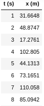
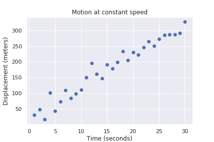
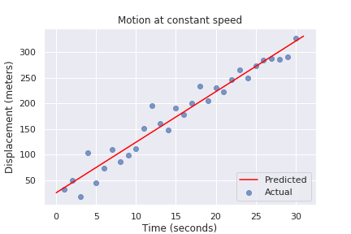

:slug: digression-regression/
:date: 2019-10-02
:subtitle: Simple linear regression in scikit
:category: python
:tags: machine learning, python, code
:image: cover.png
:alt: Data and regression line, crop.
:description: We begin to tackle the question of why vectors are the most apt representation for data as input to machine learning algorithms and present the scikit-learn API by means of simple linear regression, i.e., finding the line that best fits data, on a fictional example from simple motion.
:keywords: Machine learning, Linear Regression, Python, Algorithm, Prediction, Regression
:author: Rafael Ballestas
:writer: raballestasr
:name: Rafael Ballestas
:about1: Mathematician
:about2: with an itch for CS
:source-highlighter: pygments

= Digression to Regression

After our link:../tags/risk[risk quantification series],
it should come as no surprise
that we like numbers and measuring.
However, when confronted with the question:
"Why do you need to translate code into vectors?",
I am speechless.

Most (if not all) machine learning algorithms in abstract,
and the concrete tools and libraries
from the +Python+ data science toolset
(+Numpy, Pandas, Keras+, more on that later)
_expect_ the features and targets to be real valued.
They rely on concepts such as _distance_,
_error_, _cost functions_ and attempt to
minimize the latter by
adjusting their inner parameters.
All of these concepts are inherently mathematical.

Out of these algorithms, the easiest to
understand well is perhaps the simple linear regression.
So let's start with that.
Plus, _regression_ is a fundamentally different kind of task
from the ones we have
link:../crash-course-machine-learning/[discussed the most in the series],
which are _classification_ and _clustering_ tasks:
Regression aims to predict a number taken from
a continuum instead of answering "yes" or "no"
or tell to which group some input most likely belongs.

The situation is this:
we have two variables which appear to be (linearly) related,
and we would like a model that generalizes that relation.
Simple linear regression is used
for many interesting purposes, such as
determining:

* the relation between sales price of an asset vs its age, i.e.,
understanding depreciation,

* the fuel efficiency of a vehicle: fuel consumption vs distance covered;

* effectiveness of advertising: money spent in ads vs revenue,

* indirectly measuring physical quantities,
such as speed or acceleration.

In the first three examples above,
it could be argued
that there are other variables at play,
that the relation might not be necessarily linear, etc.
But in the last case,
and under lab-controlled conditions,
it is true that the position _x_ of
an object that moves at *constant* speed _v_
after a time _t_
departing from an initial position _i_
is given by _x = vt + i_.
Suppose we want to know the speed _v_
using only a ruler and a watch.
If measurements were perfect, we would only need two,
for we have two unkowns: _v_ and _i_.
However, in reality, they are not,
so we need to make several measurements,
and sort of "average them out" via fitting a line,
i.e., the regression.
We can make several measurements of _x_ and _t_,
which we might register in a table like this:

.Position vs time table, first few observations

This doesn't say as much as a plot:

.This shows positive correlation

Here we see there is a clear linear relation,
but no single line would perfectly fit all points.
The goal in linear regression is thus to
find the line that _best_ fits the points.
But what is the "best"?
There are several choices,
and each of those choices would be a different model.
The standard in linear regression is to minimize
the sum of the squares of the errors
for each observation. What?
Each choice of _v_ and _i_ would produce,
for each value of _t_, a corresponding value for _x_,
which may be close or far from the actual observation.
The difference between these two is called a _residual_.
But we don't care about each individual residual,
but to make them small overall.
So we add them all, but before that,
we square them in order to avoid the possibility
that due to the signs they might end up adding to
something close to 0.
This is in fact the cost function for
this particular algorithm:
different techniques come with different cost functions
and different ways to minimize them.

In simple linear regression,
the expression for the cost function
is easy enough that it
be solved with pen and paper.
In other algorithms,
hill-climbing and gradient descent techniques are
taken from optimization (more on that later).
Even simple brute force (trial and error) might be used,
as long as the cost function is minimized.

Instead of implementing simple linear regression
in pure +Python+, which could be done,
let this serve as an excuse to present the
general machine learning flow.
The tool of choice to perform
"traditional" machine learning and
data analysis in +Python+, i.e.
everything but neural networks will be
link:https://scikit-learn.org/[scikit-learn].
The flow to use this library is tipically the same
regardless of how sophisticated the chosen model:

* Create an instance of the model:

.Creating a linear regressor in scikit
[source,python]
----
from sklearn.linear_model import LinearRegression
model = LinearRegression(fit_intercept=True)
----

* Train (fit) with the data
[source,python]
----
model.fit(t, x)
----
Asumming that +t+ and +x+ are +NumPy+ arrays
(a more mathematically apt extension of lists)
holding the time and position variables, respectively.

* Make predictions
[source,python]
----
import numpy as np
time = np.linspace(0, 31, 1000).reshape(-1,1)
xfit = model.predict(time)
----
Create a new array holding a thousand
evenly spread values for time, and then
use the trained model to predict their
corresponding values in the independent variable.

* Assess model performance
[source,python]
----
import matplotlib.pyplot as plt
plt.scatter(t, x, alpha=0.7)
plt.plot(time, xfit, 'red')
----

.Regression line fits the data relatively well

In the case of simple linear regression,
it is possible to _see_ how well the model performed as above.
Quantitatively, we can use the _R^2^_ metric:

[source,python]
----
>>> model.score(t, x)
0.9531426066695182
----

The closer this value is to 1,
the better the fit and hence the regression.

That is, in a nutshell, how to
make, train and draw predictions from
machine learning algorithms in +scikit+,
with a few subtle changes from one to the next,
such as:

* usually, one splits the data into training,
validation and testing sets.
However, the expected format remains the same:
the _features_ or _predictors_
(+t+ above, but usually is +x+)
needs to be an array of vectors
and the _targets_ or _labels_
(usually +y+) a simple list or +1D+ array.

* The validation and testing are performed
in different ways according to the task,
since plotting them and getting a single evaluating number
as above is not always feasible.

Perhaps this helps in answering the question above,
which is one of those that we sometimes take for granted,
but are not necessarily easy to explain.
More on why and how to turn natural language and code
into vectors so that they might be used by standard +ML+ techniques.

== References

. [[r1]] link:https://scikit-learn.org/stable/documentation.html[Scikit-learn documentation.]
