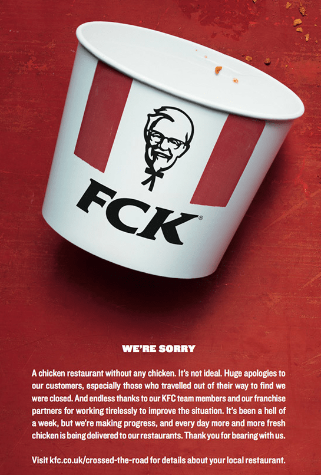
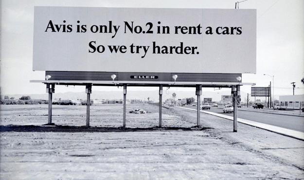
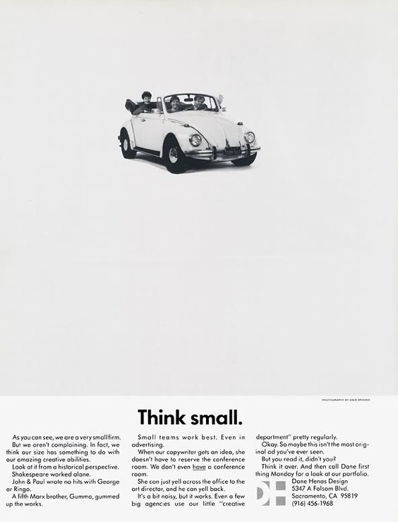

:slug: fck-strategy/
:date: 2019-04-30
:subtitle: The pratfall effect application on business
:category: philosophy
:tags: business, security, mistake, company
:image: cover.png
:alt: Broken blue ceramic plate on Unsplash: https://unsplash.com/photos/Odc4dcsjUBw
:description: By facing errors, organizations try to deviate public attention; a ‘rational’ response, perhaps. Companies should pay attention to how to handle mistakes (not only in cybersecurity). Moreover, businesses should think about how to leverage from imperfection. A ‘F*CK’ statement provides a lesson.
:keywords: Bussiness, Mistakes, Company, Image, Cibersecurity, Pratfall Effect
:author: Julian Arango
:writer: jarango
:name: Julian Arango
:about1: Behavioral strategist
:about2: Data scientist in training.
:source: https://unsplash.com/photos/Odc4dcsjUBw

= The F*CK strategy

Do you like fried chicken?
A year ago or so, `KFC` -the chicken fast-food chain-
was featured in almost every news outlet in the UK:
they ran out of chicken for an entire weekend.
A horror story for a food-chain with `900` restaurants in the country.
People were mad at them,
and they were the target of enormous criticism.
What did `KFC` do to address this uncomfortable position?

`KFC` UK worked together with their advertisement agency
to plan how to handle the public relations turmoil.
An apology arose, but not a dry one.
A straightforward tweak using their brand
along with a written apology was a splendid move.
Check it out:

.KFC advertisement at the moment of handling the chicken shortage in the UK.

The company signaled to the public that they screwed things up,
with their brand! Very creative and smart.
Moreover, the apology, as I mentioned, was not a dry one.
It was an open, heartfelt expression about contradiction
(_“a chicken restaurant without chicken is not ideal”_).
Also, an acknowledgment about how hard it was to maneuver the episode
(_“It’s been a hell of a week”_).
Brilliant! What came next was the demonstration
of turning a problem into a solution.
People loved the response by `KFC`
(published in two national printed newspapers).
Take a look at this video from Cannes Lions:

++++

<iframe width="560" height="315" src="https://www.youtube.com/embed/REfJMO8AJ5Y" frameborder="0" allowfullscreen></iframe>

++++

Yeah, the agency and `KFC` won an award for this.

== The pratfall effect

In the `1960s`, psychologist Elliot Aronson
coined the term link:http://www.psychologyconcepts.com/pratfall-effect/.[_‘pratfall effect’_]
describing some of his research findings.

[quote]
“The pratfall effect is a phenomenon
where people who are perceived as competent,
are perceived as more likable or attractive when they commit a blunder.”

Aronson ran an experiment recording an actor
while pretending to be answering quizzes.
The quizzes results were also recorded.
In one condition, after _‘solving’_ the questionnaires
(`92%` right, on purpose)
the actor pretended to spill a cup of coffee over himself.
In the other condition, there was nothing clumsy.
The recordings were played to a large sample of students
who rated afterwards how likable was the participant shown.
The clumsy one was rated better.

.Avis advertising using the pratfall effect.

We don’t have to wait for our clumsiness,
nor to simulate something of the like
to put the pratfall effect into practice.
Volkswagen (`VW`), Avis, Stella Artois,
and some other brands have used the effect on advertising campaigns.
Let’s talk about a `VW` case.
The `VW` Beetle was a success thanks to the sharp copywriting pointing
to some (apparently) discouraging aspects of the car model.
_“Ugly”_, _“slow”_, _“noisy”_, _“expensive”_ is what you would have seen
in one of the ads in those glorious years for the Beetle.
Thanks to adman and writer Richard Shotton,
I came across this funny `VW` ad:
“Think Small” (see below),
featuring the supposedly not-that-right size of the vehicle.
Counterintuitive.
That’s the complexity of the human mind.

.Volkswagen advertising

[quote]
“VW used these weaknesses to their advantage
– they implied that the Beetle looked bizarre
because their focus was on engineering excellence,
not superficial looks”

Wrote Shotton in link:https://mumbrella.com.au/brands-need-to-learn-to-accept-the-negative-with-the-positive-513514[Mumbrella].

== Epic failures and honesty

Have you ever had an epic cybersecurity failure?
I bet you have.
`Fluid Attacks` has also been there
(yeah, I know because I was responsible for one).
The `FCK` story and, more broadly,
the pratfall effect tells us something valuable
about handling incidents and signaling who we are.

Back in 2014, one of our customers angrily called us
because of a security incident provoked presumably by one of our pentesters;
he performed a denial of service attack on one workstation,
and it appeared to have collapsed a middle network security device,
leaving large corporate systems offline for around `45` minutes.
You read that right:
a pentesting company, hired to make `IT` more secure,
causing mission-critical systems to be out of service
(a contradiction, just like in the KFC situation).
We met immediately with the manager who hired us;
we asked him to tell us about the incident;
the losses seemed financially significant.
It was an awkward, tense 30-minute meeting.
I remember we asked some technical questions about how the incident unfolded.
Our colleague admitted his mistake,
and we had nothing more to do than offer a sincere apology
and to come back with a proposal to compensate for the outage.
The project was halted.

A few days later,
my boss at the time met with the customer and agreed to resume the project
and accepted our compensation proposal.
We then reflected on this incident.
The words of our `CEO` at the time still resonate in my mind:
_“responsibility before profits.”_
Today, that customer continues to trust `Fluid Attacks`;
and both of us have been able to put that incident in the past.

We shouldn’t be afraid about being honest
when a possibly (huge) error was made.
A company admitting errors makes itself more human.
Customers, we know, value companies that are perceived close to them.
Everybody knows that as humans, we make mistakes, so do companies or brands.
The act of signaling some blunders
makes brands to be perceived as more trustworthy.
Admitting weakness is concrete proof of honesty
and, consequently, makes other claims more believable.

If you ever are responsible for a security breach, tell your company.
Accept your responsibility, bet on the pratfall effect;
choose honesty.
Also, do it quickly.
Many companies have feared a lousy reaction from business errors
or adverse circumstances following this path but have succeeded.
Have you heard about Johnson & Johnson and their Tylenol product poisoning?

== Failures and not-so-good outcomes from handling strategy

I’ve been a learner at `Datacamp` for almost three years.
This company provides online training in data science
in a bunch of technologies (`Python`, `R`, `SQL`, and others).
A couple of days ago, I got to know over `Twitter`
about a scandal concerning that company.
The `CEO` was involved in sexual harassment to an instructor in 2017;
this can be found on many websites as well in `Twitter`.
The data science community, in support of the victim (a research scientist),
started a _“boycott”_ this April
(link:https://noamross.github.io/datacamp-sexual-assault/[example]).
In short, dozens of instructors started to tell people
not to take their courses on `Datacamp` and to use other available resources.
The reason? `Datacamp` management tried to hide
or diminish the incident as people demanded transparency
and accountability for the issue, a long time ago.
Companies, like `RStudio`, also spoke up against the bad `Datacamp` handling.
On April `24th`, a very late communication
from the company’s board announced that the `CEO`
was stepping from his position indefinitely.
I bet if the strategy was different,
all this could have been avoided.
`Datacamp` is a big worldwide player in the e-learning market,
and it failed to embrace the pratfall effect.
I would say that their _“rational”_ approach
led to the disastrous public relations handling,
eroding their trust.

== At Fluid Attacks, we’re not flawless, but we do our best

We are humans, and we make mistakes.
It doesn’t help to hide or diminish errors.
As we saw in this post, this might harm in unexpected ways.
Conversely, being open and confront our flaws could have massive returns.
By doing this, we are perceived more human,
more real, and thus, the trust on us strengthens.
We wanted to share with you another perspective of human nature
related to our day to day mission in cybersecurity.
No individual and no organization is fully protected against security breaches.
We must understand that fact,
and we should prepare the best we can to avoid those breaches.
We, at `Fluid Attacks`, try the best we can
to infuse that premise among our employees.
We also share with our customers that we are not flawless,
and that sh*t happens from time to time.

We invite you to check our services
if you still don’t know about them.
We offer [inner]#link:../../services/continuous-hacking/[Continuous Hacking]#,
a service that provides a constant review of your source code
and applications, looking for vulnerabilities
(allowing the develop team to focus only on the development),
as well as the tracking of the found weaknesses.
The service leverages on [inner]#link:../../products/integrates[Integrates]#,
our product for Vulnerability Management.
`Integrates` is a critical component of our value proposition.
We know `Integrates` is not yet a front runner.
We don’t know whether we are the number one,
or the second, but we work hard to make it better for you.
