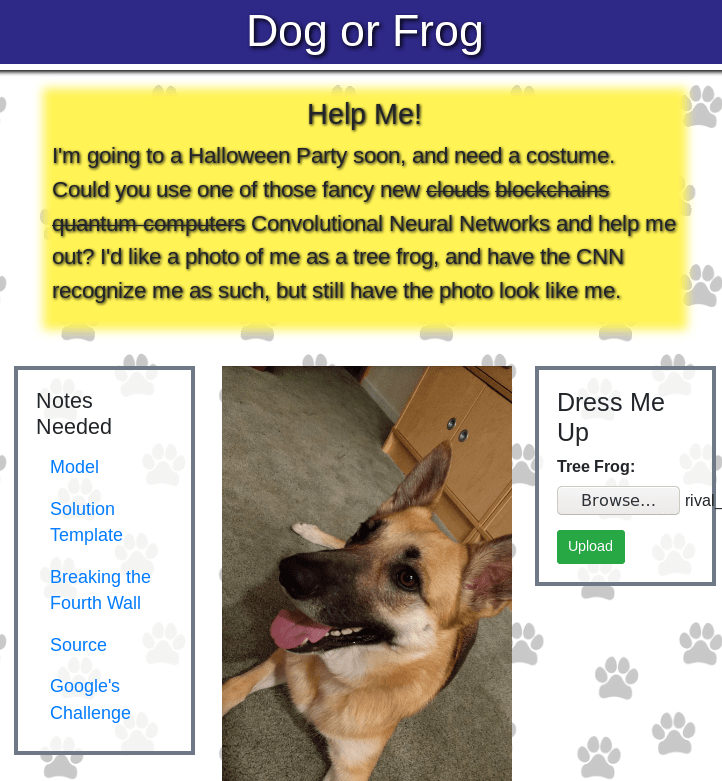
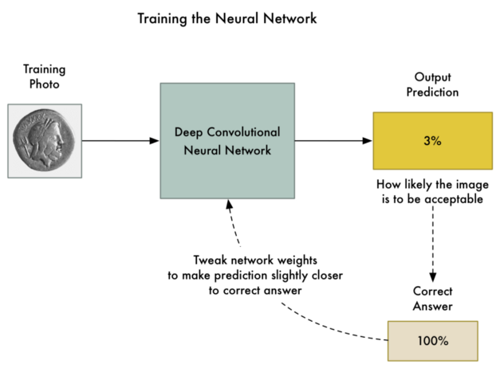
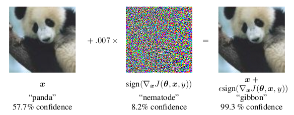
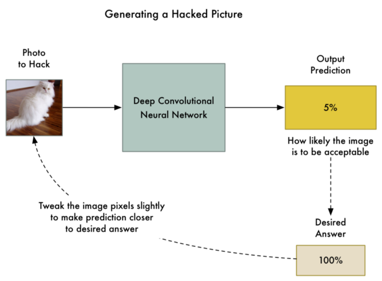
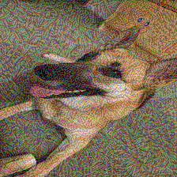

:slug: fool-machine/
:date: 2019-08-13
:subtitle: Trick neural network classifiers
:category: attacks
:tags: machine learning, vulnerability, code
:image: cover.png
:alt: Photo by KP Bodenstein on Unsplash: https://unsplash.com/photos/ElQI4kGSbiw
:description: While neural networks are great at artificial intelligence tasks, they are not without flaws. In this article we show how to create images that fool classifiers into believing they are seeing the wrong thing, while maintaining visual similarity with a correctly classified image.
:keywords: Machine learning, Vulnerability, Classification, Adversarial Example, Image, Artificial Intelligence
:author: Rafael Ballestas
:writer: raballestasr
:name: Rafael Ballestas
:about1: Mathematician
:about2: with an itch for CS
:source-highlighter: pygments

= Fool the machine

Artificial Neural Networks (+ANNs+) are certainly a wondrous achievement,
if not very intelligible.
They solve classification and other learning tasks with great accuracy.
However, they are not flawless and might misclassify and input.
No problem, error is expected.
But what if you could give it two inputs
that are virtually the same,
and get different outputs?
Worse, what if one is correctly classified
and the other manipulated into being classified as _anything_ you want?
These are called _adversarial examples_ in this context.

The applications are endless.
You could fool image recognition systems, actual cameras,
make an autonomous car crash,
bypass spam filters, etc.

That is just the content of one
link:https://picoctf.com/[PicoCTF]
challenge we came across recently.
There is a server whose sole purpose is for you to upload an image,
and it will do the classification and let you know the results.
Our task is to take the image of the dog,
which is correctly classified as a _Malinois_, which it is,
and manipulate it so that it is classified as a tree frog.
However, for your image to be a proper _adversarial example_,
it must be basically indistinguishable from the original,
i.e., it must still look like the same dog to a human:

.link:http://2018shell.picoctf.com:11889/[Challenge] description.

So, how does one go about creating such an adversarial example?
Recall that in our brief survey of machine learning techniques, we discussed
link:../crash-course-machine-learning/#artificial-neural-networks-and-deep-learning[training neural networks].
It is an iterative process in which
you continuously adjust the _weight_ parameters of your black box (the +ANN+)
until the outputs agree with the expected ones,
or at least, _minimize_ the cost function,
which is a measure of how wrong the prediction is.
I will borrow an image that better explains it from <<r2, [2]>>.

.Training a neural network by <<r2, [2]>>.

This technique is known as _backpropagation_ in the lingo.
Now, in order to obtain a picture that is still like the original,
but will classify as something entirely different,
what one could try to do is add some noise,
but not too much, so the picture doesn't change,
and not just anywhere, but exactly in the right places,
so that the classifier reads a different pattern.
Some clever folks from Google found out that
the best way to do this is by using the gradient of the cost function:

.Adding noise to fool the classifier. From <<r1, [1]>>

This is called the _fast gradient sign_ method.
This gradient can be computed _backpropagation_ again,
but in reverse, i.e.,
since the model is already trained,
and we can't modify it, let us modify the picture
little by little and see if it gets us any closer to the target.
I will again borrow from
link[@ageitgey]
since the analogy is much clearer this way:

.Tweaking the image, by <<r2, [2]>>.

The pseudo-code that would generate
an adversarial example via this method would be as follows.
Assume that the model is save in a +Keras+ +h5+ file, as in the challenge.
We can load the model,
get the input and output layers (first and last),
get the cost and gradient functions and
define a convenience function that
returns both for a particular input, like this:

.Getting cost function and gradients from a neural network
[source,python]
----
from keras.models import load_model
from keras import backend as K

model = load_model('model.h5')
input_layer = model.layers[0].input
output_layer = model.layers[-1].output
cost_function = output_layer[0, object_type_to_fake]
gradient_function = K.gradients(cost_function, input_layer)[0]
get_cost_and_gradients = K.function([input_layer, K.learning_phase()], [cost_function, gradient_function])
----

Where +object_type_to_fake+ is the class number of
what we want to fake.
Now, as per the formula in figure 2 above,
we should add a small fraction of the
sign of the gradient, until we achieve the result,
which is that the confidence in the prediction be at least 95%:

[source,python]
----
while confidence < 0.95:
    cost, gradient = get_cost_and_gradients([adversarial_image, 0])
    adversarial_image += 0.007 * np.sign(gradient)
----

However, this procedure takes way too long
without a +GPU+. A few hours according to <<r2, [2]>>.
For the +CTF+er and the more practical-minded reader,
there is a library which does this and other attacks
on machine learning systems to determine their
vulnerability to adversarial examples:
link:https://github.com/tensorflow/cleverhans/[CleverHans].
Using this library,
we change the expensive +while+ cycle above
to two +API+ calls:
make a instace of the attack method,
and then ask it to generate the adversarial example:

[source,python]
----
method = cleverhans.attacks.MomentumIterativeMethod(model, sess=K.get_session())
test   = method.generate_np(adversarial_image, eps=0.3, eps_iter=0.06, nb_iter=10, y_target=target)
----

And so we obtain this image:

.Adversarial image for the challenge

You can almost _see_ the tree frog lurking in the back,
if you imagine the two knobs on the cabinet are its eyes.
Just kidding.
Upload it to the challenge site and,
instead of getting the predictions, we get the flag.

Not just that, the model, which is based on +MobileNet+,
predicts is 99.99974% sure this is a tree frog,
while the difference, according to the widely used
perceptual hash algorithm, is less than two bits,
although the second clearly has artifacts,
from a human point of view.

What's worst is that these issues persist
_across_ different models as long as the training data is similar.
That means that we could probably use the same image
on a different image classifier with animal images
and still get the same results.

So we, should think twice before deploying
+ML+-powered security measures.
This is of course a toy example,
but in more critical scenarios,
models that are not resistant to
adversarial examples could be catastrophic.
Apparently, the reason behind this is the
linearity in the functions hidden in these networks,
so switching to a more non-linear model such as RBF networks
could solve the problem.
Another work-around could be to train the
+ANNs+ _including_ adversarial examples.

Whatever the solution, it should be clear
that one should test twice, and deploy once,
adapting the old woodworker's adage.

== References

. [[r1]] I. Goodfellow, J. Shlens, C. Szegedy.
_Explaining and harnessing adversarial examples_
link:https://arxiv.org/pdf/1412.6572.pdf[arXiv].

. [[r2]] A. Geigtey.
_Machine Learning is Fun Part 8: How to Intentionally Trick Neural Networks_
link:https://medium.com/@ageitgey/machine-learning-is-fun-part-8-how-to-intentionally-trick-neural-networks-b55da32b7196[Medium]
