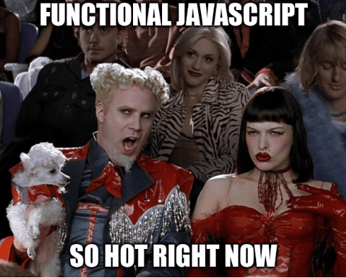

:slug: functional-fashion-in-javascript/
:date: 2018-08-08
:category: programming
:subtitle: Functional programming in JavaScript
:tags: application, functional, javascript, eslint
:image: cover.png
:alt: Cup with message in front of screen with code
:description: What are the new trends in the JavaScript world. First steps in functional JavaScript. Recommendations for the migration from any paradigm to functional. How to use eslint and its plugin for checking functional code. Functional JavaScript: fleeting fashion or imminent future?
:keywords: Functional paradigm, Object-oriented, Linter, Multiparadigm application, Eslint, Programming future.
:author: Oswaldo Parada
:writer: oparada
:name: Oswaldo José Parada Cuadros
:about1: Mechanical Engineer
:about2: Family, friends and little details. There is the answer.
:source: https://unsplash.com/photos/vc3iVL_znJ8

= Functional Fashion in JavaScript

It's funny how fashion works,
most people want to be fashionable
but just a bit understand where the fashion comes from.
Fashion pieces are not understood
but still people like to use them.

In technology same things happen, everyone wants to be fashionable.
There are 2 users of technology fashion: the final consumer,
who usually has little technical knowledge
and who doesn't care about the components of their product
as long as it's the 'latest in the market'.
Second one is behind creating the product,
a person with technical knowledge who incorporate
new technological trends in his products.

One of the latest fashion trends is functional JavaScript.
JavaScript is a very popular language
because of the ubiquity of web browsers.
If you have a modern browser
then you have a JavaScript console at your disposal.

== Divided opinions

.What people is talking about.

We already know that JavaScript is a famous language
and its functional version is a fashionable subject.
But it's a controversial issue,
which has well-defined extremes:
the reluctants and the totalitarians.
The first ones say that JavaScript is a language
that mandatorily needs the states to reach their full potential
in terms of web pages and applications.
Reluctants add that there are functions like +foreach+
that are necessary for an optimal code.
On the other side, totalitarians think in a functional world,
all JavaScript without a single trace of objects.
They're based on the fact that JavaScript is a multi-paradigm language
and therefore it's self-sufficient in a functional way.

== Our opinion

In +Fluid Attacks+ we believe that use of functional JavaScript
doesn't have to be white or black,
but a scale of grays that we can adapt to make it more light or dark.
JavaScript has its well-defined bases
and we cannot go completely against its nature,
many libraries have evolved over time to be more efficient.
Nor can we stay behind, so we must improve.
We cannot use a fully functional JavaScript
but we can code with a functional style.
This is why our way is to implement functional
approaches step by step.
There are issues that are difficult to implement
but this may be different in the future.
Let's change something here
and then change something there but
don't try to change everything in one shot
or less start from scratch.

== How to be fashionable?

To know what we must change to be functional,
it's enough to read what is functional programming
and what are its cornerstones (we recommend you to read
[button]#link:../why-we-go-functional/[Why we go functional?]#).
This paradigm is against classes
because this structures stimulate
the use of states and its mutations.
For example:

.[[cilinder-example]]Cilinder class example.
[source, javascript]
----
class cilinder {
  constructor(radius, height) {
    this.radius = radius;
    this.height = height;
  }
}
----

This is the common way to make a class,
it makes sense to do so if what you want is a replicable object.
Now we rewrite this code in a functional way.

.Cilinder class in a functional approach.
[source, javascript]
----
function cilinder(radius, height) {
  return {
    "radius": radius,
    "height": height
   };
}
----

As you can see, JavaScript classes
can be represented as functions.
If you think your classes are too large
to be represented as functions, then you should first
divide those classes into granular classes that do only one thing.

Another stone in the shoe when trying to migrate
from object-oriented to functional are the iterative cycles.
Let's look at the following code:

.Increment in list example.
[source, javascript]
----
const result = [];
const integers = [1, 2, 3];

for (let i = 0; i < elements.length; i++) {
  result.push(elements[i] + 1);
}
----

This code adds a one to all the elements of a list.
Let's represent this cycle in a functional way:

.Increment in list example, functional approach.
[source, javascript]
----
const result = [];
const integers = [1, 2, 3];
const result = elements.map(element => element + 1);
----

Code is not only more compact
but it's also easier to understand.
Like Python, JavaScript is multi-paradigm,
which means that there are a number of built-in functions
that allow your code to be functional
without the need to import any additional library.
Some of these functions are
link:https://developer.mozilla.org/en-US/docs/Web/JavaScript/Reference/Global_Objects/Array/map[+map+],
link:https://developer.mozilla.org/en-US/docs/Web/JavaScript/Reference/Global_Objects/Array/filter[+filter+]
and link:https://developer.mozilla.org/en-US/docs/Web/JavaScript/Reference/Global_Objects/Array/Reduce[+reduce+].

A final detail we want to show you,
a small introduction to high-order functions in JavaScript,
something very characteristic in the functional paradigm,
there are functions that can receive functions as a parameter
and can even return other functions.
I know, it's something difficult to understand the first time
but I'll explain it with an example.

.Multiply function is JavaScript.
[source, javascript]
----
var multiply = function(a, b) {
  return a * b;
};

multiply(2,3); // 6
----

The above is a classic function to multiply 2 integers.
Now let's express this in a high-order function.

.Multiplication in high-order function.
[source, javascript]
----
function multiplyByInteger(a) {
  return function(b) {
    a * b
  }
}

var multiplyByTwo = multiplyByInteger(2);
multiplyByTwo(3); // 6

----

As you can see our multiplyByInteger function returns another function.
The new function only requires an argument to perform multiplication,
this is known as +partial evaluation+.

With this article we don't expect you to become
an eminence in functional JavaScript,
but we want you to understand what everyone is talking about.
We'll try to convince you
to follow the recommendations we made in this article.

==  Poorly dressed guests

Keeping a functional mind while migrating
from any paradigm can be a bit difficult.
Old habits are hard to remove.
Our brain constantly invites us to safety,
to use something we already know and know it works.
When we think we have written functional code,
it may not be like that.
Even the code may look functional
but it really is a wolf in sheep's clothing,
its essence is still object-oriented.

== Fashion police

Thanks to the programming gods,
there are tools that allow us to check
if our code is really functional.
As the queen in this dance is JavaScript,
we'll introduce an extension to a well-known linter
of this language, which will allow us to enable rules
that ensure that we're programming in functional style.
We will use
link:https://github.com/jfmengels/eslint-plugin-fp[eslint-plugin-fp].

Assuming that you already have
link:https://eslint.org/docs/user-guide/getting-started[+eslint+],
we proceed to install the plugin:

.eslint-plugin-fp installation.
[source, bash]
----
npm install --save eslint-plugin-fp
----

Now we must enable the plugin
and add the rules we want to check, therefore,
we must modify the eslint configuration file
(usually a +JSON+ type file)
adding the new library to the plugin list
and the new rules to the list of rules.

.Part of the eslint configuration part.
[source, json]
----
"plugins": [
  "fp"
],
"rules": {
  "fp/no-arguments": "error",
  "fp/no-class": "error",
  "fp/no-delete": "error",
  "fp/no-events": "error",
  "fp/no-get-set": "error",
  "fp/no-let": "error",
  "fp/no-loops": "error",
  "fp/no-mutating-assign": "error",
  "fp/no-mutating-methods": "error",
  "fp/no-mutation": "error",
  "fp/no-nil": "error",
  "fp/no-proxy": "error",
  "fp/no-rest-parameters": "error",
  "fp/no-this": "error",
  "fp/no-throw": "error",
  "fp/no-unused-expression": "error",
  "fp/no-valueof-field": "error",
}
----

As you can see the rules are too many,
so I invite you to understand what each one is for link:https://github.com/jfmengels/eslint-plugin-fp#rules[here].
But as an appetizer we'll talk about some rules
and we'll set an example so you can see how this plugin works.

The no-class rule avoids the use of classes,
if you have been reading carefully,
you know why the classes shouldn't go in a functional approach
but if you are a clueless I remind you that
the classes are full of states.

Let's put the <<cilinder-example, cilinder class example>>
in a file called example.js
and use eslint with the _no-class rule_ to observe what happens.

.Linting example.js.
[source, bash]
----
$ eslint example.js

// OUTPUT

/example.js
  1:1  error  Unallowed use of `class`. Use functions instead  fp/no-class

✖ 1 problem (1 error, 0 warnings)
----

An error is displayed saying
which is the rule that is being violated,
in which line and in which file.
Remember that, it's best to run this linter
in your +CI+ to ensure that the code will not be deployed
to production without first passing all the tests.

== Conclusions

We remind you that if you already have a lot of code
written in JavaScript with some paradigm that is not functional
and you want to start migrating,
the best way to start
is by converting small fragments of code into functional ones.

Speculating about the future is very difficult,
in general the functional paradigm has taken
place in all programming languages ​​in recent years,
but some experts consider that everything is a fashion subject
and at some point, functional boom will end.
Nobody really knows what to say about this.
But in technology it's better to be fashionable
because we don't know at what time old
things will stop working, falling into oblivion.
JavaScript still has a lot to give,
there are already +JavaScript-based frameworks+ that are functional.

What a good time to be fashionable!
