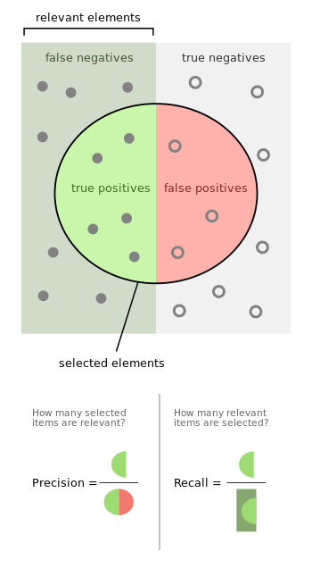
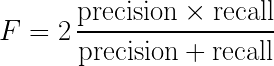
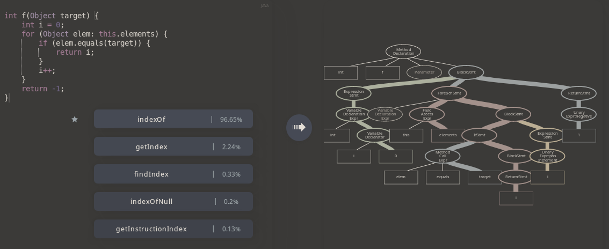

:slug: further-code2vec/
:date: 2020-01-24
:subtitle: Vector representations of code
:category: machine-learning
:tags: machine learning, security, code
:image: cover.png
:alt: Target and darts
:description: A tutorial on the usage of code2vec for the purposes of predicting method names, determining the accuracy of the model, and exporting the vector embeddings of the tokens and the method names, which is our main interest. This follows up on our earlier, more general article on code2vec.
:keywords: Machine learning, Neural Network, Encoding, Parsing, Classifier, Vulnerability
:author: Rafael Ballestas
:writer: raballestasr
:name: Rafael Ballestas
:about1: Mathematician
:about2: with an itch for CS
:source-highlighter: pygments
:source: https://unsplash.com/photos/FoiZoPtxSyA


= Further down code2vec

Let us continue with our series on representing
objects as vectors:
[inner]#link:../vector-language/[natural language]#,
[inner]#link:../embed-code-vector/[code]#,
let us take a deeper look at how `code2vec` works.
Even personality profiles
can be represented as vectors for data processing,
and this was done in 1934, by hand!.
So we certainly should be able to represent
pieces of code faithfully as vectors.
Let us see how that goes.

Recall from our last article on
[inner]#link:../embed-code-vector[code embeddings]#
that `code2vec` is,
like `word2vec` and _autoencoders_,
neural networks for an unrelated task
which produce miraculous vectors representations
of objects in their middle layers.
This is pretty much all the theory one needs to know
about this useful network as far as embedding is concerned.

In this article,
we would like to take `code2vec` for a spin
and produce some embeddings ourselves.
Luckily, the authors of `code2vec` have generously
given us their code and a tutorial on
how to use and test their model.
Sadly, however, this is geared towards their task
of predicting a function's name from its body,
so we must still figure out a way to adapt it to our needs.

They also give us a preprocessed `Java` dataset
of around 14 million examples,
already split into training, testing and validation subsets,
and pre-trained models both in ready for use
and trainable versions.
One can also choose to train a model from scratch.
Either way, after training (or skipping it),
what remains is to assess the accuracy of the model,
which one can do with a single command:

.Asessing `code2vec` performance
[source,bash]
----
$ python code2vec.py --load /path/to/model --test /path/to/data
----

Just this step, however,
takes quite some time on a regular machine.
Around 20 minutes on mine,
giving a precision of 66%, recall of 53%, and so
and an F score of 59%.
Not bad but far from ideal,
and this is consistent with the published results <<r1, [1]>>.

By the way, as this has not been said elsewhere in our
[inner]#link:../categories/machine-learning/[machine learning for security series]#,
let us take a break to clarify those terms above,
which all refer to the accuracy of any search,
and are just as applicable to vulnerability search in our context:

.Precision and recall via link:https://en.wikipedia.org/wiki/Precision_and_recall[Wikipedia]


Suppose the dots are files in a repository.
Some might actually contain vulnerabilities,
that is the left half of the rectangle,
labeled "relevant elements" above.

Ideally, a tool would detect them all, and nothing else.

Our vulnerability classifier, or maybe a human pentester, or any other tool,
tags as vulnerable those contained in the circle.
Some right (the true positives) and some wrong (the false positives).
The files containing vulnerabilities which weren't tagged,
labeled false negatives above,
we like to call them _escapes_,
those vulnerabilities which resist scrutiny.
These are actually more dangerous than the false positives,
since they are the ones that black hat hackers
might take advantage of in the wild.
But I digress.

The precision is thus the ratio of actual vulnerabilities
(true positives) found in the analysis
to all those which were tagged, i.e.,
what percentage you can believe from what I say.
The recall is how much of the reality is captured, that is,
out of all the existent vulnerabilites,
how many are picked up.
The F1 score aims to combine both the precision and the recall
and is defined as two times the ratio of their product to their sum

.F Score


But enough of information retrieval technicalities.
Back to `code2vec`.
We can run the model to get predictions.
We say:

[source,bash]
----
$ python code2vec.py --load /path/to/model --predict
----

Notice that even loading the model also takes a short while,
but when ready, each prediction is really fast.
Next, write a function body in the file `Input.java`, such as:

.`Input.java`
[source,java]
----
int f(Object target) {
  int i = 0;
  for (Object elem: this.elements) {
    if (elem.equals(target)) {
      return i;
    }
    i``;
  }
  return -1;
}
----

which clearly traverses an iterable object (v.g., a list)
trying to find the given target, and
returning its position within the object.

After updating the `Input.java` file,
we get the possible function names as predicted by `code2vec`,
each with their confidence:

[source,bash]
----
Modify the file: "Input.java" and press any key when ready, or "q" / "quit" / "exit" to exit

Original name:  f
    (0.939002) predicted: ['index', 'of']
    (0.030483) predicted: ['get', 'index']
    (0.009410) predicted: ['get', 'child', 'index']
    (0.005901) predicted: ['find', 'item']
    (0.003169) predicted: ['get', 'tab', 'index']
    (0.002887) predicted: ['get', 'row', 'index']
    (0.002884) predicted: ['get', 'instruction', 'index']
    (0.002445) predicted: ['find', 'index', 'of']
    (0.002067) predicted: ['get', 'component', 'index']
    (0.001753) predicted: ['get', 'element', 'position']
----

All of those names make sense to me!
`indexOf` and variations, or even
`getElementPosition` would be good names
for this particular function.
Remember that this reflects on the training data,
so if `indexOf` has the highest probability in the list,
it must be because the model "remembers"
a method with similar tokens whose name was `indexOf`.

However, it is much nicer
to take a look at the
link:https://code2vec.org/[demo] they provide online,
which has some built-in examples,
including the one above.
For each of those, the `AST` and the predictions are shown:

.Online code2vec demo


However this is not what we're after,
but rather the vector embeddings.
One can export both the token embeddings,
i.e. the features,
and the method name vectors,
i.e. the labels,
like this:

[source,bash]
----
$ python3 code2vec.py --load /path/to/model --save_w2v tokens.txt
----

These are saved in `word2vec` format,
which is quite simple:

[source,bash]
----
$ head -2 token_vecs.txt
1294891 128
performrename 0.13724399 0.11635801 0.6363327 0.17189577 -0.4018513 ...
----

Here we see that the vocabulary size, i.e.
the number of different tokens found was in the order of 1.3 million,
and the tokens were embedded into vectors of length 128,
which of course we snipped above.
There we show only the first 5 entries in the vector
for the token `performrename`.
The size of these exported files is quite large,
around 2 `GiB` each.

As it is at the moment,
`code2vec` officially supports only `Java` and `C#`.
There are third-party extractors for `Python`, `C`, `C``` and `TypeScript`, too.
That would easily comprise 90% of all of our clients' repositories.

In upcoming articles we will review `code2seq`,
a new generation of `code2vec`
which uses long short term memory (`LSTM`).
Essentially from the user's perspective,
`code2seq` should be able to predict a target sequence
instead of a single label at a time,
which might be useful for our purposes.

== References

. [[r1]] U. Alon, M. Zilberstein, O. Levy, and E. Yahav.
link:https://urialon.cswp.cs.technion.ac.il/wp-content/uploads/sites/83/2018/12/code2vec-popl19.pdf[code2vec: Learning Distributed Representations of Code]
Proc. ACM Program. Lang., Vol. 3, No. POPL, Article 40. January 2019.

. [[r2]] L. Thurstone (1934).
link:https://psychclassics.yorku.ca/Thurstone/[The vectors of mind]. _Psychological Review_ 41 (1):1-32.
