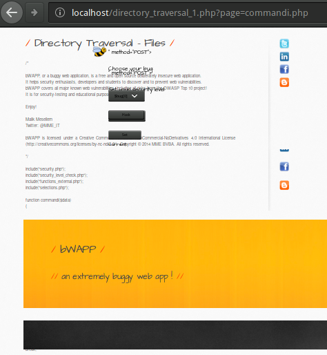

:slug: gherkin-steroids/
:date: 2018-03-13
:subtitle: How to document detailed attack vectors
:category: documentation
:tags: documentation, vector, software
:image: cover.png
:alt: Cucumber lot
:description: How to use Gherkin to document attack vectors in vulnerable applications using more advanced keywords from the Gherkin syntax. We propose a template to be used in the static and dynamic detection and exploitation of vulnerable applications. Follow-up to a previous entry with Gherkin basics.
:keywords: Gherkin, Attack vector, Documentation, Report, Vulnerability, Inclusion.
:author: Rafael Ballestas
:writer: raballestasr
:name: Rafael Ballestas
:about1: Mathematician
:about2: with an itch for CS
:source-highlighter: pygments
:source: https://unsplash.com/photos/Ky6x9T8j128

= Gherkin on steroids

In the field of information security,
'finding all vulnerabilities'
is as important as
'reporting them as soon as possible'.
For that, we need an effective means to communicate with all stakeholders.
We have proposed [inner]#link:../app-pickle/[before]# using `Gherkin`.
In that entry, we showed how to use `Gherkin`'s syntax
in order to document attack vectors,
i.e. how to find and exploit vulnerabilities in an app.
We also showed the basics of the language,
so if you haven't done so already,
we recommend you to take a look a it.

== More keywords

Sometimes you need to specify a larger piece of text
than fits in a
link:https://en.wikipedia.org/wiki/Characters_per_line#In_programming[decent-length line.]
For that, `Gherkin`, has `docstrings` (`"""`):

.Specifying long input
[source,gherkin]
----
When I inject the following SQL query in the input field:
  """
  INSERT INTO mysql.user (user, host, password)
         VALUES ('name', 'localhost', PASSWORD('pass123'))
  """
Then I have granted myself access to the database
----

You may write anything between the `docstrings`,
but they must be in their own lines and
the indentation is relative to them.
They are particularly useful for citing code,
output from `CLI` programs and
unstructured plain text.

For 'structured' plain text,
`Gherkin` has the
`Data Table` syntax element,
(don't confuse with tables from Scenario Outlines):

.Tabular data with tables
[source,gherkin]
----
Given the database is populated with the species:
| Common Name    | Genus         | Species  | Family         |
| Lion           | Panthera      | Leo      | Felidae        |
| GNU            | Connochaetes  | Gnou     | Bovidae        |
| Gentoo Penguin | Pygoscelis    | Papua    | Spheniscidae   |
| Burr gherkin   | Cucumis       | Anguria  | Cucurbitaceae  |
----

You don't have to align the pipes (`|`) as above,
but it makes your `.feature` file look nicer.
`Gherkin` doesn't care about that,
only that the number of columns match.

Speaking of Scenario Outlines,
as seen in our previous entry,
these are very useful to specify many
cause-effect relations:

//.Scenario Outlines
[source,gherkin]
----
When I do <action>
Then I get a <result>

Examples:
  |    <action>     |      <result>      |
  | Drink coffee    | Be more alert      |
  | Take a cab      | Get there faster   |
  | Open the window | Ventilate the room |
----

== Detailed attack vectors

Let us put these to practice
by documenting a vulnerability in detail
from our good old friend
link:http://itsecgames.blogspot.com.co/[bWAPP],
which simply gives us a cryptic message:

.A mysterious message

No matter how dumb it might seem,
this is the first thing we need to document:
how the page, app or whatever we're testing
works at the moment we tested it.
We might use a separate "Normal use case" scenario
as we did before.

=== Background

Or we can just plug that behavior right into the `Background`.
This must also include, in detail,
everything needed to run the app.
Our target `bWAPP` is a `PHP` web server;
Maybe you're running it inside a
link:http://itsecgames.blogspot.com.co/2013/07/bee-box-hack-and-deface-bwapp.html[`bee-box`]
virtual machine?
Or did you set up the
link:https://en.wikipedia.org/wiki/LAMP_%28software_bundle%29[`LAMP`]
server yourself?
On what operating system?
All of this must be in the background,
in order to allow reproducibility.

I, for one, am running `bWAPP` inside a
link:https://www.docker.com/[`Docker`]
container made by
link:https://hub.docker.com/r/raesene/bwapp/[`raesene`],
so let there be a record of that in our attack feature:

[source,gherkin]
----
  Background:
    Given I am running Manjaro GNU/Linux kernel 4.9.86
    And I am running bWAPP 2.2 in Docker container raesene/bwapp:
    """
    ubuntu 14.04 LTS, kernel=host(4.9), MySQL 5.5, Apache 2.4.7, PHP 5.5
    """
    Given a PHP site showing a message:
    """
    URL: bwapp/directory_traversal1.php?page=message.txt
    Message: Try to climb higher Spidy...
    Evidence: default-file.png
    """
----

All programs and versions
are explicitly listed,
plus the `URL` and field where the vulnerability was found.
Note how we can refere to external evidence files, too.

=== Dynamic detection and exploitation

Now, the cryptic message in the page
might be trying to tell us something.
Where can we climb?
As it turns out, anywhere.
The next hint is in the `URL`.
The page takes a `GET` parameter
`page=message.txt`.
So the file `message.txt` is a simple text file
that contains the words above,
and what the page does is display it.
What if we change it to another text file?
Let's try `/commandi.php`.

.Abusing the website

Notice two things here:
first, the `PHP` code and text commentaries are shown.
Hence we could theoretically access the `PHP` source of
any page in this server.
Second, the `HTML` part is actually rendered in the browser,
which could lead to a
[inner]#link:../xss-protection/[`XSS`]#
or
link:https://www.owasp.org/index.php/Cross-Site_Request_Forgery_(CSRF)[`CSRF`]
attack.

But wait.
The server is not just ``floating'' in space:
it lives inside a `GNU/Linux` machine.
And 'everything' in such an `OS` is a file,
many of which are plain-text files.
One of them is of particular importance:
link:https://www.cyberciti.biz/faq/understanding-etcpasswd-file-format/[`/etc/passwd`],
which stores information about users.
Let us try to display it in this page,
setting `page=/etc/passwd`:

.Listing users in the `bWAPP` servers

We can document that using `Gherkin` data tables,
in a scenario of its own,
due to the importance of the finding:

.Documenting a particular exploitation
[source,gherkin]
----
  Scenario: Users record extraction
    When I change the page=message.txt parameter to page=/etc/passwd
    Then we retrieve the following user records:

    # Records extracted
    | username | pw? | UID | GID | info | home | shell |
    | root     | x | 0 | 0 | root | /root | /bin/bash |
    | daemon   | x | 1 | 1 | daemon | /usr/sbin | /usr/sbin/nologin |
    | bin      | x | 2 | 2 | bin | /bin | /usr/sbin/nologin |
    | sys      | x | 3 | 3 | sys | /dev | /usr/sbin/nologin |
    | sync     | x | 4 | 65534 | sync | /bin | /bin/sync |
    | games    | x | 5 | 60 | games | /usr/games | /usr/sbin/nologin |
    | man      | x | 6 | 12 | man | /var/cache/man | /usr/sbin/nologin |
    | lp       | x | 7 | 7 | lp | /var/spool/lpd | /usr/sbin/nologin |
    | mail     | x | 8 | 8 | mail | /var/mail | /usr/sbin/nologin |
    | news     | x | 9 | 9 | news | /var/spool/news | /usr/sbin/nologin |
    | uucp     | x | 10 | 10 | uucp | /var/spool/uucp | /usr/sbin/nologin |
    | proxy    | x | 13 | 13 | proxy | /bin | /usr/sbin/nologin |
    | www-data | x | 33 | 33 | www-data | /var/www | /usr/sbin/nologin |
    | backup   | x | 34 | 34 | backup | /var/backups | /usr/sbin/nologin |
    | list     | x | 38 | 38 | Mailing List Manager | /var/list | /usr/sbin/nologin |
    | irc      | x | 39 | 39 | ircd | /var/run/ircd | /usr/sbin/nologin |
    | gnats    | x | 41 | 41 | Gnats Bug-Reporting System (admin) | /var/lib/gnats | /usr/sbin/nologin |
----

Now we know how many users there are on the server,
and which of them have passwords set.
Those are stored in
link:https://www.cyberciti.biz/faq/understanding-etcshadow-file/[`/etc/shadow`]
in the form of hashes,
which can be
[inner]#link:../storing-password-safely/[cracked if the passwords are weak]#.
However, the `shadow` file,
unlike the `passwd` file,
is protected:

.A failure

'Drat!' Well, we'll find a way around it,
sooner or later.
Now that we got the hang of it
we can try other files.
Since we always do the same:
change `page=message.txt` to `page=desired-file.txt`
we can use a Scenario Outline for that,
using one column for what we give as input,
and the other for the result:

.Documenting many cases in one Outline
[source,gherkin]
----
  Scenario Outline: Dynamic detection and exploitation
    Given the message and the page=message.txt GET parameter in the URL
    When I change the GET parameter page=message.txt to another page=<path>
    Then I see the file <printed> in the page, if it is a text file:

    Examples:
      |        <path>        |             <printed>             | <evidence>    |
      | /etc/passwd      | User accounts info          | passwd.png    |
      | /etc/group       | User groups info                |               |
      | /etc/shadow      | Couldn't open       | protected.png |
      | /etc/hosts       | Hosts file        |     |
      | commandi.php         | PHP source code and rendered HTML | source.png  |
      | passwords/heroes.xml | Heroes' passwords and secrets     |     |
      | admin/settings.php   | No output, but file exists        |     |
----

It is only natural to make several tries,
some of which fail, some of which succeed.
All of them should be reported
in the most scientific spirit.

=== Static detection and possible fixes

Let us see why `passwd` could be read
and `shadow` couldn't.
From 'inside' the server let us say

----
$ ls -l /etc/{passwd,shadow}
-rw-r--r-- 1 root root   1012 Feb 15  2016 /etc/passwd
-rw-r----- 1 root shadow  559 Feb 15  2016 /etc/shadow
----

Notice that `passwd` has three `r`'s:
one for the owner (the user `root`),
one for the the owner's group (again, just `root`)
and the final one is for everyone else.
However `shadow` doesn't have that last `r`,
so it can only be read by `root`.

While we're at static detection of problems,
let us see what is wrong with that page
so we can try to fix it.
The source code for the page
simply takes the `GET` parameter `page`,
and displays it.

.Adapted from bWAPP code. Some lines and brackets omitted for clarity.
[source,php]
----
$file = $_GET["page"];
show_file($file);
function show_file($file)
   if(is_file($file))
     $fp = fopen($file, "r") or die("Couldn't open $file.");
     while(!feof($fp))
       $line = fgets($fp,1024);
       echo($line);
       echo " ";
----

We can include this exact snippet,
numbers and all, between `docstrings`,
while discussing code exploration in our feature file.

Now the main problem with this is
that we can pass, as seen before,
any file as a `GET` parameter
and it will be shown, i.e.,
that input should have been validated and cleaned before `show_file`.

To fix that, a good first step would be to clean
strings like `..`, `./` and `../`,
which is what you would generally use to
``climb higher Spidy'':

[source,php]
----
if(strpos($data, "../") !== false || strpos($data, "..\\") !== false ||
   strpos($data, "/..") !== false || strpos($data, "\..") !== false ||
   strpos($data, ".") !== false)
        $directory_traversal_error = "Directory Traversal detected!";
----

This would block attackers who do not know
the file system hierarchy in the server,
but still allows us to give absolute paths
as the parameter.
An even better defense would be that
the user should not be allowed to display files
outside the current folder:

[source,php]
----
// Gives the current directory path
$real_base_path = realpath("");
// Gives the absolute path equal to user input
$real_user_path = realpath($user_path);
if(strpos($real_user_path, $real_base_path) === false)
  $directory_traversal_error = ""Directory Traversal detected!";
----

But this still allows us to display the
file with the heroes' passwords.
In fact, it would be better just not to
allow users to display files at their will.

=== More details

So far, we've documented in `Gherkin`:

. the background where we're running the vulnerable app,
. the dynamic detection and exploitation phase,
with several examples and evidences,
. the important records we were able to extract from the app,
. the static detection part, with specific bad code snippets,
issues and suggestions.

To finish a proper `.feature` file,
we're missing, well, the feature itself,
which is the vulnerability, or rather,
the finding and exploitation thereof.

Remember that we can document features and scenarios using 'descriptions'.
After the keywords `Feature`, `Scenario`, `Scenario Outline` or `Example`
we can write anything we like,
as long as no line starts with a keyword
(including comments - you can't mix descriptions with comments,
I learned that the hard way).

It is usual to describe features with the format
+As <type of user>
I want to <do something>
In order to <get some result>+.
We can take advantage of such a structure to
document the 'Scenario' and 'Actor' of the vulnerability,
the 'Threat' and what records can be 'compromised'.
We can also use that space to document anything else
we consider to be globally important:

[source,gherkin]
----
Feature: Vulnerability FIN.S.0075 Local file inclusion
  From the bWAPP application
  From the A7 - Missing functional level access controls category
  In URL bwapp/directory_traversal_1.php
  As any user from Internet with access to bWAPP
  I want to be able to see local files I'm not supposed to
  In order to gain access to system objects with sensitive content
  Due to missing functional level access controls
  Recommendation: restrict access to sensitive files (REQ.0176)
----

For anything else, use comments.
I will include details such as
the vulnerability code,
link:https://cwe.mitre.org/[`CWE`],
link:https://nvd.nist.gov/[`CVE`]
if present,
computed metrics such as
link:https://nvd.nist.gov/vuln-metrics/cvss[`CVSS`]
scores, etc
in comments (`#`) at the beggining of the file.
See the <<apx-feature,full feature>> below.

''''

And that is how we propose
using this language
to document attacks.
You may ask: why `Gherkin`
and not just plain text?
Because it is
link:https://en.wikipedia.org/wiki/Line-oriented_programming_language[line-oriented]
and has a light structure,
we can define a template like the one discussed here,
and we can enforce following of the format
using the readily available
link:https://github.com/cucumber/cucumber/tree/master/gherkin[parsers],
link:https://github.com/vsiakka/gherkin-lint[linters]
and
link:https://github.com/cucumber/cucumber/[compilers]
for the language.
We still need to work further
on the template definition,
so stay tuned.

[[apx-feature]]
== Appendix: full feature

[source,gherkin]
----
include::local-file-inclusion.feature[]
----
