:slug: git-steroids/
:date: 2019-03-04
:subtitle: From messy logs to Data Analytics
:category: documentation
:tags: git, software, documentation, standard, engineering, business, linters
:image: cover.png
:alt: Computer with do what is great sign.
:description: Learn why it is important and how to define a Git commit message syntax and use real-time commit message linters to improve your Git history, reduce documentation and set the foundations to implement Data Analytics processes in your Git repositories.
:keywords: Git, Standardization, Commitlint, Data Analytics, Efective Logging, Documentation
:author: Daniel Salazar
:writer: dsalazaratfluid
:name: Daniel Salazar
:about1: Software Engineer
:about2: “An intellectual says a simple thing in a hard way. An artist says a hard thing in a simple way.” Charles Bukowski
:source: https://unsplash.com/photos/5Xwaj9gaR0g

= Git on steroids

There is a universal law
that anyone in the tech world should know:
If you ask a programmer to do something,
he/she will do it their way.

Even though creativity, abstract thinking,
and putting your signature in your source code
is a link:https://venturebeat.com/2013/10/19/841449/[fundamental]
part of programming,
sometimes it also becomes a barrier
when it comes to maintainability,
readability and usability
due to lack of code standardization.

Many efforts to help programmers to
implement best practices in their code have been made,
being Python's link:https://www.python.org/dev/peps/pep-0008/#introduction[PEP 8]
and Ruby's link:https://github.com/github/rubocop-github/blob/master/STYLEGUIDE.md[Rubocop Style Guide]
some of the most popular examples.
link:https://develoger.com/linting-is-parenting-878b2470836a[Linting tools]
are also of the essence for this task,
as they provide a dynamic way for programmers
to check if their code is
following all the established conventions.

So far, it seems like the standardization problems can be easily solved
and never again a bunch of crazy programmers
will make a mess out of something.

.It's all good

But wait a minute... Is there any other activity
involving a creative process
that programmers frequently do?
Oh yes, we have link:https://git-scm.com/[Git] commit messages.

== Most Git repositories have messy logs

Thanks to the [inner]#link:../../services/continuous-hacking/[+Continuous Hacking+]#
service we offer at +Fluid Attacks+,
we get to see +Git+ repositories
from different organizations in several countries.
A vast majority of these repositories have messy logs.

Such problem can be easily explained:
Teams do not stick to a specific standard
when it comes to commit messages
and general +Git+ logging.
Programmers just fill out their commit messages
the way they personally think it is best.

You may say:
____
Ok, logs may be a little messy,
but should I really care that much about them?
____

The short answer is: Yes, you definitely should.

For the long answer,
I am first going to number
the cons of having
messy +Git+ logs.

=== Cons

. *Logs fail to accomplish their purpose:*
+
Usually, due to vague or incomplete commit messages,
a commit message log can only be understood
by the one who wrote it (just like it happens with source code),
thus making the log useless.

. *Reverting becomes a headache:*
+
If there is not a clear history of your repo,
reverting to a previous version given the need
will always be painful, as you will have
to decipher such history in order to know
to what point you want to go back.

. *Knowing who did what becomes harder:*
+
Good commit messages express,
from a high level perspective, what changes were made.
Not-so-good commit messages usually have two or three words
and do not actually tell the reader what was changed,
forcing him/her to look at the source code.

Lastly, let me bring it down to a specific example
of how a +Git+ repository history looks
when programmers do whatever they want:

.Bad Git Log
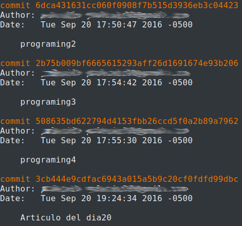

Notice how these commit messages
do not communicate anything regarding
the changes that were made,
they're basically trash logs.

=== Pros

Other than solving all the cons mentioned above,
there are two extra pros:

. *Data Analytics for the repo becomes possible:*
+
When you have one hundred developers
working simultaneously on a repository,
you definitely want to know things like:
+
  * What percentage of time do they spend fixing bugs?
  * What percentage of the programmers focus on creating new features?
  * What are the main causes of reverts in the repo?
+
And an endless number of questions
whose answers might be incredibly useful
for both business insights
and development performance/quality
improving within the company.
By having a defined commit message syntax,
such answers can be found by using link:https://www.techopedia.com/definition/26418/data-analytics[Data Analytics]
techniques

. *Logs (partially) become your documentation:*
+
By standardizing commit messages,
you will no longer have to create huge documentation manuals
explaining all the details of how a product internally works.
Each file within the repo will have its related history
with detailed information
about how it currently works and worked in the past.
Some documentation will probably still be needed
(user documentation, for example),
but we have witnessed how the amount of documentation required dramatically
diminishes thanks to good logs.

After setting a standard syntax for commit messages,
your repo history will start to look like this:

.Good Git Log
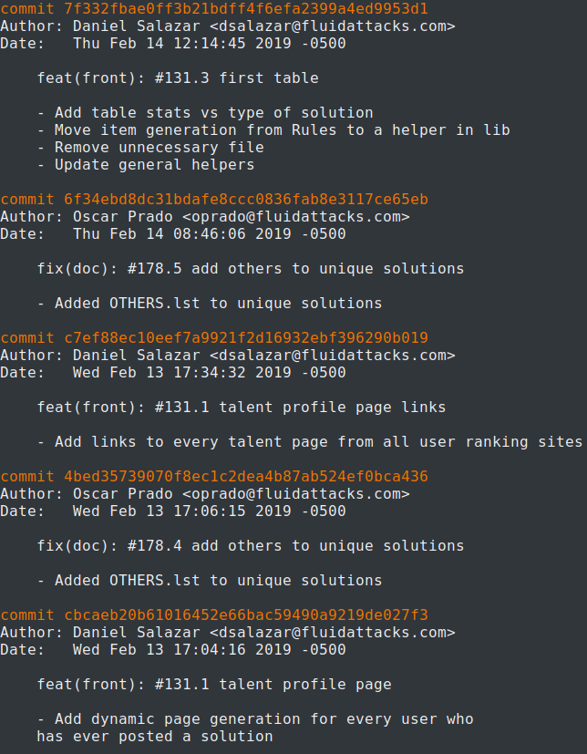

I want you to notice the three most important details to begin with:

. Titles include keywords like +feat+, +front+, +fix+, +doc+...
These tags will be essential for the Data Analytics efforts,
as they will allow [inner]#link:../crash-course-machine-learning/[algorithms]#
to know what the purpose of the commit was.
. Body section is usually itemized, with every item describing
relevant changes made in the commit.
. An issue (#N.N) is always referenced
with the purpose of
understanding what the programmer was
trying to do with the commit.
This is useful for version control services
with issue trackers like link:https://gitlab.com/[Gitlab],
link:https://github.com/[Github], etc.

== Implementing a commit message Syntax

If by this point you are convinced
about the importance of having a standard commit message syntax,
and are interested in implementing it,
make sure to keep reading,
as I will show the syntax we use,
the tools that support it,
and the benefits we get from it.

In +Fluid Attacks+ we use the link:https://docs.google.com/document/d/1QrDFcIiPjSLDn3EL15IJygNPiHORgU1_OOAqWjiDU5Y/edit[Angular JS Commit Message Conventions]
syntax with a few modifications
inspired by our specific needs.

=== Syntax

The syntax is as follows:
----
[type]([scope]): #[issue-number]{.issue-part} [title] // This is the commit title
               // This blank line separates the commit title from the commit body
[body]         // This is the commit body. It CAN have multiple lines
----
Where:

* *[variable]* are *required* variables
that must be replaced in a final commit message
(**[]** symbols must be removed).
* *\{variable\}* are *optional* variables
that must be replaced or removed
in a final commit message (**{}** symbols must be removed).
* *// Comment* are comments that must be removed in a final commit message.

In the following sections I will explain
in detail what this syntax can help us achieve.

=== Types

Types offer a high level perspective of the commit purpose.
They are explicitly defined in a closed list
that covers most (if not all) possible scenarios.

In the syntax, the *[type]* variable has to be one of the following:
----
rever  // Revert to a previous commit in history
feat   // New feature
perf   // Improves performance
fix    // Bug fix
refac  // Neither fixes a bug or adds a feature
test   // Adding missing tests or correcting existing tests
style  // Do not affect the meaning of the code (formatting, etc)
----

Notice how types are short words
that can be easily read by anyone,
but also represent keywords
that can be processed by a machine.

=== Scopes

Scopes provide specific detail
about what part of the repository/system
was modified in the commit.
Just like types,
they are explicitly defined in a closed list.

In the syntax, the *[scope]* variable has to be one of the following:
----
front  // Front-End change
back   // Back-End change
infra  // Infrastructure change
conf   // Configuration files change
build  // Build system, CI, compilers, etc (scons, webpack...)
job    // asynchronous or schedule tasks (backups, maintenance...)
cross  // Mix of two or more scopes
doc    // Documentation only changes
----

Notice how scopes, just like types,
are also human-readable and machine-readable.

=== Other important rules

Articles like link:https://chris.beams.io/posts/git-commit/[this one]
and learning on the fly helped us to define other rules
for improving general commit message quality:

. A *Commit title* must exist.

. A *Commit title* must *not* contain
the '*:*' character aside from the one specified in the syntax.

. A *Commit title* must have 50 characters or less.

. A *Commit title* must be lower case.

. A *Commit title* must not finish with a dot '*.*'.

. A *Commit title* must reference an issue.

. A *Commit title* must be meaningful.
Avoid using things like ``feat(build): #5.1 feature``.

. A *blank line* between commit title and commit body must exist.

. A *commit body* must exist.

. Lines in *commit body* must be 72 characters or less.

. Try to itemize your *commit body*.

. Do *not* use the word '*part*' for splitting commits for a single issue.
Use *#[issue-number]{.issue-part}* instead as specified in the syntax.

=== Explaining combinations

Below is a table explaining
all the possible combinations
between types and scopes
for a commit message
(Types are columns, scopes are rows):

[options="header", cols="^s,7*^"]
|===

|
| rever
| feat
| perf
| fix
| refac
| test
| style

| front
| Revert front-end to a previous version
| Add new feature to front-end
| Improve perf in front-end
| Fix something in front-end
| Change something in front-end
| Add tests for front-end
| Change front-end code style

| back
| Revert back-end to a previous version
| Add new feature to back-end
| Improve perf in back-end
| Fix something in back-end
| Change something in back-end
| Add tests for back-end
| Change back-end code style

| infra
| Revert infra to a previous version
| Add new feature to infra
| Improve perf in infra
| Fix something in infra
| Change something in infra
| Add tests for infra
| Change infra code style

| conf
| Revert config files to a previous version
| Add new feature to config files
| NA
| Fix something in config files
| Change something in config files
| NA
| Change config files code style

| build
| Revert building tools to a previous version
| Add new feature to building tools or add a new building tool
| Improve building perf
| Fix something in building tools
| Change something in building tools
| Add tests for building tools
| Change building tools code style

| job
| Revert jobs to a previous version
| Add new feature to jobs or add a new job
| Improve jobs perf
| Fix something in jobs
| Change something in jobs
| Add tests for jobs
| Change jobs code style

| cross
| Revert several scopes to a previous version
| Add new feature for several scopes
| Improve perf in several system parts
| Fix something in several system parts
| Change something in several system parts
| Add tests for several system parts
| Change code style in several system parts

| doc
| Revert doc to a previous version
| Add new doc
| NA
| Fix something in doc
| Change something in doc
| NA
| Change doc style
|===

Where:

* +perf+ is performance.
* +infra+ is infrastructure.
* +config+ is configuration.
* +doc+ is documentation.
* +NA+ is not applicable.

=== Differences with pure AngularJS syntax

In this section I will talk about the changes we
made to the original +AngularJS+ syntax and the reasons
behind them.

==== Types

. Instead of creating a particular syntax
only for reverts as specified in the link:https://docs.google.com/document/d/1QrDFcIiPjSLDn3EL15IJygNPiHORgU1_OOAqWjiDU5Y/edit#heading=h.fpepsvr2gqby[AngularJS' document],
for the sake of simplicity, we decided to make a *rever* type
that follows the same syntax as everything else.
. The *docs* type was renamed to *doc*
and turned into a scope.
The reason of such change
was to make *doc* commits more informative
by allowing programmers to specify
the purpose of the documentation change. For example:
+
   * *feat(doc):* documenting new feature.
   * *fix(doc):* fixing documentation.
   * *style(doc):* changing its style.
+
. We added a *perf* type for performance changes
with the purpose of identifying what commits have
a performance improvement as main objective
and reducing the number of commits that would
fall under the *refac* type.
. *chore* type was removed as any maintenance commit can
be translated to a *perf*/*refac*/*fix* commit.
. In order to have shorter commit titles,
we shortened types like *docs* to *doc*, *revert* to *rever*,
*refactor* to *refac*.

==== Scopes

When it comes to scopes,
the difference consists in us having a closed list of keywords
while +AngularJS+ allowing programmers
to specify any scope they want.

According to the +AngularJS+ document,
“Scope can be anything specifying place of the commit change.
For example +$location+, +$browser+, +$compile+, +$rootScope+,
+ngHref+, +ngClick+, +ngView+, etc...”.

We, on the other hand, consider that this information
should go in the commit *[title]*.

By moving the “place of the commit change” to the *[title]*,
we get to define some generic scopes that
allow us to make commit messages more informative.

Scopes like *front*, *back*, *build*, etc,
although not as precise as *ngClick*,
are machine-readable and still provide
information about where the change was made.
This, combined with allowing the programmer to
be more specific in the *[title]*,
is why we decided to create a closed list
for scopes.

==== Other differences

The last big difference between the +AngularJS+ syntax and ours
is the *#[issue-number]{.issue-part}* part,
whose purpose is to force commits to always reference an issue
in order to be able to track what motivated such commit.

Other minor differences,
like making a maximum of 50 characters for the commit title mandatory,
are either based on personal opinions
of what we think makes a commit message look better,
or preferring rules taken from other places over the +AngularJS+ ones.

== Make syntax usage a reality

You may be thinking:

____
Ok, we just defined a huge commit message syntax with a ton of rules.
But, how are we actually going to make
programmers follow it in a pragmatic way?
____

Enter the savior: link:https://conventional-changelog.github.io/commitlint/#/[Commitlint].

+Commitlint+ is an incredible tool
that can check all the syntax we just defined.
Not only it runs all the checks instantly,
but it works as a
link:https://git-scm.com/book/uz/v2/Customizing-Git-Git-Hooks[Git hook],
which means that it runs all the checks
right after a programmer runs a *git commit* command
on his/her local machine.
It is even capable of *failing* the commit attempt
if the commit message the programmer just provided
happens to be non-syntax-compliant.

=== Proof of concept

We won't be setting up +Commitlint+ for this specific syntax
as it would make the article too technical.
Nevertheless, I will show you how it currently works
in one of our repos:

==== Bad commit message

.Failed commit
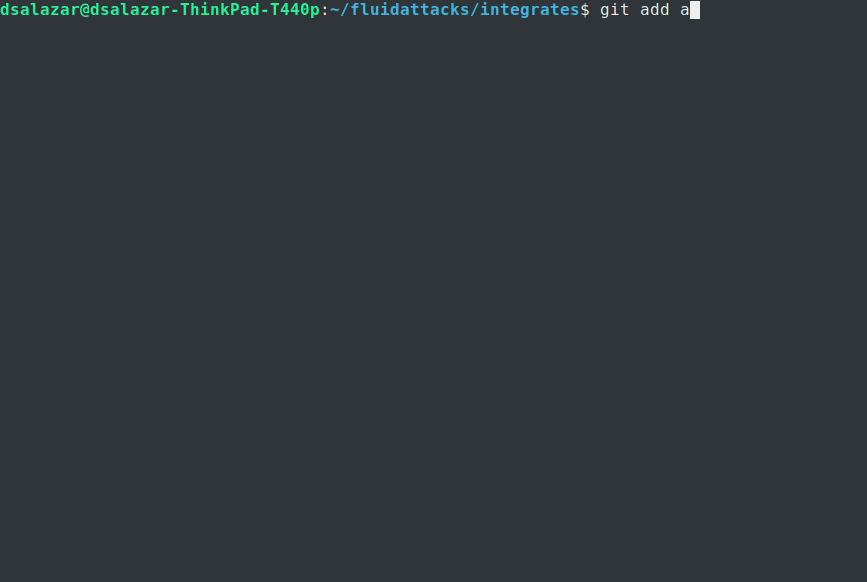

The commit we entered was:

.Bad Commit message
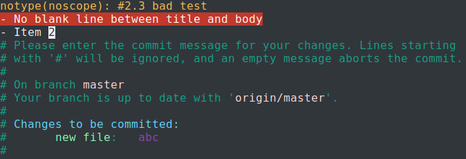

The +Commitlint+ output was:

.Failed Commitlint output
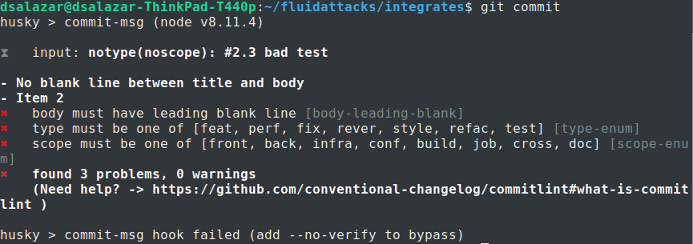

Notice how +Commitlint+ dynamically tells the programmer
what specific rules
his/her commit message is not following,
making the fix process a lot easier.
The commit attempt was also stopped by +Commitlint+,
as it doesn't allow commits to pass unless
their message is syntax compliant.

==== Good commit message

.Passed commit
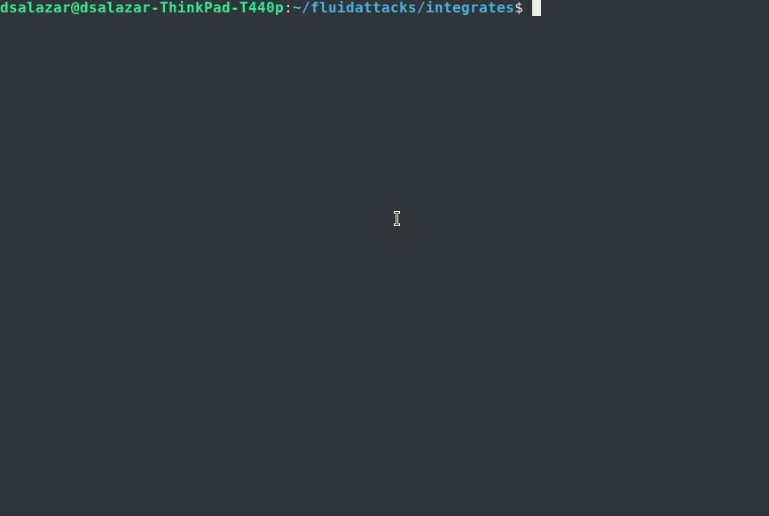

The commit we entered was:

.Good Commit message
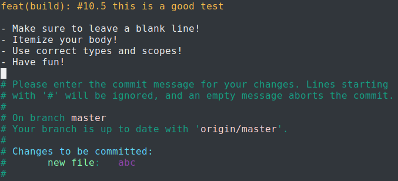

The +Commitlint+ output was:

.Passed Commitlint output
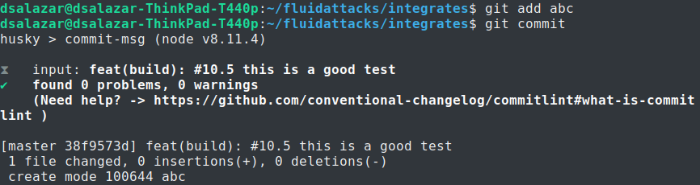

Notice how +Commitlint+ tells the programmer
that all checks passed
and proceeds to accept the commit.

== A little bit of Data Analytics

Now that we have defined a commit message syntax,
I would like to show you
a few very simple link:https://chartio.com/[+Chartio+] charts
we are now able to generate
from our link:https://gitlab.com/fluidattacks/integrates[Integrates] repository:

=== Pie chart of monthly commit types for February, 2019

.Monthly commit types for February, 2019
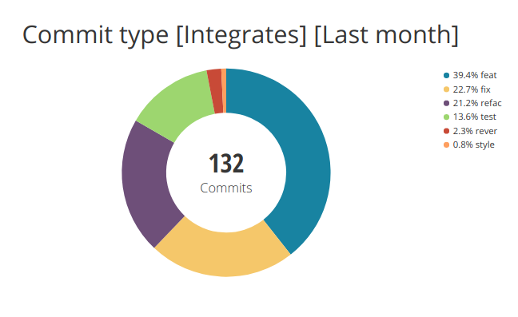

This chart allows us to know
the percentage of commits
for every type in a month.

One possible interpretation can be:

During February, 2019,
out of 132 commits, 39.4% of them (52)
had developing a new feature as their purpose.

=== Pie chart of monthly commit scopes for February, 2019

.Monthly commit scopes
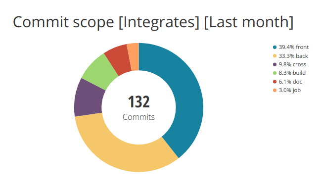

This chart allows us to know
the percentage of commits
for every scope in a month.

One possible interpretation can be:

During February, 2019,
out of 132 commits, 33.3% of them (44)
were focused on the back-end of the site.

=== Heatmap chart of monthly commit types vs scopes for February, 2019

.Monthly commit heatmap
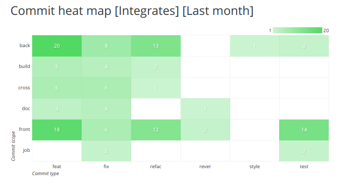

This chart allows us to know:

* What type/scope combinations were mostly used.
* What type/scope combinations were never used.
* In general, we can get insights about
what programmers did and where they did it.

One possible interpretation can be:

During February, 2019,
out of 132 commits, 20 of them were feat(back),
leading us to think that programmers
spent a considerable amount of their time
programming new functionalities
in the back-end of the site.

=== It does not end here

Now that we have a commit message syntax
and our +Git+ logs are growing everyday,
it is up to us to think what we want to do
with the normalized data we're getting.

Many different charts and analysis can be done,
it is just a matter of asking ourselves:

. What do we want to know?
. Can we know it with the data we currently have?

if so, lets make it happen!

== Conclusion

In this article we've covered
from the importance of +Git+ logs
to what benefits we can obtain
by standardizing our commit message syntax
and implementing tools for checks like +Commitlint+,
being Data Analytics the most important one.

I invite you to check the commit history
of our public repositories:

* link:https://gitlab.com/fluidattacks/integrates/commits/master[Integrates]
* link:https://gitlab.com/fluidattacks/asserts/commits/master[Asserts]
* link:https://gitlab.com/fluidattacks/web/commits/master[Web]
* link:https://gitlab.com/fluidattacks/writeups/commits/master[Writeups]
* link:https://gitlab.com/fluidattacks/default/commits/master[Default]

=== Want to get more technical?

Make sure to visit our link:https://gitlab.com/fluidattacks/default/wikis/Commit-and-MR-Messages[Commit Message Documentation Page].
There you will be able to find more detailed information
regarding our commit message syntax
and other interesting topics
like expanding syntax checks to +Gitlab+ Merge Requests.

That was it! Have a good one!
