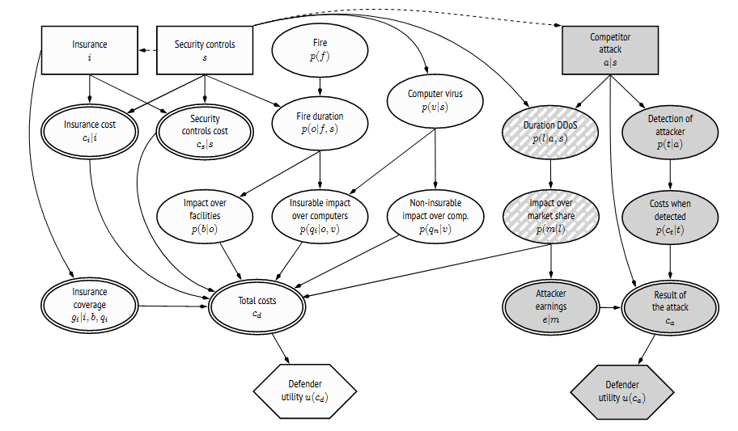

:slug: great-expectations/
:date: 2019-05-02
:subtitle: What to expect when you're at risk
:category: philosophy
:tags: business, security, risk
:image: cover.png
:alt: Chess strategy. Photo by Inactive. on Unsplash: https://unsplash.com/photos/nAjil1z3eLk
:description: A review of a paper from the adversarial risk analysis field applied to cybersecurity. The model is complex and rich and with interesting underlying ideas. We take advantage of their usage of those concepts to introduce influence diagrams and the expected value of a probabilty distribution.
:keywords: Risk, Probability, Impact, Measure, Quantify, Security
:author: Rafael Ballestas
:writer: raballestasr
:name: Rafael Ballestas
:about1: Mathematician
:about2: with an itch for CS
:source-highlighter: pygments

= Great Expectations

Thus far, the situations we have modeled have been
either over-simplifications or fabrications in order to illustrate a concept.
This article will try to improve on that a bit
by considering more variables and closer to reality, too.
We will do so by presenting the subject matter needed to understand
and review the article _An Adversarial Risk Analysis Framework
for Cybersecurity_ by Insua et al (2019), still in preprint form.

They say a picture is worth a thousand words,
and that applies to risk analysis as well.
Besides the obvious examples of mathematical plots,
diagrams can be great aids in understanding and modeling a situation
whose outcome is unknown.
Remember [inner]#link:../updating-belief/#mathematical-interlude[tree diagrams]#?
They are a good tool to help understand a situation
in which there are several choices and one depends on the other.
In reality, they are a simplified version of
link:https://www.probabilisticworld.com/bayesian-belief-networks-part-1/[Bayesian Networks].
In both, the number joining two random events
gives the probability of the end node happening,
if we already know the origin node happened.

But not all random situations in life are entirely random.
Some are decisions which should be taken strategically,
taking into account all the information at hand.
In the 1970s, decision theorists extended such diagrams to
involve such rational decisions and their consequences
in terms of rewards or penalties (_utilities_),
which rational agents are supposed to maximize.

["graphviz", "diagraminf.png"]
----
digraph diagraminf {
        decision -> {random1, random2} -> deterministic -> utility
        toutil -> utility
        todec -> decision [style=dashed, label="information"]
        torand -> random1
        torand -> random2 [label="probabilistic conditioning"]
        todete -> deterministic
        deterministic[peripheries=2];
        decision[shape=rectangle];
        utility[shape=hexagon];
        toutil[shape=none, label="..."]
        todec[shape=none, label="..."]
        todete[shape=none, label="..."]
        torand[shape=none, label="..."]
        random2[label="random event"]
}
----

In this _influence diagram_,
solid arrows indicate that the node at the tip depends probabilistically
on the node at the tail.
As illustrated by each node label:

* rectangles are for decisions to be made by rational agents,
sometimes based on information which can depend
on the occurrence of a random event or another choice;
* ellipses are for random events,
typically costs associated with a particular risk
* double ellipses for deterministic situations
(usually a mathematical function of the random events,
tipically used for costs that depend on them),
* and hexagons represent the utility, reward or penalty
associated with such an outcome.

Influence diagrams can be a lot more complicated,
but for now that will suffice.
Notice how decisions are at the first level.
Depending on those decisions, some random events
(typically costs associated with a particular risk)
will happen or not,
that's another level.
From the outcomes of those random events, a deterministic function
(usually the total of the costs)
is computed and from that, a utility is computed.
Also, influence diagrams can involve more than one decision-making agent,
which can be distinguished using colors.

With that in mind, the following model for cybersecurity attacks
can be easily understood:

.Influence diagram for a cybersecurity situation

It looks a bit busy, but bear with us.
Keep in mind the layer arrangement described above,
ignore all the mathematical notation and focus only on the shapes and labels.
There are two players involved:
the defender and attacker.
The attacker has to decide whether or not to launch an attack (row 1),
depending on the information they gain about the defender's decision
to implement security controls.
The defender might choose to acquire insurance for their cyber assets.
Each party has a utility node (last row), each of which depends on
the deterministic nodes (row 4)
which sum up the results of random impacts (row 3),
which depend on random events (row 2).
That is, in a nutshell, an influence diagram for cyber warfare.

== Mathematical interlude: expectation

Another important concept to understand this model is
that of _expected value_.
As it name implies, it is the _value_ that
can be reasonably _expected_ for a random variable,
taking into account the probability of each value,
i.e., its distribution.
However the mathematical formula to compute it
doesn't look too user friendly,
so it deserves some explanation.

The expected value is not unlike an average taken from a sample.
Say you want the average age of people in a room:

["latex","average1.png",align="center"]
----
\huge
$$\frac{25 + 21 + 21 + 20 + 21 + 25 + 22 + 23 + 23 + 24}{10} = \frac{225}{10} = 22.5$$
----

So, if you had to guess a person's age,
it would make sense to go for 22 o 23.
But adding like that would be too much work for large samples.
Why not group them instead, count how many are each age,
and _weight_ each value with that count?

["latex","average2.png",align="center"]
----
\huge
$$\frac{20\times1 + 21\times3 + 22\times1 + 23\times2 + 24\times1 + 25\times2}{10} = 22.5$$
----

This can be interpreted in terms of probabilities.
If we break up that fraction, we can rewrite that sum as

["latex","average3.png",align="center"]
----
\huge
$$20\times\frac{1}{10} + 21\times\frac{3}{10} + 22\times\frac{1}{10} + 23\times\frac{2}{10} + 24\times\frac{1}{10} + 25\times\frac{2}{10} = 22.5$$
----

Which is nothing more than the sum of each value times its probability.
This is just the definition of expected value
for a discrete probability distribution:

["latex","expected-value-discr.png",align="center"]
----
\huge
$$ EV = \sum v\times p(v) $$
----

where _v_ is each value, _p(v)_ is its probability, and
the sums runs over all possible values.
For continuous distributions, the sum over all values is upgraded
to a integral over all values:

["latex","expected-value-cont.png",align="center"]
----
\huge
$$ EV = \int v\times p(v)\,dv $$
----

== Back to the model

We would like to compute and maximize
the expected value for the utility,
but that value depends probabilistically on others.
Recalling our discussion about [inner]#link:../updating-belief/[conditional probability]#,
you know that the probability of two events happening together can be
computed with the probability of one of them,
and the probability of one given the other.
If we have a chain of events, each depending on the last,
that rule would imply a succession of multiplied conditional probabilities:

["latex","expected-utility.png",align="center"]
----
\huge
$$ \psi (e) = \int ...\int \
u(c_n + c_e + c_t + c_c) \, p(c_n) \, p(c_e | e) \, p(c_t | t_1, t_2, e)
\, p(c_c | t_1, t_2, e) \, p(t_1 | e) \, p(t_2 | e)
\ dt_2 \, dt_1 \, dc_e \, dc_t \, dc_c \, dc_n .$$
----

I know this looks like crazy math, but focus on the
product of conditional probabilities.
All that is just the probability of having the utility _u_
corresponding to the parameters _c~n~_, _c~t~_, _c~c~_, etc.
According to the above discussion of expected value,
we just multiply the value by its probability and integrate.

Now that we have an estimate of expected utility,
we need only simulate and throw some optimization algorithms to obtain
the maximum values and which parameters (the decisions, the configuration, etc)
that give us that maximum value.
In the above model, where what needs to be decided is
whether to acquire insurance and security controls, for the defender,
and the attacker needs to decide whether to launch an attack,
the results of running such simulations and optimizations are that the defender
should get the best-in-class, 1 `terabyte` per second,
cloud-based `DDos` protection, implement a firewall and anti-fire system,
and subscribe to comprehensive cyberattack insurance.
Not too surprising.

Having understood both concepts above, plus the optimization algorithms
we will not go into,
because they would take us too far away from the main topic,
all of which are standard mathematical topics,
the article can be understood.
In the original, however, we are walked through every addition to the model
step by step, beginning from a simple model where utility
depends from a single random node,
adding one piece at a time.
This might be good from a pedagogical point of view,
but we feel it would be more valuable
to explain the conventions for influence diagrams as we did above.
Also they first build a few reusable abstract model.
There is nothing special about "fire" above.
It is a risk just like an earthquake or robbery.
Only the probability distribution and the impact values would change.
Likewise "virus" and "DDos" could mean any kind of untargeted and targeted
cybersecurity risk, respectively.

After having presented the general model,
the authors go to great lengths to explain every detail
of the use case model (the above diagram),
including definitions of what each term
(such as "DDos" or "confidentiality") mean.
At the very end end they rush through the results, discussion and conclusions.
So, in terms of reviewing the paper,
we feel that it is overly long in the obvious,
and lacking in the difficult to grasp or most valuable.
Personally, I feel this is not research proper,
but merely a novel application of well-established topics
to a particular game theoretic situation
which might apply to cybersecurity as it could
to any other attack-defense scenario.

== References

. [[r1]] D. Rios, A. Couce, J. Rubio, W. Pieters, K. Labunets, D. Garcia (2019).
_An Adversarial Risk Analysis Framework for Cybersecurity_.
link:https://arxiv.org/abs/1903.07727[arXiv preprint]
