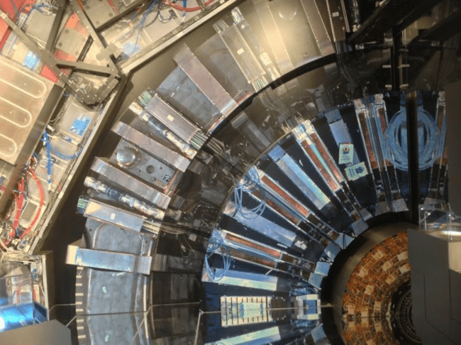

:slug: hack-cern/
:date: 2019-05-13
:subtitle: A chat with Andrés Gómez.
:category: interview
:tags: security, machine learning, testing
:image: cover.png
:alt: Purple and pink plasma ball on Unsplash: https://unsplash.com/photos/jM6Y2nhsAtk
:description: We spoke to Andrés Gómez, Ph.D. (c) at Goethe University. His research focuses on protecting a computer grid supporting physics experiments at the Large Hadron Collider (LHC) in Switzerland. Why did we choose this topic? It was not the topic, but the man. Andrés is a former Fluid Attacks member.
:keywords: CERN, Hacking, Security, Interview, LHC, Machine Learning
:author: Julian Arango
:writer: jarango
:name: Julian Arango
:about1: Behavioral strategist
:about2: Data scientist in training.
:source: https://unsplash.com/photos/jM6Y2nhsAtk

= Preventing Hacks at CERN

Have you heard about God’s particle?
In 2012, the Large Hadron Collider (`LHC`) found the Higgs Boson;
a particle predicted to exist in the 1960s
thanks to the work of Peter Higgs and other physicists.
The `LHC` consists of a 27-kilometer ring
of superconducting magnets with several accelerating structures
to boost the energy of particles along the way.
According to link:https://www.forbes.com/sites/alexknapp/2012/07/05/how-much-does-it-cost-to-find-a-higgs-boson/#695f65e63948[Forbes], finding the Higgs Boson
had cost around `USD` `13.25` billion.
Now you have a sense of what we will discussing in this post.

.Large Hadron Collider.

A good friend of ours
and former `Fluid Attacks` security engineer,
has been working in that huge scientific project.
Andrés is a final `Ph.D.` student
in Computer Science at the Goethe University in Germany.
His work has focused on securing the computer grid
that allows many physicists around the world
to analyze data on subatomic particle collisions at the `LHC`.
He has a fantastic record in cybersecurity.
Before starting his doctoral studies,
he found several serious weaknesses in commercial software.
One of his most striking findings was the link:http://kuronosec.blogspot.com/2013/07/directshow-arbitrary-memory-overwrite.html[CVE-2013 3174 (MS13-56)],
which refers to a Remote Execution Vulnerability
affecting Microsoft Windows Systems.
You can read more about Andrés in his link:https://iri-wiki.uni-frankfurt.de/cms/?q=node/90[academic profile],link:https://iri-wiki.uni-frankfurt.de/cms/?q=node/90[blog] or link:https://twitter.com/kuronosec[Twitter account].

*_What is your doctoral thesis about?_*::
 “It is about creating a security monitoring system
 for the link:https://home.cern/science/experiments/alice[`ALICE`] computational grid.
 `ALICE` is one of the major `LHC` experiments.
 The grid is made up of computer centers
 interconnected around the world
 that allow scientists to run applications for analyzing data
 obtained from particle collisions inside `ALICE`.
 My project is composed of a software framework
 that isolates applications scientists use in a sandbox.
 Then, it collects information about the behavior those applications,
 classifying them as normal or malicious using Machine Learning (`ML`).
 And finally, it allows performing actions upon detection of malicious behavior,
 such as sending alerts or stopping their execution.”

That’s amazing.
Researching protecting such a tremendous scientific _“device”_
is undoubtedly a huge challenge.
Andrés has been featured in the prestigious magazine link:https://www.scientificamerican.com/article/worlds-most-powerful-particle-collider-taps-ai-to-expose-hack-attacks/[`Scientific American`].
He told us that the `CERN`, owner of the `LHC`,
is a constant target for cyber attacks
and that this is not surprising:
many `CERN` systems are exposed to the Internet.
We wanted to know more about `ML` in his work...

*_Tell us a bit about how ML contributes to the framework you developed_*::
 “I used two `ML` models.
 The first performs a classification of applications
 into malicious and non-malicious.
 The other generates synthetic attacks
 to improve the training of the first.
  +
 I used thousands of examples of typical applications
 as well as `Linux` malware for training and testing both models.
 My framework managed to identify malicious software
 with an accuracy of `99%` and less than `0.06%` of false positives.”

Impressive.
We see a link to what we shared days ago on [inner]#link:../seek-chaos/[antifragility ]#
and this cutting-edge work.
By constant training and exposure to stressors,
the framework makes itself better and better (just like lifting weights).
According to link:https://cybersecurityventures.com/cybersecurity-almanac-2019/[Cybersecurity Ventures],
by 2021 it is estimated that cybersecurity damages
will add up to `USD` 6 trillion in the world, `3` trillion more than in 2015.
These `ML` designs,
capable of detecting security weaknesses and responding
are seen as an answer for the rampant threats nowadays.
If you want to dig deeper into Andrés' work,
link:https://arxiv.org/abs/1801.04179[here is a link] of a recent paper.

.Gomez Ramirez, et. al. (2018) Proposed Arhuaco design architecture.

Now, we turn to more general security-related issues with him.

*In your opinion, what trends in cybersecurity*::
*we should pay more attention to?*::

 “I think of three relevant topics:

 * One is the use of Artificial Intelligence (`AI`)
 for both attack detection as well as for vulnerability detection.
 I focused on the former in my doctoral research.
 +
 +
 * Another is the implementation of cryptographic techniques
 to increase reliance in execution environments,
 so user privacy is improved.
 For example, by using something called *_homomorphic encryption_*,
 an end-user could cipher his/her sensitive information
 before sharing it with a third-party (i.e., a company).
 The third-party can then perform operations
 over the encrypted data and finally,
 the user deciphers the results.
 No one (especially potential attackers) has access to plain, actionable data.
 Homomorphic encryption is used,
 for instance, in blockchain-based applications.
 +
 +
 * The last trend is the emergence of computer systems
 designed from formal mathematical models
 which, in theory, are vulnerability-proof.”

An example of that vulnerability-proof software can be found link:https://github.com/project-everest/hacl-star[here].

As a company focused on proving security in an offensive way,
`AI` is definitely a focus of research for us.
Although we haven’t yet got dirty developing `ML` or `AI` artifacts,
is something very likely to happen soon.

*_What threats are worth "having on the radar"?_*::

 “In general, with the rise of `AI`,
 I believe we will start to see more attacks
 that learn automatically from the environment where they are carried out.
 Attacks on _"Internet of Things"_ (`IoT`) devices
 have also wreaked havoc in recent months.
 Finally, the leakage of sensitive user data
 is becoming more problematic as time passes on.”

`IoT` weaknesses and leakage of sensitive information
are well under our scope.
We provide [inner]#link:../../services/continuous-hacking/[Continuous hacking]#,
as well as [inner]#link:../../services/one-shot-hacking/[One-shot hacking]#.
If you have `IoT` devices deployed on your premises,
we can help you identifying attacks vectors,
as well as providing ways to increase their security.
We can help you to protect better your sensitive information.

Our services rely on highly-skilled security analysts
as well as on technology designed to deliver real value to your company.
But, we go further.
[inner]#link:../../contact-us/[Get in touch]# so we can discuss how we can help you.

We continue our conversation with Andrés.

*_What do you think is a persistent problem within organizations?_*::

“I would say there are still many companies
receiving well-intended warnings from third parties
concerning security holes in their systems.
But, instead of taking a good skill in fixing the problems
and thanking the contributions,
what they do is threaten or sue the guy pointing to the risk.”

This is a sensitive topic and a critique.
We know that some companies foster this kind of actions
in what is called Big Bounty programs,
with clear rules and rewards.
These companies, presumably, have reached an understanding of the costs
of a cybersecurity breach,
so these programs are a win-win.
Is it a matter of rules?
Is it a matter of incentives?
It is a topic worth discussing in more depth in the future.

We want to conclude this post with two quick questions to Andrés:

*_Where should companies focus their learning efforts_*::
*_to improve their risk management?_*::

“Organizations should adopt a data-driven strategy
and invest in automation.
They should also invest in research
to stay relevant in a continuously changing field.”

*_Do you expect any further development based on your doctoral thesis?_*::

“I am exploring to go further with the framework.
The idea is to push what has been developed so far
in a research stage into a commercial product
that can be put to work in different organizations.”

We hope you liked this post
in which we shared some experiences and opinions with Andrés.
We would love to hear from you on these topics.
Drops us a mail to communications@fluidattacks.com and engage with us!

Thank you, Andrés!

== References

. [[r1]] link:https://arxiv.org/abs/1801.04179[Ramirez, A. G., Lara, C., Betev, L., Bilanovic, D.
, & Kebschull, U. (2018).
Arhuaco: Deep Learning and Isolation Based Security
for Distributed High-Throughput Computing. arXiv preprint arXiv:1801.04179.]
