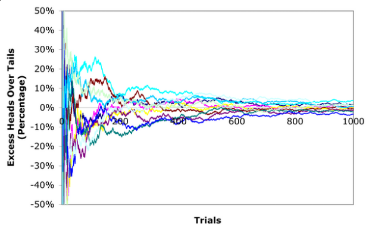
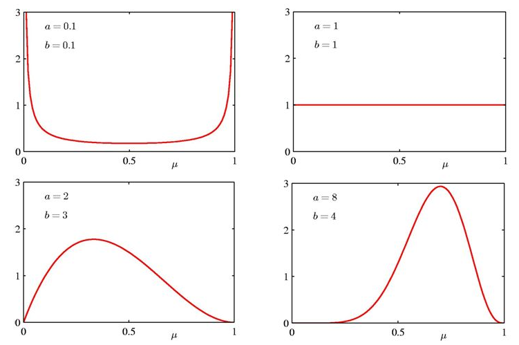
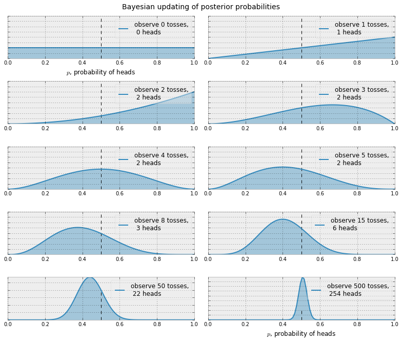
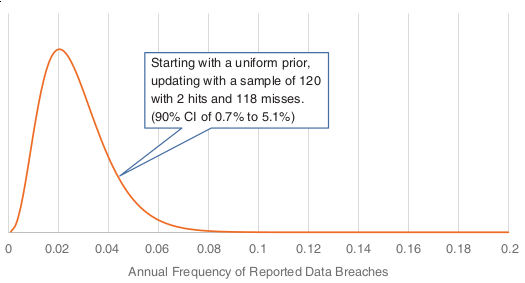
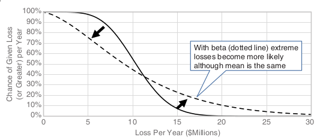

:slug: hit-miss/
:date: 2019-03-19
:subtitle: Estimating attack probability
:category: philosophy
:tags: business, security, risk
:image: cover.png
:alt: Baseball hit. Photo by Chris Chow on Unsplash: https://unsplash.com/photos/BhwRQr08PcM
:description: What is a beta distribution and how it can help us estimate the probability of suffering an attack given very sparse information, and why it is just like determining batting averages at the beginning of the season. We have more data than we think we need and use it to update our simulation results.
:keywords: Risk, Probability, Impact, Measure, Quantify, Security
:author: Rafael Ballestas
:writer: raballestasr
:name: Rafael Ballestas
:about1: Mathematician
:about2: with an itch for CS
:source: https://unsplash.com/photos/BhwRQr08PcM

= Hit or miss

One of the main obstacles against adopting
a quantitative approach to risk management
is that since major security breaches are relatively rare
and hence, there cannot be enough data for
proper statistical analysis.
While this might be true in the classical sense,
it is not if we adopt a [inner]#link:../updating-belief/[Bayesian]# mindset,
which basically amounts to being open to change
your beliefs due to new evidence.

Remember the [inner]#link:../quantifying-risk[Rule of 5]#?
It allows us to give a 90% confidence interval with only 5 samples.
This is already a counterexample
for the "not enough data" obstacle.
Also recall how we used
[inner]#link:../monetizing-vulnerabilities[probability distributions]#
in order to run simulations on many possible scenarios
and updated our beliefs based upon evidence,
all based only on a few expertly estimated probabilities.
In this article we will show how a probability distribution
can be derived from simple observations.

Suppose we want to estimate the batting average
--the ratio of hits to the number of times he stands at the bat--
for a particular player.
One way to do so would be to look at their
link:https://en.wikipedia.org/wiki/Moving_average[rolling average],
i.e. his average so far. The
link:https://www.probabilisticworld.com/law-large-numbers/[law of large numbers]
tells us that no matter what happens at the beggining,
the rolling average will tend to the true value,
if you observe it for long enough:

.Rolling average tends to the true mean. Via link:https://www.bradford-delong.com/2005/07/the_law_of_larg.html[Brad DeLong].

The only problem is, we don't have long enough.
Baseball seasons are finite,
and major cybersecurity events are few and far between.
What is one to do? If we go with the rolling average
like in the above image, we would be stuck with
the initial, imprecise part of it.
For instance, after the first try,
the player's average will be either exactly 0 or 1,
which clearly does not reflect the reality well.

Enter the _beta_ probability distribution.
This distribution takes two parameters which
determine its shape and spread,
and are cryptically called _alpha_ and _beta_,
but in reality can be though of as _hits_ and _misses_
from a certain sample.
We may also think that the density function
of this distribution gives us the probability
that a _proportion_, _ratio_ or _probability_
of an event is just that.
No, it was not a typo.
We can think of the beta distribution as
being the probability distribution of probabilities themselves.
As such, we can use it to obtain the probability of
being attacked after having observed who has been attacked (the hits)
and who has not (the misses) in a certain period of time.

.Beta distribution with different parameters. By Shona Shields on link:http://slideplayer.com/slide/6184857/[Slideplayer].

Wait: it gets better.
The beta distribution can be updated with evidence and observations,
just like we did when working with [inner]#link:../updating-belief[Bayes Rule]#,
to give better estimations.
Since alpha and beta represent hits and misses,
and if we observe some breaches and some non-breaches,
why not just add them to the original parameters?

It can be shown that the beta distribution,
modified this way, reflects reality
much better than the previous estimate.
And we can continue doing this in a repetitive manner
everytime there is an observation.

Imagine an even simpler situation:
what is the probability that a coin lands heads?
We don't know whether the coin is fair or
has been loaded to give more priority to some results than others,
so we might just roll it many times,
record the results (how many heads and how many tails)
and fit a beta distribution in the manner described above.
The results would be as follows:

.Adjusting a beta distribution to new evidence<<r1, ^[1]^>>

Notice how the distributions after the first
two tosses resulted in head do not just say
that the probability of heads is 100%,
which is what the rolling average would point to,
which is clearly wrong.
Instead, the beta distribution sort of
smoothes out what would be a sharp, extreme yes/no situation,
allowing a chance to values in between.
After only 3 tosses the distribution
starts to look like a proper distribution.
It gives the probability that the probability of
obtaining heads has a certain value.
After 50 tosses we can conclude,
with evidence and a mathematically sound supporting method,
that the coin was fair after all.

Next, how do we go about applying this to security breaches?
What exactly would be the "hits" and the "misses"?
Recall that we _update_ our knowledge of hits and misses
by taking random (tough typically small) samples
from an unknown, allegedly large population.
Since we want to estimate the probability that a bussiness like our own
would suffer a major attack,
then the population should be a list of companies similar to ours.
Call that the top 10, 100, etc of your country/region/world.
Out of those, take a random sample,
and check against a public database of cybersecurity events
(such as the
link:https://enterprise.verizon.com/resources/reports/dbir/[Verizon Data Breach Investigations Report])
to see if any of the sampled companies suffered an attack.

We also need seeds for the _alpha_ and _beta_ parameters.
These could be expert estimations or,
if you want to be very conservative,
you can set both to 1, which would give simply a
uniform distribution (everything is equally likely).
This is the most _uninformative_ of all possible priors.
It is totally unbiased.
Again, by the law of large numbers,
it doesn't really matter much where we begin.
But the better the initial estimates,
the faster the convergence to the "truth".
Starting with this uniform prior and
observing that there is one attacked company in the sample
over a 2-year period,
we obtain the following beta distribution:

.Beta distribution for breach frequency.<<r2, ^[2]^>>

When we have a distribution,
we know pretty much everything.
We can give find an expected probability of attack or,
better yet, a 90% confidence interval
in which that probability lies.
We can also use it to update our previous models.
Remember that in our
[inner]#link:../monetizing-vulnerabilities[simulations]#
to obtain the Loss Exceedance Curve,
we used a log-normal distribution simply
because it was the best fit due to some
of its properties.
Now we have a better reason to use
this beta distribution we obtained here,
and running the simulations again with
this distribution would yield the following results:

.Updated LEC

Notice how, by using the beta distribution,
it is clear that higher losses are more likely,
while smaller losses are less so.
Given that this beta distribution was built using real data,
this should be a more appropriate estimate of reality.

''''

Thus, the Bayesian interpretation of statistics and,
in particular,
the iterative updating of a fitted beta distribution
can aid your company in better understanding risk,
and not only in cibersecurity,
since nothing in this method is inherent to cybersecurity risk.
Especially in combination with [inner]#link:../monetizing-vulnerabilities/[random simulations]#,
which turn these abstract distributions
into concrete bills and coins.

== References

. [[r1]] C. Davidson-Pilon (2019).
link:https://nbviewer.jupyter.org/github/CamDavidsonPilon/Probabilistic-Programming-and-Bayesian-Methods-for-Hackers/blob/master/Chapter1_Introduction/Ch1_Introduction_PyMC3.ipynb[_Probabilistic Programming and Bayesian Methods for Hackers._]

. [[r2]] D. Hubbard, R. Seiersen (2016).
_How to measure anything in cibersecurity risk_.
link:https://www.howtomeasureanything.com/[Wiley].

. [[r3]] M. Richey M. and P. Zorn (2005).
link:https://www.jstor.org/stable/30044191?seq=1#page_scan_tab_contents[Basketball, Beta, and Bayes.]
_Mathematics Magazine_, 78(5), 354.

. [[r4]] D. Robinson (2015).
_Understanding the beta distribution (using baseball statistics)_.
link:http://varianceexplained.org/statistics/beta_distribution_and_baseball/[Variance Explained].
