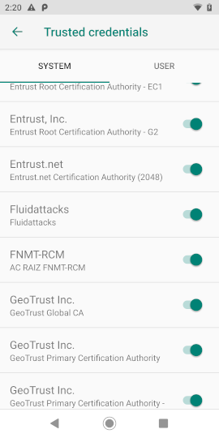
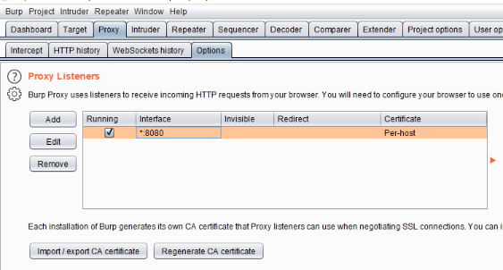
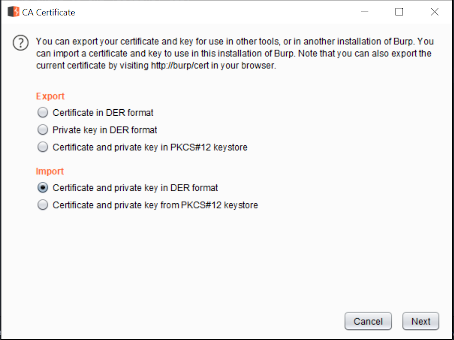
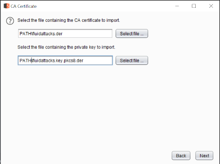
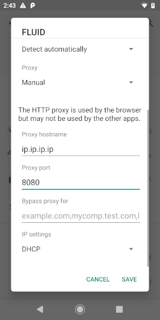
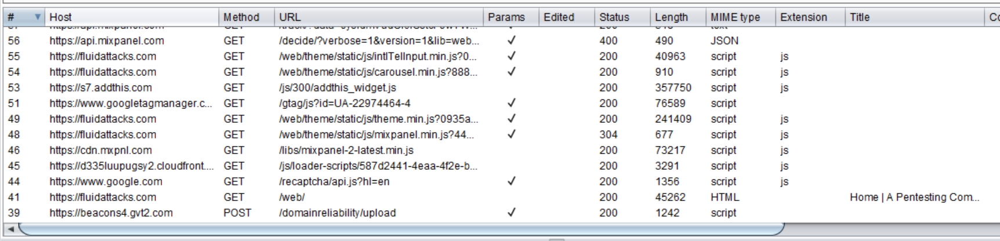

:slug: intercepting-android/
:date: 2019-10-23
:category: hacking
:subtitle: Intercept applications in newer Android phones
:tags: security, android, application, pentesting
:image: cover.png
:alt: Turned on Android smartphone. Photo by Pathum Danthanarayana on Unsplash: https://unsplash.com/photos/t8TOMKe6xZU
:description: In terms of market share, Android is the king of kings, having more than 80% of the total smartphone owner share. Hence, it is also the most suitable target for hackers. Here we are going to show how to intercept Android applications web traffic by installing a self signed certificate.
:keywords: Android, Security, Intercept, Hacking, Proxy, Application.
:author: Jonathan Armas
:writer: johna
:name: Jonathan Armas
:about1: Systems Engineer, Security+
:about2: "Be formless, shapeless like water" Bruce Lee

= Intercepting Android

+Android+ is an operating system
based on the +Linux+ kernel and used by mobile devices
such as smartphones and tablets.
Due to its popularity, it is the major target for hackers.
One of their common techniques is intercepting the traffic of apps
and trying to break them
using attack methods like fuzzing and bruteforce.

Mobile applications usually share
the same communication structure as web applications,
meaning that we can intercept requests by using a proxy.
If an application is using a secure channel like HTTPS,
we are going to have to install a digital certificate
into the phone in order to make it
accept our proxied requests.

Since +Android 7 Nougat+ (link:https://android-developers.googleblog.com/2016/07/changes-to-trusted-certificate.html[API >= 24])
we can no longer use the simple method of setting our proxy
and the certificate to capture +HTTPS+ traffic
like the +Burpsuite+ page explains link:https://support.portswigger.net/customer/portal/articles/1841102-installing-burp-s-ca-certificate-in-an-android-device[here].
If we try this method,
we will receive thousands of certificate failures from our proxy.
This is because the +Android+ operating system
no longer trusts certificates installed by the user.

To solve this, we need to have a rooted +Android+ smartphone,
then create and sign a digital certificate,
and finally put it on the System's certificate folder in our phone.

In order to intercept the application's traffic
we are going to need some tools,
the tools that we are going to use are:

* link:https://portswigger.net/burp[Burpsuite]
* link:https://www.openssl.org/source/[OpenSSL]
* link:https://developer.android.com/studio[Android Studio]

== Creating the certificate

So what is a +TLS CA certificate+?
When you communicate with a third party
using a secure channel like +HTTPS+,
the +SSL+ (Secure Socket Layer) protocol
and the +TLS+ (Transport Layer Security) protocol
include a security measure called digital certificates,
such measure implements asymmetric encryption
by using a private and public key.

In this protocol, a public key is signed by
the +CA+ (Certificate Authority) using their private key.
This way a certificate provides a link
between the public key and the +CA+ that signed that key.
The process of how a connection works is the following:

. The browser connects to the server using a secure protocol
. The server responds with the +digital certificate+
containing the public key of the server.
. The browser verifies if the +CA+ from the certificate
is included in its trusted list of +CA's+
(Here is where we will work).
. Once the browser verifies that the +CA+ from the certificate
is in its trusted list of +CA's+,
it uses the public key provided in +(2)+
to create a session key.
. Finally the browser and the server encrypt data
over the connection using the session key.

Having our certificate into the trusted store
is a way to make our phone
to trust in our proxy +HTTPS+ responses,
without this we cannot intercept secure channel traffic.
As we don't have a +CA+
we are going to create a self-signed one.

First, we generate the certificate
with 3650 days of validity
and using a +SHA256+ hash.
It also will request for some information.
We can put here our personal/company information
or leave it blank:

.Generating the certificate
[source, bash]
----
$ openssl req -x509 -days 3650 -nodes -newkey rsa:2048 -outform der -keyout fluidattacks.key -out fluidattacks.der -extensions v3_ca
Generating a RSA private key

writing new private key to 'fluidattacks.key'

You are about to be asked to enter information that will be incorporated
into your certificate request.
What you are about to enter is what is called a Distinguished Name or a DN.
There are quite a few fields but you can leave some blank
For some fields there will be a default value,
If you enter '.', the field will be left blank.

Country Name (2 letter code) [AU]:CO
State or Province Name (full name) [Some-State]:Antioquia
Locality Name (eg, city) []:Medellin
Organization Name (eg, company) [Internet Widgits Pty Ltd]:Fluid Attacks
Organizational Unit Name (eg, section) []:Fluid Attacks
Common Name (e.g. server FQDN or YOUR name) []:Fluid Attacks
Email Address []:continuous@fluidattacks.com
----

After generating the certificate,
we have convert it to +PEM+
for importing it to the phone
and +DER+ for importing it to +burp+:

.Converting the cert
[source, bash]
----
$ openssl x509 -inform DER -outform PEM -text -in fluidattacks.der -out fluidattacks.pem
$ openssl rsa -in fluidattacks.key -inform pem -out fluidattacks.key.der -outform der
----

Finally, we export our key into a +PKCS8+ file
in order to import it to +burp+:

.Modifying for burp
[source, bash]
----
$ openssl pkcs8 -topk8 -in fluidattacks.key.der -inform der -out fluidattacks.key.pkcs8.der -outform der -nocrypt
----

Now that we have all the files,
we need to start configuring our phones.

== Configuring Android

The certificates installed on the phone
follow the naming +HASH.0+,
so we need the hash of the certificate:

.Getting the hash
[source, bash]
----
$ openssl x509 -inform PEM -subject_hash -in fluidattacks.pem | head -1
----

After getting the hash,
create a copy of the certificate
with that hash on the name
(Something like +49ef1764.0+):

.Renaming for Android
[source, bash]
----
$ cp fluidattacks.pem <HASH>.0
----

Then we need to upload our certificate to the phone.
We can do it manually by connecting the phone
and moving the file into some folder
or with the following command using +adb+:

.Uploading the cert
[source, bash]
----
$ adb push <HASH>.0 /data/local/tmp
----

Once the file is in the phone,
log in as root,
remount the folder +/system+ with read and write permissions
(it is not mounted with those permissions by default),
copy our certificate to the +/system/etc/security/cacerts/+ folder
and change it's permissions and ownership to +644+ and +root:root+:

.Setting the cert
[source, bash, linenums]
----
$ adb shell
phone$ su
phone# mount -o rw,remount /system
phone# mv /data/local/tmp/<HASH>.0 /system/etc/security/cacerts/
phone# chmod 644 /system/etc/security/cacerts/<HASH>.0
phone# chown root:root /system/etc/security/cacerts/<HASH>.0
----

The last thing left to do
is restarting our phone to load our changes:

.Restarting
[source, bash]
----
phone# reboot
----

Once we turn the phone back on,
our certificate will be installed
on the +system's+ trusted credentials tab
the phone will accept the responses of our proxy.

.Android certificate

== Configuring the Proxy

Now we only need to set our proxy to use our certificate.
Open +Burpsuite+ and create a new project.
Then move to the +Proxy+ tab
and once there to the +Options+ tab.

.Burp options

Once there we are going to import our certificate
by clicking on +Import / export CA certificate+,
then select +Certificate and private key in DER format+,
and finally choose our +fluidattacks.der+
and +fluidattacks.key.pkcs8.der+ files
that we created previously.

.Import DER

.Choose file

The last thing that we need to do
is set our proxy in our phones.
First, we go to the +WiFi+ settings,
then select a shared connection
between the phone and the computer.
Here we can use the same network
that our computer is connected to
or use our computer as a mobile hotspot
to share it to our phone,
then expand the +Advanced options+,
set the +Proxy+ to +Manual+
and put the +IP+ address and +port+ of the proxy.

.Android Proxy

Now we are capturing secure channel requests
made from our phone applications and browsers
without the trouble of having certificate failures.

.Capture

If we want to have less default traffic on our proxy
we can modify again the +WiFi+ settings of our phones
and fill in the +Bypass proxy+ input
with the following domains:

.Default traffic sites
[source, bash]
----
*.google.com
*.googleapis.com
*.gstatic.com
----
