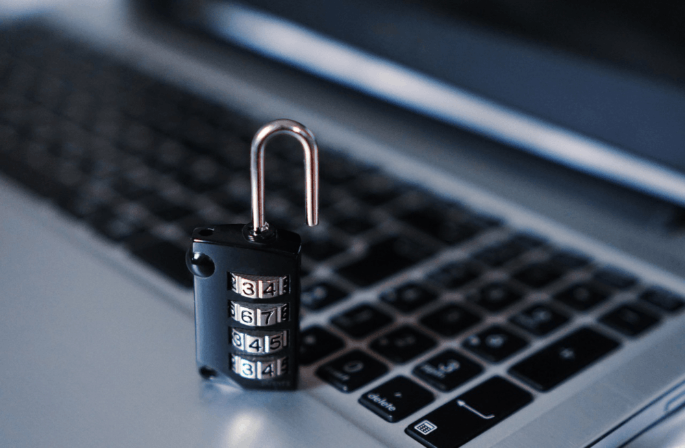

:slug: learning-code/
:date: 2019-08-16
:subtitle: A chat with Ricardo Yepes. Part 2.
:category: interview
:tags: devops, training, security
:image: cover.png
:alt: Bookshelf with some books
:description: This is the second part of our interview with Ricardo Yepes, here we will address topics such as cybersecurity, academic research, a learning platform, and more; Ricardo works as a DevOps engineer at an Australian consultancy company and was a former member of Fluid Attacks.
:keywords: Interview, DevOps, Security, Best Practices, Philosophy, Training
:author: Julian Arango
:writer: jarango
:name: Julian Arango
:about1: Behavioral strategist
:about2: Data scientist in training.
:source: https://unsplash.com/photos/pMnw5BSZYsA

= Learning how to code

We continue our conversation with Ricardo.
We threw him a question that was the source
of interesting debates at +Fluid Attacks+ some time ago.

*Should a company invest in security awareness training?*
[role="fluid-qanda"]
  . "You have two options:
  hiring people with the skills you need
  or supporting people to acquire those skills.
  People skilled enough in cybersecurity are scarce today.
  My stand here is that companies should invest in this;
  people should have a baseline knowledge of digital risks and cybersecurity.
  Educators should seek to create learning experiences.
  In my case, I feel like playing when I set myself to learn something new,
  and I think that has been crucial for advancing in my career.
  Instead of lectures (or only that),
  I think it’s better to create simulations where employees
  face what could be a real threat,
  like a phishing scam over email, telephone, or SMS.
  One of the strategies I think is the most effective
  is to make training interactive.
  For example, by putting people to solve challenges,
  making the training process look like a game."

+Fluid Attacks+ keeps learning through challenges,
as Ricardo mentioned, starting at the hiring process.
Take a look at our products,
like [inner]#link:../../products/integrates/[Integrates]#
and [inner]#link:../../products/rules/[Rules]# (this one is *FREE!*).

*In cybersecurity strategy, what should organizations start*
*and what should they stop doing?*
[role="fluid-qanda"]
  . "Companies should migrate to the cloud if they haven’t done yet.
  You still get to know some companies that remain reluctant
  to make that decision arguing cybersecurity and information risks.
  But the reality is that public cloud providers have better practices
  compared to the typical organization.
  I would expect that debate to end soon.
  +
  +
  . Second, people should start learning to code.
  Everything is shifting towards coding.
  We have software-defined networks,
  infrastructure as code (+IaC+) and many other instances
  where using code makes everything so much more powerful and flexible.
  You can see how this is gaining traction in +DevOps+ roles
  in which a single person performs a combination
  of software development and infrastructure operations.
  I recommend starting with the +Python+ programming language."

I'm pleased Ricardo pointed to the suggestion
because cybersecurity will continue to be increasingly relevant
in the global economy and coding is crucial.
link:https://www.inc.com/andrew-medal/everyone-on-the-planet-should-learn-to-code-heres-why-and-how.html[Everyone should learn to code].
For instance, we have seen invitations
to link:https://thenewmedic.com/why-how-learn-to-code/[learn to program] in medicine.
Likewise, the recognized statistician Nate Silver said
link:https://www.geekwire.com/2014/nate-silver/[journalists should learn to code].

*Now, concerning cybersecurity operations,*
*what should companies start and stop doing?*
[role="fluid-qanda"]
  . "Often, people in cybersecurity are seen as the bad guys,
  as those who will disturb your peace
  by requesting fixes by pointing out errors.
  We have frictions because security is seen as a separate entity
  trying to show what is not OK.
  Cybersecurity professionals
  *should be those guiding businesses in how to do stuff in a secure way*
  instead of being perceived as those saying _‘it can’t be done that way’_.
  +
  +
  . +DevOps+ teams solve some issues +IT+ _siloed_ teams usually have.
  What if +DevOps+ teams go further
  by including security capabilities?
  One way to achieve that is to have security people
  working together with +DevOps+ engineers.
  +DevOps+ teams usually have some professionals more skilled in coding;
  others more experienced in infrastructure administration.
  link:https://www.redhat.com/en/topics/devops/what-is-devsecops[Security could be another ingredient
  to provide solutions within +DevOps+ teams.]
  Old-fashioned developers usually think they finish their job
  when an application is functionally running.
  However, from a business perspective, that’s not true
  if other aspects are still missing, like quality and security.
  Organizations should start reconfiguring their +IT+ teams
  to create business resources covering everything in synergy:
  functionality, quality, and security."

*What cybersecurity providers are doing well? What is not so great?*
[role="fluid-qanda"]
  . "I can only say +Fluid Attacks+ is doing great stuff,
  by reinventing themselves.
  They started talking about +IaC+ around four years ago
  mentioning the importance of organizations shifting towards it.
  Benefits are so clear that it's unthinkable for me taking a different path.
  Here in Australia +IaC+ is unnegotiable,
  it brings speed to service delivery, to development,
  to infrastructure deployment.
  +Fluid Attacks+ is helping companies to automate the detection of weaknesses,
  working together with development, +IT+,
  and +DevOps+ teams to infuse security the way I mentioned before.
  If a cybersecurity firm is not into +IaC+,
  they will soon lose the interesting customers."

Indeed, +Fluid Attacks+ has a +DevOps+ approach.
Want to know more?
Visit our [inner]#link:../../services/continuous-hacking/[Continuous Hacking]#
and [inner]#link:../../services/one-shot-hacking/[One-shot Hacking]# services.

*Why do you think companies that know their weaknesses,*
*do not fix them or do it too late?*
[role="fluid-qanda"]
  . "I'm pessimistic.
  Companies fix their weaknesses
  because they have to comply with some regulations.
  Most people don't care that their software is unsafe.
  Those responsible for coding blame other people or wash their hands,
  knowing future issues will be fixed
  by a different developer down the line.
  +
  +
  . When accountability disappears,
  businesses sooner or later are forced to face setbacks.
  Newer costs might appear by detecting issues late,
  and hence other troubles might demand valuable business resources.
  Another reason for that inaction is that we tend to be very optimistic,
  for example, saying _'that happens in other companies, not here'_.

A CISO told us something very similar. Want to read about it?
Click [inner]#link:../sensible-cybersecurity/[here]#

*What do you think are relevant misconceptions in cybersecurity?*
[role="fluid-qanda"]
  . "A big misconception is that companies
  should protect primarily from individuals targeting your business:
  _“the attacker”_, _“the hacker”_, _“the terrorist”_, etc.
  A real significant threat is malware which works automatically,
  not necessarily targeted to specific firms or people.
  It is more an entity trying to enter any small digital breach.
  You don’t need declared enemies
  to protect your information and digital assets.
  It is worrying that there is no concrete solution
  to malware and ransomware yet.
  The hope for some people are potential +ML-based+ solutions
  [inner]#link:../hack-cern/[like those tested at +CERN+]# by our friend Andrés.
  +
  +
  . Another misconception
  is the notion people have about our field.
  Cybersecurity is not about detecting weaknesses.
  It is the opposite: to build robust systems,
  less likely to have flaws.

*Security is a behavioral problem; you and I know that.*
*What do you think is the most critical challenge in cybersecurity*
*from a behavioral perspective, and why?*
[role="fluid-qanda"]
  . "I would say lack of curiosity or _'critical thinking'_.
  I find this as a good countermeasure
  for simple mistakes we make that can have a huge impact,
  like getting caught by a phishing attack.
  There are other behaviors you and I have discussed
  like not fixing weaknesses,
  deploying unhardened servers
  or program without security practices.
  +
  +
  . Is hard for me to identify a broad reason
  why people behave as they do.
  But allow me to suggest this:
  a good way to move groups of people towards a better digital behavior
  is by making security more salient,
  by redefining security metrics.
  That’s like changing the incentives.
  Some security elements are not that visible,
  and security teams don’t enjoy a good reputation.
  So, by making security more salient,
  and signaling to some rewards from working
  towards well-thought security standards
  might be a trick to drive desirable behaviors."

We hope you liked this interview with Ricardo.
We would be pleased to hear from you on these topics.
Drops us a mail to communications@fluidattacks.com and engage with us!

To Ricardo, our gratitude!
