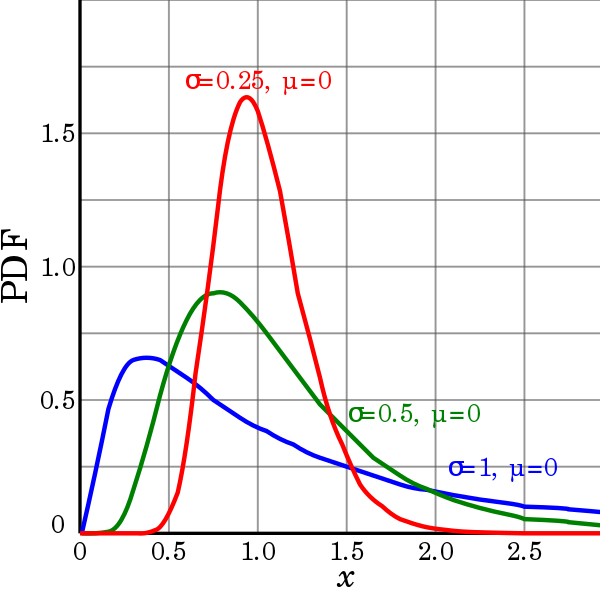
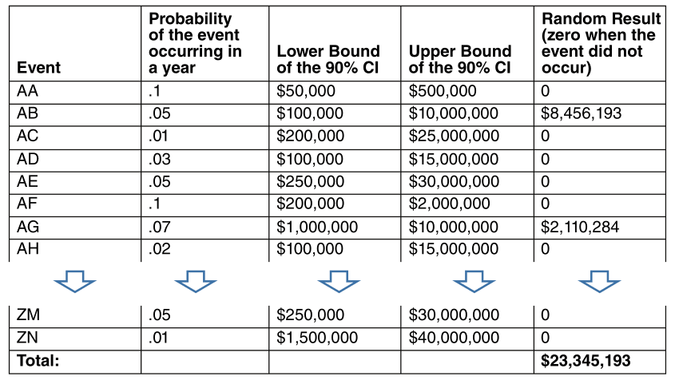
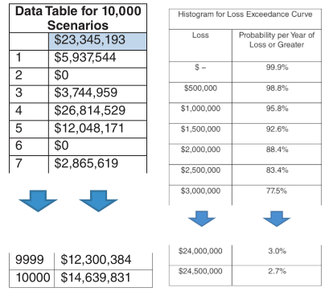
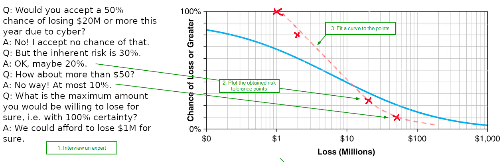

:slug: monetizing-vulnerabilities/
:date: 2019-02-19
:subtitle: From probabilites to dollars and cents
:category: philosophy
:tags: business, ethical hacking, risk
:image: cover.png
:alt: Numbers notes on Unsplash: https://unsplash.com/photos/aG-pvyMsbis
:description: How to use calibrated estimates to run a Monte Carlo simulation to obtain the expected losses and the loss exceedance curve for a particular risk or the whole organization in a particular time frame, from a high level, i.e. without the technical details.
:keywords: Risk, Probability, Impact, Measure, Quantify, Security
:author: Rafael Ballestas
:writer: raballestasr
:name: Rafael Ballestas
:about1: Mathematician
:about2: with an itch for CS
:source-highlighter: pygments
:source: https://unsplash.com/photos/aG-pvyMsbis

= Monetizing vulnerabilities

In our previous article,
we merely scratched the surface of the problem
that quantifying risks poses,
barely touching on concepts such as
calibrated estimation,
confidence intervals and
specifying the measuring object.
Now that (if?) we are convinced that:

* Cybersecurity risk can and should be measured in time-framed probabilities
rather than "low", "medium" or "high".
* Estimates should be made not as unrealistic point estimates, but instead as
confidence intervals which allow room for uncertainty.
* Even small data can tell us a lot if we use the right tools.
Quantitative methods are applicable wherever less precise methods are.
* Experts can make good estimates with the right training.

Let us see how we can turn that into dollars and cents.

Suppose we want to measure the loss incurred
by suffering a denial of service attack (the _risk_).
We can decompose the problem into the number of systems affected,
the number of hours these are out of service,
the revenue streams that rely on these systems,
and so a trained expert from your company estimates,
with 90% confidence, that the associated loss
can fall anywhere between $2 and $7 million.
This is our calibrated estimate of the _impact_ to the organization.

Now, instead of rating the "likelihood" on a scale from 1 to 5
as is done in the risk "matrices",
allow the experts from your [inner]#link:../../[security testers]#
to make an estimate in terms of probabilities.
Something like "there is a 15% chance that the organization
undergoes a denial of service" is what we need to hear here.
This particular estimate could be averaged with
the ones given by other experts, if need be.

These are all the inputs needed to run a simulation from which
we can extract the expected loss associated to a particular risk,
the probability of such loss or more,
or the overall company-wide loss expected from IT assets,
by running a so-called _Monte Carlo simulation_.
In a nutshell,
this means that we're going to simulate the events in a year
many times and average the results.
A risk happens or not depending on the likelihood given above
and the associated costs are taken at random from the
above confidence interval.

For a single "simulated year",
we just need to generate a random number between 0 and 1.
If it is below .15, we say that the event happened. Simple.
Now we need to figure out how much we lost.
The random number generated above was easy because all
numbers between 0 and 1 are equally likely.
This is called a _uniform distribution_.
However, in the case of losses, not all numbers are equally likely.
We need to generate them according to a different
_probability distribution_ which responds to two things:
the confidence interval (`CI`) estimated by the expert,
and its values should always be positive.
The most popular distribution for modeling is
the _normal_ distribution, a.k.a. the Gaussian bell:

.Effect of the mean parameter on the normal distribution
image::normal-distribution.png[Normal distributions]

However it always allows room for negative values,
no matter how much you push the mean parameter
towards the positive side, as you see above.
For this particular purpose the best fit
is the _log-normal_ family of distributions,
the distribution of the logarithm of a normally distributed variable.

.Lognormal distributions. Via link:https://commons.wikimedia.org/wiki/File:PDF-log_normal_distributions.svg[Wikimedia].

Plus, it has the advantage of being a little skewed
towards the lower values,
instead of being perfectly symmetric around the mean,
which makes lower values more probable and
hence is in better correspondence with the reality.

Thus, when the event happens, we can draw a value
from the (one and only) lognormal distribution
that has the 90% `CI` estimated by the experts,
and call that the loss for that risk in that simulated year.
We can do the same for other risks, add them all up
and so get a global loss due to cybersecurity in that simulated year,
thus obtaining a table similar to this one:

// to be changed into a native table
.Simulated losses for every risk in a "simulated year"<<r1, ^[1]^>>

Notice how, given that the probabilities for each risk are small,
none larger than 10%, most rows, most of the time,
will display a loss of $0.
Now the way to make this into a useful simulation is
to run it many times and writing down the results,
packed up into bins with which we could make a histogram,
or better yet, a curve.

.Monte Carlo results summary <<r1, ^[1]^>>

From these results, we can build a
[inner]#link:../quantifying-risk/[loss exceedance curve]#,
simply by counting the number of times the simulated results
are higher than a threshold, and plotting the results:

[[lec-simple]]
.Loss Exceedance Curve <<r1, ^[1]^>>
image::simple-lec.png[Loss Exceedance Curve]

The risk tolerance curve can be obtained from estimation as well,
this time by appropriately interviewing an executive expert
about the maximum chance with which they would be able
to tolerate certain loss thresholds,
plotting those risks on a graph,
and fitting
(link:https://en.wikipedia.org/wiki/Interpolation[interpolating])
a curve to these points:

.Fitting the risk tolerance curve

The _residual risk curve_ corresponds to the probabilities
obtained by the same method we used to generate the normal (_inherent_) risk,
only with different occurrence likelihoods
estimated by a security expert.
So we would just run the Monte Carlo simulation again,
only this time with a 1% probability of a denial of service
instead of the 15% we used before.
Thus we would expect to obtain a curve whose
loss probabilities are generally lower than
the ones in the inherent risk curve:

[[lec-all]]
.All together now <<r1, ^[1]^>>
image::../quantifying-risk/loss-exceedance-curve.png[LEC, tolerance and residual plots]

From these results it is now easier
to quantify, compare and finally make a decision regarding
which security control assets to invest in.
From the Monte Carlo simulations,
we could just average the losses to obtain
the _expected loss_.
Suppose that is $10 million.
Assume that a certain control, for example,
setting up an Intrusion Detection System,
makes the probability of the denial of service
lower to 8%, and the probability of some of other events go down as well.
If we run the simulation again,
we will obtain a different, most likely lower, expected loss.
Call it $8M, and suppose the `IDS` costs $0.5M.
In that case we might say that the _return on the control_ is given by

.Return on control
image::roc.png["Return on control"]

Clearly, an investment that reduces the expected loss
by four times its cost is clearly worth it.
Try to compare that cost to having 2 red-colored risks and 3 yellow ones.

''''

To recap, this loss exceedance curve is obtained by
running several simulations which, in turn,
feed from two expert estimates:
the estimated cost of a security event, reported as a confidence interval,
and the probability of an event occurring,
given the context in which such a vulnerability would happen.
The first can be easily estimated internally,
but the second can only be determined from a
thorough security audit and penetration testing.
From the above numbers, which are of course made up,
but not so out of this world,
you can make a more informed decision regarding
the investments your organization is willing to make
regarding both offensive and defensive security.
With the above tool, you have the gist to make
these simulations yourself.

== References

. [[r1]] D. Hubbard, R. Seiersen (2016).
_How to measure anything in cibersecurity risk_.
link:https://www.howtomeasureanything.com/[Wiley].

. [[r2]] S. Latchman (2010). _Quantifying the Risk of Natural Catastrophes_.
link:https://understandinguncertainty.org/node/622[Understanding Uncertainty].

. [[r3]] link:http://quantmleap.com/blog/2010/07/project-risk-management-and-the-application-of-monte-carlo-simulation/[quantmleap] (2010).
_Project Risk Management and the application of Monte Carlo Simulation_.
