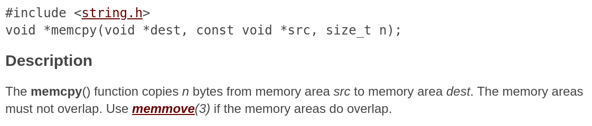

:slug: my-heart-bleeds/
:date: 2018-04-25
:subtitle: Understanding the flaw behind Heartbleed
:category: attacks
:tags: vulnerability, bug, openssl
:image: cover.png
:alt: Computer showing a pirate flag
:description: Heartbleed is the result of a buggy implementation of the TLS protocol on OpenSSL. It tempted to be a serious threat by leaking private information without any discretion. Multiple services and devices were affected across all the world due to the popularity of OpenSSL.
:keywords: TLS, HeartBeat, HeartBleed, OpenSSL, Vulnerability, Bug
:author: Daniel Yepes
:writer: cestmoi
:name: Daniel Yepes
:about1: -
:about2: "If the doors of perception were cleansed everything would appear to man as it is, Infinite." William Blake.
:source-highlighter: pygments
:source: https://unsplash.com/photos/JJPqavJBy_k

= My Heart Bleeds (But Not for You)

Back in April 2014,
one of the biggest vulnerabilities
in recent history was found: link:http://heartbleed.com/[`HeartBleed`].
The popular open source cryptographic software library link:https://www.openssl.org/[`OpenSSL`],
had a link:https://www.openssl.org/news/secadv/20140407.txt[critical flaw],
<<r1, ^[1]^>> in the implementation of a extension
on the Transport Layer Security `(TLS)` protocol.

The wide use of `OpenSSL` on several services
such as *web*, *email*, *instant messaging `(IM)`*,
even *virtual private networks `(VPNs)`*,
link:http://apac.trendmicro.com/apac/security/heartbleed/index.html[managed to affect *17%*] of all `SSL` servers,
mostly *half a million* of trusted websites.

In this article we will see how it works,
in a simple yet technical language.

.xkcd Heartbleed
image::heartbleedxkcd.png["Heartbleed"]

== TLS Protocol brief explanation

`TLS` protocol aims to provide *secure* communications
between *servers* and *web browsers*.
Whenever you see in your web browser a [green]#green lock# next to the url,
it means you are visiting a secure website,
indicating that your communication with the website is *encrypted*,
specially designed to prevent [red]#eavesdropping# and [red]#tampering#.

.Secure URL, Green lock sample

`TLS` accomplishes that by *encoding* your *data*
in a way that only the recipient knows how to *decode* it.
If a third party is listening to the conversation,
it will only see seemingly a random string of characters,
not the *actual* message or *content* of your data.

== From Beat to Bleed

The *`HearBeat` extension* was a change
proposed by link:https://www.robin-seggelmann.de/[`Dr. Seggelman`] in 2012,
and the bug was fully disclosed on April 7, 2014,
by independent researchers at `Codenomicon` and `Google Security`.
According to the link:https://tools.ietf.org/html/rfc6520[`RFC-6520`],
it's a new extension implemented over `TLS/DTLS`,
which provides a way to perform a *keep-alive* functionally.

Basically, a device sends an *echo* with a *message*
to be *replied back* with the *same information*,
just to make sure if the other device is *still alive*.
If any of them goes down during the transaction,
the other will know it by using this `HearBeat` mechanism, <<r2, ^[2]^>>.

So, for example, you are reading this article,
but you haven't done anything in a while,
your web browser sends a message to the server
saying *"Hello - Repeat it back to me"*,
the server receive it and send it back to your browser.

== The bleeding flaw

Researchers found that if a *request* made
had a *bigger length* than what was *sent* on the message,
*extra information* could be [red]#leaked# at the response sent back.

For example, the web browser
sends the following message: +
*"Hello - Repeat it back to me (28 kB)"*

But the length of the request
is modified to *40 kB*, then it becomes: +
*"Hello - Repeat it back to me (40 kB)"*

Then the message is sent and
the recipient device gets a message with a length of *40 kB*.

But the message was suposed to be *28 kB* long,
what about the remaining *12 kB*?
The recipient machine allocates in memory buffer
those extra *12 kB* of data and
send back *28 kB* of the actual
message plus extra *12 kB* of
whatever is stored in *RAM*.
Practically, you get more than
the *beat*, instead, you can actually make it [red]#bleed#, literally.

.Bad luck

Why? You may ask.
The message can be up to *64 kB*,
not a lot of information leaked though,
just *65536* characters taken from no other place than *RAM*,
but it's *not* like if an attacker could *control*
which *portion* of the *RAM* wants,
it just get whatever the machine grabs
in the subsequent block of memory.

But that doesn't seem to be harmful,
probably no more than random data being sent,
what's the chance it can get something of real value?
What if I told you an attacker doesn't have *any limit* to send `HeartBeats`?
It can stay *all day* long sending *requests*
analyzing each *64 kB* sent back and forth, and suddenly,
the flaw could yield some, if not all of the following:

* `SSL` private keys.

* Usernames and passwords that are
submitted to applications and services
running on the server.

* `Session tokens` and `cookie` values.

The worst of this vulnerability,
is that there's *no* way to *trace* it,
records for this kind of activity aren't *logged* by the `OpenSSL` daemon.
Plus it's not a client-server vulnerability,
as malicious *servers* were able to *exploit* it on *clients*
using the vulnerable version of `OpenSSL`,
called a *Reversed HeartBleed\'s*.

.xkcd Heartbleed explanation
image::heartbleed-explanation.png["Heartbleed"]

== What caused the bug?

This is a portion of the
link:https://git.openssl.org/gitweb/?p=openssl.git;a=blob;f=ssl/t1_lib.c;h=a2e2475d136f33fa26958fd192b8ace158c4899d#l3969[code of the `OpenSSL` library]
- `v1.0.1f` (the vulnerable version).
This fragment contains the bug and
I'm gonna break it in the essentials details.
+
.Fragment of the t1_lib.c from `OpenSSL`.
[source,c]
----
include::openssl-fragment.c[]
----

The line responsible for the vulnerability is this one:
+
[source,c]
----
3997      memcpy(bp, pl, payload);
----

Looking at the documentation of
link:https://linux.die.net/man/3/memcpy[`memcpy`],
we see the following:

.memcpy function

The terms in parentheses behave like this:
*bp* is the destination of the memory copied from *pl*,
*pl* is the source of that memory and
*payload* is the length of it,
basically, the last one says how large is the data. +
If *payload* states that *pl* is of *64 kB*,
when it really is of *0 kB* we got a huge problem,
because *bp* will be created with
the same size as *pl*,
filled of garbage data,
but then none of that data at *bp* gets overwritten,
because *pl* is empty or isn't large enough to fill it.

The *flaw* on the code is that
the *length* of the *data* wasn't being validated,
there were a *missing bounds* check before memcpy was performed.
We'll see that in the following lines of code:
+
[source,c,numbered]
----
include::payload-length.c[]
----

The previous three lines of code
just write the length of *p*, the '`HeartBeat`
request', into the variable *payload*,
the *expected length* of the payload.
But notice there's nothing checking
if the *expected length* of the message corresponds
to the actual length of the '`HeartBeat` request'.

The next line is responsible
to set the *length* of the response back,
the *payload* variable holds the *expected length* of the *payload*,
thus that length will be written into the *bp* variable.

[source,c]
----
3996      s2n(payload, bp);
----

Now, the line containing the vulnerability explained before,
takes a little more sense,
*pl* could have a length of *5 kB*,
but *payload* gets a value of *64 kB*,
as it is not checked,
*bp* variable will allocate in memory those *64 kB* and
send it just back, <<r2, ^[2]^>>.

[source,c]
----
3997      memcpy(bp, pl, payload);
----

=== The fix

The vulnerability is only present in versions `1.0.1`
until `1.0.1f` and `1.0.2-beta` until `1.0.2-beta1` releases.
A few days after the incident a patch was released,
the `OpenSSL` versions `1.0.1g` and `1.0.2-beta2`, got rid of the flaw.

The *patch* is essentially a *bounds check*,
to validate the actual *length* of the *payload*.

[source,c]
----
include::patch.c[]
----

The fully code patched
can be seen here in this link:https://git.openssl.org/gitweb/?p=openssl.git;a=commitdiff;h=731f431497f463f3a2a97236fe0187b11c44aead[`git diff`].

This kind of vulnerability is named `buffer over-read`, <<r3, ^[3]^>>.
For example, in the `Heartbleed` case,
the program tries to read data from memory,
but due to no bounds check,
it tries to read adjacent memory,
creating a special case of memory safety violation.

=== That was all?

Yes! That single line you saw there
was the demonic 'call of Cthulhu'.

Nah, not really like that,
but it tempted to wreak havoc,
several companies like link:https://aws.amazon.com/es/blogs/security/aws-security-and-cve-2014-0160-heartbleed/[`Amazon`],
link:https://blog.soundcloud.com/tag/heartbleed/[`SoundCloud`],
link:https://community.atlassian.com/t5/Questions/Heartbleed-Serious-OpenSSL-vulnerability/qaq-p/94964[`BitBucket`],
link:https://blog.github.com/2014-04-08-security-heartbleed-vulnerability/[`Github`], the
link:http://business.financialpost.com/personal-finance/taxes/cra-website-shutdown-security[Canada Revenue Agency `(CRA)`],
almost 78 devices from link:https://blogs.cisco.com/security/openssl-heartbleed-vulnerability-cve-2014-0160-cisco-products-and-mitigations[`Cisco Systems`],
link:http://www8.hp.com/us/en/heartbleed.html[`Hewlett-Packard`],
even operating systems shipped with it, like link:https://www.debian.org/security/2014/dsa-2896[`Debian Wheezy`],
link:https://wiki.centos.org/Security/Heartbleed[`CentOS 6.5`],
link:https://usn.ubuntu.com/2165-1/[`Ubuntu 12.04.4 LTS`],
and a big etcetera had to shut online their services,
warn or log out every user and inform them to update their password,
there were even possible cases of the bug link:https://www.securityweek.com/hackers-exploited-heartbleed-bug-steal-45-million-patient-records-report[`exploited`].

Yet, despite 4 years have passed,
there's a high chance that
a lot of services are link:https://www.theregister.co.uk/2017/01/23/heartbleed_2017/[unpatched] against `HeartBleed`,
since there are plenty reports from 2017
showing that at least 200,000 services are still link:https://www.theregister.co.uk/2017/01/23/heartbleed_2017/[affected].

=== References

. [[r1]] link:https://heartbleed.com[Synopsys (2014).]
. [[r2]] IBM (2014). A technical view of the OpenSSL HeartBleed vulnerability.
. [[r3]] link:https://cve.mitre.org/cgi-bin/cvename.cgi?name=cve-2014-0160[CVE-2014-0160.]
