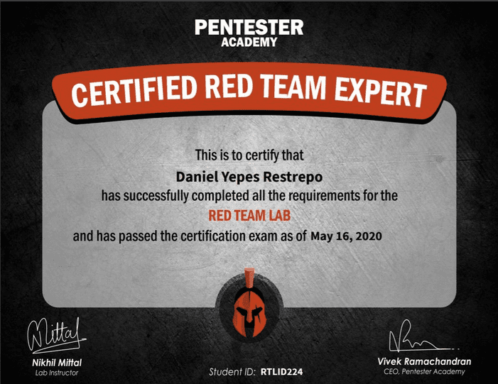
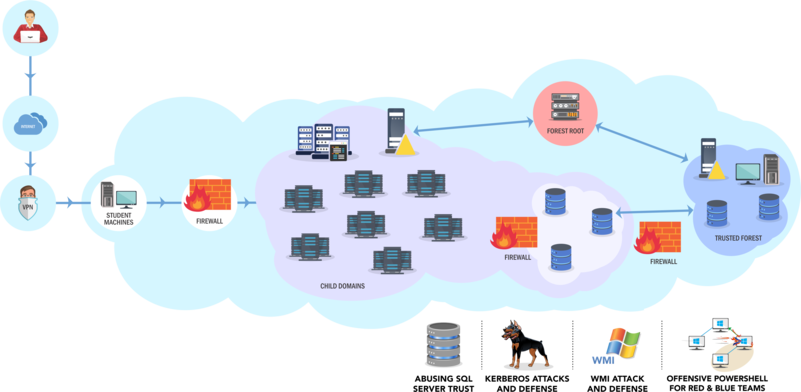

:slug: new-red-team-expert/
:date: 2020-06-08
:subtitle: A short interview with Daniel Yepes
:category: interview
:tags: interview, red team, windows, software, cybersecurity, security
:image: cover.png
:alt: Photo by Gary Bendig on Unsplash
:description: Recently our colleague Daniel Yepes achieved his certificate as a Red Team Expert. We had a chat with him, and he shared his experience, the challenges he faced, and the knowledge he acquired and employed. In the end, he gave us some tips for those interested in obtaining this certificate.
:keywords: Interview, Red Team, Windows, Software, Cybersecurity, Security
:author: Felipe Ruiz
:writer: fruiz
:name: Felipe Ruiz
:about1: Technical writer
:source: https://unsplash.com/photos/Yu-qayee34c

= A New Red Team Expert

.link:https://twitter.com/fluidattacks/status/1262759918853128193/photo/1[Certificate]

Daniel Yepes is a Computer Engineer
who has been working at `Fluid Attacks` as Security Analyst for over two years.
A few days ago, he was certified as a Red Team Expert from link:https://www.pentesteracademy.com/[Pentester Academy].
This is a site founded in *2011* by Vivek Ramachandran
that "link:https://www.linkedin.com/company/pentesteracademy[furthers the careers] of [cybersecurity] professionals worldwide
with in-depth training, attack-defense products and informative content
that address the ever-evolving landscape of online threats."

Daniel completed the link:https://www.pentesteracademy.com/redteamlab[Advanced Red Team Lab],
the second in difficulty out of three labs.
These labs are offered at Pentester Academy at different prices (*$299-699*)
depending on the access period's length.
Well, he didn't actually perform the lab,
but the Certification Exam associated with that lab;
we'd better let him tell us about his experience.

[role="fluid-qanda"]
  . I decided to take the Red Team Expert exam
  without taking the Red Team Professional one (the first on the list).
  You don't have to do them in order.
  I wanted to be adventurous and beat my brains out, and I did.
  I had already taken this exam in October last year, but I failed.
  At that time, I paid for three months' access to the lab
  (which I didn't do because of personal matters) before the test;
  this last time, I only paid for the test.
  *48* hours are allowed to take the exam
  and another *48* hours to prepare the report.
  I ended up using all the time for the former,
  and almost *24* hours for the latter.

[role="fluid-qanda"]
  . So, I just took the exam that comes with the lab.
  When you do the lab, you have to perform the stated objectives.
  There are around *60* flags you have to find there;
  these constitute proof that you reached each target.
  The lab is necessary for one not to feel overburdened in the exam
  and end up taking it several times.
  What I did was ask questions and do research.
  I asked people who had already accomplished it to give me some tips.
  However, it's much better to do the lab and know what you'll be dealing with,
  unless you already have a lot of experience.

Before we continue with Daniel,
let's summarize something shared about the Advanced Red Team Lab
on the link:https://www.pentesteracademy.com/redteamlab[Pentester Academy website].
In short, this lab is focused on threats and attacks
to network infrastructure managed with Windows Active Directory.
The exercises constitute simulation of real attack-defense events.
The user is asked to achieve an enterprise admin of multiple forests position
just starting with a non-admin user account,
exploiting software vulnerabilities and overlooked domain features.
The user faces some challenges in this lab, among which are the following:
"active directory enumeration, local and forest privilege escalation,
network pivoting, application whitelisting bypass, active user simulation,
Kerberos delegation issues, `SQL` Servers, [and] forest trusts."

.Advanced Red Team Lab (image taken from link:https://www.pentesteracademy.com/redteamlab[pentesteracademy.com])

*Why did you decide
to get this "Certified Red Team Expert" (CRTE) certificate?*
[role="fluid-qanda"]
  . I decided to get this certificate
  because I found the subject very interesting
  to reinforce/learn new techniques for different projects.
  In some of them there were environments with Active Directory.
  This is a centralized system to manage objects,
  such as users, machines, permissions, etc.
  In that ecosystem, you can find things like antivirus, `EDRs`,
  monitoring systems, databases, file servers, among others.
  The intention in such projects is to reach a target without being detected.
  In the process are presented some valuable techniques/tools
  to avoid security controls, to perform a lateral movement,
  privilege escalation, and persistence
  by abusing the misconfiguration of some services.
  It also helps to reinforce the idea that obtaining Domain Admin
  is not the primary objective but part of the way to achieve a final goal.

[role="fluid-qanda"]
  . I had already obtained the link:https://www.offensive-security.com/pwk-oscp/[`OSCP`]
  (Offensive Security Certified Professional) certificate.
  The most notable difference between the `OSCP`
  and the `CRTE` certifications is the focus.
  The `OSCP` is very much based
  on the exploitation of services from public vulnerabilities.
  The `CRTE`, including the `CRTP` (Certified Red Team Professional),
  is more focused on understanding in depth
  some components of an active directory
  and identifying and abusing the misconfigurations that are present there.

*What is the knowledge you believe is required to obtain this certificate?*
[role="fluid-qanda"]
  . The knowledge I think someone should have
  before doing the lab is the following:
  some basics on how to approach this type of environment,
  knowing how to enumerate it with the different tools available,
  and a notion of some of the components and services that can be found.
  Furthermore, and as one of the most necessary knowledge
  is to have at least the basic ability to program in PowerShell.

*What kind of tasks do you have to complete in this Red Team Lab exam?*
[role="fluid-qanda"]
  . Well, I don't intend to talk about specific tasks,
  because that would literally be telling people
  what to study and what to expect.
  The most basic or essential tasks would be the following:

[role="fluid-qanda"]
  . *Enumerate.* This is to do recon;
  that is, recognizing which users/machines/services are present.
  . *Privilege escalation.* This is moving
  from having a user without administrative privileges
  to having a user who does have them.
  It can also be to obtain those privileges for the same user.
  . *Lateral movement.* This refers to the techniques
  used to move progressively on a network.
  In other words, it is looking for how to move
  from one machine to another or others
  to obtain more information to reach the goal.

*Which were the most difficult challenges?
Any time did you feel at your wits' end?*
[role="fluid-qanda"]
  . The hardest part was getting almost halfway through the exam
  and not knowing what the hell else to do.
  One important thing to achieve here is `RCE` (Remote Command Execution).
  In vague terms, `RCE` is as if from your machine,
  you could execute system commands on another machine
  to which you have access.
  On the other hand,
  you have to make an excellent report, with precise argumentation.
  But, in the end, it's an experience for the person taking the exam,
  and what is tough for me can be easy for someone else.

*What would you recommend to those who want to get this certification?*
[role="fluid-qanda"]
  . You should start by learning
  how to deal with active directory and Windows environments.
  You must learn how to do recon and evade antivirus,
  either for running a binary or a script on PowerShell.
  Also, you should learn about abusing services
  to achieve lateral movement or escalation of privileges.
  You must immerse yourself in this world,
  not forgetting that Google is your best friend.

[role="fluid-qanda"]
  . So, do a lot of research, reading, and testing.
  Besides, if you can, go to the lab, or make a home lab,
  there are very good guidelines.
  That's something perfect to understand concepts, abuse services,
  and try to mitigate attacks.
  It's very time-consuming, but you can do it bit by bit.
  I think it is great to have that conception in mind,
  how to attack and defend.
  That way, you gain more mastery of the subject,
  and you can have a more general view of what can be presented,
  either in the exam or in a particular project.

*Do you have any certification in mind as the next one to get?*
[role="fluid-qanda"]
  . link:https://www.offensive-security.com/ctp-osce/[OSCE] or link:https://www.pentesteracademy.com/gcb[PACES].

We are grateful to Daniel for sharing this information with us,
and again we congratulate him on his new achievement.
By the way, we constantly publish content on attacks.
So, if you are interested in learning how to perform some techniques,
don't hesitate to subscribe to our blog.
