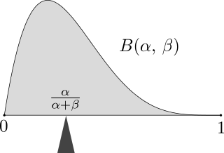
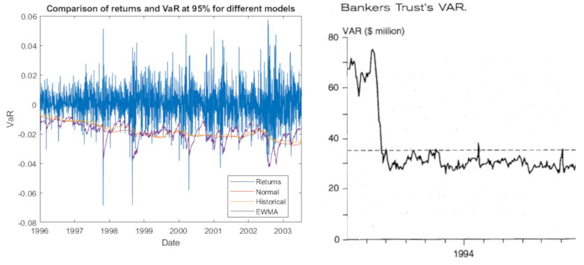

:slug: para-bellum/
:date: 2019-03-26
:subtitle: Prepare for the worst risk
:category: philosophy
:tags: business, security, risk
:image: cover.png
:alt: Fire extinguisher. Photo by Tommaso Pecchioli on Unsplash: https://unsplash.com/photos/XG_wi3W4-m8
:description: Value at Risk (VaR) is a measure of the risk of loss in the context of uncertainty, v.g., for investment. It is the upper bound for loss in a period of time with a certain degree of confidence, usually 99%, so we know that in that percent of the scenarios, loss will not exceed the VaR.
:keywords: Risk, Probability, Impact, Measure, Quantify, Security
:author: Rafael Ballestas
:writer: raballestasr
:name: Rafael Ballestas
:about1: Mathematician
:about2: with an itch for CS
:source: https://unsplash.com/photos/XG_wi3W4-m8

= Para bellum

"_Si vis pacem, para bellum_", goes the old adage.
If you want peace, prepare for war.
In our case, the worst possible risky scenario
our information assets could go into.
While probability distributions,
loss exceedance curves,
simulated scenarios, etc,
are all great for the quants in the office,
at the end of the day big, important decisions
need to be supported by single numbers
that can be easily compared to one another.
In risk management, this number is
the _Value at Risk_ or `VaR`.
Fortunately, once you have one you have the other.

`VaR` measures this scenario
by telling us beyond how much our losses
will _not_ go,
with a certain degree of confidence,
over a definite period of time.
Thus a daily 1% `VaR` of $10 million means
that the probability that you will lose more than
ten million is 1%, i.e.,
are 99% confident that the losses
will not exceed that.

So we need to define over what time period
our `VaR` will be taken and
how extreme the worst-case scenario.
Typical periods and confidences used in the industry are
a single day or week, and
confidence levels of 95% or 99%.

There are at least three workable ways
to compute the value at risk:

. Examining the distribution of the returns,
. Using the loss exceedance curve (`LEC`)

The link:https://www.investopedia.com/terms/n/normaldistribution.asp[normal distribution]
is perhaps the most popular one
for modeling real-word situations and natural phenomena, and with
link:https://www.thoughtco.com/importance-of-the-central-limit-theorem-3126556[good reason].
It could be used,
to model the value of a portfolio
over a one-year period, with
mean return 10%,
and standard deviation (volatility) 30%:

// pkg load statistics
// x = [-100:1:130];
// y = normpdf(x,10,30);
// hold on
// plot(x,y)
// ax = gca();
// set(ax, "FontSize", 14);
// xlabel('Returns (%)')
// ylabel('Probability density')
// title('Portfolio returns PDF')
// h = [-100:1:-60];
// y = normpdf(h,10,30);
// area(h,y)
// xticks([-60,-25,10,45,80])
// xticklabels({'VaR = -60','-25','Mean = 10','45','80'})
// yticks([])
// text(-70,0.002,0,{'1% of', '\downarrow area'})
// hold off
.Normal distribution of value
image::normal-pdf.png[Normal distribution of value]

Knowing the probability distribution,
which tells us probabilities of point values,
we can find probabilities of ranges
with the corresponding _cumulative_ distribution function (`CDF`):

// cdf = normcdf(x,10,30)
// semilogy(x, cdf)
// xlim([-100 80])
// ylim([1e-4,1])
// ax = gca();
// set(ax, "FontSize", 14);
// xlabel('Returns (%)')
// ylabel('Cumulative probability')
// xticks([-60,-25,10,45,80])
// xticklabels({'VaR = -60','-25','Mean = 10','45','80'})
// line([-60,-60],[eps,0.01])
// line([-100,-60],[0.01,0.01])
// yticks([1e-4,0.001,0.01,0.1,1])
// yticklabels({'0','0.001','0.01','0.1','1'})
// title('Portfolio returns CDF')
.Cumulative distribution function of value
image::normal-cdf.png[Cumulative distribution function of value,width=50%]

Looks like
a vertically reflected `LEC`.
In a cumulative probability plot
the `VaR` is just the x-value
corresponding to the confidence.

We can use a
link:https://www.libreoffice.org/discover/calc/[spreadsheet],
for this, with the
link:https://help.libreoffice.org/Calc/Statistical_Functions_Part_Four#NORM.DIST[`NORM.DIST`] function.
The probability that the loss exceeds 20% is

----
=NORM.DIST(-20,10,30,1)
0.158655253931457
----

i.e., around 15.8%.
The 10 and 30 above are the distribution parameters,
and the -20 is the value whose probability we need.
Notice that it is negative, meaning a loss.
The 1 means to make the computations cumulative.

We can also use the inverse function so that,
given a probability,
we get the point at which this probabilty is attained.
It is the same process as above, but backwards.

At what point is the 1% probability?
More exactly, for which value _V_
 is it true that the probability that
the final value is less than or equal to _V_ is 1%?
That's just the 1% `VaR`:

----
=NORM.INV(0.01,10,30)
-59.7904362212252
----

This is the 1% link:https://en.wikipedia.org/wiki/Quantile[_quantile_],
or the first _percentile_ of the distribution,
the point under which
the remaining 1% of points are,
weighing by the probability.
Thus the _Value at Risk_ in this example will be
59.8% of what we invested.
Had we invested $100 million,
then we know the `VaR` is $59.8 million,
and hence that the losses will not exceed that amount
in 99% of the cases, only in that rare 1%.
Notice that the `VaR`,
being a single figure,
does not tell us exactly or otherwise
what the losses might be in that catastrophic 1%.
But if we are ready to lose that much,
we are halfway prepared for the metaphoric war.

The _tail_ (or _conditional_) value at risk,
or `TVaR` (`CVaR`) for short,
tries to fill that void by giving us
the expected value or mean
in the catastrophe region, i.e.,
in case of a `VaR` breach.
Much like the actual mean of a distribution
is a center of gravity of sorts,
where we could "hold" the `PDF` in balance,
besides being the value with more repetitions
if we repeatedly draw numbers from such a distribution:

.Expected value of a [inner]#link:../hit-miss/[beta distribution]#. Via link:https://upload.wikimedia.org/wikipedia/commons/thumb/8/82/Beta_first_moment.svg/220px-Beta_first_moment.svg.png[Wikimedia].

The `TVaR` is thus the expected value of the loss,
given that the `VaR` has been surpassed.
In terms of the above analogy,
it is the center of gravity
of the "catastrophe" region of the distribution plot:

.Illustration of `VaR` and `TVaR`. Via link:http://www.nematrian.com/TailValueAtRisk[Nematrian].
image::tvar.png[Illustration of VaR and TVaR]

In our case, since we are mainly interested
in cybersecurity risk, which we quantify
via [inner]#link:../monetizing-vulnerabilities/[simulations]#,
we can always re-run them and
aggregate the results differently
in order to obtain the density function and
recreate the example above.
But given that the main result of our
simulations was a loss exceedance curve:

.Loss exceedance curve
image::../monetizing-vulnerabilities/simple-lec.png[Loss exceedance curve]

We can just use this to obtain the `VaR`,
just like we did with the distribution `CDF`.
This graph is already cumulative,
so there is no need to compute areas under the curve
behind the scenes.
We simply obtain the value in millions corresponding
to the percentage of the scenario in which we are interested.
In this particular graph, the 5% yearly `VaR`
appears to be $500 million
(recall that this graph has a logarithmic scale in the x-axis).
The 1% is not even visible here,
but at least that tells us that it must be beyond $1000 million.

[[var-monitor]]
Monitoring a short-termed `VaR`
can be usefulto evaluate the performance of risk management
or to understand events from the past:

.Artificial VaR monitoring (via link:https://www.mathworks.com/help/examples/risk/win64/ValueatRiskEstimationandBacktestingExample_04.png[MathWorks]) and real example from link:https://en.wikipedia.org/wiki/Bankers_Trust[Bankers Trust], via <<r3, [3]>>.

In the first we see a steady, if slow,
decline in `VaR` over the years.
Also notice how the returns are almost always
above their corresponding values-at-risk,
save for a few rare breaches,
which is to be expected.

In the image to the right there is
an interesting moment around February 1994,
where there is a sharp decrease in the `VaR`,
after which it pretty much stays stable
under the risk appetite line (dashed).
This phenomenon is explained in Jorion's book <<r3, ^[3]^>>
as a response to a rise in interest rates at that moment,
which was just as sharp as the decrease in the `VaR`.

However, a decreasing `VaR` is not all.
Shying away from investments to keep the `VaR` low will,
by symmetry, mean lower chance of great returns:

[quote,Aaron Brown]
"A risk manager has two jobs:
make people take more risk the 99% of the time it is safe to do so,
and survive the other 1% of the time.
`VaR` is the border."

''''

So,  the VaR tells us in a single number
what can happen with an investment or any risky situation
the worst that might happen.
However its greatest strength is also where it falls short.
This particular number,
while it gives an upper bound for the losses,
is also unable to tell us anything else
about what happens in that 1% of the cases.
The `TVar` tries to fill this void,
but it is still just a number,
meaning that it inherits this same weakness.

== References

. [[r1]] S. Benninga and Z. Wiener (1998). _Value-at-Risk (`VaR`)_.
link:http://simonbenninga.com/wiener/MiER74.pdf[Mathematica in Education and Research 7(4)]

. [[r2]] P. Jorion (2006). _Value at Risk:
The New Benchmark for Managing Financial Risk_.
link:https://www.goodreads.com/book/show/1274687.Value_At_Risk[McGraw-Hill].

. [[r3]] N. Pearson (2002).
_Risk Budgeting: portfolio problem solving with value-at-risk_.
link:https://www.goodreads.com/book/show/1274693.Risk_Budgeting[Wiley].
