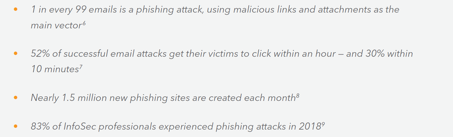
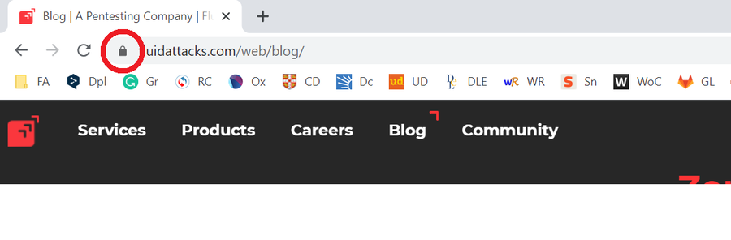

:slug: phishing/
:date: 2020-03-20
:subtitle: Sharing at least a modicum about phishing attacks
:category: techniques
:tags: social engineering, information, web, software, cybersecurity, business
:image: cover.png
:alt: Photo by Glen Hooper on Unsplash
:description: The title of this blog post refers to a new mindset suggested for many organizations—in their business security—in the face of the challenges that different forms of phishing attacks mean to them. Here we give some general ideas about phishing hoping to contribute to its prevention.
:keywords: Social Engineering, Information, Web, Software, Cybersecurity, Business
:author: Felipe Ruiz
:writer: fruiz
:name: Felipe Ruiz
:about1: Technical writer
:about2: Behavioral scientist.
:source: https://unsplash.com/photos/iK1G8rt2UAw

= Trust Nothing, Verify Everything

The current global situation with the coronavirus or `COVID-19`
has led many of us to respond with our work from home.
Amidst so much uncertainty,
there are many of us who could be looking for reliable information
on the progress of this pandemic, on what symptoms and tests are available,
and how we can protect ourselves and our families.
link:https://time.com/5806518/covid-19-scams/[It is claimed that this is being exploited by scammers],
and one of their methodologies may easily be phishing,
which we will discuss below.

Phishing can be understood as a social engineering tactic
in which link:https://www.cpni.gov.uk/system/files/documents/63/b4/Phishing_Attacks_Defending_Your_Organisation.pdf[messages persuade the user to follow fraudulent web routes],
to open attachments, or to reply to messages.
link:https://www.dhs.gov/sites/default/files/publications/2018_AEP_Vulnerabilities_of_Healthcare_IT_Systems.pdf[All this generally to extract sensitive information].
It is one of the most effective cyber threats,
posing risks to government, industry, and all types of users.
Millions of data breaches have resulted from the action of phishing.
And link:https://arxiv.org/ftp/arxiv/papers/1908/1908.05897.pdf[billions of dollars are lost every year].

This term 'phishing' apparently originated in `1996`
when hackers stealing data from American accounts took
link:https://arxiv.org/ftp/arxiv/papers/1908/1908.05897.pdf["emails as 'hooks' to catch their 'fish' from the 'sea' of internet users"].
Victims end up revealing confidential information about themselves,
someone else, or some entity to which they have access.
Such information may include passwords, bank account information,
link:https://www.researchgate.net/publication/221166492_Decision_strategies_and_susceptibility_to_phishing[credit card numbers and others].

Currently the attackers are going beyond emails.
They are also making considerable use of social networks,
link:https://www.akamai.com/us/en/multimedia/documents/white-paper/phishing-is-no-longer-just-email-its-social-white-paper.pdf["instant messaging applications, and online file-sharing services"].

Beyond the extraction of information,
link:https://www.cpni.gov.uk/system/files/documents/63/b4/Phishing_Attacks_Defending_Your_Organisation.pdf[malware] (such as [inner]#link:../ransomware/[ransomware]#)
can also be installed through these attacks.
The attacker can then request money transfers
or link:https://www.dhs.gov/sites/default/files/publications/2018_AEP_Vulnerabilities_of_Healthcare_IT_Systems.pdf[initiate unauthorized financial transactions].
She can also lead to involuntary collaboration by the recipient
link:https://www.researchgate.net/publication/221166492_Decision_strategies_and_susceptibility_to_phishing[to commit a scam] within a company
(perhaps link:https://www.akamai.com/us/en/multimedia/documents/white-paper/phishing-is-no-longer-just-email-its-social-white-paper.pdf[the simplest means of entry]).

.taken from link:https://www.akamai.com/us/en/multimedia/documents/white-paper/phishing-is-no-longer-just-email-its-social-white-paper.pdf[Akamai's] report. For other reports, visit link:https://docs.apwg.org/reports/apwg_trends_report_q4_2019.pdf[APWG] and link:https://www.avanan.com/hubfs/2019-Global-Phish-Report.pdf[Avanan]

Fraudulent emails—link:https://www.researchgate.net/publication/221166492_Decision_strategies_and_susceptibility_to_phishing[as part of a *semantic attack*]—
ask people for sensitive information to be revealed on fraudulent websites
but link:http://citeseerx.ist.psu.edu/viewdoc/download?doi=10.1.1.73.5245&rep=rep1&type=pdf[with the appearance of authentic ones].
So, if you are a Playstation user, for example,
you may receive a supposed email from them
presenting a false version of their website
so that you can enter your credentials there.
A good graphic design makes the user believe
that the information is requested from a legitimate
and recognized organization or brand.
When in fact link:https://www.researchgate.net/publication/221166492_Decision_strategies_and_susceptibility_to_phishing[it is the creative work of a con artist].
A site link:https://www.dhs.gov/sites/default/files/publications/2018_AEP_Vulnerabilities_of_Healthcare_IT_Systems.pdf[run by him or her].

Wait a minute, what do you mean by a *semantic attack*?

According to link:https://www.researchgate.net/publication/221166492_Decision_strategies_and_susceptibility_to_phishing[Downs, Holbrook, and Cranor (2006)],
computer security attacks can be divided into:
*physical*, *syntactic*, and *semantic*.
The first are aimed at the physical infrastructure of systems and networks.
The second are directed at software.
And the third, which is where we include phishing, are aimed at people.
*Semantic attacks* are oriented to extract benefits
from the way we humans interact with computer systems
and the interpretation we make of messages.

Phishing can be quite cheap. Scams usually last a few days.
Its infrastructure is then free of costs
link:http://citeseerx.ist.psu.edu/viewdoc/download?doi=10.1.1.73.5245&rep=rep1&type=pdf[“imposed by many e-commerce trust systems”].
Malicious individuals can easily acquire
the necessary phishing kits from underground sites.
Tens of thousands of those kits
developed by mixing HTML and PHP are available today,
living for about link:https://www.akamai.com/us/en/multimedia/documents/white-paper/phishing-is-no-longer-just-email-its-social-white-paper.pdf[36 hours or so before being detected and deleted].

In addition, link:https://www.researchgate.net/publication/322823383_Phishing_-_challenges_and_solutions[phishers can be difficult to detect]
since they succeed in hiding the location of their servers.
They have also begun to create networks of attackers,
with each one doing a part of the attack.
Sometimes even one of them just creates the tools,
and ends up recruiting inexperienced phishers to collect all the information,
be labeled as guilty, and not get any benefits.
That way, the real phisher could pass as undetected.

== Some types of phishing and techniques

The attack can be individualized. So we're talking about ‘*spear phishing*.’
The attacker collects (from profiles and blogs, for example)
and uses information about a particular potential victim.
While it can be a user, it can also be a group of employees
link:https://www.researchgate.net/publication/221166492_Decision_strategies_and_susceptibility_to_phishing[from certain areas in an organization].

Another form of phishing is link:https://www.dhs.gov/sites/default/files/publications/2018_AEP_Vulnerabilities_of_Healthcare_IT_Systems.pdf[working with widespread information].
In this case the attack network is much wider,
hoping that among so many,
at least some recipients will fall into the trap.

The criminal, link:https://www.cpni.gov.uk/system/files/documents/63/b4/Phishing_Attacks_Defending_Your_Organisation.pdf[through persuasive and realistic messages],
may lure the user by promising certain benefits
(e.g., money, free products, job opportunities)
or may simply force the user with specific threats.
Always link:https://arxiv.org/ftp/arxiv/papers/1908/1908.05897.pdf[intending to provoke quick and impulsive decisions in the person].
The attacker may seek link:https://www.dhs.gov/sites/default/files/publications/2018_AEP_Vulnerabilities_of_Healthcare_IT_Systems.pdf[to arouse fear, urgency, duty, greed or curiosity].

There is also evidence of a type of link:https://www.dhs.gov/sites/default/files/publications/2018_AEP_Vulnerabilities_of_Healthcare_IT_Systems.pdf[phishing called *whaling*].
In this case, rich and powerful individuals are targeted.
Sometimes, contrary to attacking them directly,
their identity and authority is used to extract financial information
or funds from the organization they belong to.
Alternatively, the use of other people's identities
can also involve those of trusted people
such as family members, colleagues or friends.

Messages from phishers can have significant narrative force
and connect with the reader through surprise.
When the message is very long, the receiver may end up paying more attention
link:http://citeseerx.ist.psu.edu/viewdoc/download?doi=10.1.1.73.5245&rep=rep1&type=pdf[to the characteristics of the design].
Sometimes phishers use images from a legitimate hyperlink
link:http://people.ischool.berkeley.edu/~tygar/papers/Phishing/why_phishing_works.pdf[to direct us to a different, corrupt site].
Other times they use fraudulent browser windows
next to or above the legitimate ones.

== Towards phishing prevention

Some users fail to distinguish between legitimate and fraudulent `URLs`,
and as link:http://people.ischool.berkeley.edu/~tygar/papers/Phishing/why_phishing_works.pdf[Dhamija, Tygar, and Hearst (2006)] illustrate,
they may take www.ebay-members-security.com as belonging to www.ebay.com.
Or they may be misled by character substitutions such as www.paypai.com,
and www.paypa1.com, instead of the original www.paypal.com.

Many users do not know or do not understand
how the security indicators in web browsers work.
As with the closed padlock icon, in this case in Chrome
(in another browser it could be located elsewhere).
This lock indicates that the website we are on
was delivered securely by `SSL` (Secure Sockets Layer). A cryptographic protocol
link:http://people.ischool.berkeley.edu/~tygar/papers/Phishing/why_phishing_works.pdf["used to provide authentication and secure communications over the Internet"].

.security indicator on Chrome

A system can be well equipped with firewalls, certificates,
and encryption and authentication mechanisms,
and phishing can be successful
because of the user's knowledge, attention, and decision-making.
From here it is then suggested a greater understanding
of the human and situational factors
related to the success of phishing attacks.

In addition to technical support,
it is intended in many organizations to give guidance to users and employees.
The idea of seeking help
when a strange situation arises should be strengthened.
And establish action plans in the presence of suspected phishing attacks.

In conclusion, and oriented towards a prevention of phishing attacks,
here are just some of the tips you will find in the documents
(which we recommend you review)
from link:https://www.dhs.gov/sites/default/files/publications/2018_AEP_Vulnerabilities_of_Healthcare_IT_Systems.pdf[DHS] and link:https://www.cpni.gov.uk/system/files/documents/63/b4/Phishing_Attacks_Defending_Your_Organisation.pdf[CPNI]:

- Check if message subjects are generic.

- Consider that those messages may show unusual spelling and grammar errors.

- Have as a key what type and amount of information is being requested.

- Be careful with messages that request urgent action.

- If possible, try to contact the sender by another means of communication
to verify the message.
