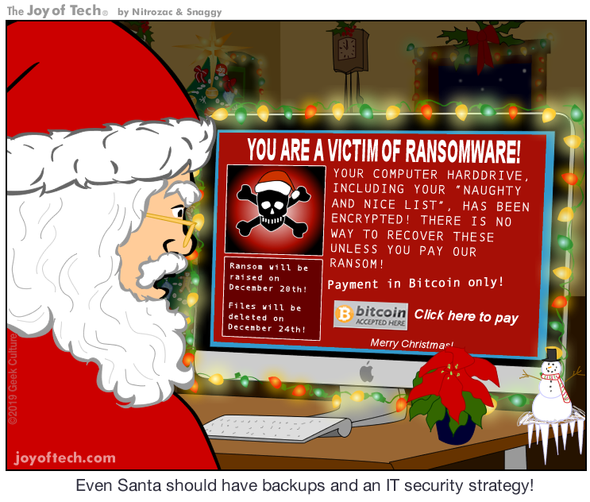
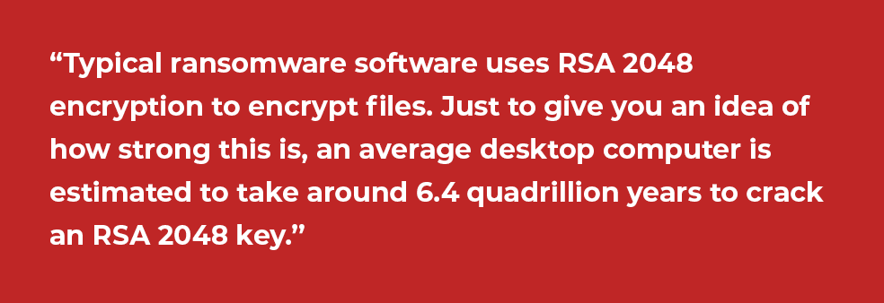
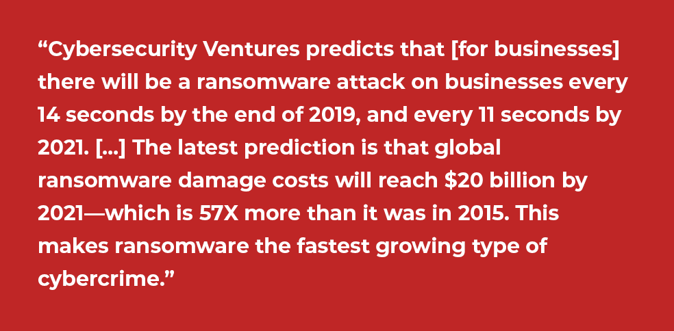

:slug: ransomware/
:date: 2020-02-03
:subtitle: Some pieces of information about ransomware attacks
:category: attacks
:tags: software, security, vulnerability, hacking, mistake
:image: cover.png
:alt: Photo by Sharon McCutcheon on Unsplash
:description: Attacks by ransomware have affected from simple individual users to small, medium and large companies, universities, and even government entities. All this in both developing and developed countries. Affecting mainly Windows systems but also Mac and Linux. In short, everyone could be a target!
:keywords: Software, Security, Vulnerability, Hacking, Mistake, Information
:author: Felipe Ruiz
:writer: fruiz
:name: Felipe Ruiz
:about1: Technical writer
:about2: Behavioral scientist.
:source: https://unsplash.com/@sharonmccutcheon?utm_source=unsplash&utm_medium=referral&utm_content=creditCopyText

= Your Files Have Been Encrypted!

When we talk about *ransomware* we refer to a very popular kind of malware.
A malicious software that being on your computer
(also on your mobile device)
is capable to encrypt some of your important files (cryptor ransomware),
to deny you access to them,
or block your operating system completely (locker ransomware).

After having completed that task, the infectious program displays a message,
demanding a ransom that you have to pay
in order to then recover the files, or restore normal activity on your computer.

More than a virus designed to steal information or for simple mischief,
ransomware is primarily aimed at making money.
We’re talking about a process of digital extortion,
which could be in some cases easy to use (some software easy to get),
even when the attacker’s skills are low.

Beyond the ransom that some subjects,
mainly organizations, pay to the attackers, some costs can be mentioned,
such as data destruction, productivity losses, system restoration,
reputation damage, and indispensable employee training.

.on link:https://www.geekculture.com/joyoftech/joyarchives/2668.html[GeekCulture]

There was a first ransomware case reported in 1989
with a trojan called PC Cyborg, or +AIDS+,
spread with 5¼ floppy discs to different countries
and that once installed on victim’s computer,
according to link:https://www.welivesecurity.com/2015/09/18/evolution-ransomware-pc-cyborg-service-sale/[Mendoza],
“hid the folders and encrypted the names of all the files on the C drive,
rendering the system unusable.”
After that, the software required $189 to be paid
to regain access to the system.

Almost a decade and a half later,
with a more developed Internet and cloud computing,
and with a better encryption method,
some cases were reported in Russia.
Mainly of them with the link:https://en.wikipedia.org/wiki/PGPCoder[PGPCoder]
and some of its variants which, after encrypting some specific files,
requested payments to some accounts
(see also about link:https://securelist.com/your-money-or-your-system-registry/30084/[Krotten] and link:https://www.secureworks.com/research/cryzip[Cryzip]).

Those were simple attacks compared to what we’re seeing today
with software like link:https://www.trendmicro.com/vinfo/us/threat-encyclopedia/malware/ransom_locky.a[Locky],
link:https://www.trendmicro.com/vinfo/us/threat-encyclopedia/malware/TROJ_CRILOCK.AE/[CryptoLocker], link:https://www.trendmicro.com/vinfo/us/threat-encyclopedia/malware/TROJ_CRYPWALL.D/[CryptoWall], link:https://www.trendmicro.com/vinfo/us/threat-encyclopedia/malware/ransom_crypsam.b[SamSam], link:https://www.trendmicro.com/vinfo/us/threat-encyclopedia/malware/ransom_petya.d[Petya], link:https://www.trendmicro.com/vinfo/us/threat-encyclopedia/malware/ransom_cerber.a[Cerber], link:https://www.trendmicro.com/vinfo/us/threat-encyclopedia/malware/ransom_jigsaw.i[Jigsaw] and link:https://www.trendmicro.com/vinfo/us/threat-encyclopedia/malware/Ransom_WCRY.SM/[WannaCry].

Last year the link:https://www.bbc.com/news/business-48661152[BBC]
reported a case of Norsk Hydro. A Norwegian aluminium producer,
which was hit with ransomware on some 20,000 computers.
It forced many of their lines of work to resort again to pencil and paper.
However, the company never wanted to pay the attackers.

Malwarebytes in August 2019 gave a link:https://resources.malwarebytes.com/files/2019/08/CTNT-2019-Ransomware_August_FINAL.pdf[report],
sharing information such as:

- A 365 percent increase over the last year for business ransomware detections,
with attackers more focused on higher amounts of money.

- An increase in the frequency of attacks targeting cities and municipalities
(e.g., Baltimore, Georgia, and Florida).

- In terms of the regions most affected,
almost 50 percent of all ransomware detections occurred in North America,
followed by Europe, the Middle East, and Africa.

- United States is the leader, with Texas, California, and New York
as “the top three states infected with ransomware.”

For new tendencies in ransomware look at this link:http://techgenix.com/ransomware-threats-next-level/[post].
And see also some information that [inner]#link:../cost-cybercrime-i/[Arango]# gave us.

== Procedure

Now, let’s talk about the procedure of ransomware attacks,
mainly oriented to a cryptor ransomware.

There must be an *_infection_* at first,
i.e. when the software runs on a computer after it has been downloaded.
This can occur thanks to the spread of ransomware
through different _vehicles of infection_
—some of which rely on social engineering tactics
(read more about it link:https://www.csoonline.com/article/2124681/what-is-social-engineering.html[here]) — such as:

- Phishing email or spam,
with attachments in an email
that are made to look reliable and attractive to open,
usually sent by botnets and sometimes targeted to specific, wealthy audiences.
[inner]#link:../attacking-weakest-link/[Gutierrez]# had already mentioned something related to phishing in our blog.

- Downloads from compromised or malicious websites.

- Malvertising: malicious advertising present on appropriate websites
and on social networks.

- Infected USBs.

The victim can also be directed to some websites
that contain malware called Exploit Kits.
Those kits act as abusers or exploiters of vulnerabilities,
scanning the victim’s computer looking for vulnerabilities
such as unpatched or outdated applications,
and then automatically installing ransomware.

After the infection, the ransomware contacts the command and control server
managed by the attackers to generate the keys required for data encryption.

The *_backup_* files and folders are then located by ransomware
from the victim’s computer to prevent restoration processes in the future.

Later it's the *_file encryption_* process of some of the victim's files,
who loses access to them.
Those files are mainly documents, spreadsheets, and images
that for the user or the infected company have a high relevance value,
and for which attackers can demand a considerable amount of money.
That encryption is usually desired
due to the difficulty that implies cracking it,
that is, obtaining passwords and saving files.

.by link:http://cdn2.hubspot.net/hubfs/241394/Ransomware-Hostage-Rescue-Manual.pdf[KnowBe4]

Finally, the victim is notified of the instructions to follow
for the ransom *_payment_* and the recovery of the files.
Although it’s not possible to access the encrypted files,
the system is able to perform the following necessary steps.

Attackers are paid online through various methods.
The typical one has been link:https://bitcoin.org/en/[Bitcoin],
acting as a global digital currency,
without connections to financial institutions,
and providing anonymity to the sending and receiving addresses.

Failure to pay at any given time
may lead to the gradual or immediate removal of the files,
or to the increase of the ransom.

== Defense

Related to the defense we could roughly say things like:

If your system is suspected of being infected,
separate it from others in your network
and from storage devices to avoid spreading.

When being infected,
from the image and the instructions that the ransomware gives you,
take advantage and with the necessary help
identify which ransomware is being used.

You can inform the authorities (recommended by the FBI)
and perhaps get support for a counterattack
with possible disinfection and malware removal.

Some websites provide information
on the possibility of removing ransomwares or decrypting files.
You should be aware that some of them can also be scams.
See link:https://www.nomoreransom.org/[The No More Ransom] project.

If you have them, use backups (copies of your files) to restore the system.
Or, sadly but effectively, so that no malware remains,
simply clean out the system storage and reinstall it from scratch.

Oops! Obviously you can pay the ransom, but it's not recommended.
It doesn't guarantee data recovery,
and is considered a way to strengthen ransomware business,
and a boost for future developments and attacks.

.As link:https://cybersecurityventures.com/global-ransomware-damage-costs-predicted-to-reach-20-billion-usd-by-2021/[Steve Morgan] said a few months ago

== Prevention

From +Fluid Attacks+, more interested in giving you prevention tactics,
so that you're prepared for attacks in a world saturated with cybercrime,
we share the following:

In order to have fewer vulnerabilities,
those that cybercriminals learn about
and tend to scavenge to install ransomware,
your operating systems need to be updated and patched frequently.

Keep your antivirus software in action,
as well as programs that give you threat notifications,
even while surfing the web,
to avoid websites where ransomware might be located.

Also, get in the habit of staying away from suspicious links,
and from installing and granting administrative privileges to software
you don't know about its functionality on your systems.

Of course, be careful with emails you receive from unknown sources
and their links and attachments.

It is vitally important
that you constantly maintain an _offline_ backup of your files
so that they are safe whenever you are attacked.

And don't forget that here at +Fluid Attacks+
we can identify and report
the vulnerabilities of your organization's systems and networks,
with our penetration testing service.
#link:../web/contact-us/[Simply get in touch with us!]#
