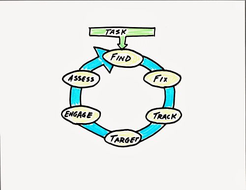

:slug: red-team-exercise/
:date: 2019-09-18
:category: documentation
:subtitle: What is a Red Team exercise?
:tags: security, testing
:image: cover.png
:alt: Foosball red vs blue. Photo by Stefan Steinbauer on Unsplash: https://unsplash.com/photos/va-B5dBbpr4
:description: This blog will provide information on a Red Team exercise. It will give the reader a general context about what a Red Team does and the main strategy used during a Red Team exercise. It will also detail the benefits of a Red Team exercise for the customer.
:keywords: Redteam, Pentesting, Attack, KillChain, Hacking, Bussiness.
:author: Anderson Taguada
:writer: anders2d
:name: Anderson Taguada
:about1: Software Engineering undergrad student
:about2: "Test" -Anonymous Tester

= Red Team exercise

Red Team refers to a team of professional hackers
that attempts to access a system through simulating a cyberattack.
During a Red Team exercise each team member plays a specific role
while the team, as a whole,
uses offensive strategies,
a variety of techniques,
and tools in order to weaken a system.

== Red Team--The Concept

In cybersecurity, a Red Team's knowledge,
skills, and abilities go beyond those of a pentester
whose role is to search, find, and report system vulnerabilities.
A Red Team also simulates a real attack by assuming an adversarial role.

== Divide and Conquer

Red Team members possess different link:https://www.tutorialspoint.com/ethical_hacking/ethical_hacking_skills.htm[hacking skills],
in order to simulate a real attack.
A real attack may be structured and divided,
with the attackers focusing on specific activities to achieve success.
Therefore, in a Red Team, you will find team members with the following skills:

.Possible roles in a Red Team via link:https://medium.com/@redteamwrangler/how-do-i-prepare-to-join-a-red-team-d74ffb5fdbe6[Medium.com].
image::skillredteam.png[Possible roles in a Red Team via Medium.com.]

Regarding the information above the above,
we spoke with Andres of +Fluid Attacks+,
When we asked him
about the Red Team exercise done by +Fluid Attacks+, he said:
[role="fluid-qanda"]
  . "First, the Red Team propose hacking objetives.
  For example: escalate privileges, modify system files or install backdoor
  to do it. We use the kill chain strategy"

Take a look at this video from +Fox9+ about Red Team exercise.

++++

<iframe width="560" height="315" src="https://www.youtube.com/embed/YIV0xvatX0M"
frameborder="0" allowfullscreen></iframe>

++++

== What is Kill Chain?

Kill Chain is a military term
to describe the steps in launching an attack.
One of its model is the +F2T2EA+
and includes the following phases:<<r3, [1]>>

. *Find*:  Identify a target
using surveillance, reconnaissance data or via intelligence gathering.

. *Fix*: Fix the target's location.
Obtain specific coordinates for the target either
from existing data or by collecting additional data.

. *Track*: Monitor the target's movement.
Keep track of the target until either a decision is made not to engage
the target or the target is successfully engaged.

. *Target*: Select an appropriate weapon or asset
to use on the target to create desired effects.
Apply command and control capabilities
to assess the value of the target and the availability
of appropriate weapons to engage it.

. *Engage*: Apply the weapon to the target.

. *Assess*: Evaluate the effects of the attack,
including any intelligence gathered at the location.

.+F2T2EA+ - The Kill Chain via link:http://myarick.blogspot.com/2014/02/f2t2ea.html[Biz -n- Seen Blog].

== Cyber Kill Chain

This term was adopted by link:https://www.lockheedmartin.com/en-us/index.html[Lockheed Martin]
and its incident team to prevent cyber attacks.
Cyber Kill Chain has the following phases:

. *Reconnaissance* : Learning about the target
using a variety of different techniques.

. *Weaponization* : Combining your vector of attack with a malicious
payload.

. *Delivery* : Transmitting the payload via a communications vector.

. *Exploitation* : Taking advantage of a software or human weakness
in order to get your payload to run.

. *Installation* : The payload establishes the persistence of an
individual host.

. *Command & Control (C2*) : The malware calls home, providing attacker control.

. *Actions on Objectives* : The bad actor steals or does whatever he was
planning on doing.

.Cyber Kill Chain Phases via link:https://www.lockheedmartin.com/en-us/capabilities/cyber/cyber-kill-chain.html[Lockheed Martin].
image::cyber-kill-chain.png[Cyber Kill Chain Phases]

== Cyber Kill Chain 3.0

This is an update of the cyber kill chain
for better defense by link:https://www.watchguard.com/es/wgrd-about/leadership/corey-nachreiner[Corey Nachreiner]
Watchguard Chief Technology Officer.

Cyber Kill Chain 3.0 has the following phases<<r1, [2]>>:

. Recon

. Delivery

. Exploitation

. Infection

. Command & Control - Lateral Movement & Pivoting

. Objective/Exfiltration.

As you can see, version 3.0 has minor changes
designed for better security defense,
but those are not unique strategies, link:https://www.helpnetsecurity.com/2015/02/10/kill-chain-30-update-the-cyber-kill-chain-for-better-defense/[HelpNetSecurity.]
[role="fluid-qanda"]
 . "Security professionals have differing opinions
 on the effectiveness of the kill chain as a defense model.
 Some love it, pointing out how several successful
 infosec teams use it, while others think it's lacking crucial details,
 and only covers a certain type of attacks.
 I think there is truth to both views,
 so I'd like to propose three simple steps to make the kill chain even better,
 let's call it +Kill Chain 3.0+."

Therefore, Kill Chain is not the only option.
You can also adapt your attack link:https://en.wikipedia.org/wiki/Military_strategy[strategy].

== Customer Benefits

Then, what are the benefits on the client side?
Simply put, Red Team's cyberattacks simulations
expose the weaknesses within a client's systems or applications
so that a client can better protect its information from a real attack scenario.

The client can then fix, build, design, and maximize its cybersecurity<<r4, [3]>>;
this is why the link:https://en.wikipedia.org/wiki/Blue_team_(computer_security)[Blue Team] exists.
Like Red Team, Blue Team also has its defensive strategies,
but we will save that discussion for a future post.

== Conclusions

According to link:https://medium.com/@redteamwrangler/how-do-i-prepare-to-join-a-red-team-d74ffb5fdbe6[Medium.com],
a Red Team member must have an offensive mindset.
For this reason, "+CTFs+, wargames, or pen testing labs
are a great way to exercise offensive mindset"<<r5, [4]>>.
At +Fluid Attacks+, every new member
trains in hacking and programming challenges
to check and assess their level of offensive mindset.

Our current talents are in the link:https://www.wechall.net/country_ranking/for/31/Colombia[TOP10 for Colombia],
and in fact, some of them are in the link:https://www.wechall.net/ranking[TOP100 Worldwide].

== References

. [[r1]] link:https://www.helpnetsecurity.com/2015/02/10/kill-chain-30-update-the-cyber-kill-chain-for-better-defense[Kill Chain 3.0: Update the cyber kill chain for better defense].

. [[r2]] link:https://sci-hub.tw/https://ieeexplore.ieee.org/abstract/document/8406561[Red Team Exercises].

. [[r3]] link:https://en.wikipedia.org/wiki/Kill_chain[Kill chain].

. [[r4]] link:https://resources.infosecinstitute.com/red-teaming-overview-assessment-methodology/#gref[Red Teaming Overview, Assessment & Methodology].

. [[r5]] link:https://medium.com/@redteamwrangler/how-do-i-prepare-to-join-a-red-team-d74ffb5fdbe6[How to prepare to join a Red Team].
