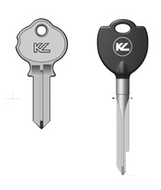
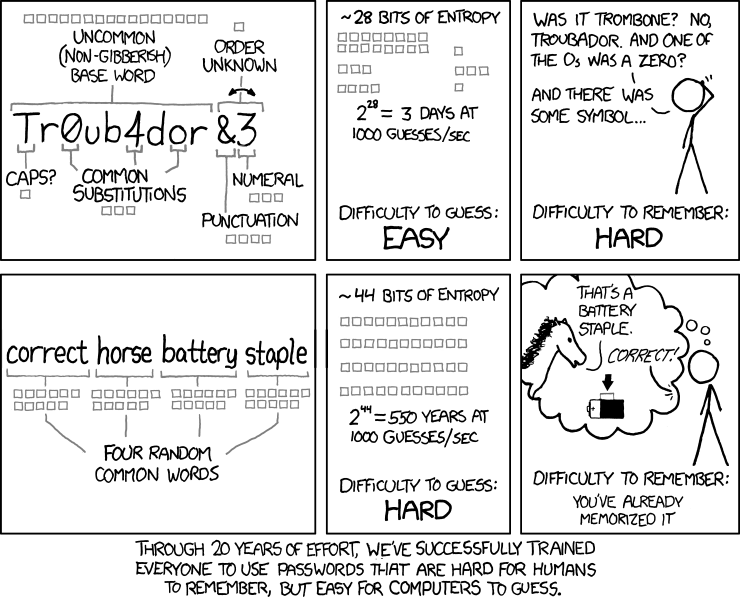

:slug: requiem-password/
:date: 2018-03-07
:subtitle: Why passphrases are better than passwords
:category: identity
:tags: password, credential, security
:image: cover.png
:alt: Rusty lock
:description: A comparison between having weak or complicated passwords that expire periodically versus having a single strong passphrase, possibly used in conjunction with password managers. We also discuss the memorability of complicated passwords vs randomly generated passphrases with diceware.
:keywords: Passphrase, Password, Security, Cracking, Policy, Diceware
:author: Rafael Ballestas
:writer: raballestasr
:name: Rafael Ballestas
:about1: Mathematician
:about2: with an itch for CS
:source: https://unsplash.com/photos/8B0SIUBeE0g

= Requiem for a p455w0rD

What would you rather have at your home door:
a simple, weak key that needs to be changed every other week,
or a one-time-setup, state-of-the-art, virtually unpickable cruciform key?

.Lock key comparison via link:http://www.locksmithledger.com/article/10837014/locksmithing-etc-jan-2013[Locksmith Ledger].

That's just the difference
between rotating short passwords vs
having one good passphrase:
the first may be convenient and easy to carry around,
and easily replaceable if lost,
while the latter might be difficult to wield at first,
but once you get used to it,
makes an unbreakable defense.

Now, the password is not dead,
as some folks at link:https://news.microsoft.com/features/whats-solution-growing-problem-passwords-says-microsoft/[Microsoft] claim
in order to favor other kinds of authentication.
A long password with a healthy mix of
upper- and lowercase letters and special symbols
is still pretty tough to guess or crack.
But they are hard to remember,
and that leads to frequent password forgets and resets.
Thus most people tend to resort to
short, easy to crack passwords.
See the 2017 link:http://templatelab.com/top-100-worst-passwords-of-2017/[Splash Data 100 worst passwords (`PDF`)]
to see the problem.
These are vulnerable to
link:https://en.wikipedia.org/wiki/Brute-force_attack[brute-forcing],
link:https://en.wikipedia.org/wiki/Dictionary_attack[dictionary attacks],
and [inner]#link:../storing-password-safely[rainbow tables]#,
to name a few of the ways they can be cracked.

In order to avoid these situations,
some organizations choose to implement
password policies that require users to
include special symbols or to
change passwords frequently.
But that is not without its problems,
either <<r1, ^[1]^ >>:
users tend to circumvent these impositions
in different ways, such as:

* replacing letters by similar numbers
(v.g. `hello` -> `h3110`, `tigger` -> `71gg3r`)
* reverting their old password back and forth (`qwerty` -> `ytrewq`)
* switching between simple passwords (`pass` -> `word`),
* altering a standard password (`password` -> `password1` -> ...),
* not avoiding it, thus getting a very complicated password,
but keeping it written down in a piece of paper (danger!).

Furthermore, with the plethora of distributed services around,
it is not uncommon for
a single person to have to deal with dozens of passwords,
leading to the reuse of the same weak ones,
which makes the situation even worse.

Possible solutions to the problem with many accounts are
[inner]#link:../multiple-credentials-begone/[Single-Sign-On services]#
and password managers such as link:https://keepass.info/[Keepass].
But these are sometimes infeasible,
for example to login to your computer,
since you cannot run any software beforehand.
And if you do use a password manager,
the main password to unlock it should be very strong
because if it falls, so do all others.
The same argument goes for encrypted files or disks and email.
In these mission-critical cases,
what you want is a 'passphrase'.

Like the name suggests,
a 'passphrase' is a sentence that you use to gain access,
just like a password.
Since they are usually much longer than password,
the mere number of them is considerably larger,
making them harder to guess or crack.
It's as simple as that.

Why? Consider this question:
how many words are there to choose from?
From an alphabet with 26 letters,
and allowing words from two to six letters,
we can make more than 12 million words.
However some of those wouldn't make sense,
such as `zzy` or `edls`,
so word dictionaries like the one above
avoid them and only take real english words.
The one used here is modest:
it contains only 7,776 words.

But that is enough when you combine them.
There are 7,776^2^ two-word passphrases, and so on.
Thus with merely five words we'd have
7,776^5^ which is around 28 quintillions (28 and 18 zeroes).
Assuming a trillion (1 and 12 zeroes) guesses per second,
such a passphrase would take about half a year to crack.
Append three zeros for each extra word, being conservative,
so a seven word passphrase would take about half a million years to crack.

You could argue that
you already have a password that is long enough.
But does it make any sense as a 'word'?
How random is it, to be safe from guessing attacks?
Is it easy to remember?
Most likely not,
that bear no relation to the word.
In contrast, passphrases are made up of regular words
which you can remember by linking them somehow.
This comic from `xkcd` sums it up:

.Passphrases vs passwords. Adapted from the original at link:https://xkcd.com/936/[xkcd].

As you see, you can use mnemonic techniques
to remember your passphrase,
even if it might seem absurd at first.
Try to do 'that' with extraneous symbols.
Research shows that even 56-bit codes
can be learned within 36 tries <<r2, ^[2]^>>
using a technique called 'spaced repetition'.
This also illustrates the problem with
difficult-to-satisfy password policies:
they force people to end up with
absurd, hard to remember passwords with
nonsensical number and letter combos.

By now you might be convinced that passwords are the way to go.
But it's not as simple as just grabbing any four words.
In order to beat attackers using dictionary and brute force attacks,
you want to make your passphrase as random as possible,
i.e., it should have a high 'entropy'.
Even if you choose some words that you think are random,
the inherent structure of language and of our brains
implies that we'd be fooling ourselves,
and that the chosen phrase is not as random as it might seem.

So how do I create a really random, strong passphrase?
Look for true real-word randomness.
The easiest way to go would be rolling a dice many times
writing down the results,
and make that into words
using a dictionary that maps sequences of dice rolls
to actual english words like this:

.Some words from a link:http://world.std.com/~reinhold/dicewarewordlist.pdf[`Diceware` dictionary].
----
26114 -> fluid
32236 -> hack
52416 -> rule
52133 -> risk
----

Thus if you roll first a 2, then a 6, ... and a 4,
the first word in your passphrase will be `fluid`.
Do this four to seven times and
your passphrase will be pretty strong.
No time to play dice? No problem.
There are plenty of `FOSS` solutions to
generate long, high-entropy passphrases
on link:https://github.com/search?p=2&q=diceware&type=Repositories&utf8=%3F[GitHub]
and link:https://getapassphrase.com/[some]
link:http://preshing.com/20110811/xkcd-password-generator/[online].

How often should they be rotated?
Truly randomly generated,
long enough passphrases
are virtually crack and guess-proof.
So you only need to protect them from
unauthorized sharing or theft.
In that case, we can extend
a fairly typical monthly renewal period
to, say, three to six months.
Using randomly generated passphrases
thus eliminates the issues of password recycling,
minor alterations, common words and guessability,
and has the advantages of superior security and memorability.

To illustrate this,
let us compare some typical authentication policies:

.Authentication policy comparison
[cols=5, options="header"]
|====
| Type
| Minimum length
| Variety
| Minimal example
| Time to brute-force

| Password
| 8 characters
| upper lower num special
| `Pas$w0rd`
| 9 hours

| Password
| 14 characters
| upper lower num special
| `Pas$w0rddddddd`
| 204 million (e6) years

| Passphrase
| 4 words x 4 letters
| non-random lower
| `fluid hacks rule risk`
| 41 quadrillion (e15) years

| Passphrase
| 4 words x 5 letters
| random lower
| `debased heron passes native`
| 343 septillion (e24) years
|====

Just the time to brute-force gives us an idea of
the relative strength of these sample password policies:
the first is essentially useless
since an unaware user can set very easy passwords.
Fourteen combined characters is not too bad, but
could be obtained via dictionary attacks
or guessing from user info.
Even a non-random, relatively short passphrase
is literally a billion (e9) times better,
but could still be guessed.
And a short, but highly entropic passphrase is a billion times better
than the last.

''''

Our concrete recommendation:
a randomly-generated, 44-bit
(the lowest setting in
link:https://getapassphrase.com/generate/[getapassphrase.com],
i.e. 4 or 5 words 3 to 8 letters in length)
beats any complicated password policy
and is easier to remember.
Change it every three to six months
at your discretion,
whatever makes your users happy.

Do keep in mind that
while passphrases have the advantages of
being harder to crack and
easier to remember than complex passwords,
you needn't use them for everything.
Regular, even easy passwords
still have their place and,
contrary to popular wisdom,
can be recycled and reused,
according to <<r3, [3]>>.
There is plenty of debate and
of course no consensus as to
what constitutes the best practice,
but now that you know both sides of the coin
you can choose what is most appropriate
for each situation.

== References

. [[r1]] link:https://queue.acm.org/detail.cfm?id=2422416[Cheswick, William (2012). 'ACM Queue' 10 (12).]

. [[r2]] link:https://www.usenix.org/system/files/conference/usenixsecurity14/sec14-paper-bonneau.pdf[Bonneau, J. and Schechter, S. (2014) Towards reliable storage
of 56-bit secretes in human memory.
'Proceedings of the 23^rd^ USENIX Security Symposium'.]

. [[r3]] link:https://www.microsoft.com/en-us/research/wp-content/uploads/2016/02/passwordPortfolios.pdf[Florencio, D et al. (2014). Password portfolios and the finite-effort user:
Sustainably managing large numbers of accounts.
'USENIX Security', August 20-22.]
