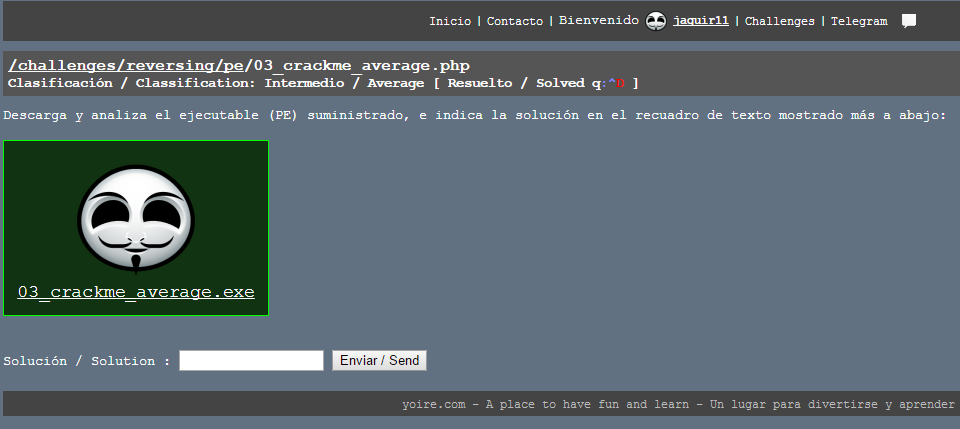
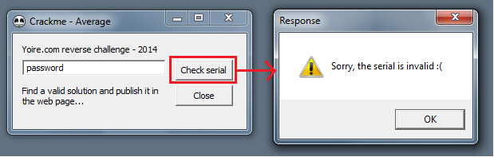
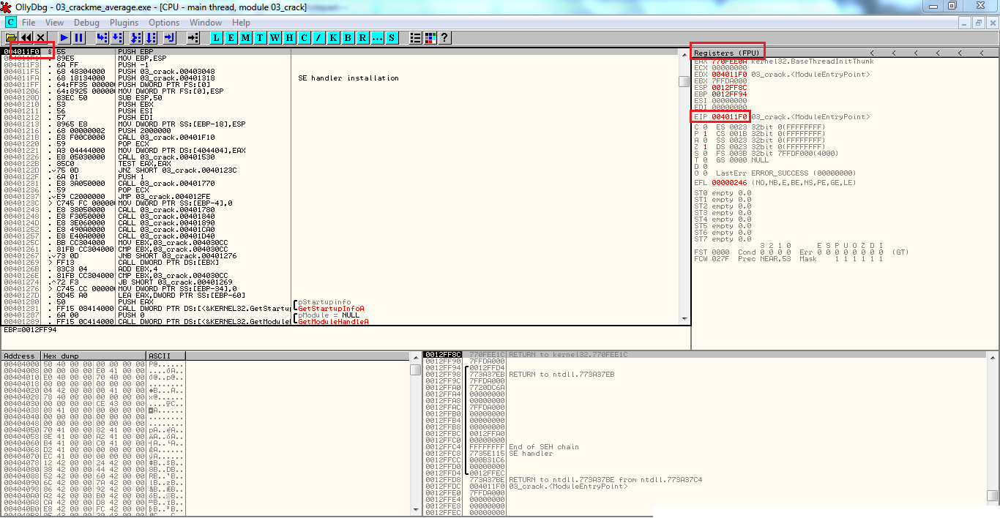
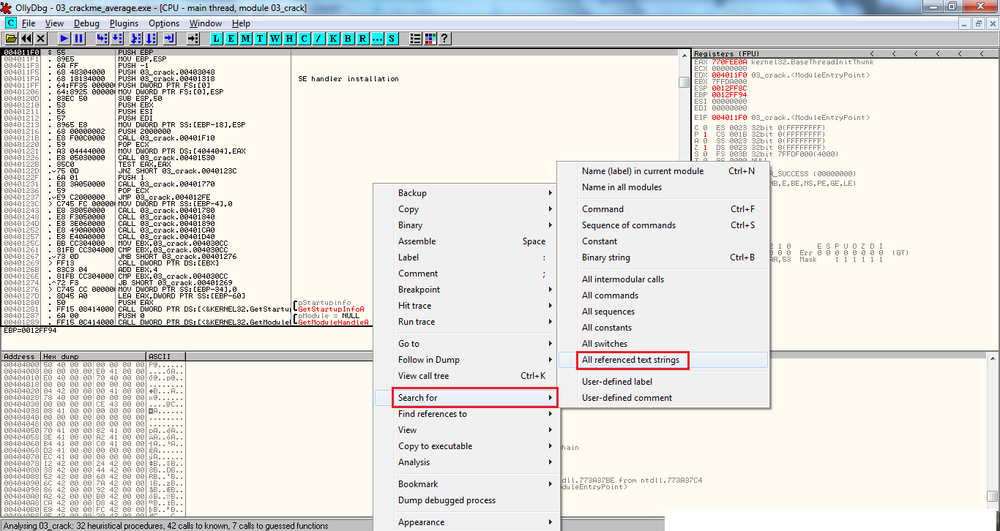
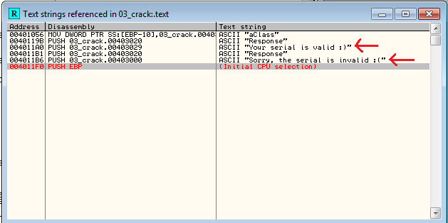
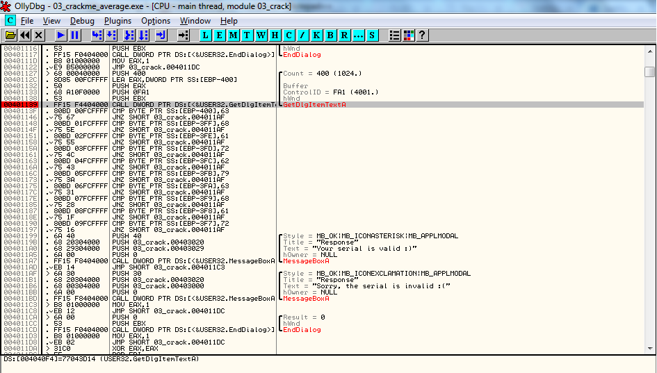
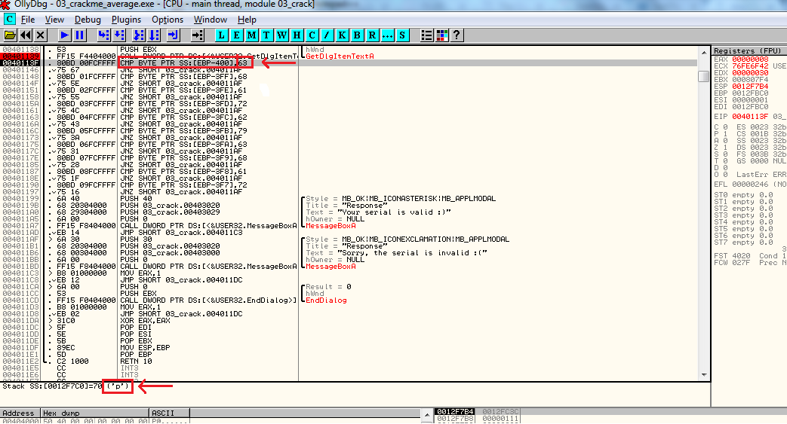
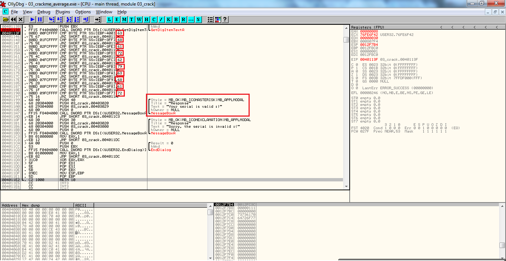
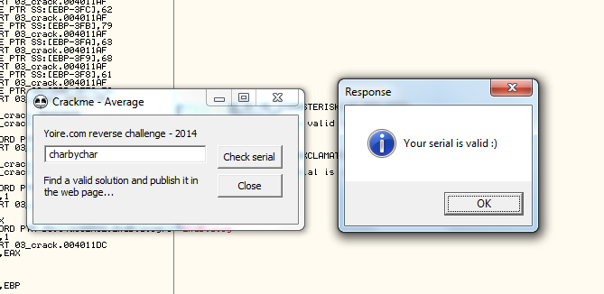

:slug: reversing-mortals/
:date: 2017-04-25
:category: attacks
:subtitle: Solving Yoire crackme average challenge
:tags: revert, challenge, engineering
:image: cover.png
:alt: Wrong red piece in white puzzle
:description: The world of hacking is pretty extense and it's difficult to know where to start. In this article we provide a first approach of one of the most common hacking applications: reverse engineering by solving a simple but educational cracking challenge using OllyDBG.
:keywords: Reversing, Reverse Engineering, Debugger, OllyDBG, Hacking, Assembler.
:author: Juan Aguirre
:writer: juanes
:name: Juan Esteban Aguirre González
:about1: Computer Engineer
:about2: Netflix and hack.
:source: https://unsplash.com/photos/5siQcvSxCP8

= Reversing for Mortals

It's hard to really know where to start when you're new to hacking.
When I first started to get into the hacking world
I came across something called Reverse Engineering,
the art of de-constructing some product followed by
a detailed analysis and revision of its composition and its inner workings.

Hacking is all about testing the limits.
My problem was that this was a complex subject and
not that easy to follow for a beginner.
Some would say it's for superior beings, hence this entry,
which is meant to help you understand how reversing works
and give you an incentive
to understand and really get into the world of reversing.

If you see or hear reversing anywhere
you will most likely see or hear assembly and debugger as well.
Assembly is a low level programming language
that can only do one thing at a time,
it's a bit complicated but understandable.
A debugger is a tool that will show you
the assembly code for an executable file.
Think of a network,
if you cut the network cable and look down it, it's like Wireshark.
Now, think of your computer, open it up and look down the `CPU`,
that's a debugger, it shows you what is really happening under everything.

To understand the basics of reversing,
we will take a look at a great challenge for beginners.

== Yoire Challenge: Crackme Average

Our task here is to obtain the serial for the executable file.

.Challenge Crackme Average on yoire.com

To accomplish our task we need a debugger.
The debugger we will be using is *OllyDbg*.
A complete installation guide and user manual can be found
at link:http://www.ollydbg.de/[the official OllyDbg] website.
Keep in mind that *Olly* cannot be used to reverse all executable files,
it focuses on binary code analysis.
As you run into more difficult reversing challenges,
you will learn to use other tools
either to complement *Olly* or to substitute it.

The first thing we need to do is understand
what the executable file was made to do.
To do this, download the .exe file on link:http://yoire.com/challenges/reversing/pe/03_crackme_average.php[the challenge website].
It's a good practice to keep a virtual machine to run the executable files,
since you don't know what they do,
the safe bet is to open it and run it in a controlled environment.
If you really trust the source of the file,
you can run it on your local machine at your own risk.

Once we run the executable,
we can see that it prompts us for a serial and gives us two options:
Check serial or close.
In order to understand what the program does
we will just enter any serial and check it.

.Result after checking an incorrect serial

After we enter an incorrect serial
we get the following message:
"Sorry the serial is invalid. :(".
You might think this doesn't help us at all
but in fact it gives us the starting point we need.

Let's open the executable file in *Olly*
and check out if assembly is as difficult as they say.

.exe file on OllyDbg

Once the file loads,
we can see that we have the registers on the top right,
the stack on the bottom right,
the hex dump on the bottom left
and the main debugging screen on the top left.
The "$" symbol shows us the entry point of the program.
In the registers we see `"EIP"`
which tells us what instruction is about to happen.
Think of it as a work bench,
if you want to work with something
you need to push it onto the bench.

In all the mess of instructions, where should I look?
Well, we know the program asks the user for input,
it then checks the input against a valid serial
and finally displays a message depending on the correctness of the serial.
So, if we find where it displays the message
we can look backwards
and try to find where it compares the input with the correct serial.
*Olly* has a great feature for this,
right-click on the main screen,
"Search for" - "All referenced text strings".

.Search for all referenced text strings

A new window pops up with the results.
The window contains all the strings that are referenced in the program.
Here we can see the message we set as our starting point
and also the message that is displayed when we enter the correct serial.

.Search for all referenced text strings

Debugging pretty much consists on setting breakpoints where we think are needed
and analysing the execution of the program before,
during and after the breakpoints.
So let's do this.

Click on the error message we saw before and hit enter,
this will take you to the location of the string reference
in the assembly code.
From here we need to scroll up carefully
and try to understand what's happening.
We see a lot of `CMP` immediately followed by a `JNZ`.
This is important because `CMP` compares two values
and `JNZ` jumps based on the result of that comparison.
`JNZ` will jump if the two values compared are not equal.
If we keep scrolling up, we see a function call in red "GetDigItemText". Bingo!
This is a function that retrieves the text associated with a control.
In our case the input we provided in the control box.
The program can then check the correctness of the input.

With time you need to learn to identify these key functions,
they allow you to set breakpoint where they need to be set
and obtain valuable information that will allow you to crack the exe.
We will go ahead and set a break point in that function.

.Setting breakpoints

With the breakpoint set, we can hit `F9` to run the program
until it reaches the breakpoint.
The program will halt at the GetDigItemText instruction
and wait for your instruction.
What we are really interested in are all the comparisons
it does immediately after.
If we hit `F8` to step over the instructions
and keep an eye out for what it compares against,
in the first `CMP`
we can see that it compares my first char 'p' with the hex 63.

.Check out the CMP!!

After the comparison we can note that the `JNZ` is taken.
Since the two values compared are not equal, `JNZ` is executed.
After the jump the program gives us the invalid serial message and exits.
Before we try another password
let's understand what the program is performing all the comparisons against.

.All the comparisons

We have the hex values: 63, 68, 61, 72, 62, 79, 63, 68, 61, 72.
And note that if the last jump is not taken
then we will land in the correct serial portion of the code.
Now all we need to do is pull out our handy link:http://www.asciitable.com/[ascii table]
and figure out the serial.
'c''h''a''r''b''y''c''h''a''r' we have our answer.
Let's test it out.

.Correct serial - Cracked!!

There we have it. Our first reversing!

Technology advances in a very fast manner
and with it grows the complexity of reversing.
Everyday more vulnerabilities are reported and patched,
developers find new methods of packaging their solutions
and new tools come out that are meant to make reversing near impossible.
You have to stay on top of it, read in order to gain new knowledge
and practice in order to apply and modify that knowledge
based on real life reversing situations.
