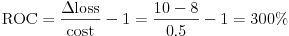
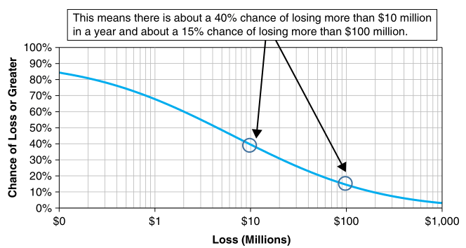

:slug: risk-indicator-roundup/
:date: 2019-05-15
:subtitle: A matter of taste
:category: philosophy
:tags: business, ethical hacking, risk
:image: cover.png
:alt: Choices. Photo by Nathan Dumlao on Unsplash: https://unsplash.com/photos/pMW4jzELQCw
:description: This blog compares risk indicators used in quantitative finance. Most of them have been discussed earlier in previous blogs, such as VaR, tVaR and LEC. We introduce the ALE, and compare them all giving their respective pros and cons. In the end, it is a matter of choice or we can just use them all.
:keywords: Risk, Probability, Choice, Measure, Quantify, Indicator
:author: Rafael Ballestas
:writer: raballestasr
:name: Rafael Ballestas
:about1: Mathematician
:about2: with an itch for CS
:source-highlighter: pygments
:source: https://unsplash.com/photos/pMW4jzELQCw

= Risk Indicator Roundup

What is the best risk indicator?
Bottom line: there is no "best", only different approaches to the same thing.
Ultimately, it's up to you.
Here we will show the pros and cons of each
risk indicator so you can make an informed decision.

== VaR

[inner]#link:../para-bellum/[Recall]# that Value at Risk (`VaR`)
measures the worst-case scenario in an uncertain return
by telling us  the endpoint beyond
which our losses will likely not go,
up to a certain degree of confidence,
in a definite period of time.
Thus a daily 1% `VaR` of $10 million means
the probability that you will lose more than
$10 million is 1%, which is the same as saying
that you are 99% confident that the losses
will not exceed $10 million.

Pros:

* Gives a good idea of how much to save in order
  to avoid bankruptcy in most (95%) cases.

* Is a well-established standard,
  used by most banks and a requirement
  per international banking regulations.

Cons:

* Says nothing about what might happen beyond the threshold.

* Is a single number, therefore, its expressiveness
  is rather narrow. It says nothing about what happens
  elsewhere with the distribution of returns.

== tVaR

While the `VaR` gives a worst-case scenario
with a certain confidence,
what if that confidence is broken, i.e.,
the `VaR` is breached? What can we expect?
That's precisely the
_tail_ value at risk tries to answer.
By using the [inner]#link:../great-expectations/[expected value]#
of a [inner]#link:../updating-belief/#mathematical-interlude[conditional probability]#,
it gives us, in a single number,
what would be expected if a worst-case scenario occurs.

There is no better way than this plot by
link:http://www.nematrian.com/TailValueAtRisk[Nematrian]
to summarize both `VaR` and `tVaR`.

.(t)VaR illustration
image::../para-bellum/tvar.png[(t)VaR illustration]

Pros:

* Prepares you for the worst of the worst.

* Single number, easy to compare or monitor over time.

Cons:

* Not easy to compute (involves an integral).

* Results can be overly pessimistic, thus
  impeding you from seeing the other side of the coin.

== ALE

This is a relatively new one.
Remember we discussed Return on Control (`ROC`)
to decide whether investing in a given defense is worth the hassle?

.Return on control

The change in loss was obtained from two simulated scenarios:
one with the control and another without it.
Both were obtained by "averaging out", i.e.
finding the [inner]#link:../great-expectations/[expected value]# of
a simulated distribution for the loss.

The Annualized Loss Expectancy (`ALE`) is related to such a computation
in that it is also obtained from a couple of expected, estimated values.
These estimated values are the expected number of ocurrences of an event
in a year (the Annualized Rate of Occurrence, `ARO`),
and the expected loss for a single ocurrence
(Single Loss Expectancy, `SLE`).
Thus, total = reps x single.
Too many acronyms for too little content:

.You don't want to ask Chandler about his Annual Net Usage Statistics!

Experts can estimate the ARO.
Suppose it is known that a data breach will most likely occur
at least once in 10 years.
The `ARO` for such an event is 1/10 = 0.1 events per year.
The `SLE` is to be estimated by your own experts.
How much would such a breach cost you?
Say, $100 million. Then the loss expected in every one of
those years is 0.1x100 = $10 million.
However, this rate will be fixed for each of the next ten years.
It is static and unlikely to be true
since risks and threats change daily.

Pros:

* Simple computation.

* Single number, thus easy to compare.

Cons:

* You're stuck with the one year period.

* Not very "realistic".

== LEC

The loss exceedance curve is a decidedly different one,
and one of our favorites at that.
We have already discussed it at length
in our
[inner]#link:../quantifying-risk[introduction to quantitative risk]#,
our general [inner]#link:../monetizing-vulnerabilities[Monte Carlo simulation article]#,
and gave an example
of implementing in [inner]#link:../quantitative-python[Quantitative Python]#.
In a nutshell, it's a graph that tells you
the probability of losing a given amount or more of money,
for any amount in a range.
It's like having all possible values-at-risk
for all confidence levels.
We believe the graph speaks for itself.

.Loss Exceedance Curve from link:https://www.howtomeasureanything.com/cybersecurity/[Hubbard et al.]

Pros:

* All the information you could want about losses in a single plot.

* Since it's a visual tool it's helpful
when you're considering a range of risks you're willing to take,
especially when it's combined with residual risk and risk tolerance curves.

Cons:

* Harder to compare since it's not a single number.

* Harder to obtain, since it involves simulations.

''''

Overall, single number risk indicators (`ALE`, `VaR` and `tVaR`) are good
for making quick comparisons and monitoring them over time.
In contrast, the `LEC` might allow you to make a more fine-grained
decision regarding how much risk you are willing to take vs.
how much you would have to lose in many different scenarios,
all in a single chart.

For ease of use, we'd say `ALE` is the winner.
However, we wouldn't expect its predictions to be the most accurate of the lot.
Also, its time period (one year) might be too much for
the fast-paced market we currently live in.
If you have to choose one single-number indicator,
we would recommend using `VaR`,
wich international banking regulations
(link:https://www.investopedia.com/terms/b/baselii.asp[Basel II]) use,
since the `tVaR` might be a tad too extreme.

In the end, it's your choice.
Or there might not be any choice to make at all.
Who says you cannot use them all at once?
If done well, they should not be contradictory, but complimentary.
Find out all you can about your investment,
use all the tools at hand, and then make the best decision possible
in terms of risk vs gain.
