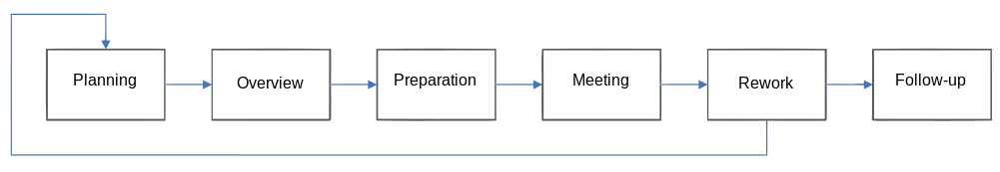
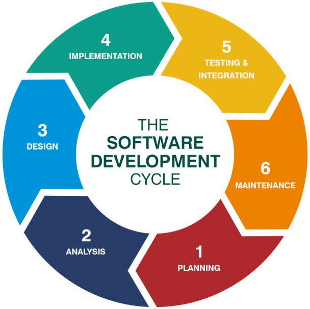
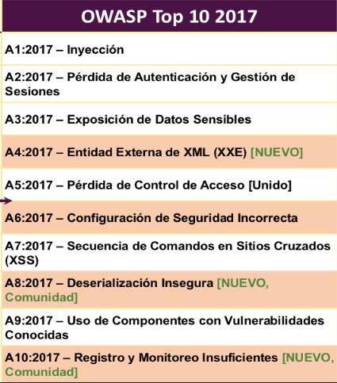
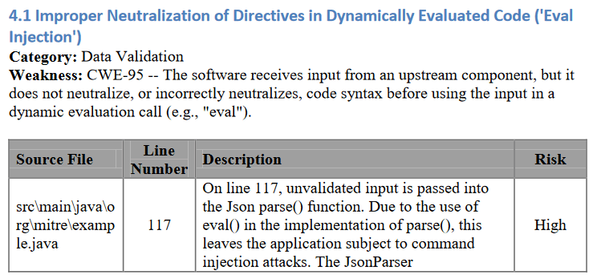
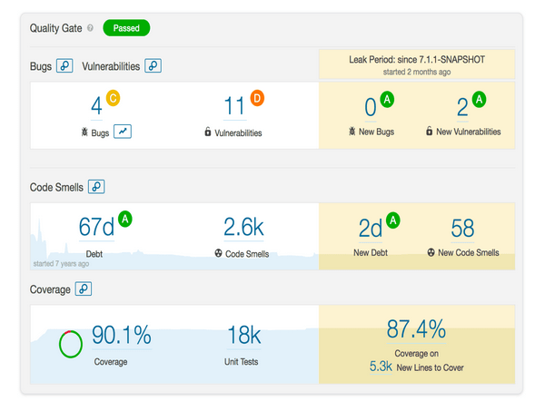

:slug: sastisfying-app-security/
:date: 2019-09-29
:category: documentation
:subtitle: An introduction to SAST
:tags: security, testing
:image: cover.png
:alt: Photo by NESA by Makers on Unsplash
:description: This blog will give an introduction about static application security test (SAST) to the readers, to have a general concept of what SAST is, We will mention how it works, the types, also some of its history and also some of the benefits of implementing in the projects.
:keywords: SAST, SDLC, Code, Automated test, Manual test, Vulnerabilities
:author: Kevin Cardona
:writer: kzccardona
:name: Kevin Cardona
:about1: Systems Engineering undergrad student
:about2: Enjoy life

= Sastisfying App Security

+SAST+ is a kind of white box test
in which a set of technologies is used
to analyze the source code, byte code or the application binaries
in search of known security vulnerabilities
that can be exploited by malicious users.

== A bit histoty

In the 1976 Michael E. Fagan explain in his paper
_Design and code inspections to reduce errors in program development
how to do the code review_, creating the world's first code review process.
The link:https://en.wikipedia.org/wiki/Fagan_inspection[Fagan inspection] is a formal process
of execution that involves several phases and participants
and that defines some entry and exit criteria
to start or end the process.

.Fagan Flow via link:https://www.secjuice.com/sast-isnt-code-review-fight-me/[secjuice.com]

Later in 1992 E.P. Doolan in his article
_Experience with Fagan's inspection method_
proposes the use of software that keep a database of the errors detected
and automatically scan the code for these errors,
being this the beginning of the use of automated tools.

== Software Development Life Cycle (SDLC)

is a serie of phases that must be followed
for the development of a software product,
in order to ensure that the quality, functionality and objectives
of the application meet customer expectations and development standards.

.Software development Life Cycle phases via link:https://www.synotive.com/blog/wp-content/uploads/2017/02/software-development-life-cycle.jpg[Synotive.com]

During the +SDLC+ is important to apply testing methodologies
that allow to identify security vulnerabilities in early stages of development
and resolve them quickly before the applications release.
These vulnerabilities can be found on websites as below:
. link:https://www.owasp.org/index.php/Category:OWASP_Top_Ten_Project[OWASP Top Ten Project]
. link:https://www.sans.org/top25-software-errors/[Top 25 Most Dangerous Software Errors]
. link:https://cwe.mitre.org/[CWE Common Weakness Enumeration]

.OWASP Top Ten Project via link:https://www.owasp.org/images/5/5e/OWASP-Top-10-2017-es.pdf[owasp.org]

By applying Static Application Security Testing +(SAST)+
we can detect and avoid most of the security vulnerabilities
listed in the previous links pages.

== How does SAST works?

It can be applied manually or through the use of automaded tools

*Manual testing* :
In this case a team of testers
is responsible for reviewing the code for known security vulnerabilities
once the vulnerabilities are found, they are reported to the development team
to be solved as soon as possible.
Manual testing includes several phases, including :

. *Synchronization* : this stage includes the appropriation of the application
Know from the developers what it does and how it does it.

. *Review* : In this stage the testing team takes the sorce code
and analyzes each line, method, class and files for security vulnerabilities.

. *Reporting* : false positives and irrelevant information
are eliminated at this stage
findig reports are created and delivered to project leaders
to be communicated to developers to mitigate or patch the vulnerabilities.

.Report of finding in manually test via link:https://www.mitre.org/sites/default/files/publications/secure-code-review-report-sample.pdf:[Mitre.org]

*Automated tools* :
Actually in the world there are many link:https://www.owasp.org/index.php/Source_Code_Analysis_Tools[tools]
that allow to perfom the analysis of the code automatically
and that gives reports of the vulnerabilities found
during the scannig process.
Because it is much more flexible it can be integrated
in all development enviroments that include
Waterfall scenarios, Continuous Integration +(CI/CD)+ environments,
+Agile/DevOps+, source repositories, and even with other testing tools.

These type of tools use sophisticated functions
as data flow analysis, control flow analysis and pattern recognition
to identify potential security vulnerabilities
presenting improvements in the time of report findings
in complex projects or with too many lines of code.

.Report of findings in automated tests via link:https://www.oreilly.com/library/view/industrial-internet-application/9781788298599/521ecdf9-f298-4e26-9b68-5baf6602094d.xhtml[Oreilly.com]

All reports must be examined by human components
because these tools thend to generate a large number of false positives
and need to be filtered to extract the potential risks of the application.

As link:https://www.synopsys.com/software-integrity/resources/knowledge-database/static-application-security-testing.html[Synopsys.com]
say, there are six simple steps
needed to perform +SAST+ efficiently in organizations

. *Finalize the tool* : Select a tool that can perform code reviews
of applications written in the programming languages you use.

. *Create the scanning infrastructure and deploy the tool* :
setting up access control and authorization,
and procuring the resources required (e.g., servers and databases)
to deploy the tool.

. *Customize the tool* : Fine-tune the tool
to suit the needs of the organization.
For example, you might configure it to reduce false positives
or find additional security vulnerabilities
by writing new rules or updating existing ones.
Integrate the tool into the build environment,
create dashboards for tracking scan results, and build custom reports.

. *Prioritize and onboard applications* : Once the tool is ready,
onboard your applications. If you have a large number of applications,
prioritize the high-risk applications to scan first.
Eventually, all your applications should be onboarded and scanned regularly,
with application scans synced with release cycles,
daily or monthly builds, or code check-ins.

. *Analyze scan results* : triaging the results of the scan
to remove false positives. Once the set of issues is finalized,
they should be tracked and provided to the deployment teams
for proper and timely remediation.

. *Provide governance and training* : Proper governance ensures
that your development teams are employing the scanning tools properly.
The software security touchpoints should be present within the +SDLC+.
+SAST+ should be incorporated as part
of your application development and deployment process.

== Benefits

It can be applied in early stages of the +SDLC+
since it searches for vulnerabilities in the code before it is compiled
ensuring the least amount of security vulnerabilities possibles
in the release of the application.

Reduce money and time costs by finding
and solving vulnerabilities in the early stages of the +SDLC+
that could cost much more in the later stages

It is really flexible, so it can be adapted to any type of project.

Has full integration with +CI/CD+, Agile and DevOps enviroments.

== Conclusions

It is important to know the security vulnerabilities
to which applications are exposed
that is why we must read and inform
in tops and rankings such as +OWASP+ or +CWE+.

Security tests should always be performed
to applications to verify that they are able to maintain
the confidentiality, integrity and availability of the information.

Always make continuous reviews to the application,
security tests are not to be performed only once

The application of +SAST+ to projects, helps programmers
to reinforce the coding standards

== References

. link:https://www.checkmarx.com/2015/05/19/application-security-testing-automated-vs-manual/[SAST Automated vs Manual]
. link:https://www.synopsys.com/software-integrity/resources/knowledge-database/static-application-security-testing.html[SAST by Synopsys]
. link:https://www.checkmarx.com/2015/04/29/sast-vs-dast-why-sast-3/[SAST vs DAST]
. link:https://www.owasp.org/index.php/Source_Code_Analysis_Tools[OWASP Source Code Analysis Tools]
. link:https://cwe.mitre.org/[Mitre CWE]
. link:https://www.secjuice.com/sast-isnt-code-review-fight-me/[SAST and Code Review]
