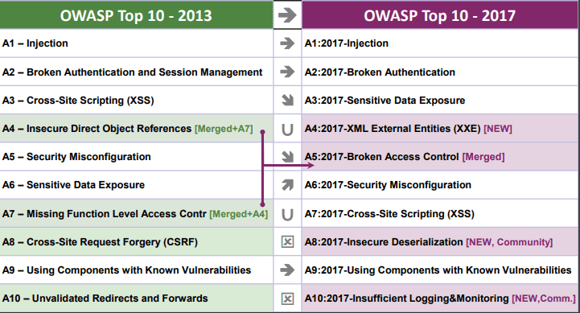

:slug: sastisfying-app-security/
:date: 2019-09-29
:category: documentation
:subtitle: An introduction to SAST
:tags: security, testing
:image: cover.png
:alt: Photo by NESA by Makers on Unsplash
:description: This blog is an introduction to the static application security test (SAST). It will provide the reader with a general concept of what SAST is, how it works, the types of static application security testing, along with some of its history and a few of the benefits of implementing SAST in projects.
:keywords: SAST, SDLC, Code, Automated test, Manual test, Vulnerabilities
:author: Kevin Cardona
:writer: kzccardona
:name: Kevin Cardona
:about1: Systems Engineering undergrad student
:about2: Enjoy life

= Sastisfying App Security

+SAST+ is a type of white box test
in which a set of technologies is used to analyze the source code,
byte code or the application binaries
in order to reveal known security vulnerabilities
that can be exploited by malicious users.

== A Bit of History

In his 1976 paper,
_Design and Code Inspections to Reduce Errors in Program Development_,
Michael E. Fagan explains how to do a code review and,
thus, creates the world’s first code review process.
link:https://en.wikipedia.org/wiki/Fagan_inspection[Fagan inspection] is a formal execution process
involving several phases and participants,
and also defines entry and exit criteria
to both start and end the process.

.Fagan Flow via link:https://www.secjuice.com/sast-isnt-code-review-fight-me/[secjuice.com]
image::fagan.png[Fagan Flow via secjuice.com]

In 1992, in his article
_Experience with Fagan’s Inspection Method_,
E.P. Doolan proposes using software that keeps a database of detected errors
and automatically scans the code for them.
This begins the use of automated tools.

== Software Development Life Cycle (SDLC)

+SDLC+ is a series of stages that must be followed
for the development of a specific software product.
These stages ensure that the quality, functionality,
and objectives of the application meet customer expectations
and development standards.

.Software Development Life Cycle stages via link:https://www.synotive.com/blog/wp-content/uploads/2017/02/software-development-life-cycle.jpg[Synotive.com]

During the +SDLC+ it is important to use testing methodologies
in the early stages of development
that identify and resolve security vulnerabilities quickly,
before the application's release.
These vulnerabilities can be found on the following websites:

. link:https://www.owasp.org/index.php/Category:OWASP_Top_Ten_Project[OWASP Top Ten Project].
. link:https://www.sans.org/top25-software-errors/[CWE/SANS TOP 25 Most Dangerous Software Errors].
. link:https://cwe.mitre.org/[CWE Common Weakness Enumeration].

.OWASP Top Ten Project via link:https://www.owasp.org/images/5/5e/OWASP-Top-10-2017-es.pdf[owasp.org]

By applying Static Application Security Testing (+SAST+)
we can detect and avoid most of the security vulnerabilities
listed in the previous links' pages.

== How does SAST work?

+SAST+ can be applied manually
or through the use of automated tools.

*Manual testing* is done by a team of testers
responsible for reviewing the code
for known security vulnerabilities.
Once vulnerabilities are found,
they are reported to the development team to be solved.
Manual testing includes several stages including:

. *Synchronization:* This stage includes receiving
from the developers the application,
a complete explanation of what the application does,
and how the application does it.

. *Review:* In this stage, the testing team
takes the source code and analyzes each line, method, class,
and file for security vulnerabilities.

. *Reporting:* At this stage, false positives
and irrelevant information are eliminated,
finding reports are created and delivered to project leaders
responsible for communicating with developers,
who then mitigate or patch the vulnerabilities.

.Report of finding in manually test via link:https://www.mitre.org/sites/default/files/publications/secure-code-review-report-sample.pdf:[Mitre.org]
image::report.png[Report of finding in manually test via Mitre.org]

*Automated tools:*
There are many link:https://www.owasp.org/index.php/Source_Code_Analysis_Tools[tools]
that allow us to automatically perform code analysis
and provide reports of the vulnerabilities
discovered during the scanning process.
Because these tools are more flexible,
they can be integrated with development environments
that include Waterfall scenarios,
Continuous Integration (+CI/CD+) environments,
+Agile/DevOps+, source repositories,
and even with other testing tools.

These types of tools use sophisticated functions
such as data flow analysis, control flow analysis, and pattern recognition
to identify potential security vulnerabilities.
The result is that vulnerabilities are reported sooner,
especially in complex projects or projects with too many lines of code.

.Report of findings in automated tests via link:https://www.oreilly.com/library/view/industrial-internet-application/9781788298599/521ecdf9-f298-4e26-9b68-5baf6602094d.xhtml[Oreilly.com]
image::toolreport.png[Report of findings in automated tests via Oreilly.com]

Reports are always checked by employees
because automated tools tend to generate a large number of false positives
and need to be filtered to extract the potential risks of an application.

As link:https://www.synopsys.com/software-integrity/resources/knowledge-database/static-application-security-testing.html[Synopsys.com] says:

[quote]
"There are six simple steps needed to perform SAST efficiently
in firms which have a very large number of applications
built on different languages, frameworks, and platforms."

. *Finalize the tool:* "Select a static analysis tool
that can perform code reviews of applications written
in the programming languages you use."

. *Create the scanning infrastructure and deploy the tool*:
"This step involves handling the licensing requirements,
setting up access control and authorization,
and procuring the resources required (e.g., servers and databases)
to deploy the tool."

. *Customize the tool:* "Fine-tune the tool
to suit the needs of the organization.
For example, you might configure it to reduce false positives
or find additional security vulnerabilities
by writing new rules or updating existing ones.
Integrate the tool into the build environment,
create dashboards for tracking scan results, and build custom reports.

. *Prioritize and onboard applications:*
"Once the tool is ready, onboard your applications.
If you have a large number of applications,
prioritize the high-risk applications to scan first.
Eventually, all your applications should be onboarded and scanned regularly,
with application scans synced with release cycles,
daily or monthly builds, or code check-ins."

. *Analyze scan results:*
"This step involves link:../triage-hacker/[triaging] the results of the scan
to remove false positives.
Once the set of issues is finalized,
they should be tracked and provided to the deployment teams
for proper and timely remediation."

. *Provide governance and training:*
"Proper governance ensures that your development teams
are employing the scanning tools properly.
The software security touchpoints should be present within the +SDLC+.
+SAST+ should be incorporated
as part of your application development and deployment process."

== Benefits

+SAST+ can be applied in the early stages of the +SDLC+
since it searches for vulnerabilities in the code before it is compiled.
This ensures the least number of possible security vulnerabilities
will make it into the application before it is released.

+SAST+ can reduce money and time costs
by finding and solving vulnerabilities in the early stages of the +SDLC+
that could cost you much more to fix,
if discovered, in the later stages.

+SAST+ is flexible and can be adapted to any type of project.

+SAST+ can be fully integrated with +CI/CD+,
Agile, and DevOps environments.

== Conclusions

It is important to know the security vulnerabilities
to which applications are exposed.
In order to do so, we must continuously read and inform ourselves
via resources such as +OWASP+ or +CWE+.

Security tests should always be performed on applications
to ensure that they are able to maintain the confidentiality,
integrity, and availability of information.

Always perform continuous reviews of an application.
Security tests should never be performed only once.

Using +SAST+ helps programmers reinforce coding standards.

== References

. link:https://www.checkmarx.com/2015/05/19/application-security-testing-automated-vs-manual/[Application Security Testing – Automated Vs Manual].
. link:https://www.synopsys.com/software-integrity/resources/knowledge-database/static-application-security-testing.html[Static Application Security Testing].
. link:https://www.checkmarx.com/2015/04/29/sast-vs-dast-why-sast-3/[SAST vs DAST – Why SAST?].
. link:https://www.owasp.org/index.php/Source_Code_Analysis_Tools[Source Code Analysis Tools].
. link:https://cwe.mitre.org/[Common Weakness Enumeration,
A Community-Developed List of Software Weakness Types].
. link:https://www.secjuice.com/sast-isnt-code-review-fight-me/[SAST Isn't Code Review].
