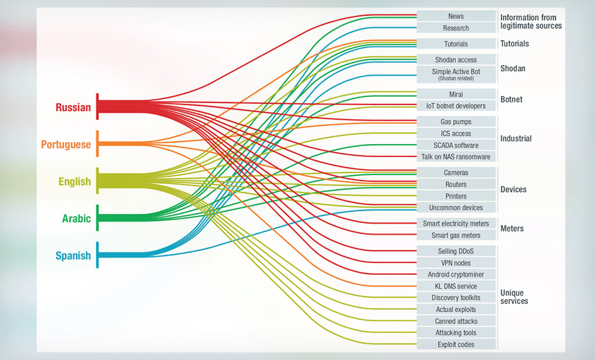
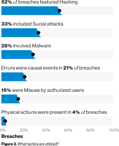

:slug: security-trends/
:date: 2019-10-03
:subtitle: Cybersecurity risks in technology trends
:category: techniques
:tags: cybersecurity, business, trends
:image: cover.png
:alt: Screen showing performance stats. Photo by Stephen Dawson on Unsplash: https://unsplash.com/photos/qwtCeJ5cLYs
:description: In this article, we will talk about the main cybersecurity trends for 2019, what to expect in upcoming years, how to keep your company secured against new types of cyberattacks, and how Fluid Attacks, as a company, deals with these kinds of threats.
:keywords: Cybersecurity, Trends, Fluid Attacks, Perspective, Techniques, Attacks
:author: Oscar Prado
:writer: oprado
:name: Oscar Prado
:about1: Industrial Automation Engineer
:about2: Fluid Attacks Developer, Hacker Wannabe

= Security in trends

In today's world technology evolves rapidly.
New tools, approaches, and trends seem to come out on almost a daily basis.
It’s our duty to keep pace with these changes,
adapt to new technologies and apply all our knowledge, skills, and abilities
to *find and report all vulnerabilities as soon as possible*.

In this article, we will discuss some of the main technology trends for 2019,
the cybersecurity risks these trends may cause,
and security prospects in upcoming years.

== Internet of Things

With the spread of +IoT+ (Internet of Things) technologies,
more devices are exposed every day to the Internet,
but they are not necessarily secure.
+IoT+ devices provide additional entry points for attackers,
giving them a whole repertoire of mechanisms
to compromise confidential information.

.IoT Targets, source: link:https://www.bankinfosecurity.com/attacks-targeting-iot-devices-windows-smb-surge-a-13082[Bank Info Security].

According to Bank Info Security <<r1, [1]>>,
attackers continue targeting the same +IoT+ flaws
reported and disclosed 3 years ago.
+IoT+ malware, such as link:https://www.cloudflare.com/learning/ddos/glossary/mirai-botnet/[Mirai],
keeps growing, escalating and mutating.
Your mobile, webcam, router or even your printer can be a target.
And these attacks are not particularly difficult to perform;
you can even find link:https://www.youtube.com/watch?v=6JFP_gUIZZY[Youtube tutorials] about them.

If you're part of the industry,
you aren't safe either,
since +PLCs+, +SCADA+ systems, smart sensors, and drives
are also +IoT+ devices that can be compromised
as a result of a +Mirai Botnet+ attack.
This may be discouraging,
even more so if we consider that in upcoming years,
the amount of +IoT+ devices will increase considerably.
We can, however, mitigate some risks now through system hardening,
and something as simple as changing the default credentials
as well as using [inner]#link:../requiem-password/[secure passwords]#.
All of these can prevent an +IoT+ attack.

== Companies in the Cloud

Most companies are now migrating to the cloud.
The advantages of Infrastructure as Code (+IaC+) are clear:
maintainability, scalability, and pricing, among others.
With cloud computing service providers like
link:https://aws.amazon.com/[Amazon Web Services],
link:https://www.digitalocean.com/[Digital Ocean] or
link:https://azure.microsoft.com/es-es/[Microsoft Azure]
with large dedicated teams maintaining their servers,
our small infrastructure team seems obsolete in comparison.
It's better to outsource this aspect to bigger companies
and stop worrying about physical infrastructure.
Well, this is not completely true.
We cannot disregard the security aspect;
the providers fulfilled their duty,
now we must fulfill ours.

According to Ben Morris,
of link:https://www.bishopfox.com/[+Bishop Fox+] <<r2, ^[2]^>>,
speaking at link:https://www.defcon.org/html/defcon-27/dc-27-index.html[Defcon Security Conference #27],
hundreds of thousands of +Amazon Elastic Block Storage+ (+EBS+),
have misconfigurations that led to sensitive data leakages:
passwords, authentication keys, and encryption keys, among others.

.AWS Alerts on bucket misconfigurations. Source: link:https://thenextweb.com/security/2017/06/02/amazon-web-services-leak-data-aws/[AWS users leaving sensitive Data].

And what's worse is in 2018,
more than +70+ million records were leaked
due to poorly configured +AWS S3+ buckets <<r3, ^[3]^>>.
The main cause of this kind of vulnerability was again the human factor.
A lack of knowledge
or negligence regarding infrastructure settings
can directly impact your company.
A weak +AWS+ configuration can be detected using automated tools.
[inner]#link:../../products/asserts/[Asserts]#, one of our products,
can detect these flaws, using the link:https://fluidattacks.com/asserts/fluidasserts.cloud.aws.cloudtrail/[+AWS Cloudtrail module+].
However, some of the cloud leakages
were also caused by hardware vulnerabilities <<r3, ^[3]^>>,
such as +Spectre+ <<r5, ^[5]^>>, +Meltdown+ <<r6, ^[6]^>> or +Foreshadow+ <<r7, ^[7]^>>,
that exploit vendor chips' vulnerabilities
to gain access to shared memory pools on physical systems.
So, it is important to keep up to date with both software and hardware
to avoid these kinds of attacks.

At +Fluid Attacks+, we have all our infrastructure as code.
We use link:https://aws.amazon.com/s3/[+AWS S3+]
as our cloud computing service provider,
link:https://www.terraform.io/[+terraform+]
and link:https://www.docker.com/[+docker+]
to configure our infrastructure,
and link:https://gitlab.com/[+Gitlab as service+]
to [inner]#link:../../events/burn-the-datacenter/[regenerate our datacenter]#
on every new version of our products.
We implement infrastructure hardening using link:https://www.hashicorp.com/blog/why-we-need-dynamic-secrets[ephemeral secrets]
in a serverless approach.
At +Fluid Attacks+, we take security very seriously,
since it’s our value promise.

== Machine Learning

Machine Learning, Neural Networks,
and Artificial Intelligence have demonstrated
that they have several applications,
and cybersecurity is not an exception.
This topic has been widely addressed in [inner]#link:../tags/machine-learning/[several blog entries]#,
so instead, let's discuss +Fluid Attacks'+ opinion
about the prospects for Machine Learning in the cybersecurity field

At +Fluid Attacks+, we do not discourage
the use of automated tools in security tests;
we even have our own [inner]#link:../../products/commands/[custom cyberweapon]#
that we sometimes use in our own tests.
However, a real security issue comes up
when only automated tools are used,
since these tools can report false positives.
For example, in the case of neural networks,
some inputs can [inner]#link:../fool-machine/[fool]# the entire algorithm.
Automated tools also do not have the human malice
to correlate vulnerabilities and then [inner]#link:../importance-pentesting/[create more complex attack vectors]#.
We see machine learning emerging technologies more as tools
rather than the holy grail of cybersecurity that will [inner]#link:../replaced-machines/[replace human hackers]#.
These tools can help our analysts to decide where to look first,
what portions of code may have vulnerabilities
and require further attention,
or which inputs may not have been properly sanitized.

== E-Commerce

In today's world, businesses usually have an online alternative
for purchasing or selling products or services.
These online alternatives have to be handled with extreme care
since most cyberattacks aim to profit from these functionalities.
E-commerce attacks come in all shapes and sizes <<r8, ^[8]^>>:
phishing, identity theft, +DDOS+, credit card frauds, and more.

Most attacks are based on social engineering.
These are attacks that try to trick the victim into performing actions
(click a link or provide confidential information)
that help the attacker gain control over the victim’s transactions.

.Verizon Data Breach Investigations Report 2019. Source: link:https://enterprise.verizon.com/resources/reports/dbir/2019/summary-of-findings/[Summary of findings].

According to Verizon,
in its annual _Data Breach Investigations Report_ <<r9, ^[9]^>>,
social engineering is the second
most used tactic to extract confidential information.
This is worrying because it doesn't matter how secure an application is
if users are fooled into providing access credentials.
This, of course, applies to E-commerce as well.

One effective way to help reduce social engineering attacks
is to train people via presentations and workshops
on how to identify a phishing attack,
along with basic security measures they can execute
before providing personal information when purchasing online.
A few of these are checking the URL and certificates,
and being suspicious when the application
asks for too much information, etc.

''''

== Conclusions

As technology evolves, cybersecurity should evolve as well.
But often what should happen differs from what does happen.
Cyberattacks become more complex
and solutions, patches, and fixes take too much time to develop and deploy.
On the bright side, with increasing cyberattacks,
cybersecurity is becoming more relevant.
Companies are investing more in security,
developing tools such as machine learning, neural networks, and +AIs+,
and considering security risk consequences
before exposing applications to the Internet.
As a result, more companies now believe what +Fluid Attacks+ has always known,
security should be applied
to the entire Software Development Life Cycle (+SDLC+).

== References

. [[r1]] link:https://www.bankinfosecurity.com/attacks-targeting-iot-devices-windows-smb-surge-a-13082[Attacks Targeting IoT Devices and Windows SMB Surge].
. [[r2]] link:https://www.defcon.org/html/defcon-27/dc-27-speakers.html#Morris[Ben Morris - Defcon Security Conference #27].
. [[r3]] link:https://www.symantec.com/security-center/threat-report?om_ext_cid=biz_vnty_istr-24_multi_v10195[2019 Internet Security Threat Report].
. [[r4]] link:https://spectreattack.com/spectre.pdf[Spectre Attacks: Exploiting Speculative Execution].
. [[r5]] link:https://meltdownattack.com/meltdown.pdf[Meltdown: Reading Kernel Memory from User Space].
. [[r6]] link:https://foreshadowattack.eu/[Foreshadow: Breaking the Virtual Memory Abstraction
with Transient Out-of-Order Execution].
. [[r7]] link:https://gbhackers.com/a-rising-of-e-commerce-cyber-attack-most-dangerous-threats-of-2019/[A Rising of E-Commerce Cyber Attack & Most Dangerous Cyber Threats of 2019].
. [[r8]] link:https://enterprise.verizon.com/resources/reports/dbir/[Verizon 2019 Data Breach Investigations Report].
