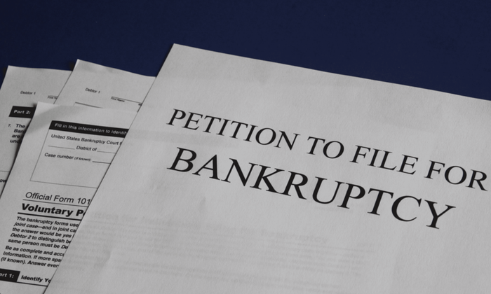

:slug: smbs-bankruptcy/
:date: 2020-01-13
:subtitle: How some firms (especially SMBs) can go broke
:category: philosophy
:tags: business, security, company, vulnerability
:image: cover.png
:alt: Photo by NeONBRAND on unplash: https://unsplash.com/photos/dDvrIJbSCkg
:description: Do companies go bankrupt by a cybersecurity breach? Some people assure there is no evidence about it. We tried to dig deeper. It appears this is the case for big corporations, but not for smaller firms. SMBs bear a considerable risk with reactive, one-shot cybersecurity practices.
:keywords: Bussiness, Security, Company, Vulnerability, Mistake, Information
:author: Julian Arango
:writer: jarango
:name: Julian Arango
:about1: Behavioral strategist
:about2: Data scientist in training.
:source: https://unsplash.com/photos/dDvrIJbSCkg

= Bankrupt by Wrong Cybersecurity!

How often do we hear a company went bankrupt because of a hack?
You've probably never heard about such a thing.
What we usually see in newspapers is millions of dollars in losses,
big corporations involved, public outrage, among others.
The case of Target in 2013, for example, comes quickly to mind.
However, similar corporations are still on the market despite those incidents.

We have heard something like this:
_a company has never gone bankrupt product of a data breach or a hack_.
Some of us at `Fluid Attacks` were a bit skeptical about that ‘fact.’
We looked for contradictory evidence;
confirmation bias is a thing.
Here is what we found.

== The commonly known cases: big firms

First, we will take a look at the famous incidents to create perspective.

Target, the giant retailer,
suffered one of the most significant cybersecurity incidents
in the past decade.
Back in 2013, a cybercrime group stole credit card data
from around 110 million users from Target’s databases,
by implanting malware after exploiting some `IT` weaknesses.
In 2017, link:https://www.usatoday.com/story/money/2017/05/23/target-pay-185m-2013-data-breach-affected-consumers/102063932/[Target settled for USD 18.5 M].

A more recent incident is Equifax’s.
The hack was performed between May and July of 2017
and affected more than 143 million people.
The data link:https://en.wikipedia.org/wiki/Equifax[included:]
*full names, Social Security numbers, birth dates,
addresses, and driver license numbers.*
It is striking the apparent permissiveness of judicial systems
to make the corporation accountable for the incident,
given this hasn't been their first.
link:https://www.bloomberg.com/news/features/2017-09-29/the-equifax-hack-has-all-the-hallmarks-of-state-sponsored-pros[A history from Bloomberg is worth reading].
The settlement, in this case, was link:https://www.cnbc.com/2019/09/09/equifax-settlement-you-need-to-update-your-claim-to-get-125.html[reached at USD 700 M].

A final example is what recently happened to Capital One bank.
Around 100 million users’ data,
specifically, credit card application data, were stolen.
A suspect has been arrested and accused of stealing the information
due to exploiting a misconfigured firewall.
link:https://thefly.com/landingPageNews.php?id=2940526&headline=COF-Capital-One-sees-incident-generating-costs-of-MM-in-[Some news outlets say]
the company estimates the incident will cost them between `USD` 100 M to 150 M.

Other corporations like Marriott International,
Adobe, Uber, Experian, Yahoo!, and Sony have had
significant cybersecurity incidents well covered by the press.
_Which of them is out of business?_

== The uncommonly known cases: small to medium-sized firms

.Bankruptcy.

Some critical aspects of the previous section are `the size of the costs`,
`the impact of the incidents`, and `the vulnerabilities present`,
leading to risk materialization.
How many companies could settle for `USD` 18.5 M? Just a few.
There is no doubt that the majority of firms
are not in a position to face a similar event.
Smaller firms (mostly in headcount) could now cause tremendous harm
by allowing data breaches
(as an example, think about a company with less than 50 employees,
with revenue exceeding `USD` 3 M,
and managing tons of user healthcare data).
Those same IT weaknesses are probably present (even more prevalent)
in smaller companies.

Here are a few stories about firms that went bankrupt due to a data breach,
or at least where cybersecurity played a non-negligible role
in going out of business.

=== MyBizHomepage: brought down by an insider

MyBizHomepage was founded in 2006.
Its valuation at that moment was around `USD` 100 M.
After the service was launched (2008),
the principal co-founder fired the firm’s `CTO`
after knowing the guy was creating direct competition
for the firm with two more people. The reason?
The company declined a proposal to be sold for nearly its valuation;
the `CTO` didn’t like the decision.
The ex-`CTO` had implanted some backdoors
to remote-control the IT infrastructure,
including backups, and started crashing MyBizHomepage, making it unusable.
The company couldn’t retake control
and had no choice than shutting down in 2009.
A wave of legal actions began from investors who lost a lot of money.

What is more: the ex-`CTO`,
link:https://www.nytimes.com/2012/08/23/business/smallbusiness/struggling-to-recover-from-a-cyberattack.html[the internal investigations found, was untraceable].
_"But Mr. Justen said he did not realize_
_that the chief technology officer had no official identity_:
_no driver’s license, no credit cards, no tax returns_.
_The chief technology officer apparently had been living off the grid,_
_which made tracking him down almost impossible_
_even with the help of the authorities"_.
More details on this story can be found link:https://boss.blogs.nytimes.com/2012/08/29/starting-over-after-a-cyberattack-shuts-down-the-business/[here].

=== Youbit: filed for bankruptcy after second hack

_Youbit_, a small South Korean bitcoin exchange,
went out of business by suffering its second hack in 8 months, back in 2017.
Cybercriminals stole 17% of its assets.
The first hack accounted for a loss of 4,000 bitcoins worth `USD` 73 M in April.
No technical details of the incident are known.
South Korean officials accused North Korean cyber-spies
responsible for the robbery.

=== Other cases

There are many other cases related to bankruptcy and cybersecurity incidents.
Mt. Gox, a Japanese digital currency exchange, had a fate similar to Youbit’s,
following hacks in 2011 and 2014.
link:https://blockonomi.com/mt-gox-hack/["Mt. Gox lost about 740,000 bitcoins]
(6% of all bitcoin in existence at the time)".
An interesting story was link:https://www.forbes.com/sites/hershshefrin/2018/12/10/huawei-pain/#7bce6d0e5d41[written by Hersh Shefrin],
Professor of Finance at Santa Clara University.
Concerning the recent US-China crisis,
he made a case for a high-level hacking
making Canadian Nortel Networks go bankrupt
by a well-known Chinese corporation.
In 2010, another company,
link:https://krebsonsecurity.com/2010/02/n-y-firm-faces-bankruptcy-from-164000-e-banking-loss/[Little and King, went bankrupt after its bank account was emptied].
The owner's computer was infected by the `Zeus Trojan`,
which stole personal and financial information, probably by keylogging.
Finally is worth mentioning the case of Westinghouse Nuclear,
which filed for bankruptcy in 2017.
The details of the story point to bad project management,
link:http://www.beyondnuclear.org/security/2014/5/22/chinese-military-cyber-attack-hacks-westinghouse-nuclear-sec.html[but indictments also point to Chinese hackers that stole intellectual property].

Want to read similar stories?
- link:https://www.bloomberg.com/news/articles/2019-06-17/american-medical-collection-agency-parent-files-for-bankruptcy[American Medical Collection Agency (`AMCA`)]
- link:https://www.wired.co.uk/article/panama-papers-mossack-fonseca-website-security-problems[Mossak Fonseca]
- link:https://www.scmagazine.com/home/security-news/colorado-firm-claims-ransomware-attack-behind-closure/[Colorado Timberline]
- link:https://www.infoworld.com/article/2608076/murder-in-the-amazon-cloud.html[Code Spaces]

== Concluding remarks: a massive risk for SMBs that can be better managed

We should update our beliefs about the impact cybersecurity can have.
More prominent players gain most of the attention;
smaller ones remain in the shadows, waiting to be found.
The `SMBs` indeed face huge risks
when their data and IT assets are not well protected and supervised.

Nevertheless, there are actions and processes
`SMBs` could establish to manage those risks better.
One of them is to be proactive and integral in testing,
and we mean testing by attacking.
As many of the cases reviewed here,
it all began with one or more weaknesses exploited by an attacker.
At `Fluid Attacks`, we excel in proactive security testing:

- We are capable of #link:../../services/continuous-hacking/[continuosly hacking]#
enterprise-level systems. We can detect small changes
that could pose risks to your business.
We combine automated tools with the best-trained cybersecurity professionals.
- We automate almost everything we know and do.
Our product [inner]#link:../../products/asserts/[Asserts]#
allow us to evaluate the state of your systems quickly.
- We store, describe, and track almost everything in
#link:../../products/integrates/[Integrates]#,
our Vulnerability Management Platform.
Integrates makes it easier for our customers
to keep track of their security weaknesses as well as fixes.

We hope you have enjoyed this post, and we look forward to hearing from you.
#link:../web/contact-us/[Do get in touch with us!]#
