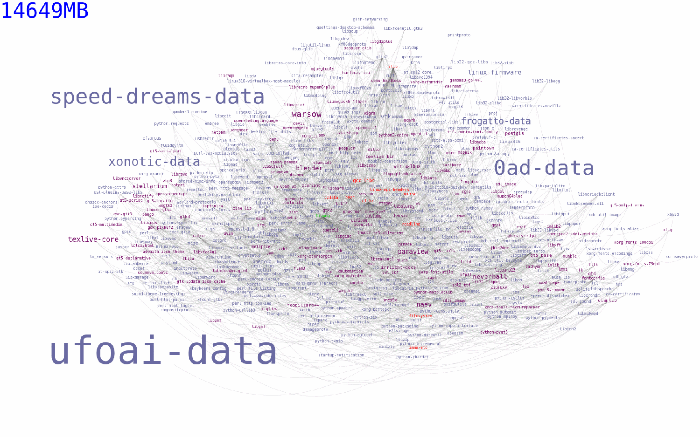
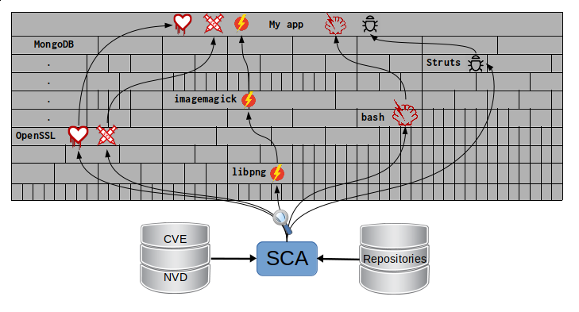
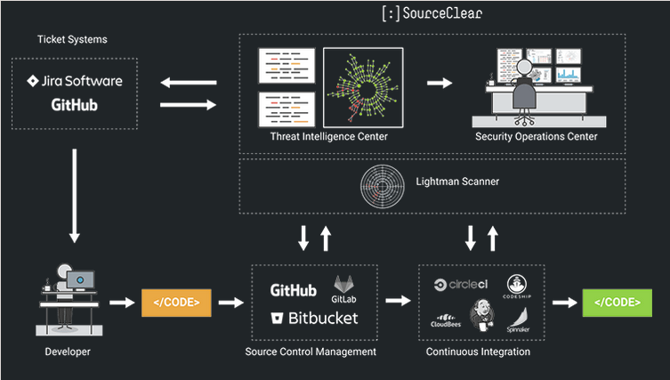

:slug: stand-shoulders-giants/
:date: 2018-02-14
:category: attacks
:subtitle: About software composition analysis
:tags: testing, dependency, vulnerability
:image: cover.png
:alt: Man standing in mountain
:description: A discussion of OWASP top 10 - A9: Using components with known vulnerabilities, in particular free and open software libraries. Comparison with the marketing buzzword Software Composition Analysis. A survey of free tools to do it yourself. Also an apology of free software in component analysis.
:keywords: Software composition, Analysis, Dependency, Vulnerability, Linux, Foss.
:author: Rafael Ballestas
:writer: raballestasr
:name: Rafael Ballestas
:about1: Mathematician
:about2: with an itch for CS
:source: https://unsplash.com/photos/exKQ01AmzNA

= Stand on the shoulders of giants

In our [inner]#link:../infinite-monkey-fuzzer/[last post]#,
we reproduced the discovery of
a vulnerability in +libpng+.
But that is only a small library,
you might say,
with a very limited scope
and only +556 KiB+ installed.
However, many, many packages depend on it.
To see how many packages
in the Arch Linux repository depend on +libpng+
we can use +pacgraph+
by link:http://kmkeen.com/pacgraph/[Kylee Keen]:

.+libpng+ reverse dependencies in +Arch Linux+

More than +14 GiB+ worth of software depends on +libpng+!
And that is only in the +Arch Linux+ repositories,
which is hardly the most popular +Linux+ distribution.
Also, the library is the official +PNG+ reference library and
is cross-platform,
so certainly many other packages in
other operating systems depend on it.

Now, back in 2015 when
+libpng+ had not yet fixed the low-high palette bug,
all the programs and libraries above
were also automatically vulnerable to the same issue.
Actually this is what happened to +Equifax+
with a vulnerability in +Apache Struts+.
Same with many web services that use
+OpenSLL+ with +Heartbleed+.

If this could happen to such flagships as
link:https://www.gnu.org/software/bash/[+bash+],
link:https://www.qt.io/[+qt+],
link:https://services.math.duke.edu/computing/tex/latex.html[+TeX+]
and link:https://xfce.org/[+xfce+],
it could happen to your organisation.
In fact, this problem is so common that
it is part of the 2017 +OWASP+ Top 10:
they call it
``A9: Using components with known vulnerabilities''.

Given the rapid adoption of Free and Open Source Software (+FOSS+)
by large companies,
all of a sudden dependency vulnerability
appears to be one link:https://en.wikipedia.org/wiki/Dependency_hell[hell] of a problem.
Or rather, as yuppies would like to point out,
a ``business opportunity''?

Many providers of so-called
``software composition analysis'' (+SCA+)
(don't google it)
have since appeared in the security scene.
Some of them are backed by
long-standing companies;
most are not.
In fact this business has gained such momentum,
that it is expected to grow more than 20% each year
from now
link:https://www.prnewswire.com/news-releases/the-software-composition-analysis-market-is-expected-to-grow-from-usd-1540-million-in-2017-to-usd-3984-million-by-2022-at-a-compound-annual-growth-rate-cagr-of-209-300595028.html[to 2022].

What's worse, it makes the +FOSS+,
that all these companies owe to,
look bad.
Yet its adoption is not slowing down and,
as we will try to show here,
it's not its fault but rather,
the dependent app's;
and also that
it's not a +FOSS+ thing but rather
that marketing efforts
point towards it.

Today's applications use on average
30+ libraries, which represent up to
80% of the code.<<r2, [2]>>
Think of it as your code being only
a thin layer upon a building of some
tiny, some larger boxes.
What +SCA+ does then is look for
vulnerabilities inside those boxes
with information from external databases,
which then become vulnerabilities in your own app:

.+SCA+ scans all the blocks in your app building

Instead of going from
the alleged solution towards the source of the problem,
let's do it backwards.

== The bad

+FOSS+ is developed and used
by thousands around the world.
This can be a double-edged blade:
on the one hand,
according to ``Linus's Law,''
bug-finding and patching
should be easier as more eyes are involved.

On the other hand,
the lack of centralised guiding
makes room for bugs.
But then again
all kinds of software do.

The difference with proprietary software is that,
due to all the restrictions
it is 'less likely' that their bugs
will become public as soon as they would be
on the freer side of things.
So expect all vulnerabilities to be zero-day.

So if the source of the problem is not +FOSS+,
what is it?
The main reasons why so many companies
suffer from +A9+:

* Not knowing used dependencies.
* Ignorance of their vulnerabilities.
* No continuous scanning for bugs.
* Not testing for compatibility.
* Component misconfiguration.

In essence,
it all boils down to a lack of communication
between the user and the source of the components.

== The good

So what can you do?
+OWASP+ recommends
the following guidelines to prevent +A9+:<<r1, ^[1]^>>

* Trim unnecessary dependencies, features, components etc.
That way you have less to check.
* Continuously monitor components for updates and vulnerability reports.
* Only obtain components from trusted sources.
* Make these guidelines into a company policy.

There are specific tools for this purpose:
they compare the version of the dependency you are using against both
remote repositories (to check for updates) and
vulnerability databases (like
to find out if any of your dependencies has
reported vulnerabilities that have not been fixed yet.

* For +JavaScript+ you can use link:https://github.com/retirejs/retire.js/[+retire.js+].
* +Java+ users have the link:http://www.mojohaus.org/versions-maven-plugin/[+Versions+] plugin for +Maven+.
* Also for +Java+ and +.NET+, you can use the
link:https://www.owasp.org/index.php/OWASP_Dependency_Check[+OWASP Dependency-Check+] tool.
* There's a link:https://github.com/stevespringett/dependency-check-sonar-plugin/tree/master/examples/single-module-maven[Dependency check] +SonarQube+ plugin.

Note that the language-specific tools
have to be integrated with the
appropriate package manager, like
+npm+ or +yarn+ with +retire+.

A bird's eye view of how the process
should integrate with your development flow is
depicted by the following diagram provided by +Source:Clear+.

.Integrating +SCA+ in your development flow. Via link:https://www.sourceclear.com/product/[+Source:Clear+].

We see that every time code is added,
the whole system gets scanned for
third-party software vulnerabilities
and other issues easily identified by
Static Analysis when code is not available.
This is done by
following this procedure:

. The +SCA+ identifies the dependencies
your software is based on.

. Detect those dependencies versions.

. Check the dependency master repository for updates.

. Check one or several vulnerability databases,
like link:https://cve.mitre.org/[CVE] and link:https://nvd.nist.gov/[NVD]
or their own.

. Report the findings.

It is a simple process, really.

Notice that the integration is not fully automatic,
and it should not be,
since these tools could (and usually do)
raise false alarms, so they are reviewed by
human security experts.

Internally, the process of scanning for
third party software is the same for both
proprietary and +FOSS+ software,
and it is a simple matter of
querying the vulnerabilities databases
as described above.

Speaking of integration,
you may wonder:
What if my app is deployed inside a container?
``30% of official images in Docker Hub
contain high priority security vulnerabilities'',
according to link:http://pentestit.com/[Pentestit].
Fortunately, there are tools
which go into your container and
perform +SCA+ inside of it (and more), like
link:http://pentestit.com/anchore-open-source-container-inspection-analysis-system/[Anchore] and
link:http://pentestit.com/dockerscan-docker-security-analysis-suite/[Dockerscan].

== The ugly

I know you did search for ``Software Composition Analysis''
when I suggested you not to.
I just know you did.
If you didn't,
good for you!
Here's what you're missing out on:

.``Software Composition Analysis'' providers.

All of these industry-leading, award-winning,
breakthrough-makers, oracles of the tech future
want to sell you one thing:
static code analysis
plus the tools we discussed above.

While static analysis is a valid tool,
it's just a tool.
It can scan code and detect vulnerabilities
and unhealthy practices,
but also encourages late detection
and produces a lot of false positives.

You could try hiring such a service, and maybe
even try to complement it with dynamic analysis tools
like [inner]#link:../infinite-monkey-fuzzer/[fuzzing]# and debuggers,
but those have their own issues.

But these are no replacement for good old-fashioned
human code review. At least at the moment.
According to <<r3 ,[3]>>,

[quote]
The only way to deal with
the risk of unknown vulnerabilities in libraries is
to have someone who understands security
analyse the source code.
Static analysis of libraries is best thought of as
providing hints where security vulnerabilities might be
located in the code,
not a replacement for experts.

In the future, we might see things like
distributed on-demand security testing and
machine learning algorithms<<r2 ,^[2]^>> using
support vector machines to
try to predict which commits
are likely to open vulnerabilities,
but in the meantime,
stick to the tried-and-true.

== References

. [[r1]] link:https://www.owasp.org/index.php/Top_10-2017_A9-Using_Components_with_Known_Vulnerabilities[OWASP Top 10-2017. Using Components with Known Vulnerabilities.]
. [[r2]] link:https://pure.qub.ac.uk/portal/en/publications/vulnerability-detection-in-open-source-software-the-cure-and-the-cause(94ec148c-80e4-448e-a267-c9ffb992b285).html[Millar, S. (2017). Vulnerability Detection in Open Source Software:
The Cure and the Cause. Queen's University Belfast.]
. [[r3]] link:https://www.contrastsecurity.com/the-unfortunate-reality-of-insecure-libraries[Williams, J. and Dabirsiaghi, A. (2014).
The Unfortunate Reality of Insecure Libraries. Aspect Security.]
