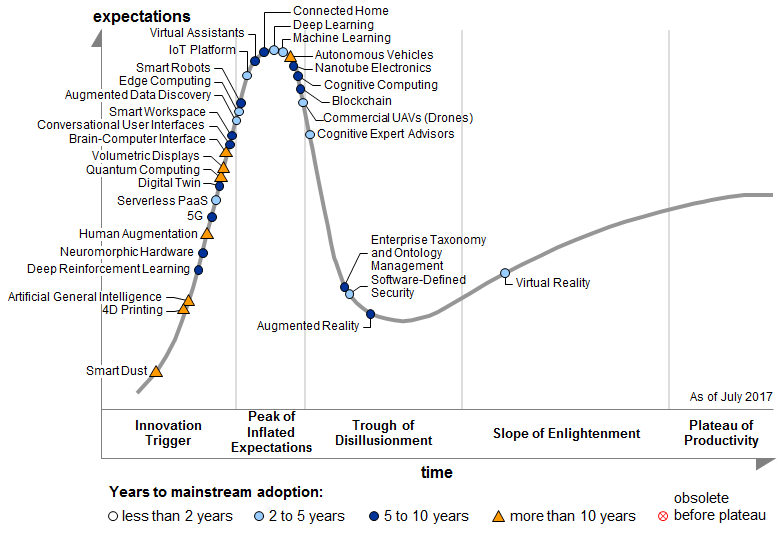

:slug: training-basic/
:date: 2019-08-15
:subtitle: A chat with Ricardo Yepes. Part 1.
:category: interview
:tags: devops, training, security
:image: cover.png
:alt: Bookshelf with some books
:description: Cybersecurity, academic research, a learning platform, and more; these are some of the endeavors Ricardo Yepes, a DevOps engineer has been into. We spoke to him recently, and he shared his current vision of cybersecurity. Here is the first part of our conversation.
:keywords: Interview, DevOps, Security, Machine Learning, Philosophy, Training
:author: Julian Arango
:writer: jarango
:name: Julian Arango
:about1: Behavioral strategist
:about2: Data scientist in training.

= We need more training in basic stuff

Ricardo works as a +DevOps+ engineer
at an Australian consultancy company.
Previously, he worked for +Fluid Attacks+
as a security analyst and instructor.
He also spent a couple of years developing and maintaining
an educational platform focused on coding and security,
where students learned by solving programming challenges.
He also had his feet in academia for a while:
he holds an +MSc+ in Engineering, and he finished his dissertation in Germany.
As with previous interviewees, we reached him out to discuss cybersecurity.

At the beginning of our conversation,
he shared a bit of his experience in doing his postgraduate studies.
To our surprise, he wasn't that enthusiastic.

*Why did you get frustrated about research?*
[role="fluid-qanda"]
  . I think the main issue is the amount of time
  you have to spend justifying things already known by the industry.
  If you didn't find the right paper on the proper journal
  to support something you wanted to say, you just don't do it.
  I guess I understand why that is important,
  but I felt I didn't fit doing that.
  I feel better working on practical things, more agile.
  Another issue was discipline;
  I believe I don’t have the discipline required
  to pursue an academic career in computer science.
  So, I decided to focus on technologies
  that are becoming essential these days.

*What can you say about academia and cybersecurity?*
[role="fluid-qanda"]
  . There is a huge gap between what industry needs
  and what is taught in colleges.
  We need more training in basic stuff;
  for example, secure coding.
  It is not that difficult to learn;
  nonetheless, you still get to know plenty of developers
  with no notion of robust security.
  That’s the reason I was attracted to work
  on an education platform some time ago.

Academia, I presume, should teach robust security fundamentals
(those basic things Ricardo mentioned)
for computer science and software engineering students.
A gap like this seems nonsensical.

*What you just mentioned is paradoxical. Why this paradox?*
[role="fluid-qanda"]
  . For academia, is too difficult to anticipate what will hit the market.
  For example, when I was an undergrad student,
  all that we know today as cloud computing didn't exist.
  I remember +AWS+; not Google.
  This wasn't taught.
  The industry was spreading the new technologies
  and creating the skills on people,
  so academia was left behind.
  It is the nature of the field, something structural.
  Computer science evolves so fast that academia is incapable of catching up.
  People might expect to be taught like putting a spoon in their mouths,
  but that's not how the world is doing these days.
  Self-teaching and self-learning are more widespread these days,
  and people are becoming more aware that they should keep learning.

*How do you study these days?*
*How do you learn what you need to do in your job?*
[role="fluid-qanda"]
  . Right now, I wouldn't go to a university to learn what I do daily.
  What I've done is learning online
  through some of the many platforms available.
  I have earned some certifications that are being demanded
  by businesses and organizations, like +AWS+, +Kubernetes+, etc.
  I don't even have to rely on a platform.
  Sometimes I just pick a topic I don't know,
  set a goal, and start browsing web resources.
  I train myself around specific tasks that interest me.

*Recently, I read somewhere that the most critical skill nowadays*
*for students is to know how to search in Google. You seem to nail it...*
[role="fluid-qanda"]
  . It is not a joke!
  You find people these days getting stuck in their tasks
  just because they do not look for resources online.
  They might say that they need to speak to an expert.
  And this experts many times just Google the things out.
  It is more of a mindset, rather than a real inability.

Well, Infrastructure as Code (+IaC+) is a thing.
+Fluid Attacks+ is proud to be working with this approach for several years now.
Our [button]#link:../../services/continuous-hacking/[Continuous Hacking]#
and [button]#link:../../services/one-shot-hacking/[One-shot Hacking]# services
rely on this approach to support our customers consistently and faster.

Now, we turn into cybersecurity specifics,
and like with the other people we have spoken with,
we asked Ricardo about his opinion on machine learning (+ML+)
and artificial intelligence (+AI+).

*What is your opinion on the contributions from ML and AI to cybersecurity?*
*Do you find hype here? Or on the contrary, is it something real?*
[role="fluid-qanda"]
  . Well, we’re precisely in the hype phase
  according to the famous Gartner curve.
  But, indeed, there are several +ML+ useful applications.
  Some years ago, I did some research on the topic,
  and I concluded that the field was in development.
  Around that time, some people said that +ML+ and +AI+ would replace,
  for example, developers.
  If that’s true, I think it will take many more years to get there.
  +ML+ and +AI+ are marvelous tools,
  and its development and research should continue.
  There are astonishing results achieved,
  for example, in health diagnosis,
  computers beating humans playing games, etc.,
  with clear implications for society.
  However, those results are very domain-specific,
  and most problems in real life are not that bound;
  some do not have rules or steps.
  So, to expect a machine to solve these kinds of issues is not likely.

.Hype Cycle for Emerging Technologies, 2017.

*Do you think ML and AI would soon help in addressing digital threats better?*
[role="fluid-qanda"]
  . Not soon.
  One of the biggest sources of vulnerabilities
  is what happens at the software design stage.
  Weaknesses created "by design".
  For example, in eliciting requisites,
  design decisions lead to developing functionalities in an insecure way.
  That is more frequent than thought.
  And this is crazy: these "by-design" weaknesses
  are so simple to avoid, that for a competent cybersecurity professional
  is almost unthinkable to find them.
  The problems with these weaknesses,
  if not identified in a development phase,
  is that they might not be easily fixed
  when the software is already deployed.

  . Perhaps, someday, a software solution could detect automatically
  that kind of problems involving human judgment
  in the elicitation of requisites.
  If so, we’re far from that.

*Is this you just mentioned linked to the gap*
*in teaching secure software development in academia?*
*Do you think this can be solved?*
[role="fluid-qanda"]
  . Of course, but it is not a challenge only universities have to address;
  organizations, specifically software development teams,
  should contribute too.
  The guys who code must know this;
  if not, they should return to the basics of secure coding.
  But, other people involved in the design process,
  such as business analysts and software architects,
  to name a few, should also get to know more about security.
  In the initial stages of development
  (requisites, analysis of problems, objectives, design, etc.)
  it is enormously helpful to include a cybersecurity guy
  that supervises and teaches people how to think
  about security and how to infuse it from the very beginning.
  Thus avoiding potential setbacks
  (usually expenditures, outages and more) in the future.
  Doing that is an excellent investment.

In an upcoming blog post,
we will share the second part of this conversation.
We hope you have enjoyed this interview so far
and we look forward to discussing the current state of cybersecurity
with customers, partners, and friends.
Do you want to share your thoughts?
[button]#link:../../contact-us/[Do get in touch with us!]#
