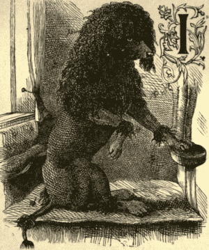
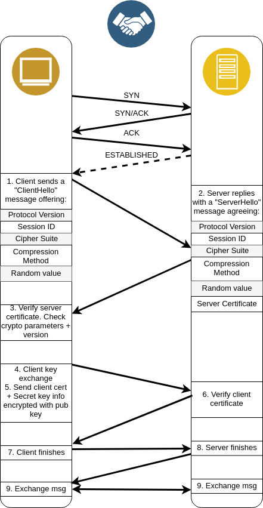
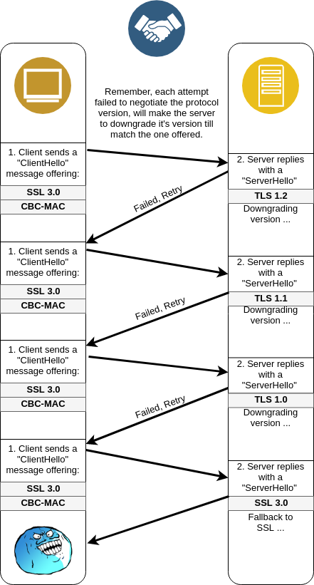
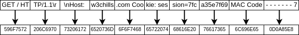

:slug: treacherous-poodle/
:date: 2018-05-02
:subtitle: How does the SSL fallback's works
:category: attacks
:tags: ssl, flaw, cbc
:image: cover.png
:alt: Unknown person below lights
:description: Exploiting an SSL/TLS flaw that creates a fallback on TLS usage to SSL 3.0, taking an advantage on missused CBC-MAC algorithm while padding the variable-length messages, allowing an attacker to perform a Man-in-The-Middle Attack to steal the user cookies.
:keywords: SSL, CBC, MAC, Padding, Flaw, Exploit
:author: Daniel Yepes
:writer: cestmoi
:name: Daniel Yepes
:about1: -
:about2: "If the doors of perception were cleansed everything would appear to man as it is, Infinite." William Blake.
:source: https://unsplash.com/photos/S2qA7JhjI6Y

= The Treacherous POODLE

A gas vendor, each week receives
gas, which he stores in pipes
and discretely refills them
with water. Each day sells this
gas to his clients,
unbeknown to an "auditor" in
black robes - aka Poodle - paying
attention to this situation. One
day the "auditor" undercover, tells
the vendor he will only offer gas
with less octanage, thus his pipes
should met certain old requeriments,
ignorant of the situation he downgrades
it's pipes standards until the "auditor"
agrees on it. +
Next day, the "auditor"
goes to the station, disguised as a
client and ask the vendor to refill
his car, next he reveals himself
telling the vendor that he knows what
he is doing plus that he has outdated
pipes which represent a threat, but
it won't talk if he pays him a
commision for each sell.

Following act, the auditor was just a regular
dude impersonating someone else.
And the vendor in it's infortune,
kept an old standard storage pipes without
realizing the harm it could make to it's clients or to
himself.

I hope that doesn't end in the worst analogy
in human history, moreover i hope it helps
to understand certain technicisms we will see
later. But please, bare in mind
that i'm not an expert on oil industry.

.Black poodle

== Techninal introduction

The +Padding Oracle On Downgraded
Legacy Encryption SSL 3.0 (POODLE v3)+,
it is a protocol vulnerability on
`*Secure Socket Layer* (SSL 3.0)`,
which can make any +*Transport Layer Secure
(TLS)*` version to fallback to `(SSL 3.0)+
plus it takes advantage on weak
encryption using a mechanism to
check message authencity using *+Cipher
Block Chaining Message Authentication Code
(CBC-MAC)+*, allowing an
attacker to steal cookies from an user
on the same network.

Discovered on September, 2014,
by `Bodo Möller` , `Thai Duong` and
`Krzysztof Kotowicz` from the `Google`
security team.

If you are not aware what this terms are
check the
[inner]#link:../release-the-beast/[`BEAST`]#
article, the `(CBC-MAC)` will be explained here,
don't worry.

== Petting the POODLE

Have you clean yourself from
that awful analogy?
From now on, guess you will see why i
wrote it.

Whenever client and server
are going to start
an exchange using `SSL/TLS`, they
use a protocol called
link:https://tools.ietf.org/html/rfc6101#page-21[`Handshake`],
a process that is explicity
to settle a ground of standards
between the client and the server,
where both agrees which `SSL/TLS`
*version protocol* will be used,
the *cryptography method* used,
*key exchange*, plus more.
All with the final intention
to send messages while speaking
on the same language.

But why does this matter?
Let's take a look at
that process step by step:

.Handshake step by step

Although i will not describe each
step in depth, it is necesary to show the
link:https://msdn.microsoft.com/en-us/library/windows/desktop/aa380513(v=vs.85).aspx[overall process],
to understand how does the downgrading
process is and where the attack
finally lands.

In simple terms, the attack
relies on the fact, that
whenever an attempt to establish
a secure connection, it fails
(Step 1 to Step 2), then the server
will fallback to an older protocol,
 <<r1, ^[1]^>>.

Remeber the gas vendor
downgrading it's pipes
until the "auditor" waits
till he has that old
pipes standard? Good...

Notice that whilst `TLS`
is the sucessor of `SSL`,
`SSL 3.0` has more precedence
than `TLS 1.0 - 1.2`,
mostly to guarantee an
smooth user experience and
interoperability across
legacy machines, thought,
it was obsolete and insecure.
Moreover the attack will even
work if both have `TLS`, <<r1, ^[1]^>>.

Well then, let's see how
does the downgrade works. +
If in the first step, the client offers
it's highest version of the protocol, let's say,
`TLS 1.2`, the server, while not
having such version, will negotiate the usage
of `TLS 1.0` by downgrading it's own
protocol version, but notice, that such
offering can be repeated several times
as long it fails.

Quite like this:

.Protocol downgrading

Hope you didn't miss the `CBC-MAC` under the
protocol version, because this is the most
interesting part of this attack.

The reason behind the fallback advantage,
is to force the client and the server to
use weak encryption. It won't reveal the key,
but it will allow an attacker to eventually
recreate cookies/session parameters by
intercepting the downgraded exchange channel,
 <<r2, ^[2]^>>.

How does this works in `SSL 3.0`? Well, `CBC` works as
expected, just with one subtle difference, the
link:https://en.wikipedia.org/wiki/Message_authentication_code[`MAC`]
is done to check the authencity of a message,
works like a charm on fixed-length messages.
But! *not* on variable-length messages
as the padding will fail to be fully
verified when decrypting.

Remeber from that stupid analogy the gas vendor
refilling it's gas pipes with water? Well,
that's what the padding is, although the
`CBC-MAC` algorithm won't have any
economic advantage, it just tries
to handle variable-length messages, by
adding extra random characters to met
the needed multiple block-length,
to get 8 or 16 bytes blocks
depending on the algorithm (+DES,
3DES, AES+). Taking advantage on this
is ofently called
link:https://www.owasp.org/index.php/Testing_for_Padding_Oracle_(OTG-CRYPST-002)[`Padding Oracle Attack`].

So, here is where the version downgrade lands.
But let's see it in action with this
simple example, i'm gonna use
8-bytes blocks to make it short.

Let's suppose we have already intercepted
a client-server communication and we
have forced the use of `SSL 3.0`, now we
are going to reveal the encrypted messages
while both are at the last step of the handshake.

Without too much details, the client
sends a request to the server:

.Http request

A message request from the client which is
going to be encrypted with `DES` using
`CBC-MAC` mode.
First at all, the `MAC` of the message
should be computed:

. `IV` is full of 0's
. `XOR` with each block of plaintext

.Compute MAC
image::mac.png[computing-mac]

And append it to the end of the message,
then check if the length of the message
is a multiple of 8 (block-size),
if not, add random padding characters
at the end until it hits a multiple of
the block-size and the final byte becomes
the length of the padding, which output
is like this:

.Padded message example with MAC code
image::http-request-fixed.png[request-example]

NOTE: I will represent the random padding
characters by "-", don't get confused.

Then the process of encryption with `CBC`
as described in the
[inner]#link:../release-the-beast/[`BEAST`]#
article. Which output is:

.Output of encrypted message

The message is then sent to the server, and now
consider the decryption process on the server:

.CBC decryption

Taking on account that the exchange
is being made with `SSL 3.0` and the
fact that when a `CBC` encryption
algorithm is used, `SSL 3.0` does
not cover padding with `MAC`.
Which means, that the mechanism
used to verify the authenticity of
a message won't be able to fully
verify it while decrypting it. +

Did you spot something weird
with this mechanism, but besides
than the stated flaw? No?
Perhaps on encryption? Or before?

Well, if you didn't, here is a clue:
Authentication should be done
after encryption, *NOT* before. The
link:https://moxie.org/blog/the-cryptographic-doom-principle/[Authenticate-then-Encrypt]
poses a problem, which by that time
wasn't that evident.

.SSL blames SSL

So, to process each block of the ciphertext, denoted as *C*, the
recipient determines each block of the plaintext, denoted as *P*,
using the following mathematical formula, <<r3, ^[3]^>>:

*P~i~* = *D~k~(C~i~) XOR C~i-1~*

. Where *C~0~* is the `Initialization Vector (IV)`
. *C* ranges from *C~1~* to *C~n~*.
. *P* ranges from *P~1~* to *P~n~*.
. *D~k~* the block-cipher decryption using per-connection key *K* or

This in simple words means, that each current block is `XORed`
with the previous block, then checks and removes the padding
at the end, and finally checks and removes the `MAC`.

So how does the attack use decryption
to get the plaintext without the key?

. Considering our padding block `[------7]`,
*C~n~*.
. And the block we want to decrypt, *C~i~*.

Replace *C~n~* by *C~i~*, usually this block
modification will be rejected, but only once
on 256 request, it won't, the attacker
will conclude that the last byte of *C~n-1~*
XORed with *C~i~* will yield, *7*.

Mathematically speaking *D~k~(C~i~)[7] XOR C~n-1~[7] = 7*

As `SSL 3.0` doesn't care for the rest
of bytes on the padding block, less
for the block-length, it will accept it.
And thus that *P~i~[7] = 7 XOR C~n-1~[7] XOR C~i-1~*
a calculation which will reveal the bytes unknown on
the block the attacker wanted.

This can be seem like a duplication of
certain block on the stream, which will replace
the last block, thus, the last byte
will be `XORed` with the last byte of the
previous block, resulting in *7*, <<r3, ^[3]^>>.
This is possible as the block is on the same
stream, thus when the message authentication
is performed it will take it as a valid block.

As stated before, this trick will be
performed almost 256 request until it's accepted,
each fail means the last byte has to be shifted.

Plus it has to be done byte by byte on the
cipher stream or at least, in each byte of
the block the attacker wants to know.

== Requeriments

Although the attack seems quite similar
with the `BEAST` attack, it relies
enterely on a flaw on `SSL/TLS` protocol.

The only requirements are:

. Run a `Man-In-The-Middle Attack` against the victim.
. Perform the Downgrade if `TLS` is used.

Once an attacker has done it, it can steal the
cookies/session from a user.

== Any patch?

Well, there is a funny quote by
the researchers:

[quote]
disabling the *SSL 3.0* protocol in the
client or in the server (or both) will
completely avoid it.
If either side supports only
*SSL 3.0*, then all hope is gone,
and a serious update required
to avoid insecure encryption.

But there was and still exist an iniciative to
link:http://disablessl3.com/[disable ssl]
from all browsers and on any servers using it.

=== References

. [[r1]] link:https://www.openssl.org/~bodo/ssl-poodle.pdf[Bodo Möller , Thai Duong, Krzysztof Kotowicz (Sept 2014).
This POODLE Bites: Exploiting The SSL 3.0 Fallback]
. [[r2]] link:https://isc.sans.edu/forums/diary/Assessing`the`risk`of`POODLE/19159/[Assessing the risk of POODLE]
. [[r3]] link:https://en.wikipedia.org/wiki/Block_cipher_mode_of_operation[Wikipedia, Block Cipher Mode of Operation]
. [[r4]] link:https://www.imperialviolet.org/2014/10/14/poodle.html[ImperialViolet (Oct 2014). POODLE attacks on SSLv3]
