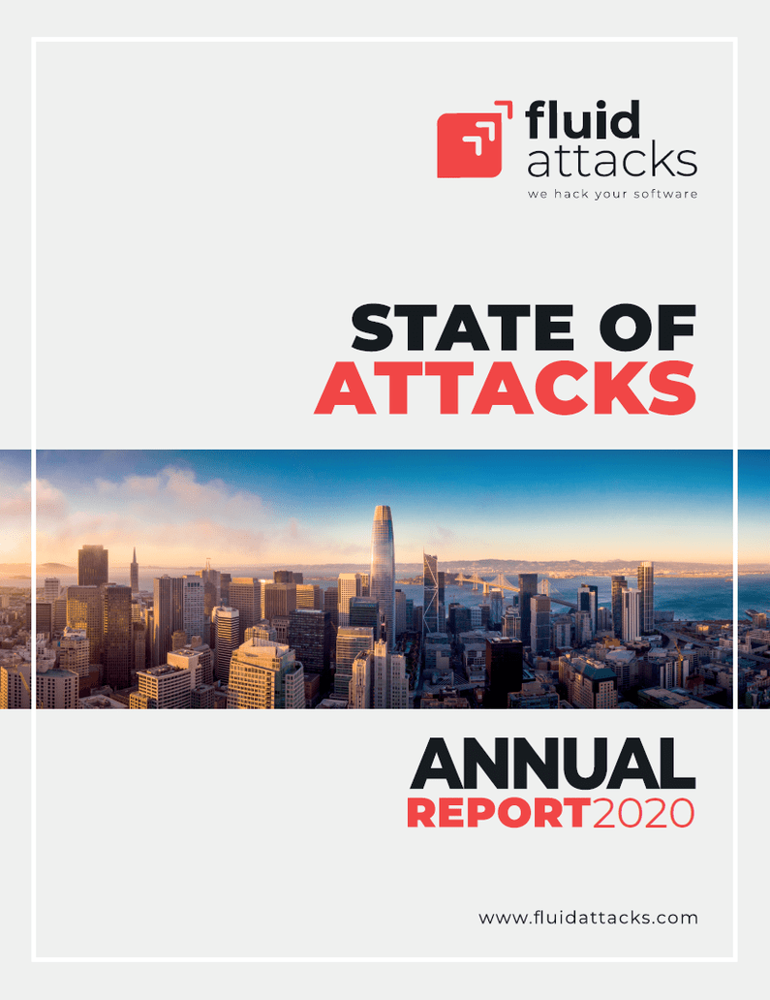

:slug: trends-2020-ii/
:date: 2020-04-02
:subtitle: More realistic cybersecurity predictions
:category: techniques
:tags: cybersecurity, trends, mistake, technology, economics, information
:image: cover.png
:alt: Photo by Matthew Henry on Unsplash
:description: In a previous post, we criticized some 'trends' in cybersecurity. In the current piece, we do the opposite. In essence, we discuss why other cybersecurity predictions for 2020 seem plausible, and some undeniably real —we wrap-up by mentioning other trends beyond 2021.
:keywords: Cybersecurity, Trends, Mistake, Technology, Economics, Information
:author: Julian Arango
:writer: jarango
:name: Julian Arango
:about1: Behavioral strategist
:about2: Data scientist in training.
:source: https://unsplash.com/photos/fPxOowbR6ls

= Happening Now: Trends 2020

In a [inner]#link:../trends-2020/[previous post]#,
we downplayed some cybersecurity predictions for 2020.
We found some of them as imprecise, not plausible, or not even being a trend
(instead, prevalent decades ago).
In this post, we bring to the table other predictions
with better support and evidence for 2020.

There seems to be consensus in four predictions for the current year.
The growth of artificial intelligence (`AI`) and machine learning (`ML`)
in cybersecurity is evident.
[inner]#link:../ransomware/[Ransomware]# is predicted to keep causing harm worldwide,
and their impact is scary.
The scarce talent in cybersecurity hasn't gone down in the previous years.
And finally, Cloud security disruptions are expected to grow.

== The use of AI and ML keeps rising

Many of the publications we consulted listed this trend.
The discourses have little variation: both organizations and criminals,
or stated differently, defense and attack sides on cybersecurity
are using automated algorithms to improve their performance.
In general, we can identify the following advantages by using `ML` and `AI`:
for defenses, higher effectiveness (mostly detection),
lower impact of human error, and acceleration of deployment.
For the dark side, the benefits are also sizable
—for instance, better and automated [inner]#link:../phishing/[phishing]# attacks,
as well as more sophisticated denial of service attacks.
Moreover, `ML` and `AI` algorithms
could be used to spread fake news and link:https://en.wikipedia.org/wiki/Deepfake[deep fakes].
Not only that, but those algorithms could create appealing malicious offers,
which, combined with malware, could harm significantly.
Remember link:https://towardsdatascience.com/how-ai-can-make-you-the-president-4756f6b1c0c0[Cambridge Analytica]?<<n1 ,^1^>>

From another perspective, in 2017,
link:https://www.cbinsights.com/research/cybersecurity-artificial-intelligence-startups-market-map/[CB Insights] published a brief report
listing more than 80 cybersecurity companies worldwide using `AI`.
All of this shows apparent growth, and hence, it is indeed a trend.

At `Fluid Attacks`, we are working on some initiatives
using `ML`/`AI` algorithms.
See, for example, the post [inner]#link:../understand-program-semantics/[Understanding Program Semantics]#
written by Rafael Ballestas, explaining how code audit can be triaged.

== Ransomware will not fade away and is evolving

If we take a look at the number of documented incidents
plus the economic impact of ransomware,
you can't imagine something different from expansion and growth.
The following statistics allow us to understand this trend:

- link:https://www.datto.com/blog/a-look-at-ransomware-in-2019[Datto] indicates that year-over-year ransomware downtime costs have tripled.
What is more, this represents *23* times higher costs for companies
compared to the average ransom requested in 2018.
This company also reports that in 2019,
*20%* of ransomware victims were small-to-medium size businesses.

- Emsisoft's data indicates that ransomware attacks increased by *41%* in 2019
(featured in link:https://www.nytimes.com/2020/02/09/technology/ransomware-attacks.html[The New York Times]).

- Ransomware costs will reach *$20 billion* by 2021,
according to link:https://cybersecurityventures.com/global-ransomware-damage-costs-predicted-to-reach-20-billion-usd-by-2021/[Cybersecurity Ventures].
This means losses *57* times higher than those observed in 2015.

And these are just a few statistics.
Let's take a look at what is happening broadly with ransomware.

Experts see a change from few high-impact targets
to many smaller impact targets.
"_With smaller attacks, it’s easier for the criminals to remain anonymous,
laundering money is simpler,
and they will have fewer people to share
the overall profit with_," says link:https://jaxenter.com/cybersecurity-trends-2020-167575.html[Jaxenter].
link:https://securityintelligence.com/posts/ibm-x-force-security-predictions-for-2020/[IBM Security] noted something
in the same lines about this shift.

In the United States,
government and public institutions are increasingly the targets of ransomware.
link:https://www.ciodive.com/news/the-forgotten-ones-ransomware-preys-on-the-resource-poor/565062/[CIO Dive] published an article
that shows the likely cause:
these institutions invest significantly less in cybersecurity
compared to the average company (*3%* vs. *10%* of their budget).
Almost a thousand institutions were victims of ransomware in 2019,
according to link:https://blog.emsisoft.com/en/35583/report-the-cost-of-ransomware-in-2020-a-country-by-country-analysis/[Emisoft].

Ransomware is particularly scary:
no doubt why different sources describe this trend
as reaching "crisis level" or "terrifying."
For a more comprehensive detail of these statistics,
we suggest the excellent compilation link:https://securityboulevard.com/2020/02/20-ransomware-statistics-youre-powerless-to-resist-reading/[Security Boulevard] wrote recently.

== Rethinking or devoting more attention to Cloud security

"_The level of understanding about security in the cloud remains low;
in fact, it is often an afterthought in cloud deployments,_"
says the link:https://www.weforum.org/agenda/2020/01/these-will-be-the-main-cybersecurity-trends-in-2020/[World Economic Forum].

It seems that organizations will change
their beliefs about cloud security very soon.
In line with the ransomware trend,
cloud providers have been impacted recently.
link:https://www.ciodive.com/news/cyrusone-ransomware-REvil/568549/[CyrusOne] suffered an incident a few months ago,
affecting the availability of several customers.
link:https://www.armor.com/resources/new-msps-compromised-reports-armor/[Armor] reported that around thirteen managed-services providers
were struck by ransomware last year.
A ransomware attack vector related to cloud providers
is the remote monitoring and management software they use.
link:https://blog.emsisoft.com/en/34822/the-state-of-ransomware-in-the-us-report-and-statistics-2019/[Emisoft] brings one example of this:
more than *400* companies
were disrupted by one ransomware incident of their cloud provider.

As organizations and people demand more cloud services,
attackers naturally shift there too.
There is some evidence
that the biggest cloud service providers in the world have been breached.
According to link:https://www.proofpoint.com/us/threat-insight/post/threat-actors-leverage-credential-dumps-phishing-and-legacy-email-protocols[Proofpoint],
Office 365 and G Suite users have been hacked
by using legacy protocols (e.g., `IMAP`).
Even two-factor authentication schemes are subject to be bypassed.

== The cybersecurity skills gap, still there

.Many companies keep openings for cybersecurity talent all the time. Modified image; the original taken from link:https://www.pxfuel.com/en/free-photo-oeufi[pxfuel.com]

In 2014, the estimate of unfilled cybersecurity jobs was *1 million*.
A view from link:https://cybersecurityventures.com/jobs/[Cybersecurity Ventures]
suggests the number will reach *3.5 million* during 2020.
Other publications like link:https://hbr.org/2017/05/cybersecurity-has-a-serious-talent-shortage-heres-how-to-fix-it[Harvard Business Review]
and link:https://knowledge.wharton.upenn.edu/article/america-plans-close-skills-gap-cybersecurity/[Knowledge @ Wharton] have also referred to this issue.
Some have blamed academia for this shortage of skilled talent.
However, it is not that simple.
In a [inner]#link:../training-basic/[previous post]# in which we interviewed a `DevOps` engineer,
it was discussed that academia, in cybersecurity,
is not capable of keeping up with the pace of the industry.

Some people think innovation in automated tools
might be the key to compensate for this shortage.
"_With as many as link:https://www.isc2.org/-/media/ISC2/Research/2018-ISC2-Cybersecurity-Workforce-Study.ashx?la=en[two in three organizations worldwide]
reporting a shortage of `IT` security staff,
automated security tools such as online vulnerability management solutions
are fast becoming essential
to maintaining a good security posture,_” says link:https://www.netsparker.com/blog/web-security/top-10-cybersecurity-trends-to-look-out-for-in-2020/[Netsparker].
Others are not that sure about it,
as there needs to be a skilled talent
to operate and fully leverage these solutions.

Companies should invest in training for promising talent,
rather than betting only to recruit skilled talent as the shortage is definite.

== What's ahead of 2020?

In our exercise reviewing trends for the ongoing year,
we found other predictions worth mentioning.
However, we don’t think they will be too relevant, yet.
Some sources see *mobile 5G technologies*
as a big door for more vulnerabilities and incidents.
Other sources predict *multi-factor authentication* schemes
will replace two-factor authentication.
Moreover, some predict that there will be lots of *vehicle hacks*
and the rise of `IoT` breaches too.
To conclude, some even predict that in 2020 countries will be destabilized
by national elections hacking
(this implies the use of digital voting systems. Will we see that happening?).

*What do you think about all of these trends?*
We hope you have enjoyed this post, and we look forward to hearing from you.
[inner]#link:../../contact-us/[Do get in touch with us!]#

In line with these posts about trends,
we predict [inner]#link:../../services/continuous-hacking/[continuous hacking]# will grow in 2020
as it delivers more value to organizations.
We have evidence that customers
continuously testing the robustness of their software and IT infrastructure
do find more weaknesses and achieve a higher rate of fixes.
To know more about this, check our *"State of Attacks" 2020 Report*.
link:https://report2020.fluidattacks.com/[Click here to read it].

.link:https://report2020.fluidattacks.com/["State of Attacks" 2020 Report]

=== Notes
. [[n1]] There is another perspective worth reading
about the Facebook-Cambridge Analytica scandal:
link:https://medium.com/@Soccermatics/the-biggest-cambridge-analytica-scandal-is-that-their-methods-don-t-work-16c2f1f3a84f[the underlying data strategy doesn't work].
