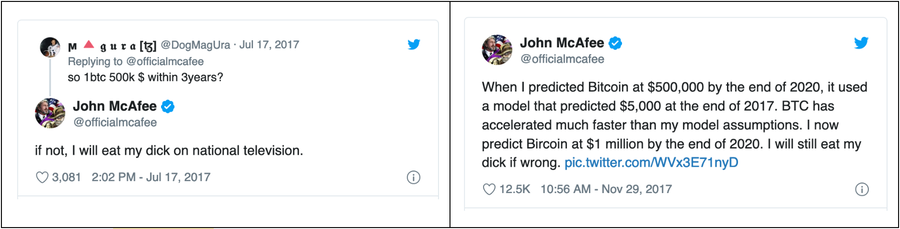
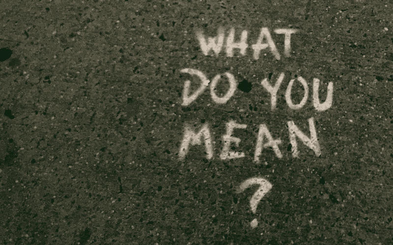

:slug: trends-2020/
:date: 2020-03-26
:subtitle: Fear will drive cybersecurity spending. Dear lord...
:category: techniques
:tags: cybersecurity, trends, mistake, technology, economics, information
:image: cover.png
:alt: Photo by Oleg Laptev on Unsplash
:description: Most people are lured to predictions of experts. But science has shown how bad we are at making predictions. In this post, we review some cybersecurity trends published online. We discuss why it is a good idea to be wary of many of these predictions.
:keywords: Cybersecurity, Trends, Mistake, Technology, Economics, Information
:author: Julian Arango
:writer: jarango
:name: Julian Arango
:about1: Behavioral strategist
:about2: Data scientist in training.
:source: https://unsplash.com/photos/QRKJwE6yfJo

= Cybersecurity Trends 2020? F*ck...

.The billionaire John link:https://twitter.com/officialmcafee/status/887024683379544065?s=20[McAfee] made a bold link:https://twitter.com/officialmcafee/status/935900326007328768?s=20[prediction] in 2017. The website link:http://dickening.com/[dickening.com] keeps track of it.

*Spoiler alert*: of course, the guy won't do that.

How many times the end of the world has been predicted?
link:https://en.wikipedia.org/wiki/List_of_dates_predicted_for_apocalyptic_events[Wikipedia] has a reasonable estimate.

Look these two link:https://interestingengineering.com/29-terrible-predictions-about-future-technology[predictions]:

- "There is not the slightest indication
that nuclear energy will ever be obtainable.
It would mean that the atom would have to be shattered at will."
—link:https://www.nytimes.com/1964/08/02/archives/the-einstein-letter-that-started-it-all-a-message-to-president.html[Albert Einstein], 1932.

- "Spam will be a thing of the past in two years' time."
—link:https://www.zdnet.com/article/in-his-own-words-bill-gates-best-quotes/[Bill Gates], 2004.

Everybody is attracted to predictions.
As humans, we are _hardwired_ to seek information
in an attempt to cope with uncertainty.
Some people, for instance, consume astrology trying to foresee their future
to anticipate bad outcomes or feeling relieved about good ones.
Others rely on "spiritual gurus"
believing they possess an "eye" into the future.
In business, the story is similar, but without the esoteric halo.
Many organizations and specialized news agencies
publish their trends or predictions in almost every sector of the economy
for the upcoming (or starting) year.
Do a simple google search for trends:
technology, fashion, business, human resources, innovation, and more.
There are many predictions.

Nevertheless, there are several issues with predictions.
The previous quotes show how bad these predictions went.
Nuclear energy has been a reality for decades,
and spam is still around causing problems.
Cybersecurity has its chunk of "trends publicity" year over year.

We looked at some of these predictions for 2020, those easily reachable online,
and we tried to do a simple classification.
In the next lines,
we share the first piece of our comments regarding this exercise.
We found that some trends are no trends at all;
some others reach a level of consensus,
and finally, we found some isolated predictions insightful.
We will focus on those dubious trends.

== Fear will drive cybersecurity spending

.photo by link:https://unsplash.com/@jontyson?utm_source=unsplash&utm_medium=referral&utm_content=creditCopyText[Jon Tyson] on Unsplash

We don’t know about you,
but the moment we read link:https://securityboulevard.com/2020/01/10-cybersecurity-trends-in-2020-you-need-to-keep-an-eye-on/[that subtitle]
pointing to a cybersecurity trend,
we were a bit shocked.
If that is true, we wonder what other aspects
do writers think have driven spending in previous years?
Fear has always been a driver for behavior.
In cybersecurity, we can’t deny it plays a significant role, naturally.
That’s not new, and it’s not a trend.
Furthermore, the figure used to support this claim
(link:https://securityboulevard.com/2020/01/10-cybersecurity-trends-in-2020-you-need-to-keep-an-eye-on/["76% of organizations plan to increase their cybersecurity budget"])
does not imply fear only, but an array of reasons.
We think the most plausible is that some cybersecurity investments pay off.

In another place, we found this "trend":
link:https://www.hoxhunt.com/blog/10-cybersecurity-trends-2020/["Information security technology remains important."]
Who said security technology would decline? Where’s the evidence?
If almost everything now is a piece of software,
who dares to say that security technology would become useless?
Security technology evolves like any other technology.
We were shocked to read this
as this implies there was a claim in the other direction,
but the writers offer nothing from which this trend could be stated.
Maybe the trend is that
organizations will renew their security technology at a faster pace?

link:https://www.netsparker.com/blog/web-security/top-10-cybersecurity-trends-to-look-out-for-in-2020/["A Growing Awareness of the Importance of Cybersecurity"]
No shit! As in the "fear" trend,
this one points to the expected growth of cybersecurity spending.
In principle, it sounds plausible.
But one should ask: who is "aware" here?
Organizations as a whole? Its top management? Their employees?
It might be the case that _precisely for the lack of awareness_,
organizations are spending more in cybersecurity.
In other words, behaviors that contribute to security
seem not to support the claim of higher consciousness.

The premise pointing to a higher awareness
could be used precisely in the opposite direction,
so this trend is very unclear.
A few people also consider “awareness training” as a trend,
based on more training demanded by companies.
Again, this probably shows that awareness is not growing,
so organizations are investing in this training, expecting to raise it.
Cybersecurity spending is not a reliable indicator of awareness as a whole.
One last thought: do awareness translate into behavior?
Scientific studies have found this is hardly true in plenty of circumstances
(see for example Sheeran, & Webb, 2016, about the intention-action gap;
a specific case in cybersecurity is discussed by Bada et al., 2019).
Be mindful of the goals your company pursues
when analyzing to invest in cybersecurity awareness training.

To conclude, a final exotic example:
link:https://www.ciodive.com/news/5-cybersecurity-trends-for-2020/569169/["Security is integrating with data science."]
Current buzzwords are also pervasive in these publications.
What the f*ck do they mean by "integrating with data science"?
Maybe the wording is not appropriate.
Writers of this trend probably wanted to say this instead:
data science —applied statistics,
given availability of programming and processing power—
is being used more in cybersecurity, and that’s undeniable.
Data science is being used increasingly
in all sectors of the economy to deliver more value.
However, if we take this sentence literally,
it is hard to understand what it means.
We didn’t find any clarity on the source either.

As these examples show, we shouldn’t take trends for granted;
we should analyze these predictions critically.
Vagueness and lack of precision populate these claims.

== One fundamental issue with most forecasts

.photo by link:https://unsplash.com/@chrisliverani[Chris Liverani] on Unsplash

We believe these trends we mentioned are, on average, based on good faith.
Nevertheless, most of them, if not all,
will have no consequences for inaccuracy;
there’s no accountability for authors.
That’s an essential insight explaining
why there are so many forecasters out there.
In essence, there’s no clear incentive
or punishment for the outcomes of predictions.
When forecasters are confronted upon inaccuracy, rationalizations kick-in.
Moreover, most people just forget about forecasters.
Do you remember a very bad forecaster?
Maybe not if you also had no _skin-in-the-game_ related to those forecasts.

== Continuous hacking shows a higher value

We have never got into making forecasts about cybersecurity.
This exercise allowed us to be mindful
of considering any sort of prediction in our field, if we were attracted to it.
We must have clear evidence about the value of any trend under consideration.
In an upcoming post,
we will address some trends we found appealing and with better support.
We will also return to the skin-in-the-game issue among others
coming from scientific scrutiny about forecasting or prediction.

We recently launched our *"State of Attacks" 2020 Report*.
link:https://report2020.fluidattacks.com/[Click here to read it].
Among our results in working with customers,
you will find one key takeaway worth noting now,
in line with this post:
[inner]#link:../../services/continuous-hacking/[continuous hacking]# delivers more value.
If that is so, we could expect this to keep growing.
We have evidence that customers
continuously testing the robustness of their software and IT infrastructure
do find more weaknesses and achieve a higher rate of fixes.

We hope you have enjoyed this post, and we look forward to hearing from you.
[inner]#link:../../contact-us/[Do get in touch with us!]#

== References

. Bada, M., Sasse, A. M., & Nurse, J. R. (2019).
link:https://arxiv.org/ftp/arxiv/papers/1901/1901.02672.pdf[Cyber security awareness campaigns: Why do they fail to change behaviour?]
_arXiv preprint arXiv:1901.02672._

. Sheeran, P., & Webb, T. L. (2016).
link:https://www.researchgate.net/publication/307857321_The_Intention-Behavior_Gap[The intention–behavior gap].
_Social and Personality Psychology Compass_, 10(9), 503-518.
