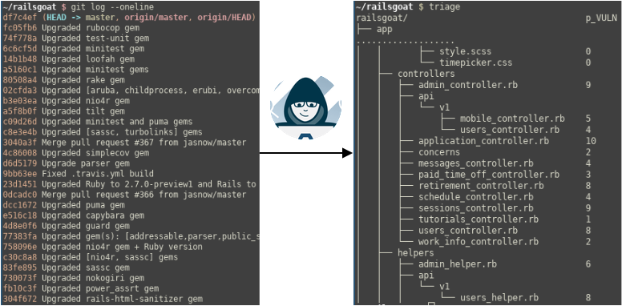
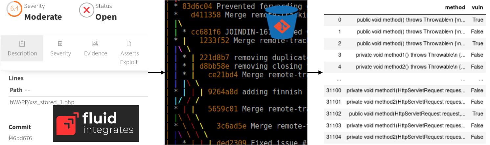
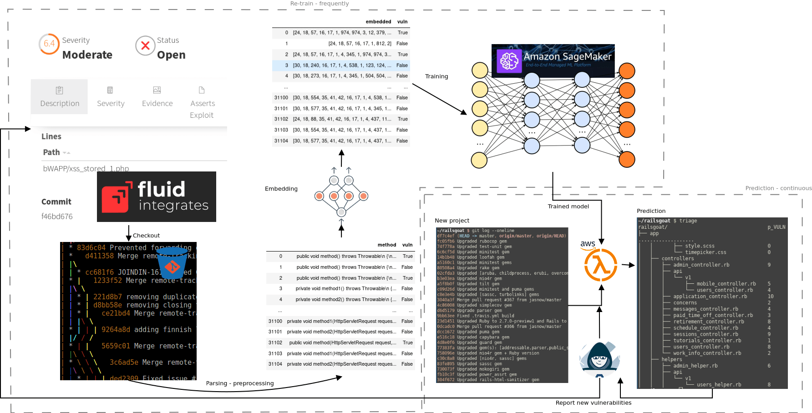

:slug: triage-hacker/
:date: 2019-10-18
:subtitle: Prioritize code auditing via ML
:category: machine-learning
:tags: machine learning, security, code
:image: cover.png
:alt: Photo by camilo jimenez on Unsplash: https://unsplash.com/photos/vGu08RYjO-s
:description: This blog is a high-level review of our previous discussion concerning machine learning techniques applied to vulnerability discovery and exploitation. Our focus will be on aiding, not replacing, manual code auditing, and hopefully, making this process quicker and more precise.
:keywords: Machine learning, Neural Network, Encoding, Parsing, Classifier, Vulnerability
:author: Rafael Ballestas
:writer: raballestasr
:name: Rafael Ballestas
:about1: Mathematician
:about2: with an itch for CS
:source: https://unsplash.com/photos/vGu08RYjO-s

= Triage for Hackers

Based upon our [inner]#link:../vulnerability-classifier[last experiment]#,
in this article, I will provide a global vision
of how our `ML` for vulnerability discovery approach should work.

First, what problem would this solve?
I am repeating myself here
but when one of our analysts has to audit
a new [inner]#link:../../services/continuous-hacking/[continuous hacking]# project,
usually all they get is access to one or more big code repositories.
And clients expect vulnerability reports as soon as possible.
We would like our predictor to sort all the files in these repositories
according to the likelihood, or possibility,
that they contain a vulnerability
so that the analyst can prioritize the manual inspection.
Ideally, when the analyst is confronted with a new project,
instead of looking at an overview of all files in a repository
or its `git log`,
they could have a number that ranks each file
in the repo with the probability of it
containing code vulnerabilities:

.From a messy git log to a prioritized file breakdown

Next, how should this be done?
Many different kinds of machine learning algorithms
have been used by the authors we have reviewed here:
[inner]#link:../crash-course-machine-learning/#decision-trees-and-forests[random forests]#,
[inner]#link:../binary-learning/[deep neural networks]#,
[inner]#link:../exploit-code-graph/[clustering]#,
[inner]#link:../natural-code/[n-grams]#.
The actual algorithm to be used
is one of the variables that we can experiment with.
For starters, we used a [inner]#link:../crash-course-machine-learning/artificial-neural-networks-and-deep-learning[neural network]#
with a single hidden layer for simplicity.
Still, this gave us [inner]#link:../vulnerability-classifier[good results]# for a first iteration.
Regardless of the algorithm to be chosen,
all of these must be fed with samples of code
labeled with their vulnerability, or in the simplest case,
a _"yes"_ for vulnerable and a _"no"_ for the rest.
Our algorithm will then proceed to _"learn"_,
whether it is pattern identification,
anomaly detection or clustering,
in the training phase,
and be able to work in the prediction phase as described above.

What data should we feed to this algorithm?
We need lots of labeled data for
such an attempt to work, according to Andrew Ng.
But not too much that it would be an obstacle.
Fortunately, we have a good amount of code vulnerabilities stored in
[inner]#link:../../products/integrates/[Integrates]#.
The ones we are interested in are those
which point to a particular set of lines of code
in a specific repository.
We should be able to look up these repositories
and extract the relevant pieces of code.
We could also extract, at random,
some other pieces of code and label them as not vulnerable,
thus obtaining a dataset.
The flow would be as in this image:

.Fetching data from Integrates and repositories

This poses several new challenges:

. Accessing `Integrates` and the repositories.
. Parsing all the obtained files.
. Splitting vulnerable and safe code.
. Masking the code so as not to expose it.

But from the data analysis point of view,
perhaps the most challenging aspect is:
how do we feed code into an algorithm that expects numerical values
or sets thereof, i.e., vectors from a continuum?
We discussed this a bit in our
[inner]#link:../digression-regression[presentation]#
of the `Python` data ecosystem,
and in our
[inner]#link:../vulnerability-classifier[first iteration]#,
we opted for breaking up the code string into tokens
and further assigning an integer to each of these.
We thus obtain a proper dataset for machine learning:

.Embedding via neural network
image::embedding.png[Embedding via neural network]

Other alternatives we will explore are
word embeddings, such as `word2vec` and `code2vec`,
which at the moment are not working for us as they
project each token into a vector, while what we need
is to map functions or even entire classes or files
into a single vector.
Token sequences are easily reversible,
as seen in the last article,
but code embeddings would not be so easy,
thus dealing with the masking issue.

Thus far we have performed these experiments in local machines.
However, this is impractical, for many reasons,
one of which is the lack of computational muscle,
in particular of `GPUs`,
which are pretty much a requirement for deep neural networks.
link:https://aws.amazon.com/[Amazon Web Services]
provides a solution called
link:https://aws.amazon.com/sagemaker/[Sagemaker].
In `Sagemaker` you are given a
link:https://jupyter.org/[Jupyter] notebook
in which you can do data science to your heart's content.
No fuss about setting up machines,
installing dependencies, everything is ready.
Such would be our choice for training the machines.
The output of this training process
is a `Python` object which can make predictions.
As seen in
[inner]#link:../vulnerability-classifier[previous]#
[inner]#link:../fool-machine[articles]#,
this can be saved in the
link:https://keras.io[Keras]
`H5` format and loaded again into a `Python` script.
An easy way to deploy this model to make predictions
would be on a serverless application on `AWS Lambda`,
so that it could be readily accessed by the analysts
to deal with new projects.

Hopefully, this cycle would be completed
by the analyst manually detecting, confirming
and exploiting —should there be a working environment—
vulnerabilities where the classifier predicted high
likelihood and reporting them back to `Integrates`.
As the `Integrates` database fills up again,
we should repeat the training cycle
with a prudent frequency,
which could be daily, weekly, etc.
This is another hyperparameter to be tuned
which would provide more data
and feedback to the machine.
That would complete the whole cycle:

.ML-aided vulnerability discovery cycle

A lot remains to be done, of course:

* Determining the best algorithms for each phase.
* Tuning all parameters.
* Provisioning the infrastructure.
* Choosing the best possible embedding.
* Connecting to data sources.

We hope to be able to develop this tool
in the next 6 to 8 months,
or at the very least experiment with
the possibilities `ML` provides to vulnerability discovery and
continue reporting the results here.
Stay tuned for more.
