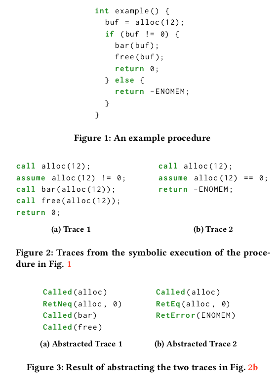
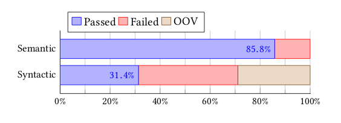

:slug: understand-program-semantics/
:date: 2020-02-14
:subtitle: With symbolic execution
:category: machine-learning
:tags: machine learning, security, code
:image: cover.png
:alt: Rubber duckies
:description: A reflection on the need to represent code before actually feeding it into neural network based encoders, such as the ones we have reviewed thus far: code2vec, word2vec and code2seq. Syntax only is not enough: the semantics can and should be captured too, using symbolic execution.
:keywords: Machine learning, Neural Network, Encoding, Parsing, Classifier, Vulnerability
:author: Rafael Ballestas
:writer: raballestasr
:name: Rafael Ballestas
:about1: Mathematician
:about2: with an itch for CS
:source-highlighter: pygments
:source: https://unsplash.com/photos/r8H8K3w9AzA

= Understanding Program Semantics

Thus far, we have established the need to
[inner]#link:../vector-language/[represent code as vectors]#
before feeding it into a machine learning classifier
that will help us
[inner]#link:../triage-hacker/[sort through a messy project]#.
We have also discussed at length
why neural network based encoders
are probably the best for this task.
However, a new problem arises from this.
In the case of natural language,
the features and labels were clear:
we try to predict neighboring words from a central word,
as is done in code2vec.
But with code we have more freedom, in a way:
code has several special properties and structure.
So we need to decide how to represent
pieces of code before even feeding them to the network
that will give us the vector representations,
if you recall, as a by-product in the middle layers.

One of these possible representations,
is to represent snippets of code as bags of words (tokens),
i.e., a simple assignment of words to numbers and
then making up a vector around that saying which tokens occurr in a snippet.
And, by the way, we skip the neural network encoder.
This is what we did
[inner]#link:vulnerability-classifier[initially]#,
but it is clear even from the foundations
that this leaves room for improvement.

Another possibility is to use the snippet's
Abstract Syntax Tree (+AST+), which,
incidentally, is what they use in tools such as
[inner]#link:../embed-code-vector/[+code2vec+]# and
[inner]#link:../code-translate/[+code2seq+]#.
However an issue that we could claim to be present here
is that code is not just about syntax,
but it also has rich semantics which could be
exploited by us to obtain more useful vector representations
and thus, hopefully, better results at the classifier level.
Remember: garbage in, garbage out.
The better the input to the classifier,
the better the triaging overall.

One interesesting approach I found
which does take into account the semantics of
the code to be represented works
by using _intraprocedural_
[inner]#link:../symbolic-execution-mortals[symbolic execution]#.
Let's see if this improves accuracy
and actually adds value to our toolchain.

As a refresher, recall that
[inner]#link:../symbolic-execution-mortals[symbolic execution]#.
traverse all the paths a program could take
with all possible inputs,
never defining them (unlike fuzzing),
but rather treating them symbolically like algebraic indeterminates.

In the work we are reviewing,
these paths are known as traces
which are left during the symbolic execution
and are further _abstracted_ or,
if you will, simplified,
so that a simple snippet like the following
becomes two abstracted traces like this:

.Abstracted traces from a snippet

Incidentally, these +Call+, +Error+, +AccessPath+, etc
type of abstractions subtly hint at an idea
we've been considering, namely,
using an intermediate representation of code
before performing the actual encoding.
This could be one such candidate,
but pseudocode, assembly or even some other _ad hoc_
kind of intermediate representation would solve or improve on
two issues at hand:

* Code from different clients will come in different programming languages.
* Protecting the customer's code from leakage by adding another masking layer.

Back to abstracted symbolic traces,
they then proceed to encode these as words
in order to use +GloVe+, a sort of big brother to +Word2Vec+.
(I warned you, most code encoders either work with
or are heavily inspired by +W2V+).
+GloVe+ exploits the intutition that when
words appear together frequently,
they have some relation,
which seems reasonable in the regular usage of language.
It remains to be seen how well such an idea translates to code, though.

That describes the entire architecture of this
system of embedding code into vectors.
They ran comprehensive experiments to determine
the added value vs the overhead of running symbolic execution
regarding the quality of the learned embeddings.
One is the production of code _analogies_:
much like "king - man + woman = queen" for natural language,
similar relations arise here,
such as "+receive+ is to +download+ as +send+ is to +upload+",
where each of those are tokens naturally occurring in snippets of code.
Of course, this is not yet standardized,
so the is no benchmark; the authors had to make their own
benchmark and corresponding dataset,
a task we will certainly be confronted with soon.

The most eye-opening result is the comparison between
syntactic and semantic based embeddings:

.Syntactic vs semantic embeddings

Almost 300% better. This makes intuitive sense,
since considering more information, and
especially the information which gives code its _meaning_,
should give better results.
However only the experiment proves it.
And quite resoundingly at that.
In the image above, OOV means out-of-vocabulary tests,
i.e., the ones that can't be tested.
Even leaving these out, the semantic results are twice
as good as the syntax-based ones.
This means, on the one hand, that
is is certainly worthwile to include semantic information
in the code representation for input to embedders,
despite the overhead.
On the other, to be fair,
the syntax-only approach they use might not be as sophisticated as,
say, +code2vec+.
It could be that we are comparing the weakest
machine gun to the weakest pistol,
instead of to the strongest, which might win
(sorry, I'm short on metaphors today, but you get the idea).

The authors were nice enough to dedicate a section
to the potential usage of their tool in downstream tasks,
such as error-code misuse detection.
That is, they don't just give the tool,
but also show you how to integrate it into a complete
machine learning toolchain, which is nice for a research paper,
where they usually don't bother and leave it
up to the reader to figure that out.
More interestingly for us, they focused on bug-finding
(although not strictly security-focused),
and the automatic repair of such code.
The results gave an accuracy of 76.5%,
which as we haven seen throughout the series,
is not bad in this context.

This is, overall, a tool which we might
actually use for our purposes but, more importantly,
shows us the importance of considering semantic information
before even attempting to design the network
for embedding code into vectors.
More on that soon.

== References

. [[r1]] J. Henkel, B. Liblit, S. Lahiri, T. Reps.
Code Vectors: Understanding Programs Through
Embedded Abstracted Symbolic Traces.
link:https://arxiv.org/pdf/1803.06686.pdf[ESEC/FSE '18].
