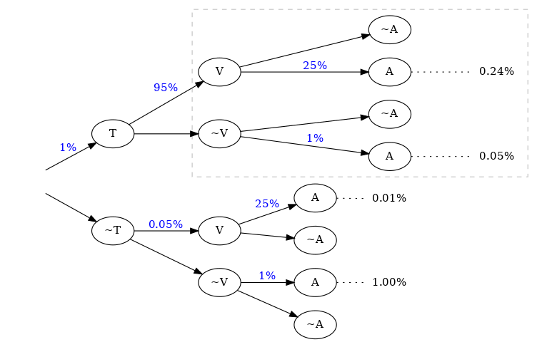

:slug: updating-belief/
:date: 2019-03-5
:subtitle: How Bayes Rule affects risk
:category: philosophy
:tags: business, ethical hacking, risk
:image: cover.png
:alt: New information. Photo by M. Parzuchowski on Unsplash: https://unsplash.com/photos/GikVY_KS9vQ
:description: How to use Bayes rule and basic probability theory to reduce uncertainty, refining initial estimates through evidence. An application to the information provided by a penetration test regarding the probability of having vulnerabilities and suffering their consequences.
:keywords: Risk, Probability, Impact, Measure, Quantify, Security
:author: Rafael Ballestas
:writer: raballestasr
:name: Rafael Ballestas
:about1: Mathematician
:about2: with an itch for CS
:source-highlighter: pygments
:source: https://unsplash.com/photos/GikVY_KS9vQ

= Updating your beliefs

Usually, changing our beliefs is seen as a negative thing.
But when those beliefs represent our state of uncertainty
regarding a particular cybersecurity risk,
you'd better use all the tools at hand
to reduce that uncertainty, i.e., measuring.

Why do we speak of "belief" and not "probability" here?
Intuitively, when we have mentioned
[inner]#link:../quantifying-risk/[probabilities]#,
we're meaning some belief or measure of uncertainty.
For example, when giving a confidence interval,
we say we _believe_ the actual value is
between the boundaries of the interval,
up to a certain degree of confidence.
When we simulate multiple scenarios in
[inner]#link:../monetizing-vulnerabilities[Monte Carlo simulations]#
and finally aggregate the results,
we're expressing that we believe
that the loss will be so many millions or larger.

In science, hypotheses are disproven trough observable, measurable evidence.
Similarly, testing in general
—and [inner]#link:../../[pentesting]# in particular—
can change our beliefs, that is,
our initially proposed or _prior_ probabilities,
based upon evidence.
The mathematical tool for updating these beliefs
is a simple one: Bayes Rule.
However, it does require us to discuss a
few basic probability theory facts.
If you're familiar with it,
feel free to skip straight to
link:#so-how-does-this-apply-to-cyber-risk[application to cybersecurity risk].

== Mathematical interlude

Let us consider a simple example for
illustrating the basic rules of probability:
we have a bag with 2 blue marbles and 3 red ones,
and we're going to draw marbles from the bag (without looking!)
and we want to find the probabilities of drawing each kind.
Let us call<<f1, ^[1]^>> R the event of picking a red marble
and B for picking a red one.
Their probabilities are P(B) = 2/5, and P\(R) = 3/5, in principle.

What if now we draw a second marble?
Now the probabilities are subject to the result
of the first draw.
For example, if we're given that the first marble picked was blue,
then the probability of drawing a red marble is now 3/4
since now there are only 4 balls altogether.
This is a link:http://setosa.io/conditional/[_conditional_ probability];
it is the chance of event R subject given B happened,
denoted P(R|B).
This situation can be illustrated with a tree diagram like this:

// to be changed into native
.Probability tree diagram. Via link:https://www.mathsisfun.com/data/probability-events-conditional.html[MathsIsFun]

We can find the probability of a branch,
that is, of the succession of two events,
by multiplying the probabilities on the arrows,
as seen above.<<f2, ^[2]^>>
And we can add related branches to make up single events:
The probability of the third branch from top to bottom
is 30%, so if we add that to the previous result,
we get that the probability of the second marble being red is 40%.
This is an application of the
link:https://www.toppr.com/guides/quantitative-aptitude/probability/total-probability/[_total probability theorem_].<<f3, ^[3]^>>

We know the conditional probabilities for the second marble given the first,
but what if they show us that the second one is blue
and we had to guess what the first one was?
That's where
link:https://betterexplained.com/articles/an-intuitive-and-short-explanation-of-bayes-theorem/[Bayes Rule] <<f4, ^[4]^>> comes in:

["latex","bayes-cause-evidence.png",align="center"]
----
\LARGE $$\rm P(cause\,|\,evidence) =
\frac{P(evidence\,|\,cause)\,P(cause)}{P(evidence)}$$
----

If we think of the first event as the cause
and the second one as the effect,
we have that P(evidence) = 40%.
We know that the _a priori_ chance of
the first ball being red is 60%,
and the probability of observing the evidence
given the cause, i.e., P(B|R) = 50%.
Hence

["latex","first-given-second.png",align="center"]
----
\LARGE
$$\rm P(first\ marble\ red\,|\,second\ marble\ blue) =
\frac{0.5\times0.6}{0.4} = \frac{3}{4} = 75\,\%.$$
----

Notice how the extra piece of information,
namely that the second marble is blue,
narrows down the chance of the first marble being red
from the prior probability of 60% to 75%.
Hence the probability of the first being blue is
the remaining 25%.
So I would bet on the first one being red,
and I would give you 3 to 1 odds.

This is the power of Bayes Rule:
observable evidence,
whose likelihood generally depends on
the assumed probabilities of the causes,
can _update_ or _refine_ our estimates
on the likelihoods of the causes.

== So how does this apply to cyber risk?

Since Bayes Rule helps us reduce our uncertainty,
it works as a measurement technique.
While our initial estimates about an event
such as suffering a denial of service or data breach
may be way off,
we can still get a measurement with those bad estimates,
plus evidence, plus their probabilities.

Consider the following random events:

* V: there is a critical vulnerability leading to remote code execution,
* A: suffering a successful denial of service attack
  (in a reasonable time period v.g. a year)
* T: penetration test results are positive,
  indicating the possibility of critical vulnerabilities.

Normally, the chain of events here would be that
a positive pen test points to the existence of vulnerabilities,
and such a vulnerability might lead to the threat
(in this case, the denial of service) materializing.
Suppose that we know, from the false positive rate,
the probability of the existence of vulnerabilities
based on a positive and negative pen test, i.e.,
P(V|T) and P(V|&#126;T).
Here the ~ symbol denotes an event not happening.

Now, the existence of a vulnerability does not
necessarily imply that the organization _will_ suffer an attack
so we might estimate the probabilities of an attack
in the case vulnerabilities exist and in the case they don't.
Let P(A|V) = 25% and P(A|~V) = 1%.
This, together with P(T) = 1%,
the _a priori_ probability that a given penetration test
will yield positive results
(which we may estimate based on historical data),
is all we need to know in order to estimate the
posterior probabilities for V, A, and, in fact,
anything we might ask about this particular situation.

We might draw a tree diagram like this
to describe the situation:

.Probability tree cyber

Probabilities in blue are the given ones.
Since branching in a probability tree implies that
the involved probabilities are complementary, i.e.,
they add up to one,
we can compute all others,
but we chose not to write them
in the above diagram to keep it tidy.
Recall that the probability of a single branch
is the product of the probabilities that lead to it
so we can compute the probabilities of every branch that ends in A,
and add them so that P(A) = 1.3%.

If the pen test is positive,
what is the probability of being attacked?
We could fiddle with formulas,
but it's easier to just look
at the subtree after the T,
the part of the tree that is framed above.
In that case, we have shorter branches ending in A:

["latex","attack-postest.png",align="center"]
----
\LARGE
$$\rm P(A\,|\,T) = 0.95\times0.25 + 0.05\times0.01 = 23.8\%.$$
----

What if it is negative?

["latex","attack-negtest.png",align="center"]
----
\LARGE
$$ \rm P(A) = 0.0005\times0.25 + 0.9995\times0.01 = 1.012\%.$$
----

Whatever its results,
penetration testing gives you more information
about the risk your organization is facing.
It is especially remarkable that the initial estimate
of 1.3% goes up by more than 18 times
when the test is positive.

Suppose a year passed,
and no denial of service attack happened.
Does that mean there are no vulnerabilities?
We know the probabilities of attack given the existence of vulnerabilities,
but not the other way around.
First, we find P(V) by total probability
(ignoring all the A nodes in the third column):

["latex","prob-vuln.png",align="center"]
----
\LARGE
$$\rm P(V) = 0.01\times0.95 + 0.99\times0.0005 = 1.0\%$$
----

We already know that P(A) = 1.3%, so P(~A) = 98.7%.
Finally, by Bayes Rule:

["latex","cyber-bayes.png",align="center"]
----
\LARGE
$$\rm P(V\,|\,\sim A) = \frac{P(\sim A\,|\,V)\,P(V)}{P(\sim A)} = 0.76\,\%.$$
----

So even it the threat does not materialize,
there is still a latent risk of having vulnerabilities.

''''

This is yet another example of how we can measure risk,
even when our initial estimates are bad,
using basic probability theory facts and
an appropriate decomposition of the problem.
We can estimate the probabilities of events given certain assumed conditions,
put that together in a probability tree diagram and
use the tools learned in this article to generate the rest.

== References

. [[r1]] Better Explained.
link:https://betterexplained.com/articles/an-intuitive-and-short-explanation-of-bayes-theorem/[An Intuitive (and Short) Explanation of Bayes' Theorem].

. [[r2]] D. Hubbard, R. Seiersen (2016).
_How to measure anything in cibersecurity risk_.
link:https://www.howtomeasureanything.com/[Wiley].

. [[r3]] D. Lindley (2006). _Understanding Uncertainty_.
link:http://www.al-edu.com/wp-content/uploads/2014/05/Lindley-D.V.-Understanding-uncertainty-2006.pdf[PDF via Wiley].
