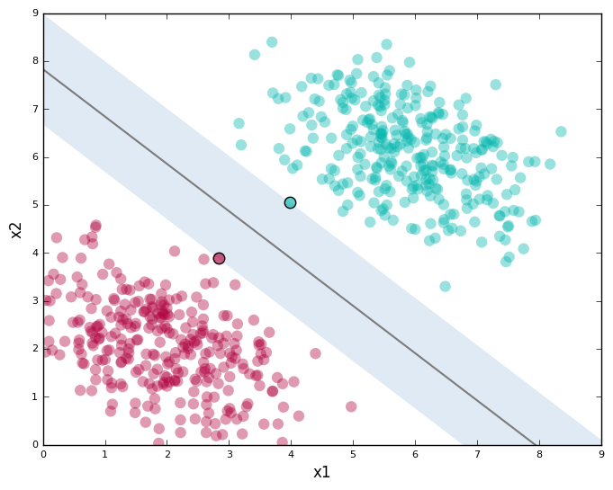
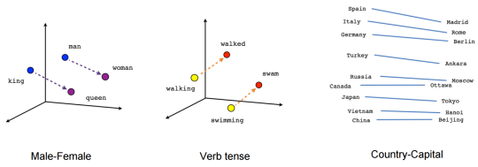
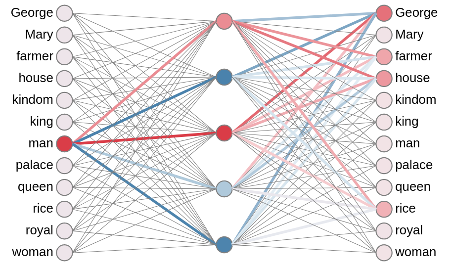
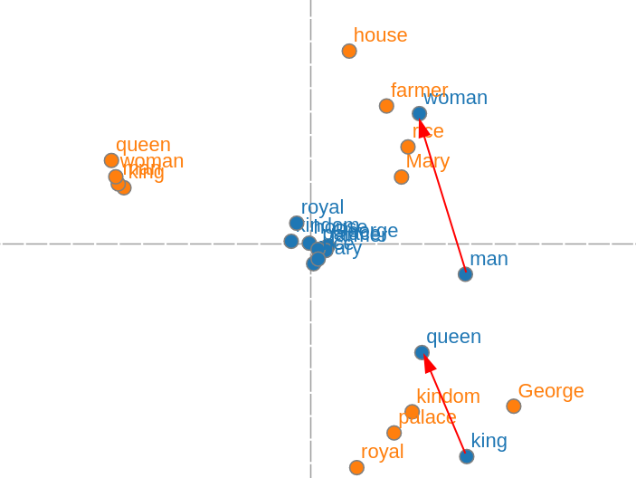

:slug: vector-language/
:date: 2019-12-13
:subtitle: Distributed representations of natural language
:category: machine-learning
:tags: machine learning, security, code
:image: cover.png
:alt: Photo by Franck V. on Unsplash: https://unsplash.com/photos/_E1PQXKUkMw
:description: An overview of word2vec, a method to obtain vectors to represent natural language in a way that is suitable for machine learning algorithms. This method inspired code2vec, which is used to represent code as vectors, our goal. To understand the latter one must first understand the former.
:keywords: Machine learning, Neural Network, Encoding, Parsing, Classifier, Vulnerability
:author: Rafael Ballestas
:writer: raballestasr
:name: Rafael Ballestas
:about1: Mathematician
:about2: with an itch for CS
:source-highlighter: pygments

= The vectors of language

Recall that in previous iterations
we described the required steps for our code classifier to work,
which can be roughly summarized as:

. Fetching data.
. Representing code as vectors.
. Training the classifier.
. Making predictions.
. Feeding new data back to the source.

It wouldn't be an overstatement to say that,
out of all of these,
probably the hardest and most delicate step
is that of representing code as vectors.
Why? Because it is the least understood of them:
there are tens of helpers to handle data gathering,
even at large scale.
Neural networks,
or in general machine learning algorithms for classification? Done.
The infrastructure and working environment
are also already there: Amazon Sagemaker has it all.
Also, as is the case with any machine learning system,
the quality of predictions will be determined
by the quality of the training data:
gargabe in, garbage out.
Thus, we must be particularly careful with
the input we will give our classifier,
which will be the output of this earlier
vector representation step.

However, for the task of representing code
in a way that is useful for machine learning techniques,
there is not much to find in the literature,
except for a couple of well-known techiques,
one of which is +code2vec+.
In turn, this is based on +word2vec+,
which is a model for learning vector representations of words.
In order to understand vector representations of code,
one must first understand the analogous for natural language,
since that might be easier to grasp and visualize,
as, no matter how good of a coder you are,
natural language is, well, more _natural_,
to understand.

Much like code, natural language is not a good fit
for machine learning algorithms which,
as we have shown here,
exploit the spatial relations of vectors
in order to learn patterns from data.
This is particularly clear in methods such as
[inner]#link:../crash-course-machine-learning/#support-vector-machines[Support Vector Machines]#
and
[inner]#link:../crash-course-machine-learning/#k-means-clustering[K-means clustering]#,
which are easy to visualize
(when the data is two dimensional or reduced to that):

.Support Vector Machine example

So, we would like to have n-dimensional
vector representations of words (resp. code)
such that words with similar meaning are close in the target space and
which, hopefully, show some structure in the sense that analogies are preserved.
The classic example of this is called
"King - Man + Woman = Queen"
which is another way of saying that the vector from
man to woman is very similar to the one
from king to queen, which makes sense.
Thus also the vector from man to king
is almost parallel to the one from woman to queen:

.Relations between words as difference vectors, via link:https://blog.aylien.com/word-embeddings-and-their-challenges/[Aylien].

Not only can we capture male-female relations
using word embeddings,
but also other kind of relations
such as present-past tense,
and notice how the difference vector
between a country's vector and its capital's vector
is, in almost every case,
a horizontal one.
Of course, what relations are caught
and the quality of the results will depend
on the nature and quality of the data the model is trained with.

So, how does one go about
representing language in a way that is spatially meaningful?
Perhaps the simplest way is the one we used in our early model
for classifying vulnerable code.
Words are nothing but labels for things.
"Shoe" is, in the eyes of a machine,
as arbitrary as "zapato" to describe something
used to cover your foot.
It might as well be called "34", why not?
Do that for every word, and you've got yourself
a _categorical_ encoding.
In reality, it's not that arbitrary.
You start with a piece of text
(resp. code, in all future iterations
when it says _text_ that can be done for code;
will be discussed in an upcoming article)
called a _corpus_, which is what you will train on.
Take as a universe all the words occurring in the corpus,
and assign numbers to each of those from 1 to the size of the corpus.
Thus, a sentence is encoded as the vector made out of
each word's label.
So, if our corpus is "A cat is on the roof. A dog is, too'
The encoding of the first sentence could be <1, 2, 3, 4, 5, 6>
and of the second, <1, 7, 3, 8>.
For simple sentences of the form "A x is on y",
it's not unmanageable, but you can imagine that this scheme
gets out of control very fast as the corpus size increases.
A related encoding is one-hot encoding.
The same labels we assigned before are now positions in an 8-dimensional vector.
Thus, the first sentence is encoded as
<1, 1, 1, 1, 1, 1, 0, 0, 0, 0>
and the second as
<1, 0, 1, 0, 0, 0, 0, 0, 1, 1>.
We can also count repetitions here.
We see several problems with these kinds of encondings.
In one-hot, the order is lost,
and the vectors would become too sparse for large corpora.
A pro: all vectors are the same size,
which is not true for categorical encoding.
So, we would also like vectors that are of the same size, m
for the sake of comparison, and hopefully,
which are not too high-dimensional.

A common saying is that deep learning
(essentially, neural networks with many layers),
which has proved the most successful approach
to hard problems such as image recoginition,
language translation and speech-to-text,
is really, at is heart, all about representation learning,
which is exactly what we need.
The thing is that these representations are usually internal
to the network, and end-users only see the results
("This is a 99% a cat. But you'll never know how I know",
or for us, "This code is 98% likely to contain a vulnerability").
The genius idea in +Word2Vec+ was to make up a network
for a totally unrelated task, and _ignore_ the results,
focusing instead in the intermediate representations
created by the network in the hidden layer.
By the way, the model is a simple three-layer network
with the task of predicting either a word from its neighbors,
which is known as the continuous bag-of-words model,
or the opposite: given a word, predict one of its neighbors,
which is known as the skipgram model.
Following the example above,
'on' should be predicted from 'cat is the roof',
and backwards in the skipgram model.
So we make up a simple 3-layered neural network,
and train it on pairs of (word, neighbor)
such as (on, cat), and (on, the):

.Example Word2Vec network, created with link:https://ronxin.github.io/wevi/[wevi].

Here we trained a network with queen-king examples
in order to obtain the infamous "King - Man + Woman = Queen" analogy
using the link:https://ronxin.github.io/wevi/[wevi] tool by Xin Rong (Kudos!).
In the state above, the network predicts from "man",
with highest likelihood, "George",
which is the only man name in the set. Makes sense.
In that image, red means a higher activation level between the neurons
and blue higher inhibition.
We also obtain a visualization of the vectors obtained
from the hidden-layer intermediate representation,
which is what we're after anyway:

.Example Word2Vec vectors, created with link:https://ronxin.github.io/wevi/[wevi].

There it is! In the image,
please ignore the orange (input) dots and focus on the blue ones,
which are the vector representations of the words we came for.
Notice how 'man' and 'woman' are essentially in the first quadrant
while the titles 'queen' and 'king' are in the fourth.
Other words are clustered around the origin,
probably because there is not much information about them in the training data.

''''

While this is not yet directly related to security,
+Word2Vec+ is nothing less than an impressive
application and fortunate by-product of
neural networks applied to a natural language processing problem.
What will be certainly more interesting for our purposes
is +Code2Vec+, coming up next. Stay tuned!

== References

. [[r1]] T. Mikolov, I. Sutskever, K. Chen, G. Corrado, and J. Dean.
_Distributed Representations of Words and Phrases and their Compositionality_.
link:http://arxiv.org/pdf/1310.4546.pdf[In Proceedings of NIPS, 2013.]
