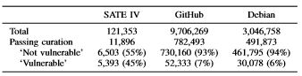
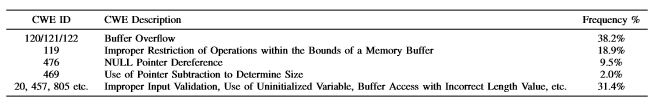
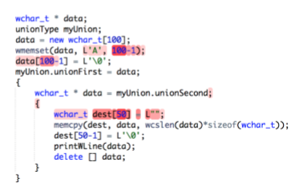

:slug: vulnerabilities-in-deep/
:date: 2019-09-23
:category: machine-learning
:subtitle: Deep Learning for vulnerability disclosure
:tags: machine learning, detect, software
:image: cover.png
:alt: Data Has A Better Idea. Photo by Stefan Steinbauer on Unsplash: https://unsplash.com/photos/1K6IQsQbizI
:description: Next, we will talk about an article from the Boston University in which new applications of Artificial Intelligence in the field of security are presented, we will discuss their approach to discover vulnerabilities in source code and finally some future work that can be developed on that field.
:keywords: Machine Learning, Deep Learning, Detection, Vulnerability, Code, AI
:author: Oscar Uribe
:writer: oscardjuribe
:name: Oscar Uribe
:about1: Software and Computer Engineering undergrad student
:about2: "Behind every successful Coder there an even more successful De-coder to understand that code." Anonymous

= Vulnerabilities in deep

Nowadays, the use of +AI+ (Artificial Intelligence) algorithms
has started to be used widely searching to solve problems
from another perspective, the data.
Data scientist have been working in problems
related with areas like medicine, data mining, robotics, etc.

Lately, some investigations has been venturing in how +AI+
can be use into the area of the security.
For example, how we will be discussing,
the vulnerability detection inside source code.

Most vulnerabilities come from bad practices
at the time of programming.
When these failures are not detected in a timely manner,
these can be discovered later by attackers.
A non disclosure vulnerability means
a risk of later exploitation for a system.
So, it is important to detect failures in early stages in our systems.

There are tools that can make static analysis of the source code,
these tools check the source code for problems
without the need of compiling and executing it.
There are also dynamic analysis tools
which send some information to the system inputs
with presets or random values in order
to check for failures or improper exceptions handling.

== Initial thoughts

In an link:https://arxiv.org/pdf/1807.04320.pdf[article]
published by the Boston University,
they expose the possibility to use an Artificial Intelligence
and algorithms of Deep and Machine Learning for
automatic vulnerability detection from source code.
The idea stems from the fact that there is a large
amount of open source code available to be analyzed.
After all, code is just text
and is possible to apply data mining algorithms on it
to extract training data.

The static and dynamic code analyzers
do not get the most out of the source code.
The algorithms that they use are based on some preset rules
that do not take into account small variations of the original rule.
So some vulnerabilities and failures may remain undiscovered.

The purpose of the exercise was using data mining,
deep and machine learning techniques to automate a process
where always could be present the human error.
This can let go unnoticed vulnerabilities that
can be present in applications
or within operating systems and then be exploited by hackers.

== Data

For that, they used +C+ and `C++` codes from different sources
such as +SATE IV Juliet Test Suite+,
a code recompilation used for test cases
that contains some known vulnerabilities,
code from +Debian+ distributions
and some +GitHub+ public repositories.

.Vulnerable code distribution link:https://arxiv.org/pdf/1807.04320.pdf[[1\]].

== Labeling

In the labeling, they created a custom lexer,
which sought to capture only the important information
and label the other as generic.
The labels already provided by the test database were used.
For the +Debian+ and +GitHub+ codes they used the dynamics analyzers
in order to search outputs that later could be interpreted
by the security professionals as one of the
known vulnerabilities from the +CWE+ list.
Also in the +GitHub+ repositories,
they searched inside the commits,
words like _“buggy”_, _“error”_, _“fixed”_, _“broken”_, and others,
in order to be able to classify each block
of source code as vulnerable or non-vulnerable.

.Statistics CWE vulnerabilities detected link:https://arxiv.org/pdf/1807.04320.pdf[[1\]].

== Feature extraction

In the feature extraction step,
they tried with two types of
link:../crash-course-machine-learning/#artificial-neural-networks-and-deep-learning[Neural Networks],
link:https://towardsdatascience.com/a-comprehensive-guide-to-convolutional-neural-networks-the-eli5-way-3bd2b1164a53[CNN] (Convolutional Neural Network) and
link:https://towardsdatascience.com/recurrent-neural-networks-d4642c9bc7ce[RNN]
(Recurrent Neural Network).

But despite of the neural network seems
to work fine for the data extraction used by the model,
performance at the time to classify was not the best.
To solve that after the feature extraction made
by the Neural Networks they passed the output through
a link:https://towardsdatascience.com/understanding-random-forest-58381e0602d2[Random Forest] classifier,
obtaining better results and avoiding the overfitting.

.Convolutional Neural Network Model and Random Forest link:https://arxiv.org/pdf/1807.04320.pdf[[1\]].
image::model.png[Convolutional Neural Model]

== Results

This vulnerability detection approach using Data mining,
link:../deep-hacking/[Deep and Machine Learning]
added some advantages
compared to lexical analyzers
since it does not need to be compiled to work
and it can be adjusted to obtain the desire precision.

Also, while the static analyzers has a limited numbers of findings,
because of the preset rules,
and does not take into account variations of the rules,
only identify a small portion of the real vulnerabilities.

.Detection of vulnerabilities link:https://arxiv.org/pdf/1807.04320.pdf[[1\]].

This algorithm is able to underline in the code blocks
that can introduce a vulnerability,
this may later allow suggestions to solve the problems
or simply that the person in charge assess
whether there is a vulnerability present or not.

== Conclusions

Techniques of link:../deep-hacking/[Deep and Machine Learning]
are used in the solution of problems
from a different perspective, the data.
The previous article is an example that
there are several functions
where Artificial Intelligence in security
is helping to automate functions
that are made by humans allowing them to use their time
more in the analysis than in the detection of problems.

Although jobs like this need to be improved a bit
to be used in the industry,
they demonstrate the potential that this type of tools
could have during the process of vulnerability disclosure.
It is also important to evaluate
the possibility of integrate them
into the process of link:../../products/asserts/[continuous integration]
of software development to detect problems
in link:../../services/continuous-hacking/[early stages] and that they go out
to latter phases with vulnerabilities within them.

== References

. [[r1]] link:https://arxiv.org/pdf/1807.04320.pdf[Automated Vulnerability Detection in Source
Code Using Deep Representation Learning].
. [[r2]] link:https://towardsdatascience.com/a-comprehensive-guide-to-convolutional-neural-networks-the-eli5-way-3bd2b1164a53[Convolutional Neural Networks].
. [[r3]] link:https://towardsdatascience.com/recurrent-neural-networks-d4642c9bc7ce[Recurrent Neural Networks].
. [[r4]] link:https://towardsdatascience.com/understanding-random-forest-58381e0602d2[Random Forest].
